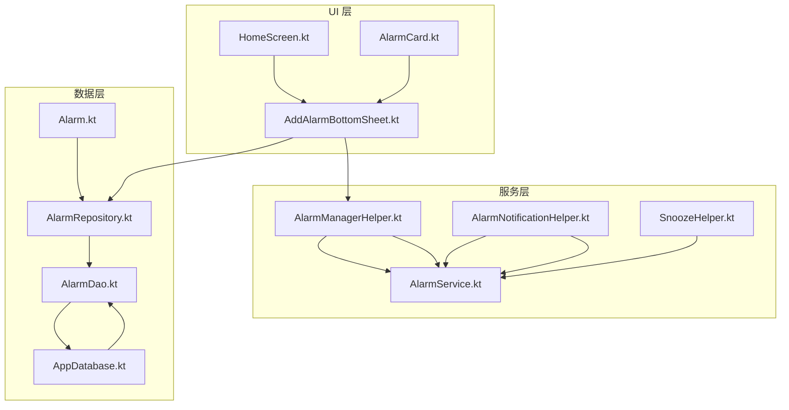
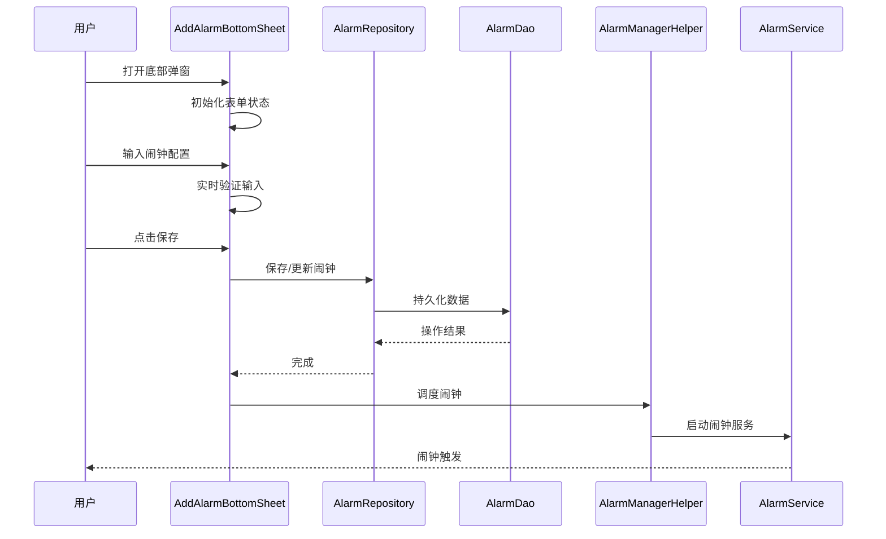
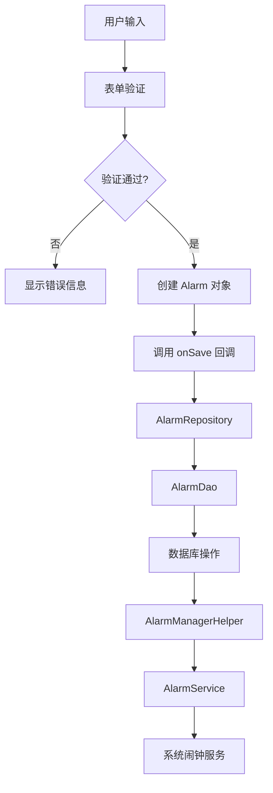
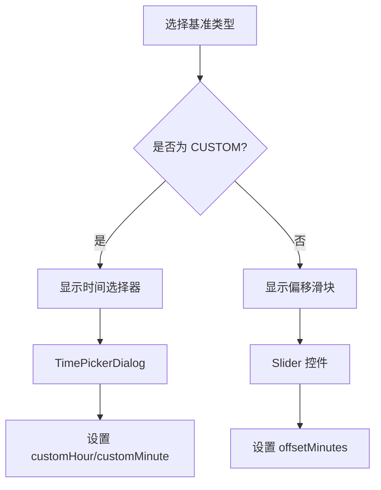
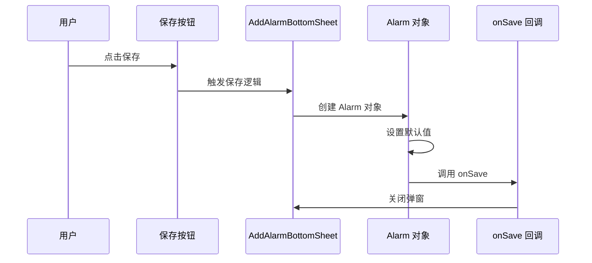
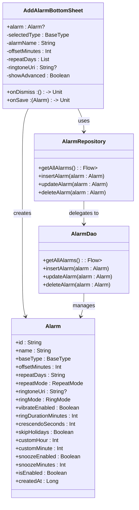

# AddAlarmBottomSheet 添加闹钟底部弹窗

<cite>
**本文档引用的文件**
- [AddAlarmBottomSheet.kt](file://app/src/main/java/com/snuabar/sunrisesunsetalarm/ui/components/AddAlarmBottomSheet.kt)
- [Alarm.kt](file://app/src/main/java/com/snuabar/sunrisesunsetalarm/data/model/Alarm.kt)
- [AlarmDao.kt](file://app/src/main/java/com/snuabar/sunrisesunsetalarm/data/database/AlarmDao.kt)
- [AlarmRepository.kt](file://app/src/main/java/com/snuabar/sunrisesunsetalarm/data/repository/AlarmRepository.kt)
- [AppDatabase.kt](file://app/src/main/java/com/snuabar/sunrisesunsetalarm/data/database/AppDatabase.kt)
- [HomeScreen.kt](file://app/src/main/java/com/snuabar/sunrisesunsetalarm/ui/screens/HomeScreen.kt)
- [AlarmManagerHelper.kt](file://app/src/main/java/com/snuabar/sunrisesunsetalarm/service/AlarmManagerHelper.kt)
- [AlarmNotificationHelper.kt](file://app/src/main/java/com/snuabar/sunrisesunsetalarm/service/AlarmNotificationHelper.kt)
- [AlarmService.kt](file://app/src/main/java/com/snuabar/sunrisesunsetalarm/service/AlarmService.kt)
- [SnoozeHelper.kt](file://app/src/main/java/com/snuabar/sunrisesunsetalarm/service/SnoozeHelper.kt)
</cite>

## 目录
1. [简介](#简介)
2. [项目结构](#项目结构)
3. [核心组件](#核心组件)
4. [架构概览](#架构概览)
5. [详细组件分析](#详细组件分析)
6. [依赖关系分析](#依赖关系分析)
7. [性能考虑](#性能考虑)
8. [故障排除指南](#故障排除指南)
9. [结论](#结论)

## 简介

AddAlarmBottomSheet 是一个基于 Jetpack Compose 的底部弹窗组件，用于创建和编辑闹钟配置。该组件提供了完整的闹钟设置界面，包括基础类型选择、偏移时间设置、重复模式配置、铃声选择以及高级设置选项。组件采用响应式设计，支持实时验证和错误处理，并集成了完整的动画效果和触摸交互优化。

该组件是日出日落闹钟应用的核心功能模块之一，为用户提供了直观易用的闹钟配置体验。通过底部弹窗的形式，用户可以在不离开当前页面的情况下快速添加或修改闹钟设置。

## 项目结构

AddAlarmBottomSheet 组件位于应用的 UI 层，与数据层和业务逻辑层保持清晰的分离：

**图表来源**
- [AddAlarmBottomSheet.kt:1-480](file://app/src/main/java/com/snuabar/sunrisesunsetalarm/ui/components/AddAlarmBottomSheet.kt#L1-L480)
- [HomeScreen.kt:1-402](file://app/src/main/java/com/snuabar/sunrisesunsetalarm/ui/screens/HomeScreen.kt#L1-L402)

**章节来源**
- [AddAlarmBottomSheet.kt:1-480](file://app/src/main/java/com/snuabar/sunrisesunsetalarm/ui/components/AddAlarmBottomSheet.kt#L1-L480)
- [HomeScreen.kt:1-402](file://app/src/main/java/com/snuabar/sunrisesunsetalarm/ui/screens/HomeScreen.kt#L1-L402)

## 核心组件

AddAlarmBottomSheet 组件的核心功能包括：

### 主要功能特性
- **基础类型配置**：支持日出、日落和自定义三种闹钟类型
- **时间设置**：偏移滑块（日出/日落）和时间选择器（自定义）
- **重复模式**：一次性、每天、工作日、周末和自定义重复
- **铃声选择**：集成系统铃声选择器
- **高级设置**：响铃模式、振动、响铃时长、渐强效果、贪睡功能等

### 状态管理
组件使用 Jetpack Compose 的状态管理机制：
- `remember` 函数管理本地状态
- `mutableStateOf` 和 `mutableIntStateOf` 处理可变状态
- 自动状态持久化和恢复

**章节来源**
- [AddAlarmBottomSheet.kt:28-480](file://app/src/main/java/com/snuabar/sunrisesunsetalarm/ui/components/AddAlarmBottomSheet.kt#L28-L480)

## 架构概览

AddAlarmBottomSheet 采用了 MVVM 架构模式，实现了清晰的关注点分离：

**图表来源**
- [AddAlarmBottomSheet.kt:120-147](file://app/src/main/java/com/snuabar/sunrisesunsetalarm/ui/components/AddAlarmBottomSheet.kt#L120-L147)
- [HomeScreen.kt:225-247](file://app/src/main/java/com/snuabar/sunrisesunsetalarm/ui/screens/HomeScreen.kt#L225-L247)

### 数据流架构

**图表来源**
- [AddAlarmBottomSheet.kt:120-147](file://app/src/main/java/com/snuabar/sunrisesunsetalarm/ui/components/AddAlarmBottomSheet.kt#L120-L147)
- [AlarmRepository.kt:1-21](file://app/src/main/java/com/snuabar/sunrisesunsetalarm/data/repository/AlarmRepository.kt#L1-L21)

## 详细组件分析

### 表单字段设计

AddAlarmBottomSheet 提供了完整的闹钟配置表单，包含以下主要字段：

#### 基础配置区域
- **闹钟名称**：文本输入框，默认为空字符串
- **基准时间类型**：单选按钮组，支持 SUNRISE、SUNSET、CUSTOM
- **时间设置**：根据基准类型动态显示不同控件

#### 时间配置逻辑

**图表来源**
- [AddAlarmBottomSheet.kt:192-234](file://app/src/main/java/com/snuabar/sunrisesunsetalarm/ui/components/AddAlarmBottomSheet.kt#L192-L234)

#### 重复模式配置

重复模式支持五种预设模式：
- **ONCE**：仅一次，所有天数为 false
- **DAILY**：每天，所有天数为 true  
- **WEEKDAYS**：工作日，周一到周五为 true，周末为 false
- **WEEKENDS**：周末，周末为 true，工作日为 false
- **CUSTOM**：自定义，用户可单独选择每周的每一天

**章节来源**
- [AddAlarmBottomSheet.kt:62-96](file://app/src/main/java/com/snuabar/sunrisesunsetalarm/ui/components/AddAlarmBottomSheet.kt#L62-L96)
- [AddAlarmBottomSheet.kt:244-294](file://app/src/main/java/com/snuabar/sunrisesunsetalarm/ui/components/AddAlarmBottomSheet.kt#L244-L294)

### 验证逻辑实现

组件实现了多层次的验证机制：

#### 实时验证
- **必填字段验证**：闹钟名称不能为空
- **数值范围验证**：偏移分钟数范围 -120 到 120 分钟
- **重复模式验证**：自定义模式下至少选择一天

#### 错误处理策略
- 使用 `OutlinedTextField` 的错误状态
- 动态显示错误消息
- 禁止无效操作

**章节来源**
- [AddAlarmBottomSheet.kt:151-157](file://app/src/main/java/com/snuabar/sunrisesunsetalarm/ui/components/AddAlarmBottomSheet.kt#L151-L157)
- [AddAlarmBottomSheet.kt:227-233](file://app/src/main/java/com/snuabar/sunrisesunsetalarm/ui/components/AddAlarmBottomSheet.kt#L227-L233)

### 提交处理流程

保存按钮的点击事件处理流程：

**图表来源**
- [AddAlarmBottomSheet.kt:120-147](file://app/src/main/java/com/snuabar/sunrisesunsetalarm/ui/components/AddAlarmBottomSheet.kt#L120-L147)

**章节来源**
- [AddAlarmBottomSheet.kt:120-147](file://app/src/main/java/com/snuabar/sunrisesunsetalarm/ui/components/AddAlarmBottomSheet.kt#L120-L147)

### 状态管理机制

组件采用响应式状态管理模式：

#### 本地状态管理
- 使用 `remember` 保存组件状态
- 使用 `mutableStateOf` 和 `mutableIntStateOf` 管理可变状态
- 自动响应状态变化更新 UI

#### 编辑模式支持
- 通过 `alarm` 参数判断是否为编辑模式
- 自动填充现有数据
- 支持取消编辑操作

**章节来源**
- [AddAlarmBottomSheet.kt:37-42](file://app/src/main/java/com/snuabar/sunrisesunsetalarm/ui/components/AddAlarmBottomSheet.kt#L37-L42)
- [AddAlarmBottomSheet.kt:123-141](file://app/src/main/java/com/snuabar/sunrisesunsetalarm/ui/components/AddAlarmBottomSheet.kt#L123-L141)

### 动画和交互优化

#### 底部弹窗动画
- 使用 `ModalBottomSheet` 实现平滑展开动画
- 支持部分展开和完全展开
- 自动适配键盘高度

#### 交互优化
- 滚动视图支持垂直滚动
- 卡片点击反馈
- 按钮状态变化提示

**章节来源**
- [AddAlarmBottomSheet.kt:98-103](file://app/src/main/java/com/snuabar/sunrisesunsetalarm/ui/components/AddAlarmBottomSheet.kt#L98-L103)
- [AddAlarmBottomSheet.kt:104-109](file://app/src/main/java/com/snuabar/sunrisesunsetalarm/ui/components/AddAlarmBottomSheet.kt#L104-L109)

## 依赖关系分析

### 组件间依赖关系

**图表来源**
- [AddAlarmBottomSheet.kt:30-34](file://app/src/main/java/com/snuabar/sunrisesunsetalarm/ui/components/AddAlarmBottomSheet.kt#L30-L34)
- [Alarm.kt:6-37](file://app/src/main/java/com/snuabar/sunrisesunsetalarm/data/model/Alarm.kt#L6-L37)
- [AlarmRepository.kt:7-21](file://app/src/main/java/com/snuabar/sunrisesunsetalarm/data/repository/AlarmRepository.kt#L7-L21)

### 外部依赖

组件依赖于以下外部库和系统服务：

#### Jetpack Compose 依赖
- Material3 组件库
- Navigation Compose
- Activity Result API

#### Android 系统服务
- RingtoneManager 用于铃声选择
- AlarmManager 用于闹钟调度
- NotificationManager 用于通知管理

**章节来源**
- [AddAlarmBottomSheet.kt:3-26](file://app/src/main/java/com/snuabar/sunrisesunsetalarm/ui/components/AddAlarmBottomSheet.kt#L3-L26)

## 性能考虑

### 内存管理
- 使用 `remember` 优化状态存储
- 避免不必要的重组
- 及时清理资源

### UI 性能
- 使用 `verticalScroll` 优化长列表
- 避免深层嵌套的组合函数
- 合理使用 `LaunchedEffect`

### 数据持久化
- 使用 Room 数据库进行高效存储
- 支持异步操作避免阻塞主线程
- 实现数据迁移策略

## 故障排除指南

### 常见问题及解决方案

#### 闹钟无法按时响起
1. 检查系统精确闹钟权限
2. 验证设备电池优化设置
3. 确认应用具有后台运行权限

#### 铃声选择失败
1. 确认 RingtoneManager 可用
2. 检查铃声 URI 格式
3. 验证铃声文件完整性

#### 重复模式配置异常
1. 检查 repeatDays 字符串格式
2. 验证 RepeatMode 枚举值
3. 确认数据库迁移完成

**章节来源**
- [HomeScreen.kt:88-113](file://app/src/main/java/com/snuabar/sunrisesunsetalarm/ui/screens/HomeScreen.kt#L88-L113)
- [AlarmDao.kt:1-29](file://app/src/main/java/com/snuabar/sunrisesunsetalarm/data/database/AlarmDao.kt#L1-L29)

## 结论

AddAlarmBottomSheet 组件是一个功能完整、架构清晰的底部弹窗实现。它成功地将复杂的闹钟配置逻辑封装在一个易于使用的界面中，同时保持了良好的性能和用户体验。

组件的主要优势包括：
- **模块化设计**：清晰的职责分离和依赖管理
- **响应式状态**：基于 Jetpack Compose 的现代状态管理
- **完整的验证**：多层次的输入验证和错误处理
- **优雅的交互**：流畅的动画和触摸反馈
- **可扩展性**：易于添加新功能和自定义选项

该组件为日出日落闹钟应用提供了坚实的基础，用户可以通过直观的界面轻松配置各种类型的闹钟，满足不同的使用场景和需求。