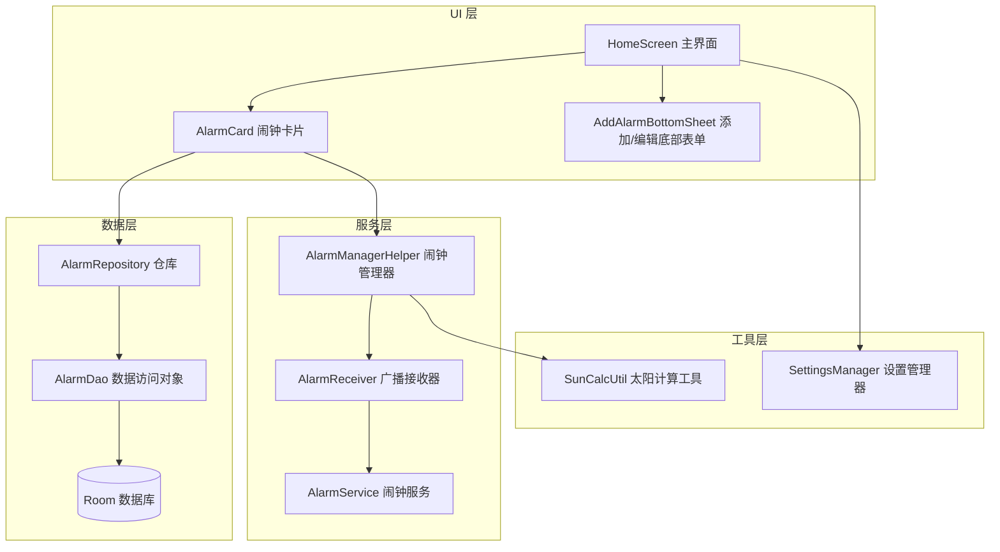
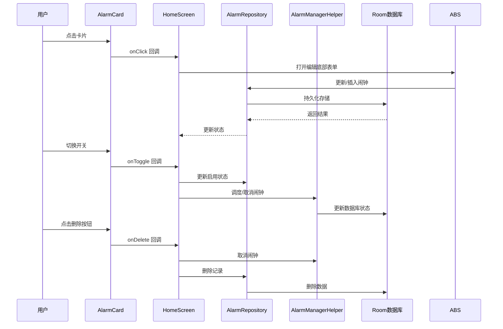
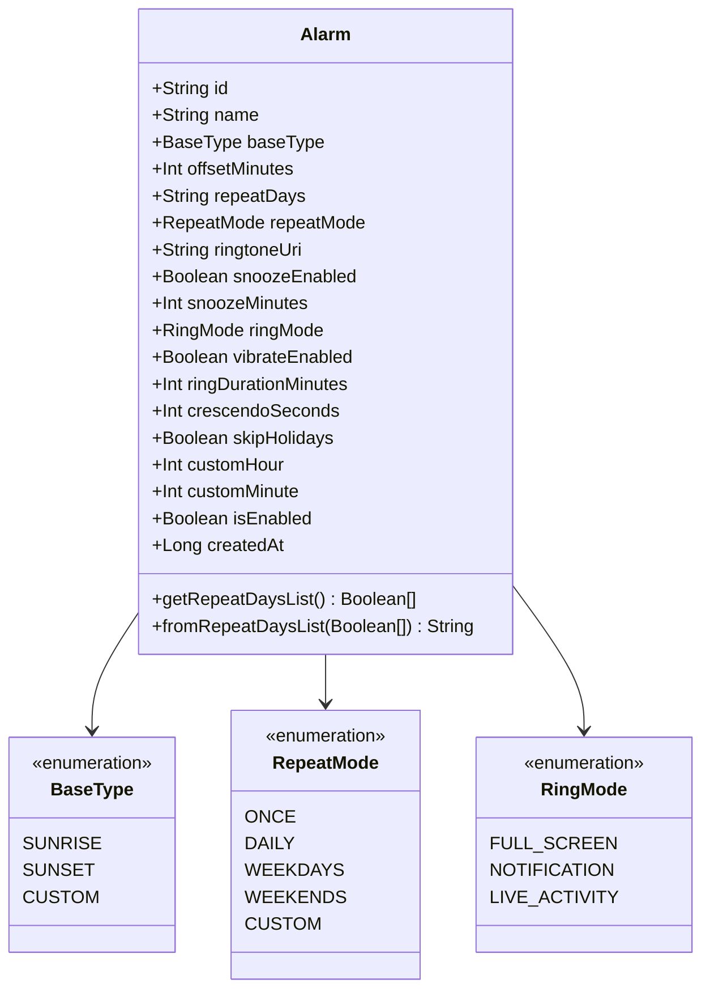
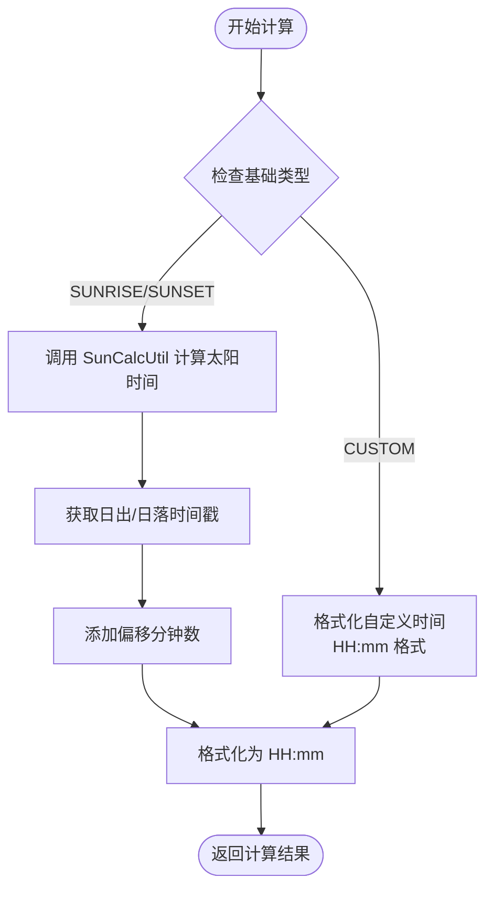
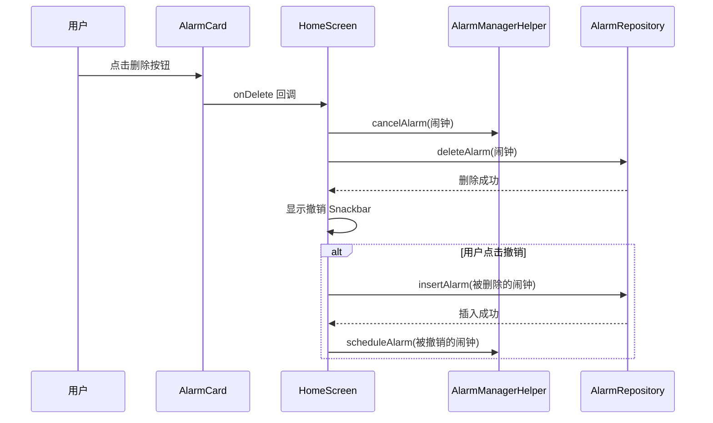
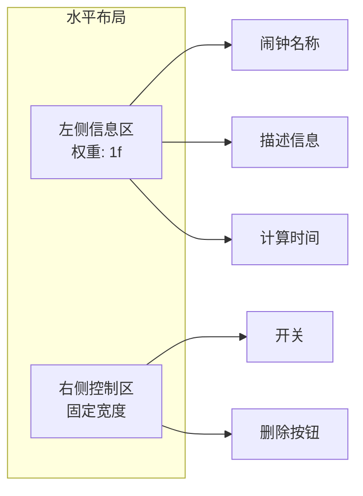
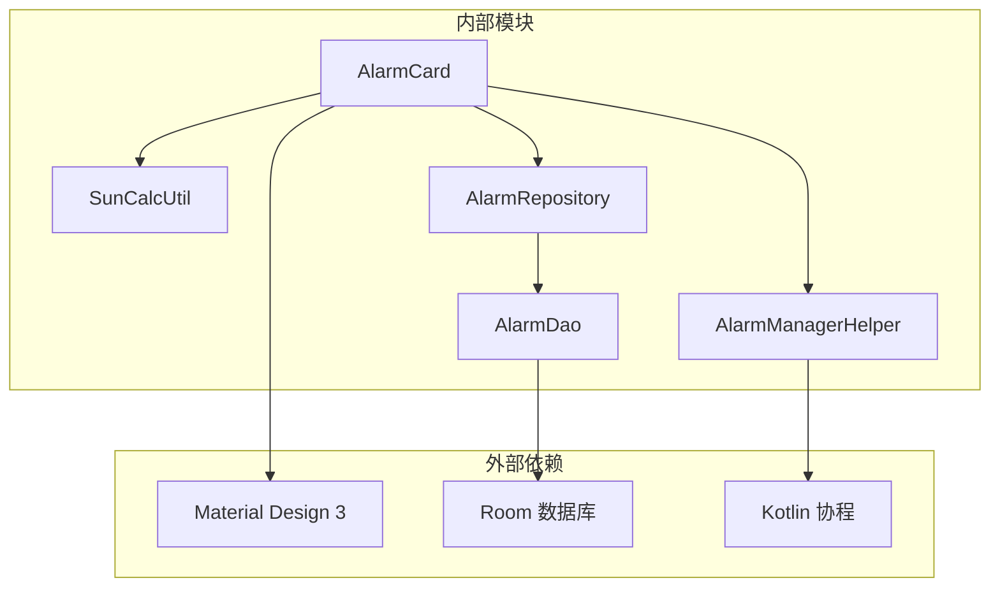

# AlarmCard 闹钟卡片

<cite>
**本文档引用的文件**
- [AlarmCard.kt](file://app/src/main/java/com/snuabar/sunrisesunsetalarm/ui/components/AlarmCard.kt)
- [Alarm.kt](file://app/src/main/java/com/snuabar/sunrisesunsetalarm/data/model/Alarm.kt)
- [HomeScreen.kt](file://app/src/main/java/com/snuabar/sunrisesunsetalarm/ui/screens/HomeScreen.kt)
- [AddAlarmBottomSheet.kt](file://app/src/main/java/com/snuabar/sunrisesunsetalarm/ui/components/AddAlarmBottomSheet.kt)
- [SunCalcUtil.kt](file://app/src/main/java/com/snuabar/sunrisesunsetalarm/util/SunCalcUtil.kt)
- [AlarmManagerHelper.kt](file://app/src/main/java/com/snuabar/sunrisesunsetalarm/service/AlarmManagerHelper.kt)
- [AlarmRepository.kt](file://app/src/main/java/com/snuabar/sunrisesunsetalarm/data/repository/AlarmRepository.kt)
- [AlarmDao.kt](file://app/src/main/java/com/snuabar/sunrisesunsetalarm/data/database/AlarmDao.kt)
- [AlarmReceiver.kt](file://app/src/main/java/com/snuabar/sunrisesunsetalarm/receiver/AlarmReceiver.kt)
</cite>

## 目录
1. [简介](#简介)
2. [项目结构](#项目结构)
3. [核心组件](#核心组件)
4. [架构概览](#架构概览)
5. [详细组件分析](#详细组件分析)
6. [依赖关系分析](#依赖关系分析)
7. [性能考虑](#性能考虑)
8. [故障排除指南](#故障排除指南)
9. [结论](#结论)
10. [附录](#附录)

## 简介

AlarmCard 是一个基于 Jetpack Compose 的自定义 UI 组件，用于在主界面中展示和管理用户的闹钟列表。该组件实现了现代化的 Material Design 设计语言，支持多种类型的闹钟（日出、日落、自定义），并提供了完整的交互功能，包括开关切换、点击编辑和删除操作。

该组件的核心设计理念是通过简洁直观的视觉层次来展示关键信息，同时保持高度的可定制性和响应式布局。组件能够根据不同的闹钟类型动态调整显示内容，并提供实时的位置计算功能来确定基于日出日落的闹钟时间。

## 项目结构

AlarmCard 组件位于应用的 UI 层，与数据层、服务层和工具层形成清晰的分层架构：



**图表来源**
- [AlarmCard.kt:1-150](file://app/src/main/java/com/snuabar/sunrisesunsetalarm/ui/components/AlarmCard.kt#L1-L150)
- [HomeScreen.kt:1-402](file://app/src/main/java/com/snuabar/sunrisesunsetalarm/ui/screens/HomeScreen.kt#L1-L402)
- [AlarmRepository.kt:1-22](file://app/src/main/java/com/snuabar/sunrisesunsetalarm/data/repository/AlarmRepository.kt#L1-L22)

**章节来源**
- [AlarmCard.kt:1-150](file://app/src/main/java/com/snuabar/sunrisesunsetalarm/ui/components/AlarmCard.kt#L1-L150)
- [HomeScreen.kt:1-402](file://app/src/main/java/com/snuabar/sunrisesunsetalarm/ui/screens/HomeScreen.kt#L1-L402)

## 核心组件

AlarmCard 组件是一个完全可组合的 Composable 函数，具有以下核心特性：

### 组件签名和参数

组件接受以下参数：
- `alarm`: Alarm 类型的闹钟对象，包含所有闹钟配置信息
- `latitude`: Double 类型的纬度值，用于太阳计算
- `longitude`: Double 类型的经度值，用于太阳计算
- `onToggle`: 布尔回调函数，处理开关状态变化
- `onClick`: 无参回调函数，处理卡片点击事件
- `onDelete`: 无参回调函数，处理删除操作

### 布局结构

组件采用 Card 容器作为根元素，内部包含三个主要区域：

1. **左侧信息区**: 显示闹钟图标、名称、描述和计算后的时间
2. **右侧控制区**: 包含开关按钮和删除按钮
3. **响应式设计**: 使用权重系统确保在不同屏幕尺寸下的良好表现

### 状态管理

组件通过外部传入的回调函数管理状态，实现了单向数据流的设计原则。内部不维护任何可变状态，确保了组件的纯函数特性和可预测性。

**章节来源**
- [AlarmCard.kt:21-91](file://app/src/main/java/com/snuabar/sunrisesunsetalarm/ui/components/AlarmCard.kt#L21-L91)

## 架构概览

AlarmCard 组件在整个应用架构中扮演着关键角色，连接了 UI 层、数据层和服务层：



**图表来源**
- [AlarmCard.kt:26-28](file://app/src/main/java/com/snuabar/sunrisesunsetalarm/ui/components/AlarmCard.kt#L26-L28)
- [HomeScreen.kt:185-218](file://app/src/main/java/com/snuabar/sunrisesunsetalarm/ui/screens/HomeScreen.kt#L185-L218)
- [AlarmRepository.kt:14-18](file://app/src/main/java/com/snuabar/sunrisesunsetalarm/data/repository/AlarmRepository.kt#L14-L18)

## 详细组件分析

### 数据模型和状态

AlarmCard 组件依赖于 Alarm 数据模型，该模型定义了完整的闹钟配置：



**图表来源**
- [Alarm.kt:7-37](file://app/src/main/java/com/snuabar/sunrisesunsetalarm/data/model/Alarm.kt#L7-L37)

### 信息展示逻辑

组件实现了智能的信息展示策略，根据不同类型的闹钟动态生成显示内容：

#### 基础类型图标映射

| 基础类型 | 图标 | 颜色主题 | 描述 |
|---------|------|----------|------|
| SUNRISE | WbSunny | primary | 日出 |
| SUNSET | WbTwilight | tertiary | 日落 |
| CUSTOM | AccessTime | secondary | 自定义 |

#### 重复模式格式化

组件支持五种重复模式，每种模式都有相应的本地化描述：

- **ONCE**: "仅一次"
- **DAILY**: "每天"  
- **WEEKDAYS**: "工作日"
- **WEEKENDS**: "周末"
- **CUSTOM**: 根据选中的具体星期几生成描述

#### 时间计算算法

对于基于日出日落的闹钟，组件使用 SunCalcUtil 工具类进行精确计算：



**图表来源**
- [AlarmCard.kt:130-149](file://app/src/main/java/com/snuabar/sunrisesunsetalarm/ui/components/AlarmCard.kt#L130-L149)
- [SunCalcUtil.kt:19-45](file://app/src/main/java/com/snuabar/sunrisesunsetalarm/util/SunCalcUtil.kt#L19-L45)

### 交互行为实现

AlarmCard 组件提供了三种主要的用户交互：

#### 点击事件处理

卡片整体支持点击事件，用于打开编辑底部表单。点击行为通过 onClick 回调传递给父组件，确保了组件的无状态设计。

#### 开关切换逻辑

开关控件直接绑定到 alarm.isEnabled 状态，onCheckedChange 回调负责处理状态变化：

1. **启用状态**: 调用 onToggle(true)，触发数据库更新和闹钟调度
2. **禁用状态**: 调用 onToggle(false)，触发数据库更新和闹钟取消

#### 删除操作流程

删除按钮提供安全的删除操作，包含撤销功能：



**图表来源**
- [AlarmCard.kt:77-87](file://app/src/main/java/com/snuabar/sunrisesunsetalarm/ui/components/AlarmCard.kt#L77-L87)
- [HomeScreen.kt:198-218](file://app/src/main/java/com/snuabar/sunrisesunsetalarm/ui/screens/HomeScreen.kt#L198-L218)

### 状态管理机制

AlarmCard 采用外部状态管理模式，通过回调函数与父组件通信：

#### 可变状态的使用

组件内部使用了必要的可变状态来处理本地计算和临时变量：

- `alarmTime`: 缓存计算后的闹钟时间，避免重复计算
- `iconData`: 缓存图标、描述和颜色信息

#### 生命周期管理

组件遵循 Compose 的生命周期管理原则：
- 无持久状态：所有状态都由父组件管理
- 计算优化：使用 remember 和 derivedStateOf 进行计算缓存
- 内存管理：及时释放不必要的资源

### 属性配置选项

AlarmCard 支持丰富的属性配置，通过外部参数传递：

| 参数名 | 类型 | 必需 | 默认值 | 描述 |
|--------|------|------|--------|------|
| alarm | Alarm | 是 | - | 闹钟数据对象 |
| latitude | Double | 是 | - | 纬度坐标 |
| longitude | Double | 是 | - | 经度坐标 |
| onToggle | (Boolean) -> Unit | 是 | - | 开关状态回调 |
| onClick | () -> Unit | 是 | - | 卡片点击回调 |
| onDelete | () -> Unit | 是 | - | 删除操作回调 |

### 样式定制方法

组件遵循 Material Design 3 规范，支持主题定制：

#### 颜色方案

- **图标颜色**: 根据基础类型自动选择主题颜色
- **文本颜色**: 使用 onSurfaceVariant 确保良好的对比度
- **容器颜色**: Card 使用默认的 elevation 效果

#### 布局定制

- **间距**: 使用 16dp 内边距和 12dp 间距
- **权重**: 左侧信息区使用 weight(1f) 占据剩余空间
- **对齐**: 垂直居中对齐确保视觉平衡

### 响应式布局实现

组件采用灵活的响应式设计：



**图表来源**
- [AlarmCard.kt:37-89](file://app/src/main/java/com/snuabar/sunrisesunsetalarm/ui/components/AlarmCard.kt#L37-L89)

## 依赖关系分析

AlarmCard 组件的依赖关系体现了清晰的分层架构：



**图表来源**
- [AlarmCard.kt:3-19](file://app/src/main/java/com/snuabar/sunrisesunsetalarm/ui/components/AlarmCard.kt#L3-L19)
- [AlarmRepository.kt:1-22](file://app/src/main/java/com/snuabar/sunrisesunsetalarm/data/repository/AlarmRepository.kt#L1-L22)

### 直接依赖

- **SunCalcUtil**: 用于基于日出日落的精确时间计算
- **AlarmRepository**: 提供数据访问和持久化功能
- **AlarmManagerHelper**: 处理系统级闹钟调度

### 间接依赖

- **Material Design 3**: 提供 UI 组件和主题系统
- **Kotlin 协程**: 支持异步操作和状态管理
- **Room 数据库**: 提供本地数据持久化

**章节来源**
- [AlarmCard.kt:130-149](file://app/src/main/java/com/snuabar/sunrisesunsetalarm/ui/components/AlarmCard.kt#L130-L149)
- [AlarmRepository.kt:1-22](file://app/src/main/java/com/snuabar/sunrisesunsetalarm/data/repository/AlarmRepository.kt#L1-L22)

## 性能考虑

AlarmCard 组件在设计时充分考虑了性能优化：

### 计算优化

- **记忆化**: 使用 remember 缓存计算结果，避免重复计算
- **派生状态**: 使用 derivedStateOf 优化重组频率
- **懒加载**: 仅在需要时进行太阳时间计算

### 内存管理

- **无状态设计**: 避免持有不必要的状态引用
- **及时释放**: 在组件销毁时自动释放资源
- **轻量级**: 最小化内存占用和 CPU 使用

### UI 性能

- **重组优化**: 使用 key 参数优化列表项重组
- **布局扁平化**: 避免深层嵌套的布局结构
- **绘制优化**: 使用合适的背景色和透明度

## 故障排除指南

### 常见问题及解决方案

#### 闹钟时间显示异常

**症状**: 闹钟时间显示为 06:15 或其他固定值

**原因**: SunCalcUtil 计算失败或位置权限不足

**解决方案**:
1. 检查网络连接和位置权限
2. 验证纬度和经度参数的有效性
3. 查看日志输出获取详细错误信息

#### 开关状态不同步

**症状**: 切换开关后 UI 状态没有更新

**原因**: onToggle 回调未正确处理状态更新

**解决方案**:
1. 确保 onToggle 回调正确更新 alarm.isEnabled
2. 验证数据库更新操作的成功执行
3. 检查 AlarmManagerHelper 的调度/取消操作

#### 删除操作不可撤销

**症状**: 删除后无法撤销操作

**原因**: recentlyDeletedAlarm 状态管理问题

**解决方案**:
1. 确保 onDelete 回调正确设置 recentlyDeletedAlarm
2. 验证 Snackbar 的显示和用户交互
3. 检查撤销操作的数据库回滚逻辑

**章节来源**
- [AlarmCard.kt:146-149](file://app/src/main/java/com/snuabar/sunrisesunsetalarm/ui/components/AlarmCard.kt#L146-L149)
- [HomeScreen.kt:198-218](file://app/src/main/java/com/snuabar/sunrisesunsetalarm/ui/screens/HomeScreen.kt#L198-L218)

## 结论

AlarmCard 组件展现了现代 Android 开发的最佳实践，通过清晰的架构设计、完善的错误处理和优秀的用户体验，为用户提供了直观易用的闹钟管理界面。

组件的主要优势包括：

1. **架构清晰**: 采用分层设计，职责分离明确
2. **性能优秀**: 优化的计算和内存管理
3. **用户体验**: 响应式设计和流畅的交互体验
4. **可扩展性**: 模块化的代码结构便于功能扩展
5. **可靠性**: 完善的错误处理和状态管理

该组件为整个应用的闹钟功能提供了坚实的基础，是构建高质量 Android 应用的优秀示例。

## 附录

### 实际使用示例

#### 基本用法

```kotlin
AlarmCard(
    alarm = alarm,
    latitude = currentLat,
    longitude = currentLng,
    onToggle = { isEnabled ->
        // 处理开关状态变化
    },
    onClick = {
        // 处理卡片点击
    },
    onDelete = {
        // 处理删除操作
    }
)
```

#### 高级配置

组件支持通过外部参数进行深度定制，包括主题颜色、间距和布局等。

### 最佳实践指导

1. **状态管理**: 始终使用外部状态管理模式
2. **错误处理**: 实现完善的异常处理和降级策略
3. **性能优化**: 使用 remember 和 derivedStateOf 进行计算缓存
4. **用户体验**: 提供清晰的反馈和撤销操作
5. **测试覆盖**: 为关键功能编写单元测试和集成测试