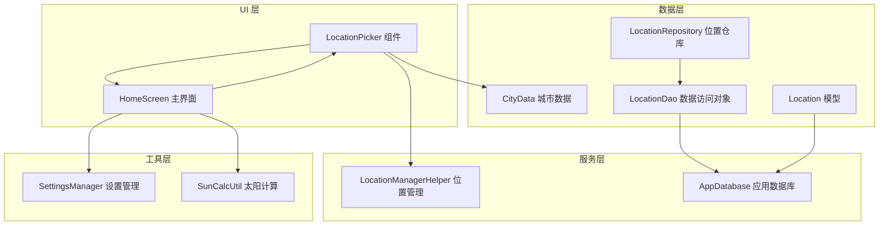
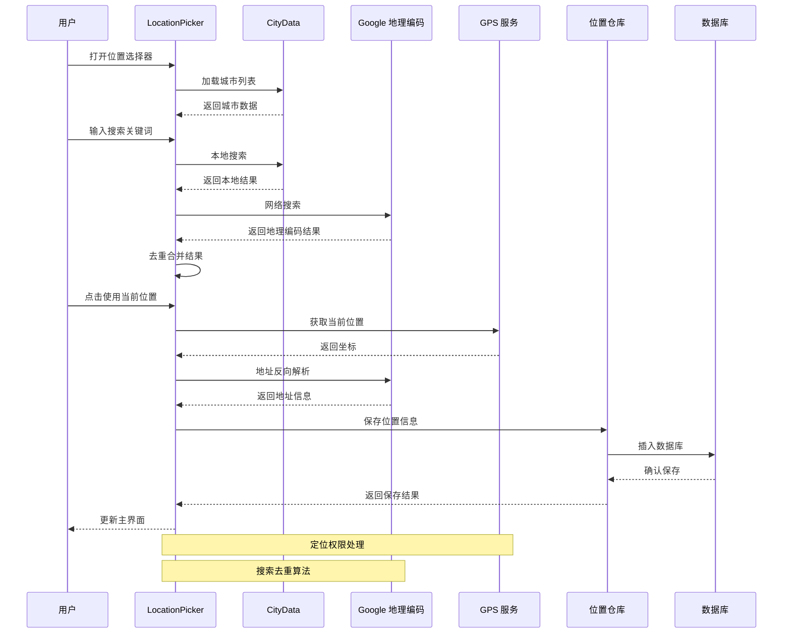
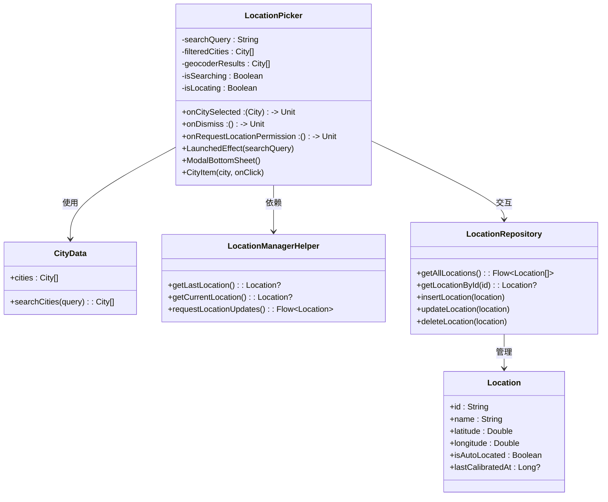
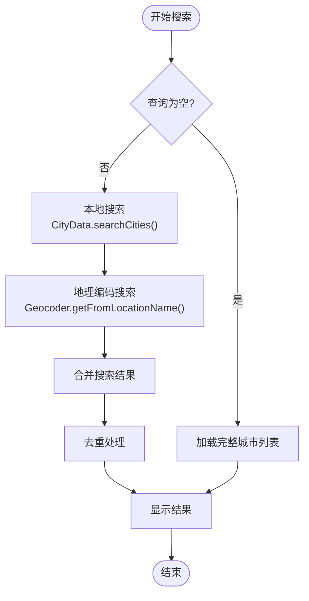
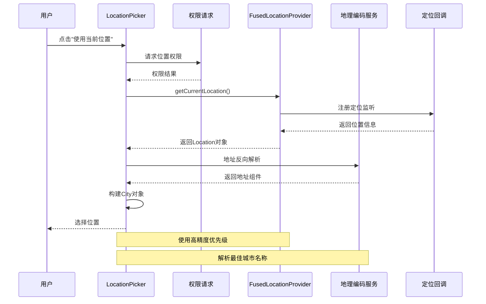
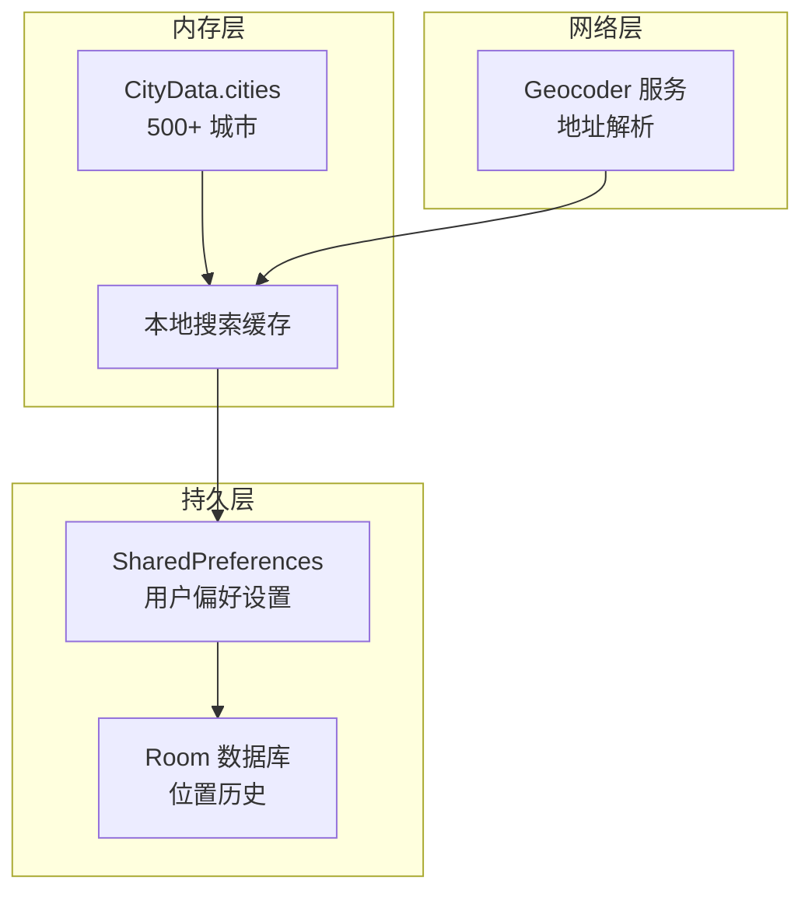
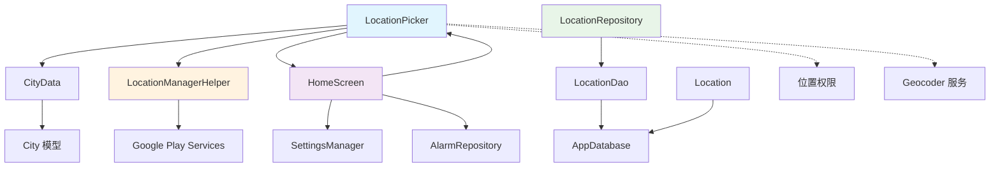
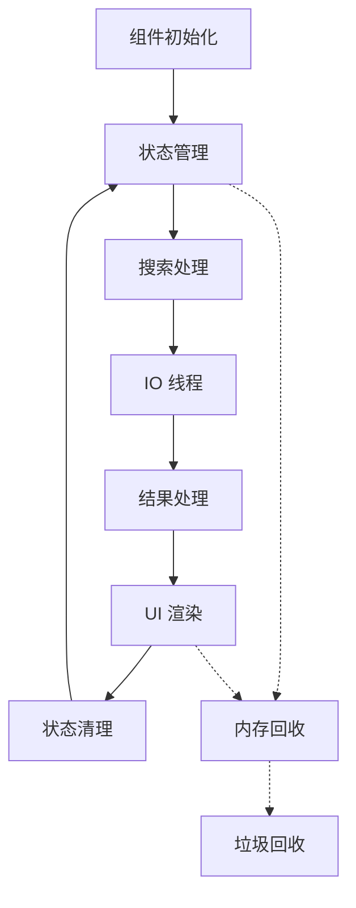

# LocationPicker 位置选择器

<cite>
**本文档引用的文件**
- [LocationPicker.kt](file://app/src/main/java/com/snuabar/sunrisesunsetalarm/ui/components/LocationPicker.kt)
- [CityData.kt](file://app/src/main/java/com/snuabar/sunrisesunsetalarm/data/CityData.kt)
- [LocationManagerHelper.kt](file://app/src/main/java/com/snuabar/sunrisesunsetalarm/util/LocationManagerHelper.kt)
- [Location.kt](file://app/src/main/java/com/snuabar/sunrisesunsetalarm/data/model/Location.kt)
- [LocationDao.kt](file://app/src/main/java/com/snuabar/sunrisesunsetalarm/data/database/LocationDao.kt)
- [LocationRepository.kt](file://app/src/main/java/com/snuabar/sunrisesunsetalarm/data/repository/LocationRepository.kt)
- [HomeScreen.kt](file://app/src/main/java/com/snuabar/sunrisesunsetalarm/ui/screens/HomeScreen.kt)
- [AppDatabase.kt](file://app/src/main/java/com/snuabar/sunrisesunsetalarm/data/database/AppDatabase.kt)
- [SettingsManager.kt](file://app/src/main/java/com/snuabar/sunrisesunsetalarm/util/SettingsManager.kt)
- [AndroidManifest.xml](file://app/src/main/AndroidManifest.xml)
</cite>

## 目录
1. [简介](#简介)
2. [项目结构](#项目结构)
3. [核心组件](#核心组件)
4. [架构概览](#架构概览)
5. [详细组件分析](#详细组件分析)
6. [依赖关系分析](#依赖关系分析)
7. [性能考虑](#性能考虑)
8. [故障排除指南](#故障排除指南)
9. [结论](#结论)

## 简介

LocationPicker 是一个基于 Jetpack Compose 的位置选择器组件，专为日出日落闹钟应用设计。该组件提供了完整的城市搜索、GPS定位、历史记录管理和用户偏好设置功能。它集成了本地城市数据库、Google 地图地理编码服务和 Android 位置服务，为用户提供流畅的位置选择体验。

## 项目结构

LocationPicker 组件位于应用的 UI 层，与数据层、服务层和工具层紧密协作：

**图表来源**
- [LocationPicker.kt:1-260](file://app/src/main/java/com/snuabar/sunrisesunsetalarm/ui/components/LocationPicker.kt#L1-L260)
- [HomeScreen.kt:1-402](file://app/src/main/java/com/snuabar/sunrisesunsetalarm/ui/screens/HomeScreen.kt#L1-L402)

**章节来源**
- [LocationPicker.kt:1-260](file://app/src/main/java/com/snuabar/sunrisesunsetalarm/ui/components/LocationPicker.kt#L1-L260)
- [HomeScreen.kt:1-402](file://app/src/main/java/com/snuabar/sunrisesunsetalarm/ui/screens/HomeScreen.kt#L1-L402)

## 核心组件

LocationPicker 组件的核心功能包括：

### 1. 城市列表展示
- 支持 500+ 个中国主要城市的数据
- 实时搜索过滤功能
- 分组显示本地数据和网络搜索结果

### 2. 搜索过滤机制
- 本地城市数据库搜索
- Google 地理编码服务集成
- 智能去重算法
- 搜索结果排序和展示

### 3. 位置信息解析
- GPS 定位服务集成
- 地址反向解析
- 城市名称提取
- 坐标信息管理

**章节来源**
- [LocationPicker.kt:27-260](file://app/src/main/java/com/snuabar/sunrisesunsetalarm/ui/components/LocationPicker.kt#L27-L260)
- [CityData.kt:10-554](file://app/src/main/java/com/snuabar/sunrisesunsetalarm/data/CityData.kt#L10-L554)

## 架构概览

LocationPicker 采用 MVVM 架构模式，通过状态管理和协程实现响应式编程：

**图表来源**
- [LocationPicker.kt:42-98](file://app/src/main/java/com/snuabar/sunrisesunsetalarm/ui/components/LocationPicker.kt#L42-L98)
- [LocationManagerHelper.kt:18-77](file://app/src/main/java/com/snuabar/sunrisesunsetalarm/util/LocationManagerHelper.kt#L18-L77)

## 详细组件分析

### LocationPicker 组件架构

**图表来源**
- [LocationPicker.kt:26-260](file://app/src/main/java/com/snuabar/sunrisesunsetalarm/ui/components/LocationPicker.kt#L26-L260)
- [CityData.kt:3-8](file://app/src/main/java/com/snuabar/sunrisesunsetalarm/data/CityData.kt#L3-L8)
- [LocationManagerHelper.kt:14-79](file://app/src/main/java/com/snuabar/sunrisesunsetalarm/util/LocationManagerHelper.kt#L14-L79)
- [LocationRepository.kt:7-17](file://app/src/main/java/com/snuabar/sunrisesunsetalarm/data/repository/LocationRepository.kt#L7-L17)

### 搜索功能实现

LocationPicker 的搜索功能采用双重搜索策略：

**图表来源**
- [LocationPicker.kt:42-98](file://app/src/main/java/com/snuabar/sunrisesunsetalarm/ui/components/LocationPicker.kt#L42-L98)
- [CityData.kt:546-552](file://app/src/main/java/com/snuabar/sunrisesunsetalarm/data/CityData.kt#L546-L552)

### GPS 定位集成

**图表来源**
- [LocationPicker.kt:142-175](file://app/src/main/java/com/snuabar/sunrisesunsetalarm/ui/components/LocationPicker.kt#L142-L175)
- [LocationManagerHelper.kt:60-77](file://app/src/main/java/com/snuabar/sunrisesunsetalarm/util/LocationManagerHelper.kt#L60-L77)

**章节来源**
- [LocationPicker.kt:26-260](file://app/src/main/java/com/snuabar/sunrisesunsetalarm/ui/components/LocationPicker.kt#L26-L260)
- [LocationManagerHelper.kt:14-79](file://app/src/main/java/com/snuabar/sunrisesunsetalarm/util/LocationManagerHelper.kt#L14-L79)

### 数据存储策略

LocationPicker 采用多层数据存储策略：

**图表来源**
- [CityData.kt:10-544](file://app/src/main/java/com/snuabar/sunrisesunsetalarm/data/CityData.kt#L10-L544)
- [SettingsManager.kt:8-49](file://app/src/main/java/com/snuabar/sunrisesunsetalarm/util/SettingsManager.kt#L8-L49)
- [Location.kt:6-15](file://app/src/main/java/com/snuabar/sunrisesunsetalarm/data/model/Location.kt#L6-L15)

**章节来源**
- [LocationRepository.kt:7-17](file://app/src/main/java/com/snuabar/sunrisesunsetalarm/data/repository/LocationRepository.kt#L7-L17)
- [LocationDao.kt:7-23](file://app/src/main/java/com/snuabar/sunrisesunsetalarm/data/database/LocationDao.kt#L7-L23)

## 依赖关系分析

### 组件依赖图

**图表来源**
- [LocationPicker.kt:18-33](file://app/src/main/java/com/snuabar/sunrisesunsetalarm/ui/components/LocationPicker.kt#L18-L33)
- [HomeScreen.kt:24-66](file://app/src/main/java/com/snuabar/sunrisesunsetalarm/ui/screens/HomeScreen.kt#L24-L66)

### 外部依赖

LocationPicker 依赖以下外部服务和库：

| 依赖类型 | 服务名称 | 版本/要求 | 用途 |
|---------|----------|-----------|------|
| Google Play Services | FusedLocationProvider | 最低 API 21 | GPS 定位 |
| AndroidX | Compose Material3 | 最新稳定版 | UI 组件 |
| Kotlin | Coroutines | 最新稳定版 | 异步处理 |
| Android | Geocoder | 系统服务 | 地址解析 |
| Room | Database | 最新稳定版 | 本地存储 |

**章节来源**
- [AndroidManifest.xml:5-15](file://app/src/main/AndroidManifest.xml#L5-L15)
- [LocationManagerHelper.kt:6-11](file://app/src/main/java/com/snuabar/sunrisesunsetalarm/util/LocationManagerHelper.kt#L6-L11)

## 性能考虑

### 列表渲染优化

LocationPicker 采用以下优化策略：

1. **LazyColumn 虚拟化渲染**
   - 使用 `LazyColumn` 实现列表项的按需渲染
   - 仅渲染可见区域内的城市项
   - 支持动态高度调整

2. **搜索去重算法**
   - 智能过滤重复的搜索结果
   - 基于字符串包含关系的去重逻辑
   - 减少 UI 渲染负担

3. **异步处理**
   - 地理编码搜索在 IO 线程执行
   - 定位请求使用协程处理
   - 避免阻塞主线程

### 内存管理

**图表来源**
- [LocationPicker.kt:36-98](file://app/src/main/java/com/snuabar/sunrisesunsetalarm/ui/components/LocationPicker.kt#L36-L98)

**章节来源**
- [LocationPicker.kt:26-260](file://app/src/main/java/com/snuabar/sunrisesunsetalarm/ui/components/LocationPicker.kt#L26-L260)

## 故障排除指南

### 常见问题及解决方案

#### 1. 定位权限相关问题

**问题症状**：
- "使用当前位置"按钮无响应
- 定位失败提示

**解决步骤**：
1. 检查 AndroidManifest.xml 中的权限声明
2. 确认运行时权限请求流程
3. 验证 Google Play Services 是否可用

**章节来源**
- [AndroidManifest.xml:5-15](file://app/src/main/AndroidManifest.xml#L5-L15)
- [LocationPicker.kt:142-175](file://app/src/main/java/com/snuabar/sunrisesunsetalarm/ui/components/LocationPicker.kt#L142-L175)

#### 2. 搜索功能异常

**问题症状**：
- 搜索无结果或结果不准确
- 地理编码服务调用失败

**解决步骤**：
1. 检查网络连接状态
2. 验证 Geocoder 服务可用性
3. 确认搜索查询格式正确

**章节来源**
- [LocationPicker.kt:42-98](file://app/src/main/java/com/snuabar/sunrisesunsetalarm/ui/components/LocationPicker.kt#L42-L98)

#### 3. 数据存储问题

**问题症状**：
- 位置信息丢失
- 应用重启后设置重置

**解决步骤**：
1. 检查 SharedPreferences 写入
2. 验证 Room 数据库迁移
3. 确认数据持久化流程

**章节来源**
- [SettingsManager.kt:8-49](file://app/src/main/java/com/snuabar/sunrisesunsetalarm/util/SettingsManager.kt#L8-L49)
- [AppDatabase.kt:10-34](file://app/src/main/java/com/snuabar/sunrisesunsetalarm/data/database/AppDatabase.kt#L10-L34)

## 结论

LocationPicker 位置选择器组件展现了现代 Android 开发的最佳实践：

### 设计优势

1. **模块化架构**：清晰的分层设计，职责分离明确
2. **响应式编程**：基于 Compose 和协程的状态管理
3. **性能优化**：虚拟化渲染和智能缓存策略
4. **用户体验**：流畅的交互和即时反馈

### 技术亮点

- **双重搜索策略**：结合本地数据库和网络服务的优势
- **智能去重算法**：提升搜索结果质量
- **权限优雅降级**：处理权限拒绝场景
- **数据持久化**：多层存储策略确保数据安全

### 改进建议

1. **搜索历史记录**：添加最近搜索和常用地点功能
2. **离线支持**：增强离线搜索能力
3. **国际化支持**：扩展多语言城市名称支持
4. **无障碍访问**：提升无障碍功能完整性

该组件为日出日落闹钟应用提供了坚实的基础，通过合理的架构设计和性能优化，为用户提供了高效、可靠的地理位置选择体验。