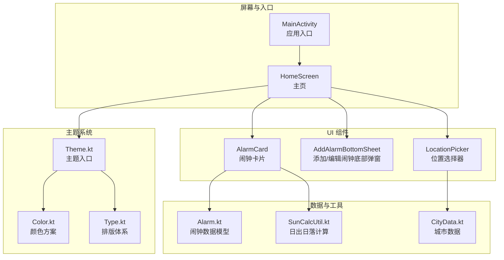
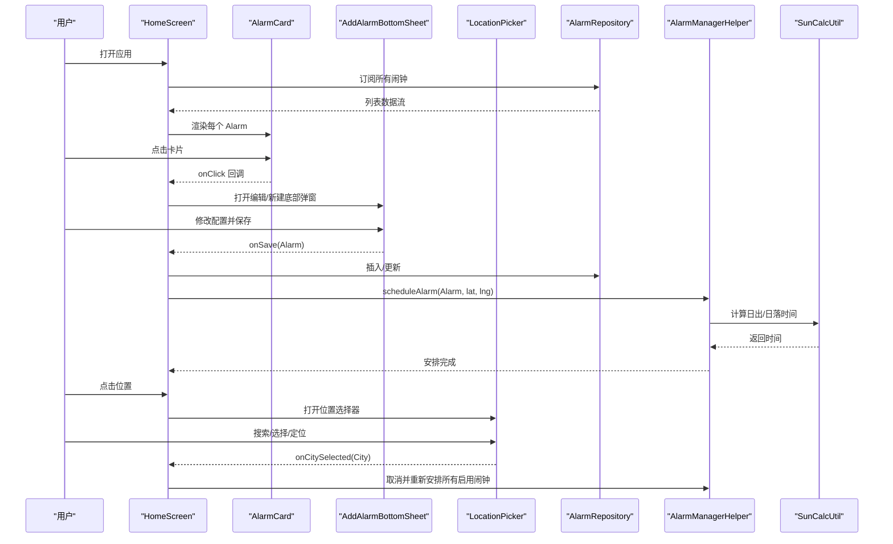
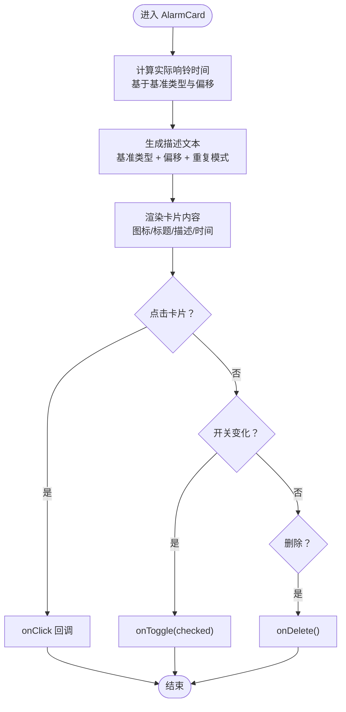
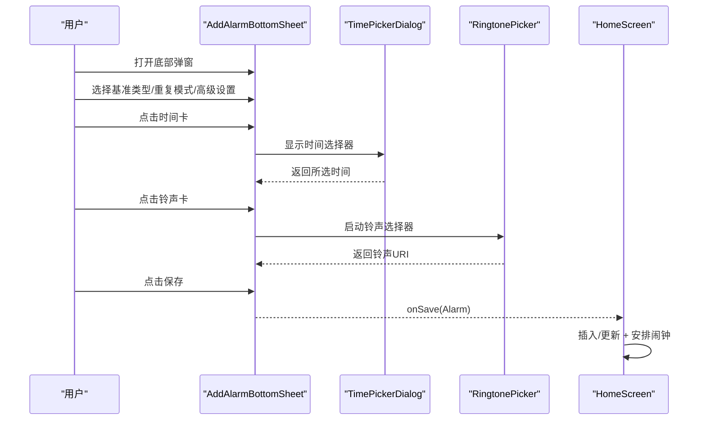
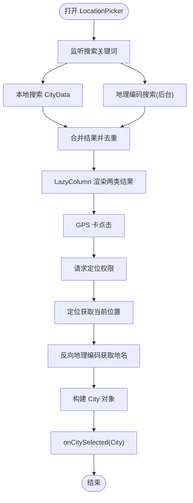
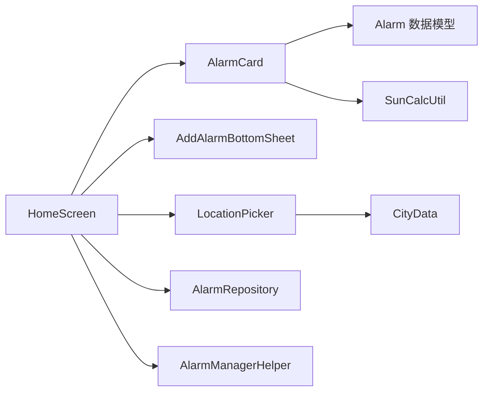

# UI组件

<cite>
**本文档引用的文件**
- [AlarmCard.kt](file://app/src/main/java/com/snuabar/sunrisesunsetalarm/ui/components/AlarmCard.kt)
- [AddAlarmBottomSheet.kt](file://app/src/main/java/com/snuabar/sunrisesunsetalarm/ui/components/AddAlarmBottomSheet.kt)
- [LocationPicker.kt](file://app/src/main/java/com/snuabar/sunrisesunsetalarm/ui/components/LocationPicker.kt)
- [Theme.kt](file://app/src/main/java/com/snuabar/sunrisesunsetalarm/ui/theme/Theme.kt)
- [Color.kt](file://app/src/main/java/com/snuabar/sunrisesunsetalarm/ui/theme/Color.kt)
- [Type.kt](file://app/src/main/java/com/snuabar/sunrisesunsetalarm/ui/theme/Type.kt)
- [HomeScreen.kt](file://app/src/main/java/com/snuabar/sunrisesunsetalarm/ui/screens/HomeScreen.kt)
- [Alarm.kt](file://app/src/main/java/com/snuabar/sunrisesunsetalarm/data/model/Alarm.kt)
- [SunCalcUtil.kt](file://app/src/main/java/com/snuabar/sunrisesunsetalarm/util/SunCalcUtil.kt)
- [CityData.kt](file://app/src/main/java/com/snuabar/sunrisesunsetalarm/data/CityData.kt)
- [MainActivity.kt](file://app/src/main/java/com/snuabar/sunrisesunsetalarm/MainActivity.kt)
</cite>

## 目录
1. [简介](#简介)
2. [项目结构](#项目结构)
3. [核心组件](#核心组件)
4. [架构总览](#架构总览)
5. [详细组件分析](#详细组件分析)
6. [依赖关系分析](#依赖关系分析)
7. [性能考量](#性能考量)
8. [故障排查指南](#故障排查指南)
9. [结论](#结论)
10. [附录](#附录)

## 简介
本文件聚焦于日出日落智能闹钟应用的Jetpack Compose UI组件，系统性梳理并说明以下核心组件的设计与实现：
- AlarmCard 闹钟卡片：展示单个闹钟的名称、类型、重复模式、偏移量以及计算后的实际响铃时间，并支持开关与删除操作。
- AddAlarmBottomSheet 添加/编辑闹钟底部弹窗：提供完整的闹钟配置界面，包括基准时间类型、自定义时间或偏移滑条、重复模式与自定义星期、铃声选择、高级设置（响铃模式、振动、响铃时长、渐强、节假日跳过、贪睡等）。
- LocationPicker 位置选择器：支持本地城市列表搜索、地理编码搜索、GPS定位获取当前位置，并在选择后触发闹钟重新调度。

同时，文档阐述组件的状态管理、事件处理与数据绑定机制，Material Design 3 主题系统的应用（颜色、排版、尺寸），响应式设计与跨设备适配策略，并给出组件使用示例、自定义选项与样式覆盖方法，以及组件组合模式与最佳实践。

## 项目结构
UI层采用按功能模块划分的目录结构，核心UI组件位于 ui/components，主题定义位于 ui/theme，入口与主屏幕位于 ui/screens。数据模型与工具类位于 data 与 util 包下。

图表来源
- [AlarmCard.kt:1-150](file://app/src/main/java/com/snuabar/sunrisesunsetalarm/ui/components/AlarmCard.kt#L1-L150)
- [AddAlarmBottomSheet.kt:1-480](file://app/src/main/java/com/snuabar/sunrisesunsetalarm/ui/components/AddAlarmBottomSheet.kt#L1-L480)
- [LocationPicker.kt:1-260](file://app/src/main/java/com/snuabar/sunrisesunsetalarm/ui/components/LocationPicker.kt#L1-L260)
- [Theme.kt:1-106](file://app/src/main/java/com/snuabar/sunrisesunsetalarm/ui/theme/Theme.kt#L1-L106)
- [Color.kt:1-52](file://app/src/main/java/com/snuabar/sunrisesunsetalarm/ui/theme/Color.kt#L1-L52)
- [Type.kt:1-32](file://app/src/main/java/com/snuabar/sunrisesunsetalarm/ui/theme/Type.kt#L1-L32)
- [HomeScreen.kt:1-402](file://app/src/main/java/com/snuabar/sunrisesunsetalarm/ui/screens/HomeScreen.kt#L1-L402)
- [MainActivity.kt:1-39](file://app/src/main/java/com/snuabar/sunrisesunsetalarm/MainActivity.kt#L1-L39)
- [Alarm.kt:1-50](file://app/src/main/java/com/snuabar/sunrisesunsetalarm/data/model/Alarm.kt#L1-L50)
- [SunCalcUtil.kt:1-138](file://app/src/main/java/com/snuabar/sunrisesunsetalarm/util/SunCalcUtil.kt#L1-L138)
- [CityData.kt:1-554](file://app/src/main/java/com/snuabar/sunrisesunsetalarm/data/CityData.kt#L1-L554)

章节来源
- [HomeScreen.kt:1-402](file://app/src/main/java/com/snuabar/sunrisesunsetalarm/ui/screens/HomeScreen.kt#L1-L402)
- [MainActivity.kt:1-39](file://app/src/main/java/com/snuabar/sunrisesunsetalarm/MainActivity.kt#L1-L39)

## 核心组件
本节对三个核心UI组件进行深入分析，涵盖状态管理、事件处理、数据绑定与交互流程。

- AlarmCard 闹钟卡片
  - 输入参数：Alarm 实体、经纬度、开关回调、点击回调、删除回调
  - 状态管理：内部不持有可变状态；通过外部传入的 onToggle/onDelete 处理用户交互
  - 数据绑定：根据 Alarm.baseType 与 Alarm.offsetMinutes 计算实际响铃时间；根据 RepeatMode 生成描述文本
  - 交互行为：点击卡片进入编辑；右侧开关切换启用状态；删除按钮触发删除
  - 设计要点：图标与颜色与基准类型绑定；描述文本包含“日出/日落/自定义”、“偏移量”、“重复模式”；时间文本来自 SunCalcUtil 计算结果

- AddAlarmBottomSheet 添加/编辑闹钟底部弹窗
  - 输入参数：Alarm?（可空表示新建）、关闭回调、保存回调
  - 状态管理：使用 remember + mutableState/mutableIntState 管理表单字段；TimePickerDialog 与 RingtonePicker 使用 rememberLauncherForActivityResult
  - 数据绑定：根据选择的基准类型决定显示偏移滑条或自定义时间卡；重复模式联动自定义星期选择；高级设置项按需展开
  - 交互行为：保存时构建 Alarm 对象并调用 onSave；编辑模式先取消旧闹钟再插入/更新
  - 设计要点：Material3 组件广泛使用（OutlinedTextField、ExposedDropdownMenu、Slider、Switch、Card 等）

- LocationPicker 位置选择器
  - 输入参数：城市选择回调、关闭回调、请求权限回调
  - 状态管理：LaunchedEffect 监听搜索关键词，触发本地搜索与地理编码搜索；协程控制异步定位
  - 数据绑定：本地 CityData.cities 与 Geocoder 结果合并展示；过滤重复项；点击城市触发 onCitySelected
  - 交互行为：搜索框输入触发搜索；GPS 卡点击触发权限申请与定位；定位成功后封装 City 并回调
  - 设计要点：ModalBottomSheet + LazyColumn + 自定义 CityItem；支持加载指示器与空状态提示

章节来源
- [AlarmCard.kt:1-150](file://app/src/main/java/com/snuabar/sunrisesunsetalarm/ui/components/AlarmCard.kt#L1-L150)
- [AddAlarmBottomSheet.kt:1-480](file://app/src/main/java/com/snuabar/sunrisesunsetalarm/ui/components/AddAlarmBottomSheet.kt#L1-L480)
- [LocationPicker.kt:1-260](file://app/src/main/java/com/snuabar/sunrisesunsetalarm/ui/components/LocationPicker.kt#L1-L260)

## 架构总览
整体架构围绕 HomeScreen 作为主屏幕，协调 AlarmCard、AddAlarmBottomSheet、LocationPicker 三大组件，并通过 AlarmRepository 与 AlarmManagerHelper 进行数据持久化与系统闹钟调度。

图表来源
- [HomeScreen.kt:1-402](file://app/src/main/java/com/snuabar/sunrisesunsetalarm/ui/screens/HomeScreen.kt#L1-L402)
- [AlarmCard.kt:1-150](file://app/src/main/java/com/snuabar/sunrisesunsetalarm/ui/components/AlarmCard.kt#L1-L150)
- [AddAlarmBottomSheet.kt:1-480](file://app/src/main/java/com/snuabar/sunrisesunsetalarm/ui/components/AddAlarmBottomSheet.kt#L1-L480)
- [LocationPicker.kt:1-260](file://app/src/main/java/com/snuabar/sunrisesunsetalarm/ui/components/LocationPicker.kt#L1-L260)
- [Alarm.kt:1-50](file://app/src/main/java/com/snuabar/sunrisesunsetalarm/data/model/Alarm.kt#L1-L50)
- [SunCalcUtil.kt:1-138](file://app/src/main/java/com/snuabar/sunrisesunsetalarm/util/SunCalcUtil.kt#L1-L138)

## 详细组件分析

### AlarmCard 组件分析
- 状态管理
  - 不持有可变状态，通过 onToggle/onClick/onDelete 三个回调与父组件交互
  - 时间计算在函数内部完成，避免在 Compose 层维护复杂状态
- 数据绑定
  - 基于 Alarm.baseType 与 offsetMinutes 计算实际响铃时间
  - 重复模式格式化为本地化文本，支持一次性、每日、工作日、周末、自定义星期
- 交互流程
  - 点击卡片触发编辑；右侧开关切换启用状态；删除按钮触发删除并支持撤销
- 设计细节
  - 图标与颜色与基准类型绑定（日出/日落/自定义）
  - 文本层级使用 MaterialTheme.typography 的标题与正文系列

图表来源
- [AlarmCard.kt:1-150](file://app/src/main/java/com/snuabar/sunrisesunsetalarm/ui/components/AlarmCard.kt#L1-L150)
- [Alarm.kt:1-50](file://app/src/main/java/com/snuabar/sunrisesunsetalarm/data/model/Alarm.kt#L1-L50)
- [SunCalcUtil.kt:1-138](file://app/src/main/java/com/snuabar/sunrisesunsetalarm/util/SunCalcUtil.kt#L1-L138)

章节来源
- [AlarmCard.kt:1-150](file://app/src/main/java/com/snuabar/sunrisesunsetalarm/ui/components/AlarmCard.kt#L1-L150)
- [Alarm.kt:1-50](file://app/src/main/java/com/snuabar/sunrisesunsetalarm/data/model/Alarm.kt#L1-L50)
- [SunCalcUtil.kt:1-138](file://app/src/main/java/com/snuabar/sunrisesunsetalarm/util/SunCalcUtil.kt#L1-L138)

### AddAlarmBottomSheet 组件分析
- 状态管理
  - 使用 remember + mutableState/mutableIntState 管理基础字段
  - 使用 rememberLauncherForActivityResult 管理系统对话框（TimePicker、RingtonePicker）
  - ModalBottomSheetState 控制弹窗展开/收起
- 数据绑定
  - 基于选择的基准类型决定 UI：CUSTOM 显示时间卡，SUNRISE/SUNSET 显示偏移滑条
  - 重复模式联动自定义星期选择
  - 高级设置按需展开，包含响铃模式、振动、响铃时长、渐强、节假日跳过、贪睡等
- 交互流程
  - 保存时构建 Alarm 对象，区分新建与编辑场景；编辑前取消旧闹钟，保存后安排新闹钟
  - 高级设置中的贪睡开关控制贪睡时长滑条显示

图表来源
- [AddAlarmBottomSheet.kt:1-480](file://app/src/main/java/com/snuabar/sunrisesunsetalarm/ui/components/AddAlarmBottomSheet.kt#L1-L480)
- [HomeScreen.kt:1-402](file://app/src/main/java/com/snuabar/sunrisesunsetalarm/ui/screens/HomeScreen.kt#L1-L402)

章节来源
- [AddAlarmBottomSheet.kt:1-480](file://app/src/main/java/com/snuabar/sunrisesunsetalarm/ui/components/AddAlarmBottomSheet.kt#L1-L480)
- [HomeScreen.kt:1-402](file://app/src/main/java/com/snuabar/sunrisesunsetalarm/ui/screens/HomeScreen.kt#L1-L402)

### LocationPicker 组件分析
- 状态管理
  - LaunchedEffect 监听搜索关键词，触发本地搜索与地理编码搜索
  - 协程控制定位逻辑，Geocoder 异步获取地址信息
- 数据绑定
  - 本地搜索使用 CityData.searchCities；地理编码搜索使用 Geocoder.getFromLocationName
  - 合并结果并过滤重复项；LazyColumn 展示两类结果（本地数据/网络搜索）
- 交互流程
  - 搜索框输入触发搜索；GPS 卡点击触发权限申请与定位；定位成功后封装 City 并回调 onCitySelected
  - 支持加载指示器与空状态提示

图表来源
- [LocationPicker.kt:1-260](file://app/src/main/java/com/snuabar/sunrisesunsetalarm/ui/components/LocationPicker.kt#L1-L260)
- [CityData.kt:1-554](file://app/src/main/java/com/snuabar/sunrisesunsetalarm/data/CityData.kt#L1-L554)

章节来源
- [LocationPicker.kt:1-260](file://app/src/main/java/com/snuabar/sunrisesunsetalarm/ui/components/LocationPicker.kt#L1-L260)
- [CityData.kt:1-554](file://app/src/main/java/com/snuabar/sunrisesunsetalarm/data/CityData.kt#L1-L554)

### Material Design 3 主题系统
- 颜色系统
  - 定义了浅色与深色两套颜色方案，包含 primary、secondary、tertiary、surface、background、error 等
  - 支持动态颜色（Android 12+），根据系统主题自动切换
- 排版体系
  - 定义了 bodyLarge、titleLarge、labelSmall 等常用文本样式
- 尺寸规范
  - 组件普遍使用 dp 作为尺寸单位，遵循 Material3 规范
- 应用方式
  - 在 SunriseSunsetAlarmTheme 中注入 colorScheme 与 Typography
  - 在各组件中通过 MaterialTheme.colorScheme 与 MaterialTheme.typography 获取样式

章节来源
- [Theme.kt:1-106](file://app/src/main/java/com/snuabar/sunrisesunsetalarm/ui/theme/Theme.kt#L1-L106)
- [Color.kt:1-52](file://app/src/main/java/com/snuabar/sunrisesunsetalarm/ui/theme/Color.kt#L1-L52)
- [Type.kt:1-32](file://app/src/main/java/com/snuabar/sunrisesunsetalarm/ui/theme/Type.kt#L1-L32)

### 响应式设计与跨设备适配
- 布局策略
  - 使用 fillMaxWidth/fillMaxSize 适配不同宽度；LazyColumn 与 ModalBottomSheet 提供滚动与弹窗体验
  - 使用 Spacers 与 Arrangement/Alignment 控制间距与对齐
- 材料组件
  - 使用 Card、OutlinedTextField、Slider、Switch、RadioButton、FilterChip 等组件保证一致的交互体验
- 动态主题
  - 根据系统深色模式自动切换颜色方案，提升跨设备一致性

章节来源
- [AlarmCard.kt:1-150](file://app/src/main/java/com/snuabar/sunrisesunsetalarm/ui/components/AlarmCard.kt#L1-L150)
- [AddAlarmBottomSheet.kt:1-480](file://app/src/main/java/com/snuabar/sunrisesunsetalarm/ui/components/AddAlarmBottomSheet.kt#L1-L480)
- [LocationPicker.kt:1-260](file://app/src/main/java/com/snuabar/sunrisesunsetalarm/ui/components/LocationPicker.kt#L1-L260)
- [Theme.kt:1-106](file://app/src/main/java/com/snuabar/sunrisesunsetalarm/ui/theme/Theme.kt#L1-L106)

### 组件使用示例与最佳实践
- AlarmCard 使用示例
  - 在 HomeScreen 中通过 LazyColumn 遍历 Alarm 列表，为每个 Alarm 渲染 AlarmCard
  - 传递 onToggle/onClick/onDelete 回调，实现开关、编辑、删除与撤销
- AddAlarmBottomSheet 使用示例
  - HomeScreen 中根据 showAddSheet 或 editingAlarm 状态控制弹窗显示
  - 保存时根据是否编辑决定取消旧闹钟并插入/更新新闹钟
- LocationPicker 使用示例
  - HomeScreen 中点击位置区域打开 LocationPicker，选择城市后更新设置并重新调度所有启用闹钟
- 最佳实践
  - 组件保持无状态或最小状态，通过回调与父组件通信
  - 使用 remember 与 rememberCoroutineScope 管理轻量状态与协程作用域
  - 使用 Material3 组件与主题，确保一致性与可访问性
  - 对耗时操作（定位、地理编码）使用协程与后台线程，避免阻塞主线程

章节来源
- [HomeScreen.kt:1-402](file://app/src/main/java/com/snuabar/sunrisesunsetalarm/ui/screens/HomeScreen.kt#L1-L402)
- [AlarmCard.kt:1-150](file://app/src/main/java/com/snuabar/sunrisesunsetalarm/ui/components/AlarmCard.kt#L1-L150)
- [AddAlarmBottomSheet.kt:1-480](file://app/src/main/java/com/snuabar/sunrisesunsetalarm/ui/components/AddAlarmBottomSheet.kt#L1-L480)
- [LocationPicker.kt:1-260](file://app/src/main/java/com/snuabar/sunrisesunsetalarm/ui/components/LocationPicker.kt#L1-L260)

## 依赖关系分析
- 组件间依赖
  - HomeScreen 依赖 AlarmCard、AddAlarmBottomSheet、LocationPicker
  - AlarmCard 依赖 Alarm 数据模型与 SunCalcUtil
  - LocationPicker 依赖 CityData 与 Geocoder
- 外部依赖
  - Material3 组件库与 Jetpack Compose
  - AlarmManager 与 AlarmManagerHelper（系统闹钟调度）
  - Room 数据库（AlarmRepository）

图表来源
- [HomeScreen.kt:1-402](file://app/src/main/java/com/snuabar/sunrisesunsetalarm/ui/screens/HomeScreen.kt#L1-L402)
- [AlarmCard.kt:1-150](file://app/src/main/java/com/snuabar/sunrisesunsetalarm/ui/components/AlarmCard.kt#L1-L150)
- [AddAlarmBottomSheet.kt:1-480](file://app/src/main/java/com/snuabar/sunrisesunsetalarm/ui/components/AddAlarmBottomSheet.kt#L1-L480)
- [LocationPicker.kt:1-260](file://app/src/main/java/com/snuabar/sunrisesunsetalarm/ui/components/LocationPicker.kt#L1-L260)
- [Alarm.kt:1-50](file://app/src/main/java/com/snuabar/sunrisesunsetalarm/data/model/Alarm.kt#L1-L50)
- [SunCalcUtil.kt:1-138](file://app/src/main/java/com/snuabar/sunrisesunsetalarm/util/SunCalcUtil.kt#L1-L138)
- [CityData.kt:1-554](file://app/src/main/java/com/snuabar/sunrisesunsetalarm/data/CityData.kt#L1-L554)

章节来源
- [HomeScreen.kt:1-402](file://app/src/main/java/com/snuabar/sunrisesunsetalarm/ui/screens/HomeScreen.kt#L1-L402)

## 性能考量
- 状态管理
  - 使用 remember 与 rememberCoroutineScope 管理轻量状态，避免不必要的重组
  - 对耗时操作（定位、地理编码）使用协程与后台线程
- 列表渲染
  - 使用 LazyColumn 与 key 优化列表渲染性能
- 主题与样式
  - Material3 组件与统一主题减少样式计算成本
- 交互与权限
  - 对权限请求与系统对话框使用 rememberLauncherForActivityResult，避免重复创建

## 故障排查指南
- 闹钟未按时响起
  - 检查系统精确闹钟权限（Android 12+），必要时引导用户前往设置
  - 确认 Alarm.isEnabled 与 AlarmManagerHelper 的调度状态
- 日出/日落时间不正确
  - 检查经纬度是否正确；确认 SunCalcUtil 的计算结果
- 位置选择异常
  - 检查定位权限是否授予；确认 Geocoder 是否可用；查看网络搜索结果是否为空
- 底部弹窗无法关闭
  - 检查 onDismiss 回调是否正确传递；确认 ModalBottomSheetState 的状态

章节来源
- [HomeScreen.kt:1-402](file://app/src/main/java/com/snuabar/sunrisesunsetalarm/ui/screens/HomeScreen.kt#L1-L402)
- [AlarmCard.kt:1-150](file://app/src/main/java/com/snuabar/sunrisesunsetalarm/ui/components/AlarmCard.kt#L1-L150)
- [AddAlarmBottomSheet.kt:1-480](file://app/src/main/java/com/snuabar/sunrisesunsetalarm/ui/components/AddAlarmBottomSheet.kt#L1-L480)
- [LocationPicker.kt:1-260](file://app/src/main/java/com/snuabar/sunrisesunsetalarm/ui/components/LocationPicker.kt#L1-L260)

## 结论
本UI组件文档系统性梳理了 AlarmCard、AddAlarmBottomSheet、LocationPicker 的设计与实现，阐明了状态管理、事件处理与数据绑定机制，展示了Material Design 3主题系统的应用与响应式设计策略。通过 HomeScreen 的协调与 AlarmRepository/AlarmManagerHelper 的配合，实现了从配置到调度的完整闭环。建议在后续迭代中持续关注权限与系统能力差异带来的兼容性问题，并进一步优化异步操作与错误处理。

## 附录
- 组件组合模式
  - HomeScreen 作为容器，协调多个子组件；子组件尽量保持无状态，通过回调与父组件通信
- 自定义选项与样式覆盖
  - 可通过覆写 MaterialTheme 的 colorScheme 与 typography 实现主题定制
  - 可通过自定义 Card、OutlinedTextField 等组件的 colors 与 modifier 实现局部样式覆盖
- 数据模型参考
  - Alarm：包含基础类型、偏移、重复模式、铃声、响铃模式、振动、响铃时长、渐强、节假日跳过、贪睡等字段
  - SunCalcUtil：提供日出/日落/正午时间计算
  - CityData：提供本地城市列表与搜索方法

章节来源
- [Alarm.kt:1-50](file://app/src/main/java/com/snuabar/sunrisesunsetalarm/data/model/Alarm.kt#L1-L50)
- [SunCalcUtil.kt:1-138](file://app/src/main/java/com/snuabar/sunrisesunsetalarm/util/SunCalcUtil.kt#L1-L138)
- [CityData.kt:1-554](file://app/src/main/java/com/snuabar/sunrisesunsetalarm/data/CityData.kt#L1-L554)