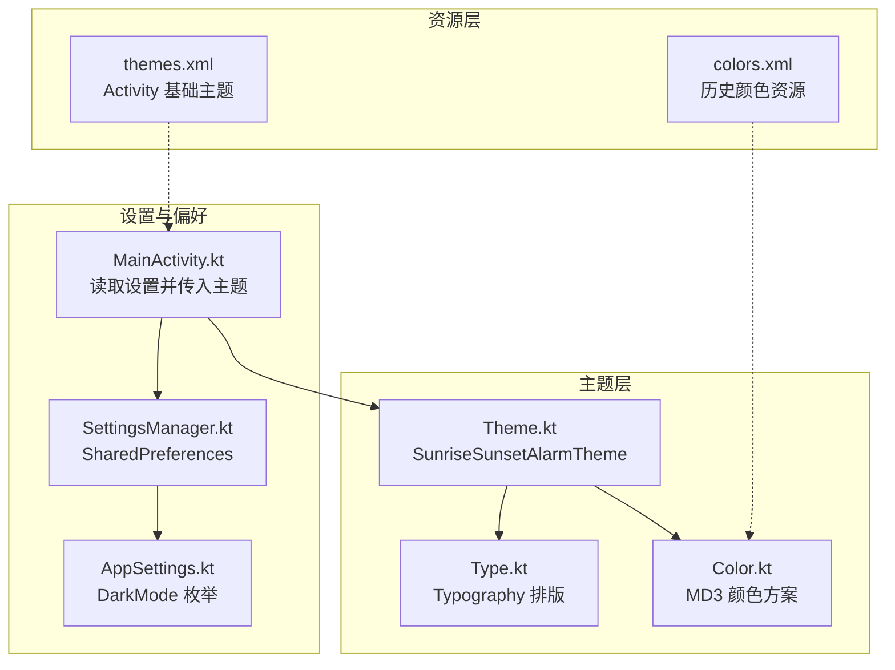
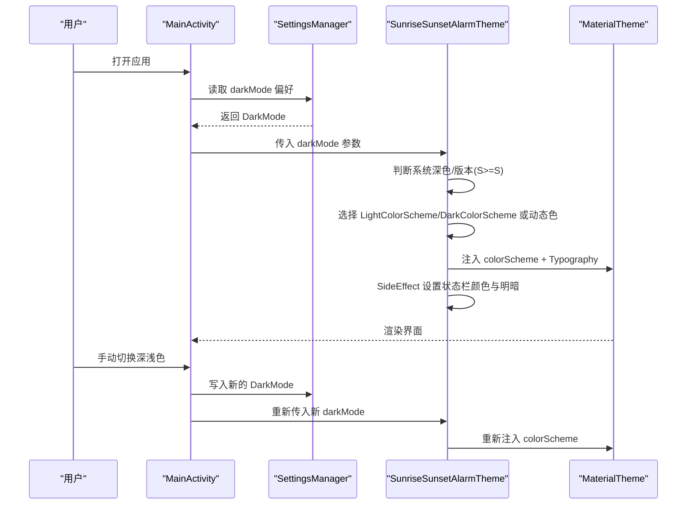
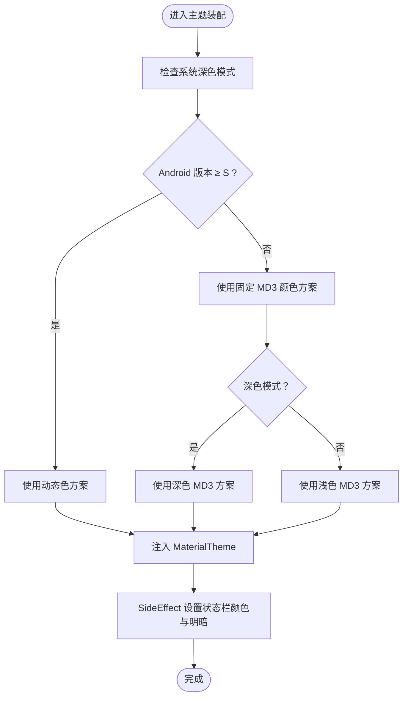
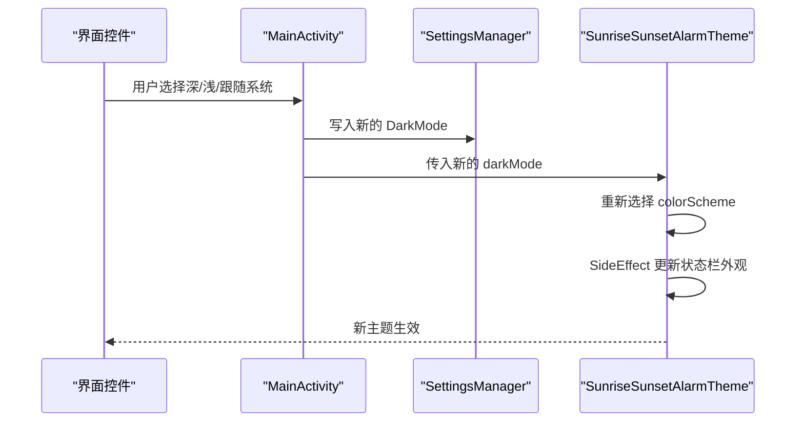
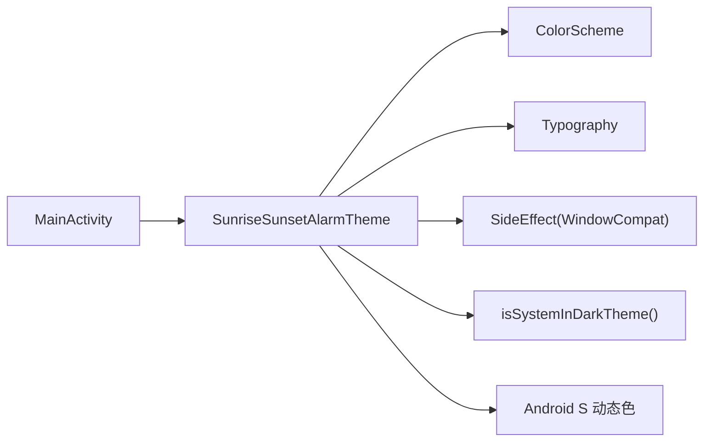

# 主题系统

<cite>
**本文引用的文件**
- [Color.kt](file://app/src/main/java/com/snuabar/sunrisesunsetalarm/ui/theme/Color.kt)
- [Theme.kt](file://app/src/main/java/com/snuabar/sunrisesunsetalarm/ui/theme/Theme.kt)
- [Type.kt](file://app/src/main/java/com/snuabar/sunrisesunsetalarm/ui/theme/Type.kt)
- [themes.xml](file://app/src/main/res/values/themes.xml)
- [colors.xml](file://app/src/main/res/values/colors.xml)
- [AppSettings.kt](file://app/src/main/java/com/snuabar/sunrisesunsetalarm/data/model/AppSettings.kt)
- [MainActivity.kt](file://app/src/main/java/com/snuabar/sunrisesunsetalarm/MainActivity.kt)
- [SettingsManager.kt](file://app/src/main/java/com/snuabar/sunrisesunsetalarm/util/SettingsManager.kt)
</cite>

## 目录
1. [简介](#简介)
2. [项目结构](#项目结构)
3. [核心组件](#核心组件)
4. [架构总览](#架构总览)
5. [详细组件分析](#详细组件分析)
6. [依赖关系分析](#依赖关系分析)
7. [性能考量](#性能考量)
8. [故障排查指南](#故障排查指南)
9. [结论](#结论)
10. [附录](#附录)

## 简介
本文件系统性梳理 Clock 应用的主题系统实现，基于 Jetpack Compose 的 Material Design 3（MD3）主题框架，覆盖颜色系统、字体排版与尺寸规范、深浅色模式切换机制（含系统检测与手动切换）、颜色层次结构（主色、强调色、语义化颜色）、主题定制方法（颜色覆盖、字体调整、尺寸修改），以及响应式设计与无障碍支持的实践要点。文档面向开发者与产品/设计人员，既提供代码级实现细节，也给出可操作的定制指南。

## 项目结构
主题系统主要由以下模块构成：
- 颜色定义：集中于 ui/theme/Color.kt，提供浅色与深色两套 MD3 颜色方案。
- 主题装配：ui/theme/Theme.kt 提供 SunriseSunsetAlarmTheme 可组合项，负责根据系统状态与用户偏好选择颜色方案，并注入状态栏外观。
- 字体排版：ui/theme/Type.kt 定义 Typography，统一标题、正文与标签的排版风格。
- 资源层主题：res/values/themes.xml 提供基础 Activity 主题（状态栏/导航栏透明）。
- 设置与偏好：data/model/AppSettings.kt 定义 DarkMode 枚举；util/SettingsManager.kt 通过 SharedPreferences 存取用户偏好的深浅色模式；MainActivity.kt 在运行时读取并驱动主题切换。
- 历史资源：res/values/colors.xml 保留传统颜色资源，当前未被主题系统直接使用。

图表来源
- [Theme.kt:1-106](file://app/src/main/java/com/snuabar/sunrisesunsetalarm/ui/theme/Theme.kt#L1-L106)
- [Color.kt:1-52](file://app/src/main/java/com/snuabar/sunrisesunsetalarm/ui/theme/Color.kt#L1-L52)
- [Type.kt:1-32](file://app/src/main/java/com/snuabar/sunrisesunsetalarm/ui/theme/Type.kt#L1-L32)
- [SettingsManager.kt:1-49](file://app/src/main/java/com/snuabar/sunrisesunsetalarm/util/SettingsManager.kt#L1-L49)
- [AppSettings.kt:1-12](file://app/src/main/java/com/snuabar/sunrisesunsetalarm/data/model/AppSettings.kt#L1-L12)
- [MainActivity.kt:1-39](file://app/src/main/java/com/snuabar/sunrisesunsetalarm/MainActivity.kt#L1-L39)
- [themes.xml:1-8](file://app/src/main/res/values/themes.xml#L1-L8)
- [colors.xml:1-11](file://app/src/main/res/values/colors.xml#L1-L11)

章节来源
- [Theme.kt:1-106](file://app/src/main/java/com/snuabar/sunrisesunsetalarm/ui/theme/Theme.kt#L1-L106)
- [Color.kt:1-52](file://app/src/main/java/com/snuabar/sunrisesunsetalarm/ui/theme/Color.kt#L1-L52)
- [Type.kt:1-32](file://app/src/main/java/com/snuabar/sunrisesunsetalarm/ui/theme/Type.kt#L1-L32)
- [MainActivity.kt:1-39](file://app/src/main/java/com/snuabar/sunrisesunsetalarm/MainActivity.kt#L1-L39)
- [SettingsManager.kt:1-49](file://app/src/main/java/com/snuabar/sunrisesunsetalarm/util/SettingsManager.kt#L1-L49)
- [AppSettings.kt:1-12](file://app/src/main/java/com/snuabar/sunrisesunsetalarm/data/model/AppSettings.kt#L1-L12)
- [themes.xml:1-8](file://app/src/main/res/values/themes.xml#L1-L8)
- [colors.xml:1-11](file://app/src/main/res/values/colors.xml#L1-L11)

## 核心组件
- 颜色系统（Color.kt）
  - 提供 md_theme_light_* 与 md_theme_dark_* 两套 MD3 颜色令牌，覆盖 primary、onPrimary、primaryContainer、onPrimaryContainer、secondary、onSecondary、secondaryContainer、onSecondaryContainer、tertiary、onTertiary、tertiaryContainer、onTertiaryContainer、error、errorContainer、onError、onErrorContainer、background、onBackground、surface、onSurface、surfaceVariant、onSurfaceVariant、outline 等。
  - 浅色与深色方案分别定义，确保高对比度与可读性。
- 主题装配（Theme.kt）
  - 定义 LightColorScheme 与 DarkColorScheme，分别映射上述颜色令牌。
  - SunriseSunsetAlarmTheme 接收 darkMode 参数（SYSTEM/LIGHT/DARK），内部根据系统深色模式与设备 Android 版本（>=S 使用动态色）选择最终 colorScheme。
  - 通过 SideEffect 动态设置状态栏颜色与状态栏文字/图标明暗（isAppearanceLightStatusBars）。
  - 将 MaterialTheme 的 colorScheme、typography 注入到子树。
- 字体排版（Type.kt）
  - 统一定义 bodyLarge、titleLarge、labelSmall 的字体族、字重、字号、行高与字距，形成一致的排版体系。
- 设置与偏好（SettingsManager.kt、AppSettings.kt、MainActivity.kt）
  - DarkMode 枚举与默认值（SYSTEM）。
  - SettingsManager 通过 SharedPreferences 读写 darkMode。
  - MainActivity 在运行时从设置加载 darkMode，并在用户切换时更新设置与主题状态。

章节来源
- [Color.kt:1-52](file://app/src/main/java/com/snuabar/sunrisesunsetalarm/ui/theme/Color.kt#L1-L52)
- [Theme.kt:19-105](file://app/src/main/java/com/snuabar/sunrisesunsetalarm/ui/theme/Theme.kt#L19-L105)
- [Type.kt:9-31](file://app/src/main/java/com/snuabar/sunrisesunsetalarm/ui/theme/Type.kt#L9-L31)
- [AppSettings.kt:3-11](file://app/src/main/java/com/snuabar/sunrisesunsetalarm/data/model/AppSettings.kt#L3-L11)
- [SettingsManager.kt:8-17](file://app/src/main/java/com/snuabar/sunrisesunsetalarm/util/SettingsManager.kt#L8-L17)
- [MainActivity.kt:20-36](file://app/src/main/java/com/snuabar/sunrisesunsetalarm/MainActivity.kt#L20-L36)

## 架构总览
下图展示主题系统在应用中的装配与控制流：MainActivity 读取设置，传递给 SunriseSunsetAlarmTheme，后者依据系统与版本选择颜色方案，并注入 MaterialTheme；同时通过 SideEffect 控制状态栏外观。

图表来源
- [MainActivity.kt:20-36](file://app/src/main/java/com/snuabar/sunrisesunsetalarm/MainActivity.kt#L20-L36)
- [Theme.kt:71-105](file://app/src/main/java/com/snuabar/sunrisesunsetalarm/ui/theme/Theme.kt#L71-L105)
- [SettingsManager.kt:11-17](file://app/src/main/java/com/snuabar/sunrisesunsetalarm/util/SettingsManager.kt#L11-L17)

## 详细组件分析

### 颜色系统与层次结构
- 颜色令牌分层
  - 主色（Primary）：用于强调重要元素与关键动作，浅/深两套对应明暗背景。
  - 强调容器（PrimaryContainer/OnPrimaryContainer）：用于承载主色内容的容器与文本，保证对比度与可读性。
  - 次要色（Secondary）：用于次要功能与装饰，保持界面层次清晰。
  - 第三色（Tertiary）：用于强调或特殊状态，与主色形成互补。
  - 语义化颜色（Error/ErrorContainer/OnError/OnErrorContainer）：用于错误状态，确保警示明确。
  - 表面与背景（Surface/Background/OnSurface/OnBackground/SurfaceVariant/OnSurfaceVariant）：决定界面层级与内容可读性。
  - 轮廓（Outline）：用于边框、分割线等视觉引导。
- 浅/深色方案
  - 浅色方案强调高对比度与柔和的强调色，适合明亮环境。
  - 深色方案采用较低亮度的主色容器与更高亮度的文本，减少眩光并提升可读性。
- 动态色（Android 12+）
  - 当设备满足条件时，使用系统动态色方案，颜色随壁纸变化，增强个性化与一致性。

图表来源
- [Theme.kt:71-105](file://app/src/main/java/com/snuabar/sunrisesunsetalarm/ui/theme/Theme.kt#L71-L105)
- [Color.kt:5-52](file://app/src/main/java/com/snuabar/sunrisesunsetalarm/ui/theme/Color.kt#L5-L52)

章节来源
- [Color.kt:5-52](file://app/src/main/java/com/snuabar/sunrisesunsetalarm/ui/theme/Color.kt#L5-L52)
- [Theme.kt:19-69](file://app/src/main/java/com/snuabar/sunrisesunsetalarm/ui/theme/Theme.kt#L19-L69)

### 深浅色模式切换机制
- 系统主题检测
  - 通过 isSystemInDarkTheme 判断系统深色模式，作为 SYSTEM 模式的基础。
- 手动切换逻辑
  - MainActivity 从 SettingsManager 读取 darkMode，默认 SYSTEM。
  - 用户在界面触发切换后，更新 SettingsManager 中的 darkMode，并重新渲染主题。
- 状态栏适配
  - 使用 SideEffect 获取窗口并设置状态栏颜色为 primary，同时根据深浅模式调整状态栏文字/图标明暗，确保可读性。

图表来源
- [MainActivity.kt:29-33](file://app/src/main/java/com/snuabar/sunrisesunsetalarm/MainActivity.kt#L29-L33)
- [SettingsManager.kt:11-17](file://app/src/main/java/com/snuabar/sunrisesunsetalarm/util/SettingsManager.kt#L11-L17)
- [Theme.kt:76-98](file://app/src/main/java/com/snuabar/sunrisesunsetalarm/ui/theme/Theme.kt#L76-L98)

章节来源
- [MainActivity.kt:20-36](file://app/src/main/java/com/snuabar/sunrisesunsetalarm/MainActivity.kt#L20-L36)
- [SettingsManager.kt:8-17](file://app/src/main/java/com/snuabar/sunrisesunsetalarm/util/SettingsManager.kt#L8-L17)
- [Theme.kt:71-105](file://app/src/main/java/com/snuabar/sunrisesunsetalarm/ui/theme/Theme.kt#L71-L105)

### 字体排版与尺寸规范
- 统一排版基线
  - bodyLarge：正文基础样式，提供舒适的阅读行高与字距。
  - titleLarge：标题样式，突出层级与重点信息。
  - labelSmall：标签与辅助文本，强调信息密度与可读性。
- 设计原则
  - 字体族采用系统默认，保证跨设备一致性。
  - 字号、行高与字距遵循 MD3 排版指导，兼顾可读性与空间利用。

章节来源
- [Type.kt:9-31](file://app/src/main/java/com/snuabar/sunrisesunsetalarm/ui/theme/Type.kt#L9-L31)

### 主题定制指南
- 颜色覆盖
  - 修改 md_theme_light_* 与 md_theme_dark_* 中的具体颜色值，即可覆盖主色、强调色与语义化颜色。
  - 若需适配品牌色，建议保持 onContainer 与容器之间的对比度阈值，确保可读性。
- 字体调整
  - 调整 bodyLarge/titleLarge/labelSmall 的字号、行高与字距，以适配不同语言或可访问性需求。
  - 如需引入自定义字体，可在 TextStyle 中指定 FontFamily，并确保资源可用。
- 尺寸修改
  - 通过修改 Typography 中的字号与行高参数，统一调整各级别文本的视觉权重。
  - 对于间距与组件尺寸，建议在具体 UI 组件中使用 MaterialTheme.typography 与尺寸常量进行约束，避免硬编码。

章节来源
- [Color.kt:5-52](file://app/src/main/java/com/snuabar/sunrisesunsetalarm/ui/theme/Color.kt#L5-L52)
- [Type.kt:9-31](file://app/src/main/java/com/snuabar/sunrisesunsetalarm/ui/theme/Type.kt#L9-L31)

### 响应式设计与无障碍支持
- 响应式设计
  - 使用 MaterialTheme 的尺寸与排版系统，配合布局组件（如 LazyColumn/Grid）实现自适应布局。
  - 在不同屏幕密度与尺寸下，保持字号与行高的比例关系，确保可读性一致。
- 无障碍支持
  - 通过对比度与色彩方案（尤其是 onSurface/onBackground、onPrimary/onContainer）确保文本与交互元素的可识别性。
  - 在动态色不可用时，确保固定方案满足无障碍对比度要求。
  - 使用合适的字体大小与行高，避免过密或过疏影响阅读体验。

## 依赖关系分析
- 组件耦合
  - Theme.kt 依赖 Color.kt 的颜色令牌与 Type.kt 的排版定义，耦合度低、职责清晰。
  - MainActivity 仅负责读取与传递 darkMode，不直接参与颜色决策，降低 UI 与业务逻辑耦合。
- 外部依赖
  - Material3 提供 colorScheme、dynamicLightColorScheme/dynamicDarkColorScheme、Typography 等能力。
  - AndroidX Core 提供 WindowCompat 与 SideEffect，用于状态栏外观控制。
- 潜在风险
  - 若动态色不可用或系统不支持，回退到固定颜色方案，需确保对比度与可读性。
  - SharedPreferences 读写异常时应回退到默认 SYSTEM 模式，避免崩溃。

图表来源
- [Theme.kt:19-105](file://app/src/main/java/com/snuabar/sunrisesunsetalarm/ui/theme/Theme.kt#L19-L105)
- [MainActivity.kt:20-36](file://app/src/main/java/com/snuabar/sunrisesunsetalarm/MainActivity.kt#L20-L36)

章节来源
- [Theme.kt:19-105](file://app/src/main/java/com/snuabar/sunrisesunsetalarm/ui/theme/Theme.kt#L19-L105)
- [MainActivity.kt:20-36](file://app/src/main/java/com/snuabar/sunrisesunsetalarm/MainActivity.kt#L20-L36)

## 性能考量
- 动态色成本
  - Android 12+ 的动态色会根据壁纸生成颜色，可能带来轻微的首帧延迟；建议在主题初始化时避免频繁切换。
- 状态栏 SideEffect
  - SideEffect 仅在主题变更时执行，且仅在非编辑模式下生效，对性能影响有限。
- 颜色与排版缓存
  - MaterialTheme 的 colorScheme 与 Typography 为轻量对象，Compose 会进行合理缓存，无需额外优化。

## 故障排查指南
- 主题未生效或闪烁
  - 检查 Activity 是否正确包裹 SunriseSunsetAlarmTheme，并确保 Surface 使用 MaterialTheme.colorScheme.background。
  - 确认 themes.xml 中的状态栏/导航栏透明设置不会与动态色冲突。
- 深浅色切换无效
  - 确认 SettingsManager 正确写入 DarkMode 并在 MainActivity 重新传入主题。
  - 检查 SYSTEM 模式是否受系统深色模式影响。
- 动态色不显示
  - 确认设备 Android 版本≥S，且系统壁纸支持动态色。
  - 若动态色不可用，回退到固定颜色方案，检查对比度与可读性。

章节来源
- [MainActivity.kt:21-36](file://app/src/main/java/com/snuabar/sunrisesunsetalarm/MainActivity.kt#L21-L36)
- [Theme.kt:71-105](file://app/src/main/java/com/snuabar/sunrisesunsetalarm/ui/theme/Theme.kt#L71-L105)
- [themes.xml:3-6](file://app/src/main/res/values/themes.xml#L3-L6)

## 结论
本主题系统以 Material Design 3 为核心，结合系统深浅色检测与动态色能力，提供了稳定、可定制且具备无障碍支持的主题方案。通过清晰的颜色层次、统一的排版体系与灵活的偏好存储，开发者可以快速实现品牌化定制与多场景适配。建议在后续迭代中持续关注动态色兼容性与无障碍对比度验证，以提升用户体验与可访问性。

## 附录
- 资源层主题
  - themes.xml 提供 Activity 基础主题，设置状态栏与导航栏透明，便于与动态色/主题颜色协同。
- 历史颜色资源
  - colors.xml 保留传统颜色资源，当前未被主题系统直接使用，建议在迁移完成后清理或归档。

章节来源
- [themes.xml:3-6](file://app/src/main/res/values/themes.xml#L3-L6)
- [colors.xml:1-11](file://app/src/main/res/values/colors.xml#L1-L11)