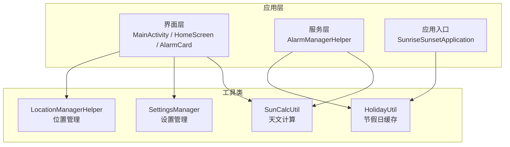
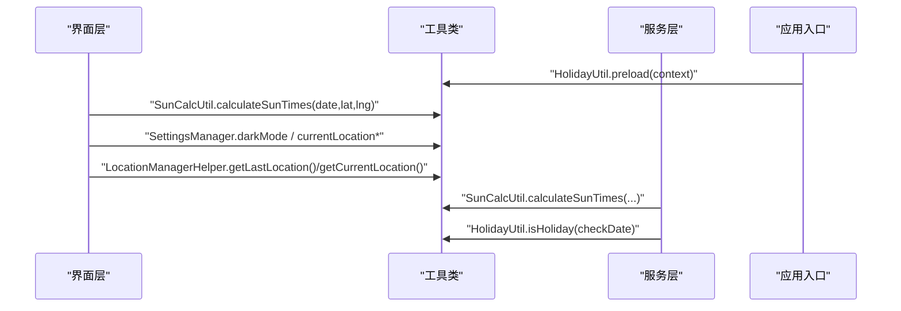
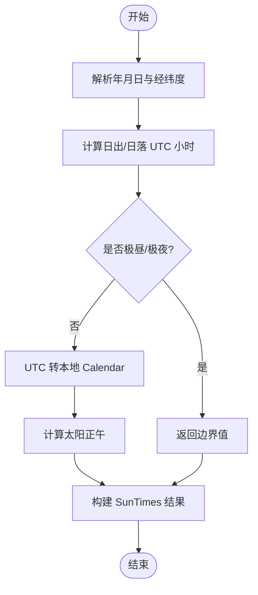
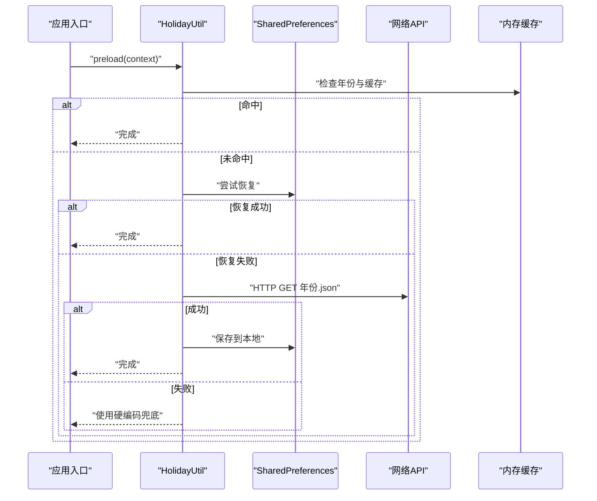
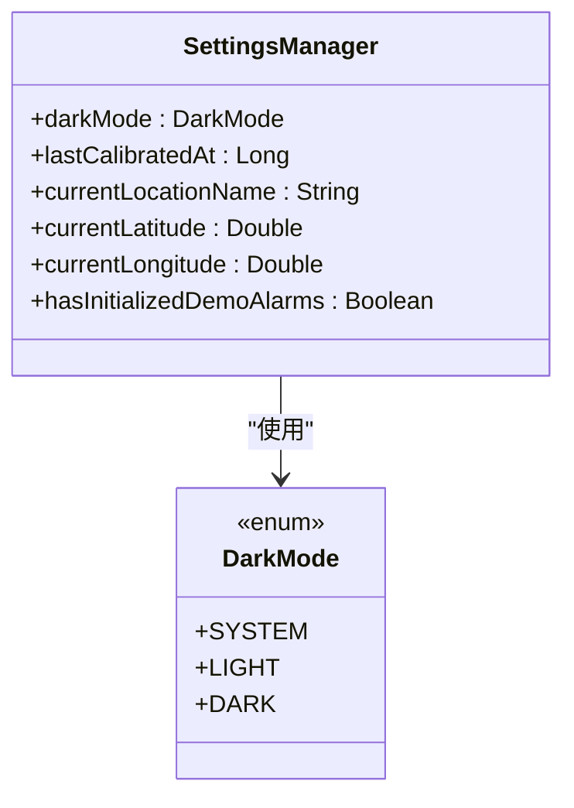
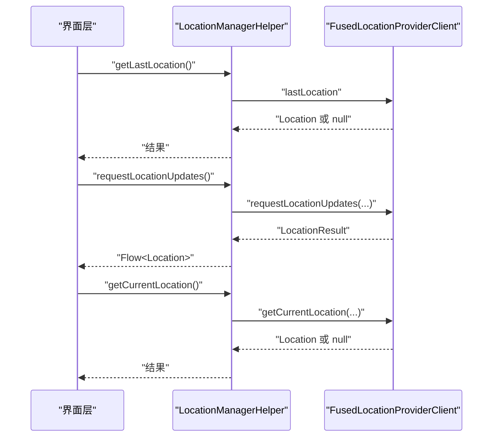
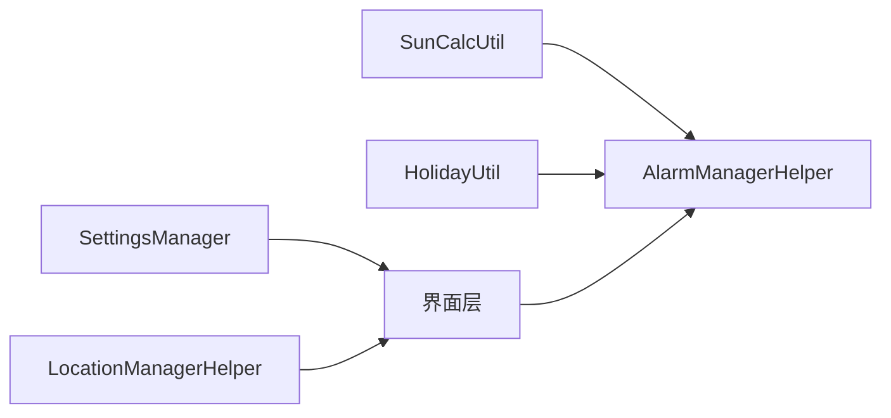

# 工具类

<cite>
**本文引用的文件**
- [SunCalcUtil.kt](file://app/src/main/java/com/snuabar/sunrisesunsetalarm/util/SunCalcUtil.kt)
- [HolidayUtil.kt](file://app/src/main/java/com/snuabar/sunrisesunsetalarm/util/HolidayUtil.kt)
- [SettingsManager.kt](file://app/src/main/java/com/snuabar/sunrisesunsetalarm/util/SettingsManager.kt)
- [LocationManagerHelper.kt](file://app/src/main/java/com/snuabar/sunrisesunsetalarm/util/LocationManagerHelper.kt)
- [AlarmManagerHelper.kt](file://app/src/main/java/com/snuabar/sunrisesunsetalarm/service/AlarmManagerHelper.kt)
- [AlarmCard.kt](file://app/src/main/java/com/snuabar/sunrisesunsetalarm/ui/components/AlarmCard.kt)
- [HomeScreen.kt](file://app/src/main/java/com/snuabar/sunrisesunsetalarm/ui/screens/HomeScreen.kt)
- [MainActivity.kt](file://app/src/main/java/com/snuabar/sunrisesunsetalarm/MainActivity.kt)
- [SunriseSunsetApplication.kt](file://app/src/main/java/com/snuabar/sunrisesunsetalarm/SunriseSunsetApplication.kt)
- [AppSettings.kt](file://app/src/main/java/com/snuabar/sunrisesunsetalarm/data/model/AppSettings.kt)
</cite>

## 目录
1. [简介](#简介)
2. [项目结构](#项目结构)
3. [核心组件](#核心组件)
4. [架构总览](#架构总览)
5. [详细组件分析](#详细组件分析)
6. [依赖分析](#依赖分析)
7. [性能考量](#性能考量)
8. [故障排查指南](#故障排查指南)
9. [结论](#结论)
10. [附录](#附录)

## 简介
本文件聚焦于日出日落智能闹钟应用中的工具类，系统性梳理以下工具类的功能、实现原理、使用方式与集成关系：
- SunCalcUtil 天文计算工具：基于简化 NOAA 算法计算日出、日落与正午时刻，支持按日期与经纬度返回本地时间戳。
- HolidayUtil 节假日处理工具：预加载并缓存当年节假日数据，支持网络回退与硬编码兜底，提供快速查询接口。
- SettingsManager 应用设置管理工具：封装 SharedPreferences 的键值读写，统一管理主题、定位与初始化状态等配置。
- LocationManagerHelper 位置管理工具：基于 Google Play Services 提供一次性定位、持续位置流与权限适配。

同时，文档解释各工具类的设计原则（如单例与线程安全）、复用策略、与核心模块（闹钟调度、界面展示）的调用关系，并给出扩展建议与最佳实践。

## 项目结构
工具类位于应用主模块的 util 包中，分别服务于服务层（闹钟调度）、UI 层（界面展示与交互）与应用生命周期（预加载节假日数据）。

图表来源
- [SunCalcUtil.kt:6-45](file://app/src/main/java/com/snuabar/sunrisesunsetalarm/util/SunCalcUtil.kt#L6-L45)
- [HolidayUtil.kt:22-75](file://app/src/main/java/com/snuabar/sunrisesunsetalarm/util/HolidayUtil.kt#L22-L75)
- [SettingsManager.kt:8-47](file://app/src/main/java/com/snuabar/sunrisesunsetalarm/util/SettingsManager.kt#L8-L47)
- [LocationManagerHelper.kt:14-77](file://app/src/main/java/com/snuabar/sunrisesunsetalarm/util/LocationManagerHelper.kt#L14-L77)
- [AlarmManagerHelper.kt:75-151](file://app/src/main/java/com/snuabar/sunrisesunsetalarm/service/AlarmManagerHelper.kt#L75-L151)
- [HomeScreen.kt:36-37](file://app/src/main/java/com/snuabar/sunrisesunsetalarm/ui/screens/HomeScreen.kt#L36-L37)
- [MainActivity.kt:17-37](file://app/src/main/java/com/snuabar/sunrisesunsetalarm/MainActivity.kt#L17-L37)
- [SunriseSunsetApplication.kt:36-52](file://app/src/main/java/com/snuabar/sunrisesunsetalarm/SunriseSunsetApplication.kt#L36-L52)

章节来源
- [SunCalcUtil.kt:6-45](file://app/src/main/java/com/snuabar/sunrisesunsetalarm/util/SunCalcUtil.kt#L6-L45)
- [HolidayUtil.kt:22-75](file://app/src/main/java/com/snuabar/sunrisesunsetalarm/util/HolidayUtil.kt#L22-L75)
- [SettingsManager.kt:8-47](file://app/src/main/java/com/snuabar/sunrisesunsetalarm/util/SettingsManager.kt#L8-L47)
- [LocationManagerHelper.kt:14-77](file://app/src/main/java/com/snuabar/sunrisesunsetalarm/util/LocationManagerHelper.kt#L14-L77)
- [AlarmManagerHelper.kt:75-151](file://app/src/main/java/com/snuabar/sunrisesunsetalarm/service/AlarmManagerHelper.kt#L75-L151)
- [HomeScreen.kt:36-37](file://app/src/main/java/com/snuabar/sunrisesunsetalarm/ui/screens/HomeScreen.kt#L36-L37)
- [MainActivity.kt:17-37](file://app/src/main/java/com/snuabar/sunrisesunsetalarm/MainActivity.kt#L17-L37)
- [SunriseSunsetApplication.kt:36-52](file://app/src/main/java/com/snuabar/sunrisesunsetalarm/SunriseSunsetApplication.kt#L36-L52)

## 核心组件
- SunCalcUtil：提供 SunTimes 数据类与 calculateSunTimes 方法，内部以简化 NOAA 算法计算 UTC 时刻并转换为本地时间，返回日出、日落与太阳正午的时间戳。
- HolidayUtil：提供 preload 与 isHoliday 接口，采用“内存缓存优先、SharedPreferences 恢复、网络拉取、硬编码兜底”的多级策略，保证可用性与性能。
- SettingsManager：封装 SharedPreferences 的键值读写，暴露主题、定位信息与初始化标记等属性，便于跨组件共享。
- LocationManagerHelper：封装 FusedLocationProviderClient 的最近一次位置、位置流与当前高精度位置获取，提供协程挂起与 Flow 回调能力。

章节来源
- [SunCalcUtil.kt:8-45](file://app/src/main/java/com/snuabar/sunrisesunsetalarm/util/SunCalcUtil.kt#L8-L45)
- [HolidayUtil.kt:41-94](file://app/src/main/java/com/snuabar/sunrisesunsetalarm/util/HolidayUtil.kt#L41-L94)
- [SettingsManager.kt:11-37](file://app/src/main/java/com/snuabar/sunrisesunsetalarm/util/SettingsManager.kt#L11-L37)
- [LocationManagerHelper.kt:18-77](file://app/src/main/java/com/snuabar/sunrisesunsetalarm/util/LocationManagerHelper.kt#L18-L77)

## 架构总览
工具类与核心模块的交互路径如下：
- UI 层在展示与交互中调用 SunCalcUtil 计算日出/日落相关时间，调用 SettingsManager 读取主题与定位信息，必要时通过 LocationManagerHelper 获取位置。
- 服务层（AlarmManagerHelper）在调度闹钟时调用 SunCalcUtil 计算日出/日落基准时间，并结合 HolidayUtil 进行节假日跳过判断。
- 应用入口在启动时异步预加载节假日数据，避免后续查询阻塞。

图表来源
- [SunCalcUtil.kt:19-45](file://app/src/main/java/com/snuabar/sunrisesunsetalarm/util/SunCalcUtil.kt#L19-L45)
- [HolidayUtil.kt:41-94](file://app/src/main/java/com/snuabar/sunrisesunsetalarm/util/HolidayUtil.kt#L41-L94)
- [SettingsManager.kt:11-37](file://app/src/main/java/com/snuabar/sunrisesunsetalarm/util/SettingsManager.kt#L11-L37)
- [LocationManagerHelper.kt:18-77](file://app/src/main/java/com/snuabar/sunrisesunsetalarm/util/LocationManagerHelper.kt#L18-L77)
- [AlarmManagerHelper.kt:81-142](file://app/src/main/java/com/snuabar/sunrisesunsetalarm/service/AlarmManagerHelper.kt#L81-L142)
- [SunriseSunsetApplication.kt:49-52](file://app/src/main/java/com/snuabar/sunrisesunsetalarm/SunriseSunsetApplication.kt#L49-L52)

## 详细组件分析

### SunCalcUtil 天文计算工具
- 功能概述
  - 输入：指定日期与经纬度
  - 输出：SunTimes（包含日出、日落、太阳正午的毫秒时间戳）
  - 算法依据：简化版 NOAA 太阳计算算法，先计算 UTC 时刻，再转换为本地时间
- 核心流程
  - 计算日出/日落 UTC 小时数
  - 将 UTC 小时转换为本地 Calendar 实例
  - 正午为日出与日落的中点
- 关键点
  - 使用角度换算与三角函数计算真太阳时
  - 对极昼/极夜（cosH 超出范围）进行特殊处理
  - 时间归一化与时区转换
- 使用示例与参数
  - 示例路径：[AlarmManagerHelper.kt:81-89](file://app/src/main/java/com/snuabar/sunrisesunsetalarm/service/AlarmManagerHelper.kt#L81-L89)、[AlarmCard.kt:136-144](file://app/src/main/java/com/snuabar/sunrisesunsetalarm/ui/components/AlarmCard.kt#L136-L144)
  - 参数说明：date（Calendar）、latitude（Double）、longitude（Double）
- 设计原则与线程安全
  - 单例对象，纯函数式设计，无可变状态，天然线程安全
- 扩展建议
  - 支持夏令时偏移
  - 增加海拔高度修正项
  - 提供批量日期计算接口

图表来源
- [SunCalcUtil.kt:19-45](file://app/src/main/java/com/snuabar/sunrisesunsetalarm/util/SunCalcUtil.kt#L19-L45)
- [SunCalcUtil.kt:47-110](file://app/src/main/java/com/snuabar/sunrisesunsetalarm/util/SunCalcUtil.kt#L47-L110)
- [SunCalcUtil.kt:115-127](file://app/src/main/java/com/snuabar/sunrisesunsetalarm/util/SunCalcUtil.kt#L115-L127)

章节来源
- [SunCalcUtil.kt:8-45](file://app/src/main/java/com/snuabar/sunrisesunsetalarm/util/SunCalcUtil.kt#L8-L45)
- [AlarmManagerHelper.kt:81-89](file://app/src/main/java/com/snuabar/sunrisesunsetalarm/service/AlarmManagerHelper.kt#L81-L89)
- [AlarmCard.kt:136-144](file://app/src/main/java/com/snuabar/sunrisesunsetalarm/ui/components/AlarmCard.kt#L136-L144)

### HolidayUtil 节假日处理工具
- 功能概述
  - 预加载：优先内存缓存，其次本地持久化，再次网络拉取，最后硬编码兜底
  - 查询：同步判断某日是否为节假日
- 核心流程
  - preload：根据年份选择数据源，缓存到内存与 SharedPreferences
  - isHoliday：优先内存缓存，否则硬编码
- 关键点
  - volatile 变量与年份校验保证缓存一致性
  - 网络请求超时与异常处理
  - JSON 解析仅提取放假日期集合
- 使用示例与参数
  - 示例路径：[AlarmManagerHelper.kt:122-125](file://app/src/main/java/com/snuabar/sunrisesunsetalarm/service/AlarmManagerHelper.kt#L122-L125)、[SunriseSunsetApplication.kt:49-52](file://app/src/main/java/com/snuabar/sunrisesunsetalarm/SunriseSunsetApplication.kt#L49-L52)
  - 参数说明：Context（用于读取 SharedPreferences 与协程上下文）
- 设计原则与线程安全
  - 单例对象，volatile 缓存变量，线程间可见性由 volatile 保障
- 扩展建议
  - 支持多地区节假日数据
  - 增加节假日名称映射与类型区分
  - 提供手动刷新与失效策略

图表来源
- [HolidayUtil.kt:41-75](file://app/src/main/java/com/snuabar/sunrisesunsetalarm/util/HolidayUtil.kt#L41-L75)
- [HolidayUtil.kt:98-119](file://app/src/main/java/com/snuabar/sunrisesunsetalarm/util/HolidayUtil.kt#L98-L119)
- [HolidayUtil.kt:150-167](file://app/src/main/java/com/snuabar/sunrisesunsetalarm/util/HolidayUtil.kt#L150-L167)
- [HolidayUtil.kt:176-204](file://app/src/main/java/com/snuabar/sunrisesunsetalarm/util/HolidayUtil.kt#L176-L204)

章节来源
- [HolidayUtil.kt:22-94](file://app/src/main/java/com/snuabar/sunrisesunsetalarm/util/HolidayUtil.kt#L22-L94)
- [AlarmManagerHelper.kt:122-125](file://app/src/main/java/com/snuabar/sunrisesunsetalarm/service/AlarmManagerHelper.kt#L122-L125)
- [SunriseSunsetApplication.kt:49-52](file://app/src/main/java/com/snuabar/sunrisesunsetalarm/SunriseSunsetApplication.kt#L49-L52)

### SettingsManager 应用设置管理工具
- 功能概述
  - 统一封装主题、定位信息、校准时间与初始化标记等偏好设置
  - 使用 SharedPreferences 与 Kotlin 扩展函数简化写入
- 核心属性
  - darkMode：枚举值（SYSTEM/LIGHT/DARK），默认 SYSTEM
  - lastCalibratedAt：上次校准时间（毫秒）
  - currentLocationName、currentLatitude、currentLongitude：当前位置信息
  - hasInitializedDemoAlarms：演示闹钟初始化标记
- 使用示例与参数
  - 示例路径：[MainActivity.kt:20-32](file://app/src/main/java/com/snuabar/sunrisesunsetalarm/MainActivity.kt#L20-L32)、[HomeScreen.kt:282-286](file://app/src/main/java/com/snuabar/sunrisesunsetalarm/ui/screens/HomeScreen.kt#L282-L286)
  - 参数说明：构造函数接收 Context；属性读写均为同步操作
- 设计原则与线程安全
  - 非单例类，每次实例化独立 SharedPreferences；读写通过 apply 异步提交，但读取即时生效
- 扩展建议
  - 增加设置变更监听回调
  - 支持默认值工厂与类型安全的序列化存储

图表来源
- [SettingsManager.kt:8-47](file://app/src/main/java/com/snuabar/sunrisesunsetalarm/util/SettingsManager.kt#L8-L47)
- [AppSettings.kt:3-11](file://app/src/main/java/com/snuabar/sunrisesunsetalarm/data/model/AppSettings.kt#L3-L11)

章节来源
- [SettingsManager.kt:11-37](file://app/src/main/java/com/snuabar/sunrisesunsetalarm/util/SettingsManager.kt#L11-L37)
- [MainActivity.kt:20-32](file://app/src/main/java/com/snuabar/sunrisesunsetalarm/MainActivity.kt#L20-L32)
- [HomeScreen.kt:282-286](file://app/src/main/java/com/snuabar/sunrisesunsetalarm/ui/screens/HomeScreen.kt#L282-L286)
- [AppSettings.kt:3-11](file://app/src/main/java/com/snuabar/sunrisesunsetalarm/data/model/AppSettings.kt#L3-L11)

### LocationManagerHelper 位置管理工具
- 功能概述
  - 提供最近一次位置、持续位置流与当前高精度位置获取
  - 基于 FusedLocationProviderClient，使用协程挂起与 Callback Flow
- 核心方法
  - getLastLocation：获取最近一次位置
  - requestLocationUpdates：返回 Flow<Location>，自动清理
  - getCurrentLocation：一次性高精度定位
- 使用示例与参数
  - 示例路径：[HomeScreen.kt:258-274](file://app/src/main/java/com/snuabar/sunrisesunsetalarm/ui/screens/HomeScreen.kt#L258-L274)
  - 参数说明：Context；位置请求优先级与间隔
- 设计原则与线程安全
  - 非单例类，内部持有 FusedLocationProviderClient；协程挂起与 Flow 清理确保资源释放
- 扩展建议
  - 增加权限检查与错误码映射
  - 支持位置权限拒绝后的降级策略

图表来源
- [LocationManagerHelper.kt:18-77](file://app/src/main/java/com/snuabar/sunrisesunsetalarm/util/LocationManagerHelper.kt#L18-L77)

章节来源
- [LocationManagerHelper.kt:18-77](file://app/src/main/java/com/snuabar/sunrisesunsetalarm/util/LocationManagerHelper.kt#L18-L77)
- [HomeScreen.kt:258-274](file://app/src/main/java/com/snuabar/sunrisesunsetalarm/ui/screens/HomeScreen.kt#L258-L274)

## 依赖分析
- 工具类之间的耦合度低，职责清晰：
  - SunCalcUtil 与 HolidayUtil 仅被服务层与 UI 层调用，不互相依赖
  - SettingsManager 与 LocationManagerHelper 分别服务于主题与定位，彼此独立
- 外部依赖
  - SunCalcUtil 依赖 Java/Kotlin 数学库
  - HolidayUtil 依赖 Gson、网络连接与 SharedPreferences
  - LocationManagerHelper 依赖 Google Play Services 与协程 Flow
- 集成点
  - AlarmManagerHelper 在调度时同时依赖 SunCalcUtil 与 HolidayUtil
  - UI 层在展示与交互中依赖 SunCalcUtil、SettingsManager、LocationManagerHelper

图表来源
- [AlarmManagerHelper.kt:81-142](file://app/src/main/java/com/snuabar/sunrisesunsetalarm/service/AlarmManagerHelper.kt#L81-L142)
- [SunCalcUtil.kt:19-45](file://app/src/main/java/com/snuabar/sunrisesunsetalarm/util/SunCalcUtil.kt#L19-L45)
- [HolidayUtil.kt:80-94](file://app/src/main/java/com/snuabar/sunrisesunsetalarm/util/HolidayUtil.kt#L80-L94)
- [SettingsManager.kt:11-37](file://app/src/main/java/com/snuabar/sunrisesunsetalarm/util/SettingsManager.kt#L11-L37)
- [LocationManagerHelper.kt:18-77](file://app/src/main/java/com/snuabar/sunrisesunsetalarm/util/LocationManagerHelper.kt#L18-L77)

章节来源
- [AlarmManagerHelper.kt:81-142](file://app/src/main/java/com/snuabar/sunrisesunsetalarm/service/AlarmManagerHelper.kt#L81-L142)
- [SunCalcUtil.kt:19-45](file://app/src/main/java/com/snuabar/sunrisesunsetalarm/util/SunCalcUtil.kt#L19-L45)
- [HolidayUtil.kt:80-94](file://app/src/main/java/com/snuabar/sunrisesunsetalarm/util/HolidayUtil.kt#L80-L94)
- [SettingsManager.kt:11-37](file://app/src/main/java/com/snuabar/sunrisesunsetalarm/util/SettingsManager.kt#L11-L37)
- [LocationManagerHelper.kt:18-77](file://app/src/main/java/com/snuabar/sunrisesunsetalarm/util/LocationManagerHelper.kt#L18-L77)

## 性能考量
- SunCalcUtil
  - 纯数学计算，时间复杂度近似 O(1)，适合频繁调用
  - 建议缓存每日计算结果，避免重复计算
- HolidayUtil
  - preload 在后台协程执行，避免阻塞主线程
  - 内存缓存命中后 isHoliday 为 O(1) 查找；网络失败时走硬编码兜底
- SettingsManager
  - SharedPreferences 写入为异步 apply，读取即时；建议合并多次写入
- LocationManagerHelper
  - requestLocationUpdates 使用 Flow 自动清理，避免泄漏
  - 高精度定位仅在需要时调用，降低耗电

## 故障排查指南
- SunCalcUtil
  - 若出现极昼/极夜导致的日出/日落边界值，确认纬度与日期是否处于高纬度冬季或夏季
  - 检查输入经纬度范围与日期合法性
- HolidayUtil
  - 网络请求超时或解析失败时会回落到硬编码数据；可通过日志确认数据来源
  - SharedPreferences 恢复失败会重新拉取网络数据
- SettingsManager
  - 枚举读取异常时回退到默认 SYSTEM
  - 读取数值型字段失败时回退到默认值
- LocationManagerHelper
  - 未授予位置权限时返回 null；需在 UI 层引导用户授权
  - Flow 在作用域结束时自动移除回调，确保无内存泄漏

章节来源
- [SunCalcUtil.kt:92-95](file://app/src/main/java/com/snuabar/sunrisesunsetalarm/util/SunCalcUtil.kt#L92-L95)
- [HolidayUtil.kt:115-118](file://app/src/main/java/com/snuabar/sunrisesunsetalarm/util/HolidayUtil.kt#L115-L118)
- [SettingsManager.kt:12-16](file://app/src/main/java/com/snuabar/sunrisesunsetalarm/util/SettingsManager.kt#L12-L16)
- [LocationManagerHelper.kt:18-33](file://app/src/main/java/com/snuabar/sunrisesunsetalarm/util/LocationManagerHelper.kt#L18-L33)

## 结论
上述工具类围绕“纯计算”“缓存与回退”“配置与权限”三大主题，提供了高内聚、低耦合的基础能力。SunCalcUtil 与 HolidayUtil 分别覆盖天文与节假日两大外部数据域，SettingsManager 与 LocationManagerHelper 则分别承担应用配置与位置能力。它们通过服务层与 UI 层的协作，形成稳定的调度与展示闭环。建议在保持现有设计原则的基础上，逐步引入权限检查、错误码映射与配置监听机制，进一步提升健壮性与可维护性。

## 附录
- 使用示例路径参考
  - SunCalcUtil：[AlarmManagerHelper.kt:81-89](file://app/src/main/java/com/snuabar/sunrisesunsetalarm/service/AlarmManagerHelper.kt#L81-L89)、[AlarmCard.kt:136-144](file://app/src/main/java/com/snuabar/sunrisesunsetalarm/ui/components/AlarmCard.kt#L136-L144)
  - HolidayUtil：[AlarmManagerHelper.kt:122-125](file://app/src/main/java/com/snuabar/sunrisesunsetalarm/service/AlarmManagerHelper.kt#L122-L125)、[SunriseSunsetApplication.kt:49-52](file://app/src/main/java/com/snuabar/sunrisesunsetalarm/SunriseSunsetApplication.kt#L49-L52)
  - SettingsManager：[MainActivity.kt:20-32](file://app/src/main/java/com/snuabar/sunrisesunsetalarm/MainActivity.kt#L20-L32)、[HomeScreen.kt:282-286](file://app/src/main/java/com/snuabar/sunrisesunsetalarm/ui/screens/HomeScreen.kt#L282-L286)
  - LocationManagerHelper：[HomeScreen.kt:258-274](file://app/src/main/java/com/snuabar/sunrisesunsetalarm/ui/screens/HomeScreen.kt#L258-L274)