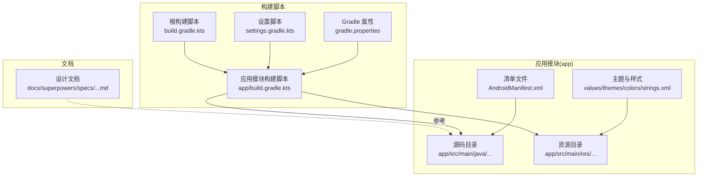
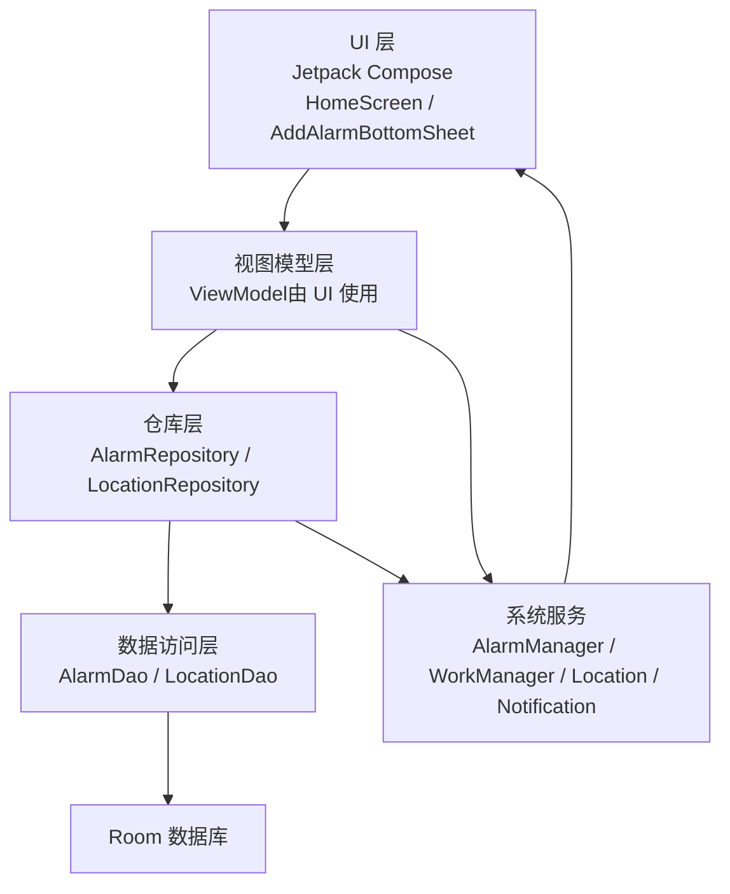
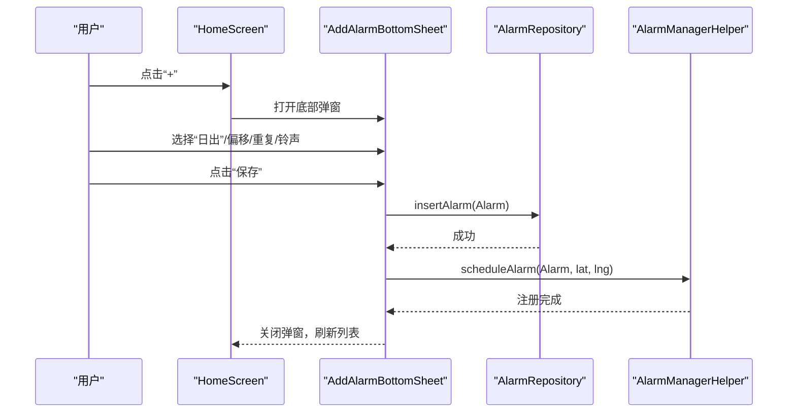
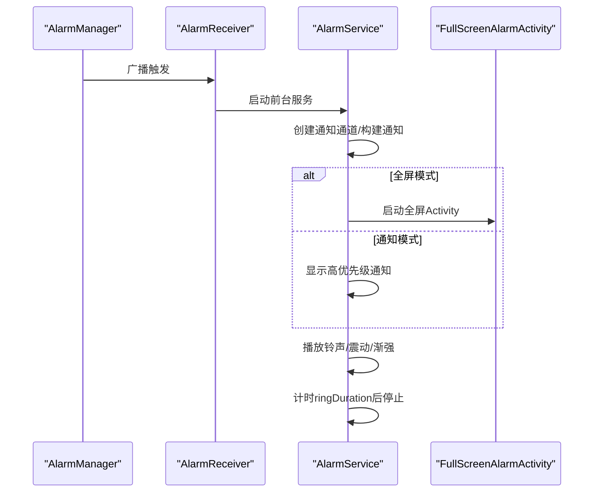
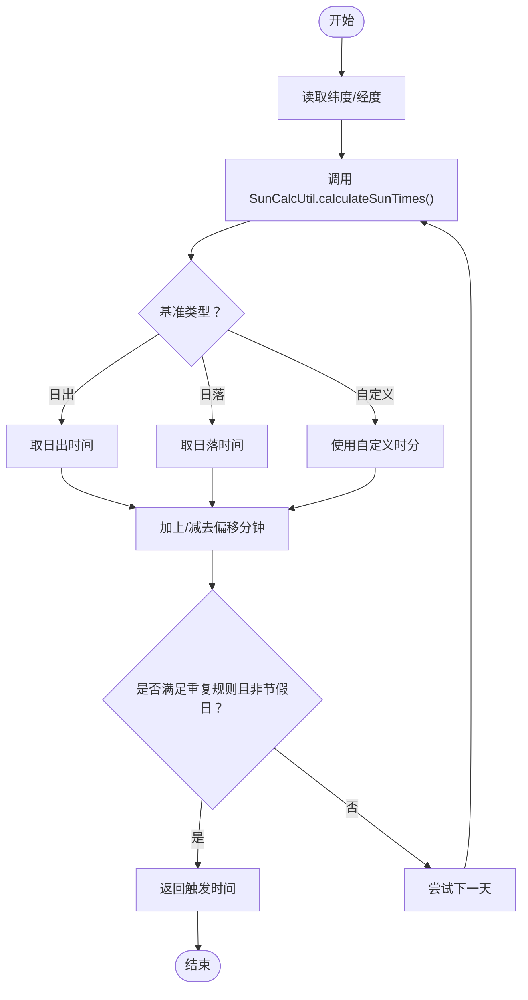
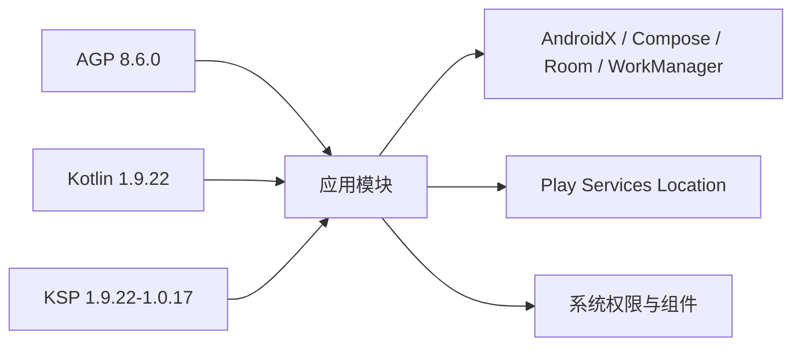

# 快速开始

<cite>
**本文引用的文件**
- [README.md](file://README.md)
- [设计文档](file://docs/superpowers/specs/2026-06-11-sunrise-sunset-alarm-design.md)
- [根构建脚本](file://build.gradle.kts)
- [应用模块构建脚本](file://app/build.gradle.kts)
- [Gradle 属性](file://gradle.properties)
- [设置脚本](file://settings.gradle.kts)
- [主清单文件](file://app/src/main/AndroidManifest.xml)
- [主活动](file://app/src/main/java/com/snuabar/sunrisesunsetalarm/MainActivity.kt)
- [应用入口](file://app/src/main/java/com/snuabar/sunrisesunsetalarm/SunriseSunsetApplication.kt)
- [首页屏幕](file://app/src/main/java/com/snuabar/sunrisesunsetalarm/ui/screens/HomeScreen.kt)
- [闹钟模型](file://app/src/main/java/com/snuabar/sunrisesunsetalarm/data/model/Alarm.kt)
- [响铃服务](file://app/src/main/java/com/snuabar/sunrisesunsetalarm/service/AlarmService.kt)
- [闹钟管理助手](file://app/src/main/java/com/snuabar/sunrisesunsetalarm/service/AlarmManagerHelper.kt)
- [太阳时间计算工具](file://app/src/main/java/com/snuabar/sunrisesunsetalarm/util/SunCalcUtil.kt)
- [设置管理器](file://app/src/main/java/com/snuabar/sunrisesunsetalarm/util/SettingsManager.kt)
- [添加闹钟底部弹窗](file://app/src/main/java/com/snuabar/sunrisesunsetalarm/ui/components/AddAlarmBottomSheet.kt)
- [应用字符串资源](file://app/src/main/res/values/strings.xml)
</cite>

## 目录
1. [简介](#简介)
2. [项目结构](#项目结构)
3. [核心组件](#核心组件)
4. [架构总览](#架构总览)
5. [详细组件分析](#详细组件分析)
6. [依赖关系分析](#依赖关系分析)
7. [性能考虑](#性能考虑)
8. [故障排除指南](#故障排除指南)
9. [结论](#结论)
10. [附录](#附录)

## 简介
本指南面向新开发者，帮助你在30分钟内成功克隆、构建并运行日出日落智能闹钟应用，体验核心功能（添加首个日出闹钟、调整日落提醒等）。你将获得完整的环境要求、权限申请流程、首次运行配置以及常见问题的解决方案。

## 项目结构
该工程采用标准 Android Gradle 项目结构，核心代码位于 app 模块，采用 Kotlin + Jetpack Compose + Room + WorkManager + AlarmManager 的技术栈组合，围绕“日出/日落”时间计算与闹钟调度展开。

图表来源
- [根构建脚本:1-7](file://build.gradle.kts#L1-L7)
- [应用模块构建脚本:1-108](file://app/build.gradle.kts#L1-L108)
- [设置脚本:1-18](file://settings.gradle.kts#L1-L18)
- [Gradle 属性:1-5](file://gradle.properties#L1-L5)
- [主清单文件:1-88](file://app/src/main/AndroidManifest.xml#L1-L88)

章节来源
- [根构建脚本:1-7](file://build.gradle.kts#L1-L7)
- [应用模块构建脚本:1-108](file://app/build.gradle.kts#L1-L108)
- [设置脚本:1-18](file://settings.gradle.kts#L1-L18)
- [Gradle 属性:1-5](file://gradle.properties#L1-L5)

## 核心组件
- 应用入口与数据库初始化：应用在 Application 中初始化 Room 数据库、预加载节假日数据，并调度每日重排班任务。
- 主界面与交互：首页展示日出/日落时间预览、闹钟列表、添加/编辑闹钟底部弹窗、位置选择与设置。
- 闹钟调度：基于 AlarmManager 的精确/非精确闹钟注册，结合太阳时间计算与重复规则。
- 响铃实现：前台服务响铃、通知通道、全屏/通知两种模式、渐强音效与震动。
- 权限与系统集成：位置权限、通知权限、精确闹钟权限、开机自启、前台服务特殊用途等。

章节来源
- [应用入口:18-66](file://app/src/main/java/com/snuabar/sunrisesunsetalarm/SunriseSunsetApplication.kt#L18-L66)
- [首页屏幕:46-296](file://app/src/main/java/com/snuabar/sunrisesunsetalarm/ui/screens/HomeScreen.kt#L46-L296)
- [主活动:17-38](file://app/src/main/java/com/snuabar/sunrisesunsetalarm/MainActivity.kt#L17-L38)
- [响铃服务:24-247](file://app/src/main/java/com/snuabar/sunrisesunsetalarm/service/AlarmService.kt#L24-L247)
- [闹钟管理助手:17-166](file://app/src/main/java/com/snuabar/sunrisesunsetalarm/service/AlarmManagerHelper.kt#L17-L166)
- [太阳时间计算工具:6-138](file://app/src/main/java/com/snuabar/sunrisesunsetalarm/util/SunCalcUtil.kt#L6-L138)

## 架构总览
应用采用 MVVM + Room + WorkManager + AlarmManager 的分层架构，UI 使用 Jetpack Compose，数据持久化与后台任务解耦，系统闹钟与前台服务保障响铃可靠性。

图表来源
- [首页屏幕:65-66](file://app/src/main/java/com/snuabar/sunrisesunsetalarm/ui/screens/HomeScreen.kt#L65-L66)
- [应用入口:25-34](file://app/src/main/java/com/snuabar/sunrisesunsetalarm/SunriseSunsetApplication.kt#L25-L34)
- [主清单文件:48-83](file://app/src/main/AndroidManifest.xml#L48-L83)

## 详细组件分析

### 环境与工具要求
- Android SDK
  - compileSdk：36
  - targetSdk：36
  - minSdk：26
- Kotlin
  - Kotlin 插件版本：1.9.22
  - JVM 目标：17
  - Compose 编译扩展版本：1.5.8
- 构建工具
  - Android Gradle 插件：8.6.0
  - KSP：1.9.22-1.0.17
- 依赖管理
  - AndroidX、Compose BOM、Room、WorkManager、Play Services Location、Gson、Coroutines
- 开发工具
  - Android Studio（建议最新稳定版）
  - 已启用 AndroidX（android.useAndroidX=true）

章节来源
- [应用模块构建脚本:7-50](file://app/build.gradle.kts#L7-L50)
- [根构建脚本:2-6](file://build.gradle.kts#L2-L6)
- [Gradle 属性:2-4](file://gradle.properties#L2-L4)

### 权限与系统组件
应用在清单中声明以下关键权限与组件：
- 位置权限：ACCESS_FINE_LOCATION、ACCESS_COARSE_LOCATION
- 通知权限：POST_NOTIFICATIONS（Android 13+）
- 精确闹钟：SCHEDULE_EXACT_ALARM
- 系统组件：BootReceiver、AlarmReceiver、AlarmService、FullScreenAlarmActivity、AlarmDismissReceiver、AlarmRescheduleWorker

章节来源
- [主清单文件:5-16](file://app/src/main/AndroidManifest.xml#L5-L16)
- [主清单文件:48-83](file://app/src/main/AndroidManifest.xml#L48-L83)

### 首次运行与配置
- 首次启动会自动初始化两个演示闹钟：日出唤醒、日落提醒。
- 若未授予通知权限（Android 13+），会提示并引导前往设置。
- 若未授予精确闹钟权限（Android 12+），会提示并引导前往系统设置。
- 可在设置中切换深色模式、选择城市位置、执行时间校准。

章节来源
- [首页屏幕:68-79](file://app/src/main/java/com/snuabar/sunrisesunsetalarm/ui/screens/HomeScreen.kt#L68-L79)
- [首页屏幕:132-147](file://app/src/main/java/com/snuabar/sunrisesunsetalarm/ui/screens/HomeScreen.kt#L132-L147)
- [首页屏幕:88-113](file://app/src/main/java/com/snuabar/sunrisesunsetalarm/ui/screens/HomeScreen.kt#L88-L113)
- [设置管理器:8-49](file://app/src/main/java/com/snuabar/sunrisesunsetalarm/util/SettingsManager.kt#L8-L49)

### 添加第一个日出闹钟
- 在首页点击“+”浮动按钮，打开“添加/编辑闹钟”底部弹窗。
- 选择“日出”，设置偏移量（可提前/延后），选择重复模式（如每天），配置铃声与响铃模式（全屏/通知）。
- 点击“保存”，应用将写入数据库并注册系统闹钟。

图表来源
- [首页屏幕:225-247](file://app/src/main/java/com/snuabar/sunrisesunsetalarm/ui/screens/HomeScreen.kt#L225-L247)
- [添加闹钟底部弹窗:123-143](file://app/src/main/java/com/snuabar/sunrisesunsetalarm/ui/components/AddAlarmBottomSheet.kt#L123-L143)
- [闹钟管理助手:21-54](file://app/src/main/java/com/snuabar/sunrisesunsetalarm/service/AlarmManagerHelper.kt#L21-L54)

章节来源
- [首页屏幕:225-247](file://app/src/main/java/com/snuabar/sunrisesunsetalarm/ui/screens/HomeScreen.kt#L225-L247)
- [添加闹钟底部弹窗:123-143](file://app/src/main/java/com/snuabar/sunrisesunsetalarm/ui/components/AddAlarmBottomSheet.kt#L123-L143)
- [闹钟管理助手:21-54](file://app/src/main/java/com/snuabar/sunrisesunsetalarm/service/AlarmManagerHelper.kt#L21-L54)

### 调整日落提醒
- 在首页点击任一闹钟卡片，进入编辑模式，修改“日落”基准、偏移量或重复模式。
- 若启用闹钟，系统会重新计算并注册新的触发时间；若禁用则取消注册。

章节来源
- [首页屏幕:180-221](file://app/src/main/java/com/snuabar/sunrisesunsetalarm/ui/screens/HomeScreen.kt#L180-L221)
- [闹钟管理助手:56-60](file://app/src/main/java/com/snuabar/sunrisesunsetalarm/service/AlarmManagerHelper.kt#L56-L60)

### 响铃流程
- AlarmManager 触发广播 → AlarmReceiver 唤醒 → AlarmService 启动前台服务，按响铃模式播放铃声、震动、显示全屏或通知。
- 用户可关闭或贪睡，超时自动停止。

图表来源
- [主清单文件:48-83](file://app/src/main/AndroidManifest.xml#L48-L83)
- [响铃服务:44-83](file://app/src/main/java/com/snuabar/sunrisesunsetalarm/service/AlarmService.kt#L44-L83)
- [响铃服务:135-142](file://app/src/main/java/com/snuabar/sunrisesunsetalarm/service/AlarmService.kt#L135-L142)

章节来源
- [主清单文件:48-83](file://app/src/main/AndroidManifest.xml#L48-L83)
- [响铃服务:44-83](file://app/src/main/java/com/snuabar/sunrisesunsetalarm/service/AlarmService.kt#L44-L83)
- [响铃服务:135-142](file://app/src/main/java/com/snuabar/sunrisesunsetalarm/service/AlarmService.kt#L135-L142)

### 日出/日落时间计算
- 使用本地天文算法计算当日日出/日落时间，支持偏移量与节假日跳过。
- 计算结果用于确定下次闹钟触发时间。

图表来源
- [太阳时间计算工具:19-45](file://app/src/main/java/com/snuabar/sunrisesunsetalarm/util/SunCalcUtil.kt#L19-L45)
- [闹钟管理助手:62-151](file://app/src/main/java/com/snuabar/sunrisesunsetalarm/service/AlarmManagerHelper.kt#L62-L151)

章节来源
- [太阳时间计算工具:19-45](file://app/src/main/java/com/snuabar/sunrisesunsetalarm/util/SunCalcUtil.kt#L19-L45)
- [闹钟管理助手:62-151](file://app/src/main/java/com/snuabar/sunrisesunsetalarm/service/AlarmManagerHelper.kt#L62-L151)

## 依赖关系分析
- 构建插件与版本
  - AGP 8.6.0、Kotlin 1.9.22、KSP 1.9.22-1.0.17
- 运行时依赖
  - AndroidX 核心、Lifecycle、Activity-Compose、Compose BOM、Navigation、ViewModel、Room、WorkManager、Play Services Location、Gson、Coroutines
- 清单声明
  - 权限与四大组件（Activity/Service/BroadcastReceiver）

图表来源
- [根构建脚本:2-6](file://build.gradle.kts#L2-L6)
- [应用模块构建脚本:58-107](file://app/build.gradle.kts#L58-L107)
- [主清单文件:5-16](file://app/src/main/AndroidManifest.xml#L5-L16)

章节来源
- [根构建脚本:2-6](file://build.gradle.kts#L2-L6)
- [应用模块构建脚本:58-107](file://app/build.gradle.kts#L58-L107)
- [主清单文件:5-16](file://app/src/main/AndroidManifest.xml#L5-L16)

## 性能考虑
- 使用 Room 本地存储与 KSP 编译期生成 DAO，降低运行时开销。
- 使用 WorkManager 定时任务每日重排班，避免频繁计算。
- AlarmManager 精确闹钟优先，降级为非精确闹钟以保证可用性。
- 前台服务响铃，避免系统回收导致的延迟。

## 故障排除指南
- 无法按时响铃（Android 12+）
  - 现象：闹钟不响或延迟
  - 排查：确认已授予“精确闹钟”权限；若未授予，系统会回退到非精确闹钟
  - 处理：在设置中打开“精确闹钟”权限
- 通知不显示（Android 13+）
  - 现象：响铃但无通知
  - 排查：确认已授予“通知”权限
  - 处理：在设置中打开“通知”权限
- 位置权限拒绝
  - 现象：无法自动定位
  - 处理：在设置中打开位置权限；或手动选择城市
- 闹钟未注册
  - 现象：新增闹钟后未响
  - 排查：检查 AlarmManagerHelper 是否成功注册；查看日志输出
  - 处理：重启应用或手动切换一次位置以触发重排班
- 构建失败
  - 现象：编译报错或找不到依赖
  - 排查：确认 Gradle 与 JDK 版本匹配；同步 Gradle；清理并重建
  - 处理：升级 Gradle Wrapper；确保网络可访问 Google/Maven Central

章节来源
- [首页屏幕:88-113](file://app/src/main/java/com/snuabar/sunrisesunsetalarm/ui/screens/HomeScreen.kt#L88-L113)
- [首页屏幕:132-147](file://app/src/main/java/com/snuabar/sunrisesunsetalarm/ui/screens/HomeScreen.kt#L132-L147)
- [首页屏幕:271-274](file://app/src/main/java/com/snuabar/sunrisesunsetalarm/ui/screens/HomeScreen.kt#L271-L274)
- [闹钟管理助手:32-54](file://app/src/main/java/com/snuabar/sunrisesunsetalarm/service/AlarmManagerHelper.kt#L32-L54)

## 结论
通过本指南，你可以在30分钟内完成环境准备、项目构建、权限配置与首次运行，体验添加日出闹钟与调整日落提醒的核心功能。遇到问题时，可依据故障排除指南快速定位并解决。

## 附录

### 环境与工具清单
- Android Studio（建议最新稳定版）
- Android SDK：compileSdk 36、targetSdk 36、minSdk 26
- Kotlin：1.9.22，JVM 目标 17
- 构建工具：AGP 8.6.0，KSP 1.9.22-1.0.17
- 依赖：AndroidX、Compose BOM、Room、WorkManager、Play Services Location、Gson、Coroutines

章节来源
- [应用模块构建脚本:7-50](file://app/build.gradle.kts#L7-L50)
- [根构建脚本:2-6](file://build.gradle.kts#L2-L6)
- [Gradle 属性:2-4](file://gradle.properties#L2-L4)

### 权限申请流程
- 位置权限：首次使用请求 ACCESS_FINE_LOCATION / ACCESS_COARSE_LOCATION
- 通知权限：Android 13+ 请求 POST_NOTIFICATIONS
- 精确闹钟：Android 12+ 请求 SCHEDULE_EXACT_ALARM

章节来源
- [主清单文件:5-16](file://app/src/main/AndroidManifest.xml#L5-L16)
- [首页屏幕:124-147](file://app/src/main/java/com/snuabar/sunrisesunsetalarm/ui/screens/HomeScreen.kt#L124-L147)
- [首页屏幕:88-113](file://app/src/main/java/com/snuabar/sunrisesunsetalarm/ui/screens/HomeScreen.kt#L88-L113)

### 基本使用示例
- 添加首个日出闹钟
  - 打开首页 → 点击“+” → 选择“日出” → 设置偏移/重复 → 保存 → 查看列表
- 调整日落提醒
  - 点击闹钟卡片 → 修改为“日落” → 调整偏移/重复 → 保存
- 切换城市
  - 点击顶部城市名 → 选择城市 → 系统自动重排所有启用闹钟

章节来源
- [首页屏幕:225-247](file://app/src/main/java/com/snuabar/sunrisesunsetalarm/ui/screens/HomeScreen.kt#L225-L247)
- [首页屏幕:249-275](file://app/src/main/java/com/snuabar/sunrisesunsetalarm/ui/screens/HomeScreen.kt#L249-L275)
- [添加闹钟底部弹窗:123-143](file://app/src/main/java/com/snuabar/sunrisesunsetalarm/ui/components/AddAlarmBottomSheet.kt#L123-L143)