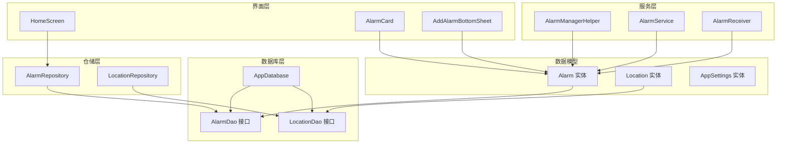
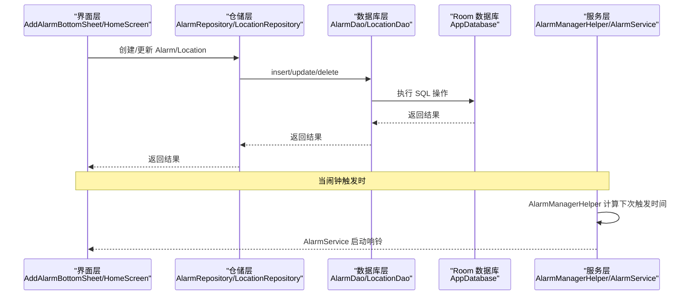
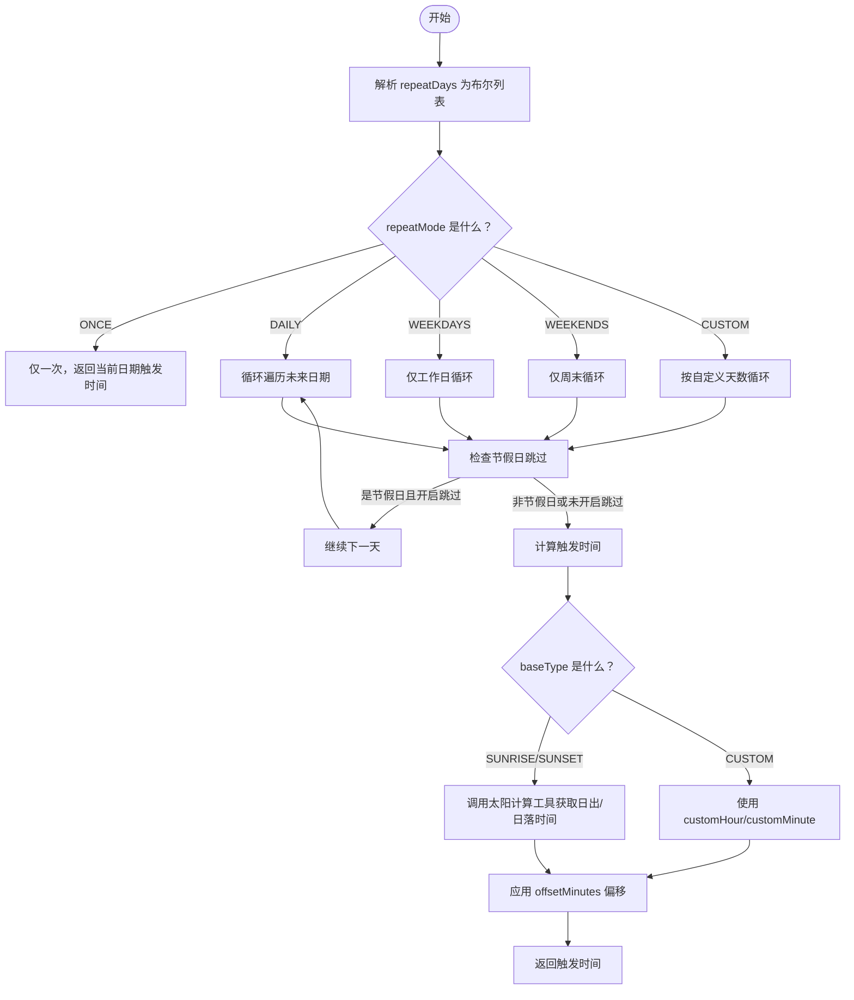
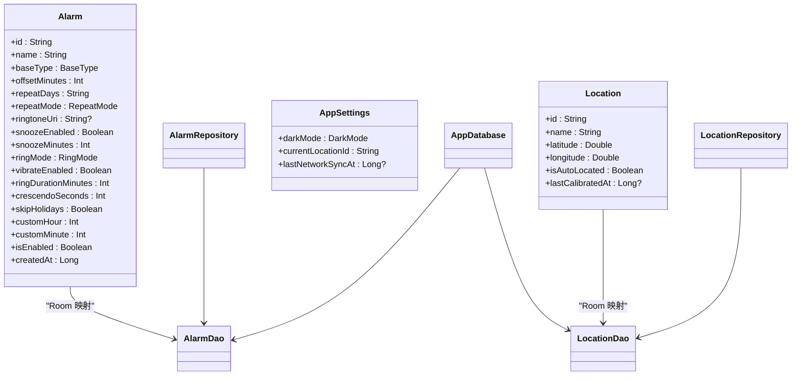

# 实体模型

<cite>
**本文引用的文件**
- [Alarm.kt](file://app/src/main/java/com/snuabar/sunrisesunsetalarm/data/model/Alarm.kt)
- [Location.kt](file://app/src/main/java/com/snuabar/sunrisesunsetalarm/data/model/Location.kt)
- [AppSettings.kt](file://app/src/main/java/com/snuabar/sunrisesunsetalarm/data/model/AppSettings.kt)
- [AlarmDao.kt](file://app/src/main/java/com/snuabar/sunrisesunsetalarm/data/database/AlarmDao.kt)
- [LocationDao.kt](file://app/src/main/java/com/snuabar/sunrisesunsetalarm/data/database/LocationDao.kt)
- [AppDatabase.kt](file://app/src/main/java/com/snuabar/sunrisesunsetalarm/data/database/AppDatabase.kt)
- [AlarmRepository.kt](file://app/src/main/java/com/snuabar/sunrisesunsetalarm/data/repository/AlarmRepository.kt)
- [LocationRepository.kt](file://app/src/main/java/com/snuabar/sunrisesunsetalarm/data/repository/LocationRepository.kt)
- [AlarmCard.kt](file://app/src/main/java/com/snuabar/sunrisesunsetalarm/ui/components/AlarmCard.kt)
- [AddAlarmBottomSheet.kt](file://app/src/main/java/com/snuabar/sunrisesunsetalarm/ui/components/AddAlarmBottomSheet.kt)
- [HomeScreen.kt](file://app/src/main/java/com/snuabar/sunrisesunsetalarm/ui/screens/HomeScreen.kt)
- [AlarmManagerHelper.kt](file://app/src/main/java/com/snuabar/sunrisesunsetalarm/service/AlarmManagerHelper.kt)
- [AlarmService.kt](file://app/src/main/java/com/snuabar/sunrisesunsetalarm/service/AlarmService.kt)
- [AlarmReceiver.kt](file://app/src/main/java/com/snuabar/sunrisesunsetalarm/receiver/AlarmReceiver.kt)
- [SettingsManager.kt](file://app/src/main/java/com/snuabar/sunrisesunsetalarm/util/SettingsManager.kt)
</cite>

## 目录
1. [简介](#简介)
2. [项目结构](#项目结构)
3. [核心组件](#核心组件)
4. [架构总览](#架构总览)
5. [详细组件分析](#详细组件分析)
6. [依赖关系分析](#依赖关系分析)
7. [性能考量](#性能考量)
8. [故障排查指南](#故障排查指南)
9. [结论](#结论)
10. [附录](#附录)

## 简介
本章节对应用中的实体模型进行系统化梳理与说明，重点覆盖 Alarm 闹钟实体、Location 位置实体与 AppSettings 应用设置实体的字段定义、数据类型、取值范围与业务含义；同时阐述 BaseType、RepeatMode、RingMode 等枚举类型的设计理念，并结合实际使用场景给出字段使用示例与最佳实践建议。

## 项目结构
实体模型位于 data/model 目录，配合 Room 数据库层（DAO、Repository、Database）与 UI 层组件共同构成完整的数据流。Alarm 与 Location 通过 DAO 持久化到本地数据库，UI 组件负责展示与编辑，服务层负责闹钟调度与响铃逻辑。

图表来源
- [Alarm.kt:6-37](file://app/src/main/java/com/snuabar/sunrisesunsetalarm/data/model/Alarm.kt#L6-L37)
- [Location.kt:6-15](file://app/src/main/java/com/snuabar/sunrisesunsetalarm/data/model/Location.kt#L6-L15)
- [AppSettings.kt:3-7](file://app/src/main/java/com/snuabar/sunrisesunsetalarm/data/model/AppSettings.kt#L3-L7)
- [AlarmDao.kt:7-29](file://app/src/main/java/com/snuabar/sunrisesunsetalarm/data/database/AlarmDao.kt#L7-L29)
- [LocationDao.kt:7-23](file://app/src/main/java/com/snuabar/sunrisesunsetalarm/data/database/LocationDao.kt#L7-L23)
- [AppDatabase.kt:10-32](file://app/src/main/java/com/snuabar/sunrisesunsetalarm/data/database/AppDatabase.kt#L10-L32)
- [AlarmRepository.kt:7-21](file://app/src/main/java/com/snuabar/sunrisesunsetalarm/data/repository/AlarmRepository.kt#L7-L21)
- [LocationRepository.kt:7-17](file://app/src/main/java/com/snuabar/sunrisesunsetalarm/data/repository/LocationRepository.kt#L7-L17)
- [HomeScreen.kt:65-79](file://app/src/main/java/com/snuabar/sunrisesunsetalarm/ui/screens/HomeScreen.kt#L65-L79)
- [AlarmCard.kt:96-128](file://app/src/main/java/com/snuabar/sunrisesunsetalarm/ui/components/AlarmCard.kt#L96-L128)
- [AddAlarmBottomSheet.kt:32-245](file://app/src/main/java/com/snuabar/sunrisesunsetalarm/ui/components/AddAlarmBottomSheet.kt#L32-L245)
- [AlarmManagerHelper.kt:114-147](file://app/src/main/java/com/snuabar/sunrisesunsetalarm/service/AlarmManagerHelper.kt#L114-L147)
- [AlarmService.kt:44-83](file://app/src/main/java/com/snuabar/sunrisesunsetalarm/service/AlarmService.kt#L44-L83)
- [AlarmReceiver.kt:58-68](file://app/src/main/java/com/snuabar/sunrisesunsetalarm/receiver/AlarmReceiver.kt#L58-L68)

章节来源
- [Alarm.kt:1-49](file://app/src/main/java/com/snuabar/sunrisesunsetalarm/data/model/Alarm.kt#L1-L49)
- [Location.kt:1-16](file://app/src/main/java/com/snuabar/sunrisesunsetalarm/data/model/Location.kt#L1-L16)
- [AppSettings.kt:1-12](file://app/src/main/java/com/snuabar/sunrisesunsetalarm/data/model/AppSettings.kt#L1-L12)
- [AppDatabase.kt:1-34](file://app/src/main/java/com/snuabar/sunrisesunsetalarm/data/database/AppDatabase.kt#L1-L34)

## 核心组件
本节从数据模型角度对三个实体进行逐项说明，包括字段定义、数据类型、取值范围与业务含义，并给出使用示例与最佳实践。

- Alarm 闹钟实体
  - id：字符串主键，唯一标识一个闹钟记录
  - name：闹钟名称，用于用户识别
  - baseType：基础类型，枚举值为 SUNRISE（日出）、SUNSET（日落）、CUSTOM（自定义）
  - offsetMinutes：偏移分钟数，整型，用于在日出/日落基础上增加或减少分钟数
  - repeatDays：重复天数配置，字符串，存储每周七天的布尔值序列，逗号分隔
  - repeatMode：重复模式，默认 CUSTOM，枚举值为 ONCE、DAILY、WEEKDAYS、WEEKENDS、CUSTOM
  - ringtoneUri：铃声 URI，可空字符串，指向系统或自定义铃声资源
  - snoozeEnabled：是否启用贪睡，布尔值
  - snoozeMinutes：贪睡分钟数，整型
  - ringMode：响铃模式，默认 FULL_SCREEN，枚举值为 FULL_SCREEN、NOTIFICATION、LIVE_ACTIVITY
  - vibrateEnabled：震动开关，布尔值
  - ringDurationMinutes：响铃持续时间（分钟），整型
  - crescendoSeconds：渐强时长（秒），整型
  - skipHolidays：节假日跳过，布尔值
  - customHour/customMinute：自定义时间的小时与分钟，整型，默认 -1 表示未设置
  - isEnabled：启用状态，布尔值
  - createdAt：创建时间戳，毫秒级时间

- Location 位置实体
  - id：字符串主键，唯一标识一个位置
  - name：位置名称（如城市名）
  - latitude/longitude：纬度与经度，双精度浮点数
  - isAutoLocated：是否为自动定位，默认 false
  - lastCalibratedAt：最后校准时间戳，可空

- AppSettings 应用设置实体
  - darkMode：深色模式偏好，默认 SYSTEM，枚举值为 SYSTEM、LIGHT、DARK
  - currentLocationId：当前选中位置 ID，字符串
  - lastNetworkSyncAt：最后网络同步时间戳，可空

章节来源
- [Alarm.kt:6-37](file://app/src/main/java/com/snuabar/sunrisesunsetalarm/data/model/Alarm.kt#L6-L37)
- [Location.kt:6-15](file://app/src/main/java/com/snuabar/sunrisesunsetalarm/data/model/Location.kt#L6-L15)
- [AppSettings.kt:3-7](file://app/src/main/java/com/snuabar/sunrisesunsetalarm/data/model/AppSettings.kt#L3-L7)

## 架构总览
下图展示了实体模型在应用中的角色与交互路径，从 UI 编辑到数据库持久化，再到服务层调度与响铃执行。

图表来源
- [AlarmRepository.kt:7-21](file://app/src/main/java/com/snuabar/sunrisesunsetalarm/data/repository/AlarmRepository.kt#L7-L21)
- [LocationRepository.kt:7-17](file://app/src/main/java/com/snuabar/sunrisesunsetalarm/data/repository/LocationRepository.kt#L7-L17)
- [AlarmDao.kt:7-29](file://app/src/main/java/com/snuabar/sunrisesunsetalarm/data/database/AlarmDao.kt#L7-L29)
- [LocationDao.kt:7-23](file://app/src/main/java/com/snuabar/sunrisesunsetalarm/data/database/LocationDao.kt#L7-L23)
- [AppDatabase.kt:15-17](file://app/src/main/java/com/snuabar/sunrisesunsetalarm/data/database/AppDatabase.kt#L15-L17)
- [AlarmManagerHelper.kt:114-147](file://app/src/main/java/com/snuabar/sunrisesunsetalarm/service/AlarmManagerHelper.kt#L114-L147)
- [AlarmService.kt:44-83](file://app/src/main/java/com/snuabar/sunrisesunsetalarm/service/AlarmService.kt#L44-L83)

## 详细组件分析

### Alarm 闹钟实体详解
- 字段与业务含义
  - id：主键，确保每条闹钟记录唯一性
  - name：便于用户识别的标签
  - baseType：决定闹钟触发时间来源（日出/日落/自定义）
  - offsetMinutes：仅对 SUNRISE/SUNSET 生效，允许在日出/日落基础上增减分钟
  - repeatDays：以逗号分隔的布尔列表，表示每周七天是否响铃
  - repeatMode：控制重复策略（一次性/每日/工作日/周末/自定义）
  - ringtoneUri：可空，为空则使用系统默认闹钟铃声
  - snoozeEnabled/snoozeMinutes：贪睡功能的开关与时长
  - ringMode：响铃呈现方式（全屏/通知/Live Activity）
  - vibrateEnabled：震动开关
  - ringDurationMinutes：响铃持续时长（分钟）
  - crescendoSeconds：渐强时长（秒）
  - skipHolidays：节假日跳过
  - customHour/customMinute：当 baseType=CUSTOM 时生效，表示具体时间
  - isEnabled：控制闹钟是否启用
  - createdAt：记录创建时间

- 数据类型与取值范围
  - id/name：字符串
  - baseType：枚举 SUNRISE/SUNSET/CUSTOM
  - offsetMinutes：整型，典型范围如 [-120, 120] 分钟（由 UI 滑杆范围体现）
  - repeatDays：字符串，存储 7 个布尔值，逗号分隔
  - repeatMode：枚举 ONCE/DAILY/WEEKDAYS/WEEKENDS/CUSTOM
  - ringtoneUri：字符串（URI），可空
  - snoozeEnabled/vibrateEnabled/skipHolidays/isEnabled：布尔值
  - snoozeMinutes/ringDurationMinutes/crescendoSeconds：整型，通常为 [1,30] 的正整数
  - customHour/customMinute：整型，-1 表示未设置；有效范围为 0-23/0-59
  - createdAt：长整型（毫秒）

- 使用示例与最佳实践
  - 日出闹钟：baseType=SUNRISE，offsetMinutes=0，repeatMode=DAILY，ringDurationMinutes=5，vibrateEnabled=true
  - 偏移闹钟：baseType=SUNRISE，offsetMinutes=15（延后15分钟），repeatMode=WEEKDAYS
  - 自定义时间：baseType=CUSTOM，customHour=7，customMinute=30，repeatMode=ONCE 或 CUSTOM
  - 贪睡设置：snoozeEnabled=true，snoozeMinutes=5；若用户易醒，可适当降低响铃时长
  - 节假日跳过：skipHolidays=true，结合节假日工具类在调度时跳过
  - 铃声选择：ringtoneUri 可留空使用系统默认，或指定自定义铃声 URI
  - 重复天数：repeatDays 通过逗号分隔的布尔串存储，提供工具方法在列表与字符串之间转换

- 关键流程与算法
  - 重复天数解析：将逗号分隔的字符串转换为布尔列表，用于 UI 显示与服务端调度
  - 下次触发计算：根据 baseType、offsetMinutes、repeatMode、repeatDays、skipHolidays、customHour/Minute 与当前位置经纬度计算下一次触发时间

图表来源
- [Alarm.kt:28-36](file://app/src/main/java/com/snuabar/sunrisesunsetalarm/data/model/Alarm.kt#L28-L36)
- [AlarmManagerHelper.kt:114-147](file://app/src/main/java/com/snuabar/sunrisesunsetalarm/service/AlarmManagerHelper.kt#L114-L147)

章节来源
- [Alarm.kt:6-37](file://app/src/main/java/com/snuabar/sunrisesunsetalarm/data/model/Alarm.kt#L6-L37)
- [AlarmCard.kt:96-128](file://app/src/main/java/com/snuabar/sunrisesunsetalarm/ui/components/AlarmCard.kt#L96-L128)
- [AddAlarmBottomSheet.kt:32-245](file://app/src/main/java/com/snuabar/sunrisesunsetalarm/ui/components/AddAlarmBottomSheet.kt#L32-L245)
- [AlarmManagerHelper.kt:114-147](file://app/src/main/java/com/snuabar/sunrisesunsetalarm/service/AlarmManagerHelper.kt#L114-L147)

### Location 位置实体详解
- 字段与业务含义
  - id：主键，唯一标识位置
  - name：位置名称（如城市名）
  - latitude/longitude：地理坐标
  - isAutoLocated：是否为自动定位
  - lastCalibratedAt：最后校准时间戳，用于校准太阳时间计算

- 数据类型与取值范围
  - id/name：字符串
  - latitude：双精度浮点数，范围约 [-90, 90]
  - longitude：双精度浮点数，范围约 [-180, 180]
  - isAutoLocated：布尔值
  - lastCalibratedAt：长整型（毫秒），可空

- 使用示例与最佳实践
  - 默认位置：初始化时可设置默认城市名与经纬度
  - 自动定位：isAutoLocated=true 时，优先使用系统定位结果
  - 校准机制：lastCalibratedAt 记录校准时间，用于后续太阳时间计算的时效性判断

章节来源
- [Location.kt:6-15](file://app/src/main/java/com/snuabar/sunrisesunsetalarm/data/model/Location.kt#L6-L15)
- [SettingsManager.kt:19-32](file://app/src/main/java/com/snuabar/sunrisesunsetalarm/util/SettingsManager.kt#L19-L32)

### AppSettings 应用设置实体详解
- 字段与业务含义
  - darkMode：深色模式偏好（SYSTEM/LIGHT/DARK）
  - currentLocationId：当前选中位置 ID
  - lastNetworkSyncAt：最后网络同步时间戳，可空

- 数据类型与取值范围
  - darkMode：枚举 SYSTEM/LIGHT/DARK
  - currentLocationId：字符串
  - lastNetworkSyncAt：长整型（毫秒），可空

- 使用示例与最佳实践
  - 主题切换：通过 darkMode 切换主题，SYSTEM 适配系统设置
  - 位置管理：currentLocationId 与 Location 实体关联，用于太阳时间计算
  - 同步策略：lastNetworkSyncAt 用于判断是否需要重新拉取网络数据

章节来源
- [AppSettings.kt:3-7](file://app/src/main/java/com/snuabar/sunrisesunsetalarm/data/model/AppSettings.kt#L3-L7)
- [SettingsManager.kt:11-17](file://app/src/main/java/com/snuabar/sunrisesunsetalarm/util/SettingsManager.kt#L11-L17)

### 枚举类型设计
- BaseType（基础类型）
  - SUNRISE：基于日出时间
  - SUNSET：基于日落时间
  - CUSTOM：自定义时间
  - 设计理念：统一闹钟触发时间来源，支持动态计算与静态设定

- RepeatMode（重复模式）
  - ONCE：仅一次
  - DAILY：每天
  - WEEKDAYS：工作日
  - WEEKENDS：周末
  - CUSTOM：自定义星期组合
  - 设计理念：覆盖常见重复场景，CUSTOM 提供灵活扩展

- RingMode（响铃模式）
  - FULL_SCREEN：全屏显示
  - NOTIFICATION：通知栏提醒
  - LIVE_ACTIVITY：Live Activity（前台通知）
  - 设计理念：满足不同用户体验需求，兼顾省电与提醒效果

章节来源
- [Alarm.kt:39-49](file://app/src/main/java/com/snuabar/sunrisesunsetalarm/data/model/Alarm.kt#L39-L49)

## 依赖关系分析
- 数据模型与数据库层
  - Alarm/Location 实体通过 Room 注解映射到表 alarms/locations
  - AppDatabase 声明实体集合与版本迁移策略
  - AlarmDao/LocationDao 定义查询、插入、更新、删除操作

- 仓储层与数据库层
  - AlarmRepository/LocationRepository 封装 DAO 操作，提供 Flow/List 查询接口

- UI 层与模型
  - HomeScreen 通过 AlarmRepository 获取所有闹钟并展示
  - AlarmCard 展示闹钟摘要信息，包含基础类型、偏移与重复模式
  - AddAlarmBottomSheet 支持创建/编辑 Alarm，包含重复天数、响铃参数等

- 服务层与模型
  - AlarmManagerHelper 根据 Alarm 的 repeatMode/ repeatDays/skipHolidays 与位置经纬度计算下次触发时间
  - AlarmService 根据 ringMode/ringDurationMinutes/vibrateEnabled 等参数执行响铃逻辑

图表来源
- [Alarm.kt:6-37](file://app/src/main/java/com/snuabar/sunrisesunsetalarm/data/model/Alarm.kt#L6-L37)
- [Location.kt:6-15](file://app/src/main/java/com/snuabar/sunrisesunsetalarm/data/model/Location.kt#L6-L15)
- [AppSettings.kt:3-7](file://app/src/main/java/com/snuabar/sunrisesunsetalarm/data/model/AppSettings.kt#L3-L7)
- [AlarmDao.kt:7-29](file://app/src/main/java/com/snuabar/sunrisesunsetalarm/data/database/AlarmDao.kt#L7-L29)
- [LocationDao.kt:7-23](file://app/src/main/java/com/snuabar/sunrisesunsetalarm/data/database/LocationDao.kt#L7-L23)
- [AppDatabase.kt:10-17](file://app/src/main/java/com/snuabar/sunrisesunsetalarm/data/database/AppDatabase.kt#L10-L17)
- [AlarmRepository.kt:7-21](file://app/src/main/java/com/snuabar/sunrisesunsetalarm/data/repository/AlarmRepository.kt#L7-L21)
- [LocationRepository.kt:7-17](file://app/src/main/java/com/snuabar/sunrisesunsetalarm/data/repository/LocationRepository.kt#L7-L17)

章节来源
- [AlarmDao.kt:7-29](file://app/src/main/java/com/snuabar/sunrisesunsetalarm/data/database/AlarmDao.kt#L7-L29)
- [LocationDao.kt:7-23](file://app/src/main/java/com/snuabar/sunrisesunsetalarm/data/database/LocationDao.kt#L7-L23)
- [AppDatabase.kt:10-32](file://app/src/main/java/com/snuabar/sunrisesunsetalarm/data/database/AppDatabase.kt#L10-L32)
- [AlarmRepository.kt:7-21](file://app/src/main/java/com/snuabar/sunrisesunsetalarm/data/repository/AlarmRepository.kt#L7-L21)
- [LocationRepository.kt:7-17](file://app/src/main/java/com/snuabar/sunrisesunsetalarm/data/repository/LocationRepository.kt#L7-L17)

## 性能考量
- 数据存储
  - 使用 Room 进行本地持久化，避免频繁 IO；Alarm/Location 表结构简单，索引需求低
  - 通过 Flow 提供响应式查询，减少主线程阻塞

- 重复调度
  - AlarmManagerHelper 在调度时考虑 repeatMode/repeatDays/skipHolidays，避免无效计算
  - 使用最小必要范围的日期循环，提高效率

- 响铃执行
  - AlarmService 根据 ringMode 选择不同的响铃策略，避免不必要的 UI 开销
  - 渐强与震动参数合理设置，平衡体验与电量消耗

- 数据迁移
  - AppDatabase 的迁移脚本保证历史数据兼容，避免因新增字段导致的异常

## 故障排查指南
- 闹钟不触发
  - 检查 isEnabled 是否为 true
  - 检查 repeatMode/repeatDays 是否导致当天被跳过
  - 若启用 skipHolidays，确认当日是否为节假日
  - 确认 baseType 与 customHour/customMinute 设置是否正确

- 偏移量无效
  - 仅 SUNRISE/SUNSET 类型支持 offsetMinutes；CUSTOM 类型不显示偏移

- 重复天数显示异常
  - 确认 repeatDays 字符串格式为 7 个布尔值，逗号分隔
  - 使用工具方法在列表与字符串之间正确转换

- 响铃参数无效
  - ringDurationMinutes/snoozeMinutes/crescendoSeconds 应为正整数
  - ringMode 选择需与设备能力匹配（如 Live Activity 的可用性）

- 位置相关问题
  - lastCalibratedAt 是否过期，必要时重新校准
  - isAutoLocated 与手动设置的经纬度冲突时，优先使用自动定位

章节来源
- [AlarmCard.kt:96-128](file://app/src/main/java/com/snuabar/sunrisesunsetalarm/ui/components/AlarmCard.kt#L96-L128)
- [AddAlarmBottomSheet.kt:32-245](file://app/src/main/java/com/snuabar/sunrisesunsetalarm/ui/components/AddAlarmBottomSheet.kt#L32-L245)
- [AlarmManagerHelper.kt:114-147](file://app/src/main/java/com/snuabar/sunrisesunsetalarm/service/AlarmManagerHelper.kt#L114-L147)
- [AlarmService.kt:44-83](file://app/src/main/java/com/snuabar/sunrisesunsetalarm/service/AlarmService.kt#L44-L83)

## 结论
本实体模型围绕 Alarm、Location、AppSettings 三大核心对象构建，通过 Room 数据库层实现稳定持久化，结合 UI 与服务层完成从创建、调度到响铃的完整闭环。BaseType、RepeatMode、RingMode 等枚举类型提供了清晰的业务语义与灵活的扩展空间。遵循本文提供的字段定义、取值范围与最佳实践，可有效提升应用的稳定性与用户体验。

## 附录
- 示例场景
  - 晨间唤醒：SUNRISE + 0 偏移 + 每日 + 全屏响铃 + 震动 + 5 分钟响铃时长
  - 工作日日落提醒：SUNSET + 0 偏移 + 工作日 + 通知栏提醒 + 贪睡 5 分钟
  - 自定义午夜闹钟：CUSTOM + 00:00 + 仅一次 + Live Activity + 跳过节假日

- 版本与迁移
  - AppDatabase 版本为 5，包含对 customHour/customMinute 与 repeatMode 的迁移脚本

章节来源
- [HomeScreen.kt:69-79](file://app/src/main/java/com/snuabar/sunrisesunsetalarm/ui/screens/HomeScreen.kt#L69-L79)
- [AppDatabase.kt:19-32](file://app/src/main/java/com/snuabar/sunrisesunsetalarm/data/database/AppDatabase.kt#L19-L32)