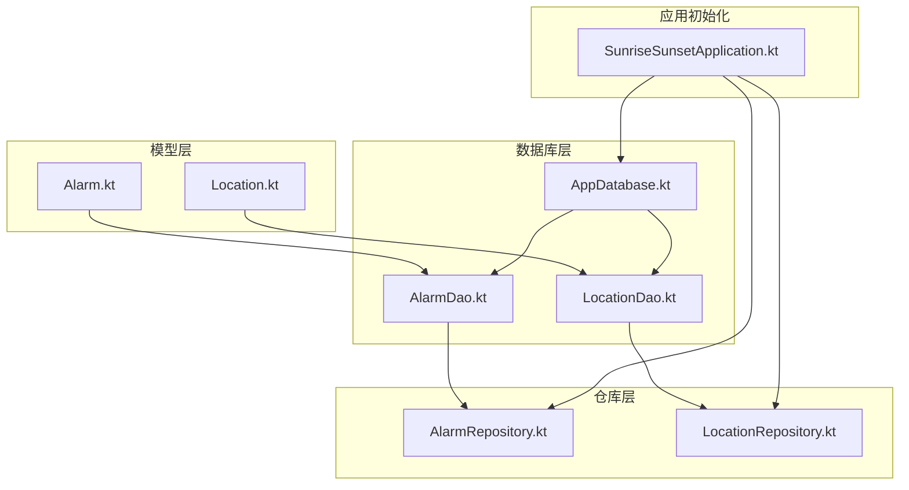
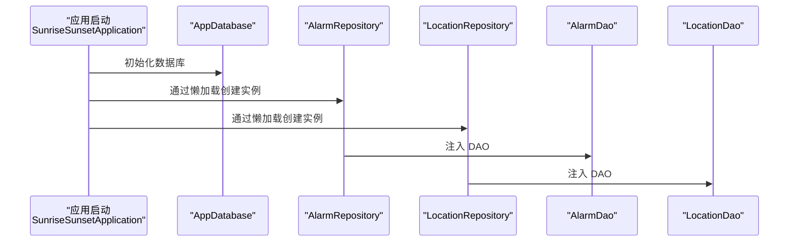
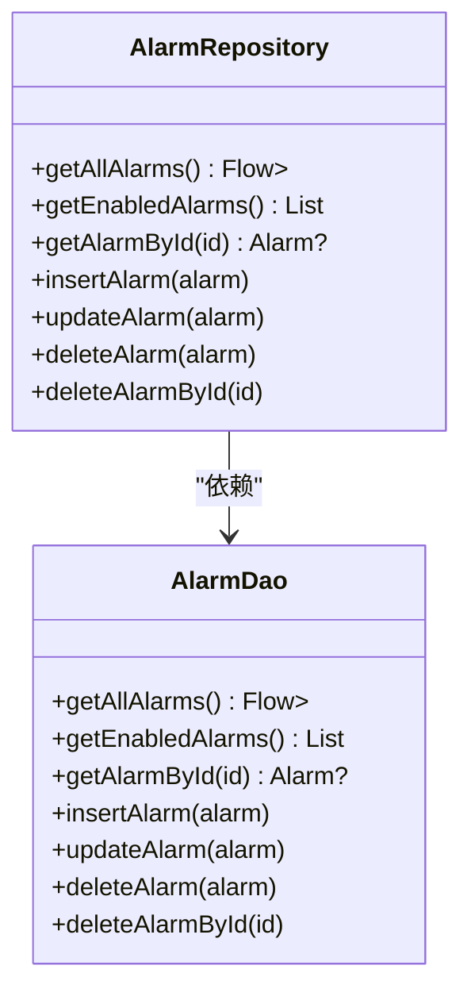
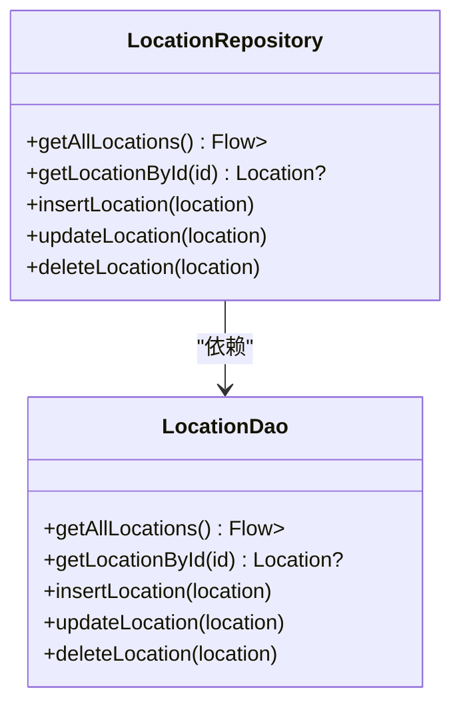
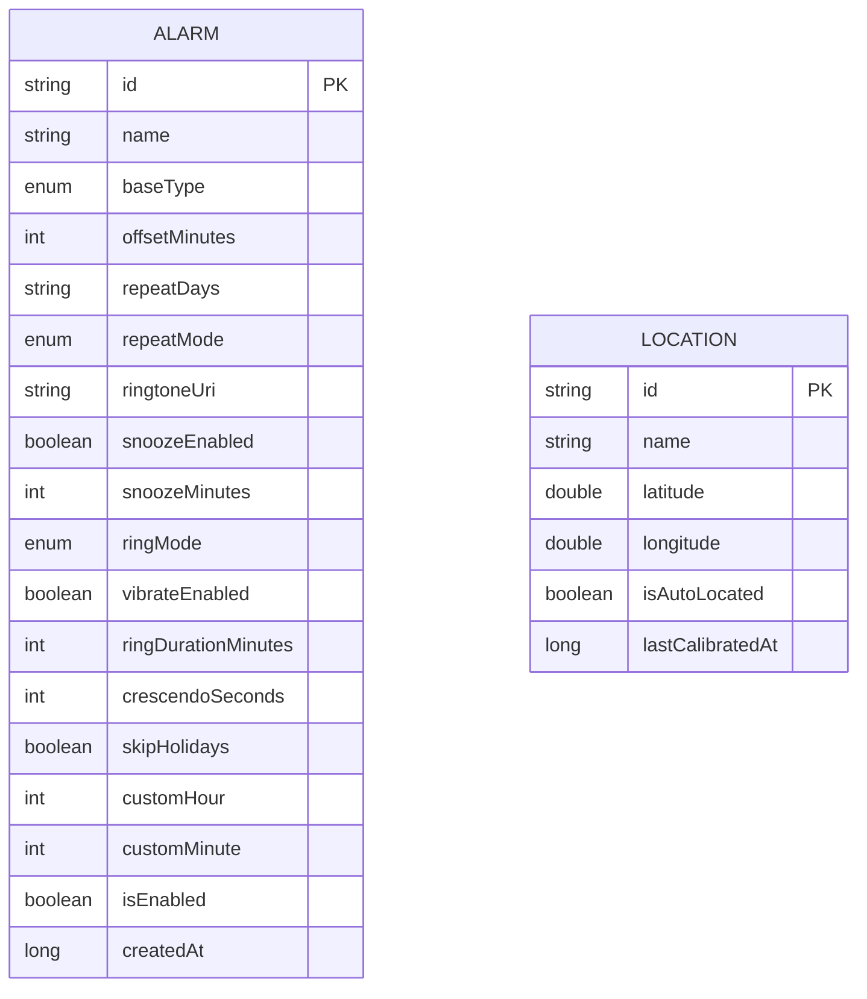
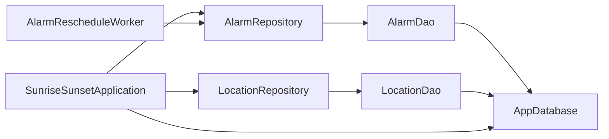

# 数据仓库层

<cite>
**本文引用的文件**
- [AlarmRepository.kt](file://app/src/main/java/com/snuabar/sunrisesunsetalarm/data/repository/AlarmRepository.kt)
- [LocationRepository.kt](file://app/src/main/java/com/snuabar/sunrisesunsetalarm/data/repository/LocationRepository.kt)
- [AlarmDao.kt](file://app/src/main/java/com/snuabar/sunrisesunsetalarm/data/database/AlarmDao.kt)
- [LocationDao.kt](file://app/src/main/java/com/snuabar/sunrisesunsetalarm/data/database/LocationDao.kt)
- [AppDatabase.kt](file://app/src/main/java/com/snuabar/sunrisesunsetalarm/data/database/AppDatabase.kt)
- [Alarm.kt](file://app/src/main/java/com/snuabar/sunrisesunsetalarm/data/model/Alarm.kt)
- [Location.kt](file://app/src/main/java/com/snuabar/sunrisesunsetalarm/data/model/Location.kt)
- [SunriseSunsetApplication.kt](file://app/src/main/java/com/snuabar/sunrisesunsetalarm/SunriseSunsetApplication.kt)
- [AlarmRescheduleWorker.kt](file://app/src/main/java/com/snuabar/sunrisesunsetalarm/receiver/AlarmRescheduleWorker.kt)
</cite>

## 目录
1. [简介](#简介)
2. [项目结构](#项目结构)
3. [核心组件](#核心组件)
4. [架构总览](#架构总览)
5. [详细组件分析](#详细组件分析)
6. [依赖关系分析](#依赖关系分析)
7. [性能考量](#性能考量)
8. [故障排查指南](#故障排查指南)
9. [结论](#结论)
10. [附录：使用示例与测试指南](#附录使用示例与测试指南)

## 简介
本文件聚焦于数据仓库层，系统性解析 AlarmRepository 与 LocationRepository 的设计模式与实现原理，阐明仓库模式如何封装底层数据源（Room DAO），向上提供统一的异步数据操作接口，从而实现数据层与业务逻辑的解耦。文档覆盖：
- 仓库类方法的职责与实现路径
- 协程与 Flow 在仓库中的使用、错误处理与异常传播
- 缓存策略、内存优化与性能调优
- 数据同步、冲突解决与一致性保障
- 在 ViewModel 中的正确调用方式
- 单元测试编写与 Mock 数据准备建议

## 项目结构
数据仓库层位于 app/src/main/java/com/snuabar/sunrisesunsetalarm/data 下，采用“模型-数据库-仓库”三层组织：
- 模型层：Alarm、Location 实体
- 数据库层：Room 数据库 AppDatabase 及其 DAO 接口 AlarmDao、LocationDao
- 仓库层：AlarmRepository、LocationRepository 封装 DAO 并暴露高层 API

图表来源
- [AlarmRepository.kt:1-22](file://app/src/main/java/com/snuabar/sunrisesunsetalarm/data/repository/AlarmRepository.kt#L1-L22)
- [LocationRepository.kt:1-18](file://app/src/main/java/com/snuabar/sunrisesunsetalarm/data/repository/LocationRepository.kt#L1-L18)
- [AlarmDao.kt:1-30](file://app/src/main/java/com/snuabar/sunrisesunsetalarm/data/database/AlarmDao.kt#L1-L30)
- [LocationDao.kt:1-24](file://app/src/main/java/com/snuabar/sunrisesunsetalarm/data/database/LocationDao.kt#L1-L24)
- [AppDatabase.kt:1-34](file://app/src/main/java/com/snuabar/sunrisesunsetalarm/data/database/AppDatabase.kt#L1-L34)
- [SunriseSunsetApplication.kt:1-67](file://app/src/main/java/com/snuabar/sunrisesunsetalarm/SunriseSunsetApplication.kt#L1-L67)

章节来源
- [AlarmRepository.kt:1-22](file://app/src/main/java/com/snuabar/sunrisesunsetalarm/data/repository/AlarmRepository.kt#L1-L22)
- [LocationRepository.kt:1-18](file://app/src/main/java/com/snuabar/sunrisesunsetalarm/data/repository/LocationRepository.kt#L1-L18)
- [AlarmDao.kt:1-30](file://app/src/main/java/com/snuabar/sunrisesunsetalarm/data/database/AlarmDao.kt#L1-L30)
- [LocationDao.kt:1-24](file://app/src/main/java/com/snuabar/sunrisesunsetalarm/data/database/LocationDao.kt#L1-L24)
- [AppDatabase.kt:1-34](file://app/src/main/java/com/snuabar/sunrisesunsetalarm/data/database/AppDatabase.kt#L1-L34)
- [SunriseSunsetApplication.kt:1-67](file://app/src/main/java/com/snuabar/sunrisesunsetalarm/SunriseSunsetApplication.kt#L1-L67)

## 核心组件
- AlarmRepository：封装 AlarmDao，提供 Flow 驱动的实时列表与挂起函数的 CRUD 操作，支持按 ID 查询与删除。
- LocationRepository：封装 LocationDao，提供 Flow 驱动的实时列表与挂起函数的 CRUD 操作，支持按 ID 查询与删除。
- AppDatabase：Room 数据库，声明实体与 DAO 抽象，并提供迁移策略。
- AlarmDao/LocationDao：Room DAO 接口，定义查询、插入、更新、删除等方法，部分返回 Flow，部分为挂起函数。
- Alarm/Location：Room 实体，定义表结构与字段。

章节来源
- [AlarmRepository.kt:7-21](file://app/src/main/java/com/snuabar/sunrisesunsetalarm/data/repository/AlarmRepository.kt#L7-L21)
- [LocationRepository.kt:7-17](file://app/src/main/java/com/snuabar/sunrisesunsetalarm/data/repository/LocationRepository.kt#L7-L17)
- [AppDatabase.kt:10-17](file://app/src/main/java/com/snuabar/sunrisesunsetalarm/data/database/AppDatabase.kt#L10-L17)
- [AlarmDao.kt:7-29](file://app/src/main/java/com/snuabar/sunrisesunsetalarm/data/database/AlarmDao.kt#L7-L29)
- [LocationDao.kt:7-23](file://app/src/main/java/com/snuabar/sunrisesunsetalarm/data/database/LocationDao.kt#L7-L23)
- [Alarm.kt:6-37](file://app/src/main/java/com/snuabar/sunrisesunsetalarm/data/model/Alarm.kt#L6-L37)
- [Location.kt:6-15](file://app/src/main/java/com/snuabar/sunrisesunsetalarm/data/model/Location.kt#L6-L15)

## 架构总览
仓库层通过依赖注入在应用启动时创建实例，向业务层（如 Worker）提供统一的数据访问入口。DAO 层负责与数据库交互，仓库层负责组合与暴露 API，并在需要时进行数据转换或策略处理。

图表来源
- [SunriseSunsetApplication.kt:28-34](file://app/src/main/java/com/snuabar/sunrisesunsetalarm/SunriseSunsetApplication.kt#L28-L34)
- [AlarmRepository.kt:7](file://app/src/main/java/com/snuabar/sunrisesunsetalarm/data/repository/AlarmRepository.kt#L7)
- [LocationRepository.kt:7](file://app/src/main/java/com/snuabar/sunrisesunsetalarm/data/repository/LocationRepository.kt#L7)
- [AlarmDao.kt:7](file://app/src/main/java/com/snuabar/sunrisesunsetalarm/data/database/AlarmDao.kt#L7)
- [LocationDao.kt:7](file://app/src/main/java/com/snuabar/sunrisesunsetalarm/data/database/LocationDao.kt#L7)

## 详细组件分析

### AlarmRepository 设计与实现
- 角色定位：面向业务的闹钟数据访问门面，屏蔽 Room DAO 的细节，向上提供统一的 API。
- 方法族：
  - 列表订阅：getAllAlarms 返回 Flow<List<Alarm>>，用于 UI 订阅实时变化。
  - 条件查询：getEnabledAlarms 返回挂起函数，查询启用状态的闹钟集合。
  - 单条查询：getAlarmById 支持按主键查询，返回可空对象。
  - 写入与更新：insertAlarm、updateAlarm、deleteAlarm、deleteAlarmById 提供完整的 CRUD。
- 异步与协程：
  - Flow 由 DAO 直接返回，仓库层不做转换，保持上游数据流的纯净性。
  - 挂起函数用于一次性写入或批量查询，避免阻塞主线程。
- 错误处理与异常传播：
  - 仓库层不捕获异常，直接透传 DAO 抛出的异常，便于上层统一处理。
- 数据一致性与冲突策略：
  - 插入使用 REPLACE 冲突策略，确保幂等写入。
  - 删除通过主键精确删除，避免误删。

图表来源
- [AlarmRepository.kt:7-21](file://app/src/main/java/com/snuabar/sunrisesunsetalarm/data/repository/AlarmRepository.kt#L7-L21)
- [AlarmDao.kt:7-29](file://app/src/main/java/com/snuabar/sunrisesunsetalarm/data/database/AlarmDao.kt#L7-L29)

章节来源
- [AlarmRepository.kt:7-21](file://app/src/main/java/com/snuabar/sunrisesunsetalarm/data/repository/AlarmRepository.kt#L7-L21)
- [AlarmDao.kt:9-28](file://app/src/main/java/com/snuabar/sunrisesunsetalarm/data/database/AlarmDao.kt#L9-L28)

### LocationRepository 设计与实现
- 角色定位：面向业务的位置数据访问门面，提供位置列表订阅与 CRUD。
- 方法族：
  - 列表订阅：getAllLocations 返回 Flow<List<Location>>，用于 UI 订阅实时变化。
  - 单条查询：getLocationById 支持按主键查询，返回可空对象。
  - 写入与更新：insertLocation、updateLocation、deleteLocation 提供完整的 CRUD。
- 异步与协程：
  - Flow 由 DAO 直接返回，仓库层不做转换，保持上游数据流的纯净性。
  - 挂起函数用于一次性写入或查询，避免阻塞主线程。
- 错误处理与异常传播：
  - 仓库层不捕获异常，直接透传 DAO 抛出的异常，便于上层统一处理。
- 数据一致性与冲突策略：
  - 插入使用 REPLACE 冲突策略，确保幂等写入。

图表来源
- [LocationRepository.kt:7-17](file://app/src/main/java/com/snuabar/sunrisesunsetalarm/data/repository/LocationRepository.kt#L7-L17)
- [LocationDao.kt:7-23](file://app/src/main/java/com/snuabar/sunrisesunsetalarm/data/database/LocationDao.kt#L7-L23)

章节来源
- [LocationRepository.kt:7-17](file://app/src/main/java/com/snuabar/sunrisesunsetalarm/data/repository/LocationRepository.kt#L7-L17)
- [LocationDao.kt:9-22](file://app/src/main/java/com/snuabar/sunrisesunsetalarm/data/database/LocationDao.kt#L9-L22)

### 数据模型与数据库层
- Alarm 实体包含主键、名称、基础类型、偏移分钟数、重复天字符串、重复模式、铃声 URI、小睡配置、响铃模式、震动、持续时间、渐强秒数、节假日跳过、自定义时分、启用状态与创建时间等字段；提供重复天列表与字符串互转工具。
- Location 实体包含主键、名称、经纬度、自动定位标记与最后校准时间。
- AppDatabase 声明实体与 DAO 抽象，并提供版本迁移策略，确保数据库演进的兼容性。

图表来源
- [Alarm.kt:6-37](file://app/src/main/java/com/snuabar/sunrisesunsetalarm/data/model/Alarm.kt#L6-L37)
- [Location.kt:6-15](file://app/src/main/java/com/snuabar/sunrisesunsetalarm/data/model/Location.kt#L6-L15)

章节来源
- [Alarm.kt:6-37](file://app/src/main/java/com/snuabar/sunrisesunsetalarm/data/model/Alarm.kt#L6-L37)
- [Location.kt:6-15](file://app/src/main/java/com/snuabar/sunrisesunsetalarm/data/model/Location.kt#L6-L15)
- [AppDatabase.kt:10-17](file://app/src/main/java/com/snuabar/sunrisesunsetalarm/data/database/AppDatabase.kt#L10-L17)

## 依赖关系分析
- 仓库层依赖 DAO 层，DAO 层依赖 Room 数据库与注解映射。
- 应用启动时通过 SunriseSunsetApplication 创建数据库实例，并以惰性方式注入到仓库中。
- Worker 在后台周期性任务中调用 AlarmRepository 的挂起函数获取启用闹钟并重新调度。

图表来源
- [AlarmRepository.kt:7](file://app/src/main/java/com/snuabar/sunrisesunsetalarm/data/repository/AlarmRepository.kt#L7)
- [LocationRepository.kt:7](file://app/src/main/java/com/snuabar/sunrisesunsetalarm/data/repository/LocationRepository.kt#L7)
- [AlarmDao.kt:7](file://app/src/main/java/com/snuabar/sunrisesunsetalarm/data/database/AlarmDao.kt#L7)
- [LocationDao.kt:7](file://app/src/main/java/com/snuabar/sunrisesunsetalarm/data/database/LocationDao.kt#L7)
- [AppDatabase.kt:10-17](file://app/src/main/java/com/snuabar/sunrisesunsetalarm/data/database/AppDatabase.kt#L10-L17)
- [SunriseSunsetApplication.kt:28-34](file://app/src/main/java/com/snuabar/sunrisesunsetalarm/SunriseSunsetApplication.kt#L28-L34)
- [AlarmRescheduleWorker.kt:38](file://app/src/main/java/com/snuabar/sunrisesunsetalarm/receiver/AlarmRescheduleWorker.kt#L38)

章节来源
- [SunriseSunsetApplication.kt:28-34](file://app/src/main/java/com/snuabar/sunrisesunsetalarm/SunriseSunsetApplication.kt#L28-L34)
- [AlarmRescheduleWorker.kt:38](file://app/src/main/java/com/snuabar/sunrisesunsetalarm/receiver/AlarmRescheduleWorker.kt#L38)

## 性能考量
- Flow 订阅与数据库变更：
  - DAO 的 Flow 直接返回给仓库，仓库不做额外转换，减少中间层开销，提升响应速度。
- 写入冲突策略：
  - 插入使用 REPLACE，避免重复主键导致的失败，提高幂等写入的稳定性。
- IO 线程与协程调度：
  - DAO 的挂起函数默认在合适的调度器上执行，仓库层不额外切换线程，避免不必要的上下文切换。
- 数据库迁移：
  - 通过显式迁移策略处理字段扩展，降低运行时错误风险。
- 内存优化：
  - 仓库层仅持有 DAO 引用，无额外缓存，避免内存冗余。
- 建议优化点（通用指导）：
  - 对频繁查询的字段建立索引（如按启用状态查询）。
  - 对大列表分页或懒加载，避免一次性加载过多数据。
  - 对 Flow 的收集范围进行合理限制，避免过度订阅。

[本节为通用性能建议，不直接分析具体文件，故无章节来源]

## 故障排查指南
- DAO 抛出异常：
  - 仓库层不捕获异常，直接透传，便于上层统一处理。若出现数据库约束或 SQL 错误，请检查实体字段与迁移策略。
- Flow 不更新：
  - 确认 UI 已正确收集 Flow；确认数据库写入发生在正确的线程；确认 Room 的查询语句与表结构一致。
- 写入失败或重复：
  - 检查插入策略是否为 REPLACE；确认主键唯一性；检查并发写入场景下的事务边界。
- Worker 调度异常：
  - 确认 Worker 能够访问 AlarmRepository；检查 getEnabledAlarms 的调用是否在后台线程执行。

章节来源
- [AlarmRepository.kt:10](file://app/src/main/java/com/snuabar/sunrisesunsetalarm/data/repository/AlarmRepository.kt#L10)
- [LocationRepository.kt:10](file://app/src/main/java/com/snuabar/sunrisesunsetalarm/data/repository/LocationRepository.kt#L10)
- [AlarmDao.kt:18](file://app/src/main/java/com/snuabar/sunrisesunsetalarm/data/database/AlarmDao.kt#L18)
- [LocationDao.kt:15](file://app/src/main/java/com/snuabar/sunrisesunsetalarm/data/database/LocationDao.kt#L15)

## 结论
AlarmRepository 与 LocationRepository 通过最小化的封装实现了对 DAO 的统一暴露，结合 Flow 的实时订阅与挂起函数的异步写入，有效解耦了数据层与业务层。仓库层不引入额外复杂逻辑，保持高内聚低耦合，配合 Room 的迁移与冲突策略，形成稳定可靠的数据访问层。

[本节为总结性内容，不直接分析具体文件，故无章节来源]

## 附录：使用示例与测试指南

### 在 ViewModel 中的正确调用方式
- 列表订阅：通过仓库的 Flow 获取实时列表并在 UI 中收集。
- 单次查询：在需要时调用挂起函数获取单条记录。
- 写入与更新：在后台线程调用挂起函数执行插入、更新、删除操作。
- 示例参考路径：
  - 仓库方法调用示例：[AlarmRescheduleWorker.kt:38](file://app/src/main/java/com/snuabar/sunrisesunsetalarm/receiver/AlarmRescheduleWorker.kt#L38)

章节来源
- [AlarmRescheduleWorker.kt:38](file://app/src/main/java/com/snuabar/sunrisesunsetalarm/receiver/AlarmRescheduleWorker.kt#L38)

### 协程与 Flow 使用要点
- Flow 构建与转换：
  - 仓库层直接返回 DAO 的 Flow，不做转换，保持上游数据流的纯净性。
- 错误处理与异常传播：
  - 仓库层不捕获异常，直接透传，便于上层统一处理。
- 异常传播路径：
  - DAO 抛出的异常经仓库层透传至上层调用方（如 Worker 或 ViewModel）。

章节来源
- [AlarmRepository.kt:8](file://app/src/main/java/com/snuabar/sunrisesunsetalarm/data/repository/AlarmRepository.kt#L8)
- [LocationRepository.kt:8](file://app/src/main/java/com/snuabar/sunrisesunsetalarm/data/repository/LocationRepository.kt#L8)

### 数据同步、冲突解决与一致性
- 同步机制：
  - Flow 订阅提供数据库变更的实时通知，UI 与 Worker 可据此同步状态。
- 冲突解决：
  - 插入使用 REPLACE 冲突策略，确保幂等写入。
- 一致性保证：
  - 通过 Room 的事务与 DAO 的原子操作保证单次操作的一致性；对于跨表或复杂业务，可在上层封装事务。

章节来源
- [AlarmDao.kt:18](file://app/src/main/java/com/snuabar/sunrisesunsetalarm/data/database/AlarmDao.kt#L18)
- [LocationDao.kt:15](file://app/src/main/java/com/snuabar/sunrisesunsetalarm/data/database/LocationDao.kt#L15)

### 单元测试编写指南与 Mock 数据准备
- 测试目标：
  - 验证仓库方法的行为（Flow 是否正确传递、挂起函数是否正确调用 DAO、异常是否按预期传播）。
- Mock 数据准备：
  - 准备 Alarm 与 Location 的测试实体实例，模拟 DAO 的返回值与行为。
- 测试策略：
  - 使用挂起函数的协程测试框架（如 Kotlin Coroutines Test）验证异步行为。
  - 对 Flow 的收集进行断言，验证数据流的正确性。
  - 对异常场景进行断言，验证异常传播路径。
- 建议的测试用例：
  - getAllAlarms 返回的 Flow 能否正确反映数据库变更。
  - getEnabledAlarms 是否返回启用状态的集合。
  - insert/update/delete 是否正确调用 DAO 并产生预期的数据库结果。
  - 异常场景下，仓库层是否透传异常至调用方。

[本节为通用测试指导，不直接分析具体文件，故无章节来源]