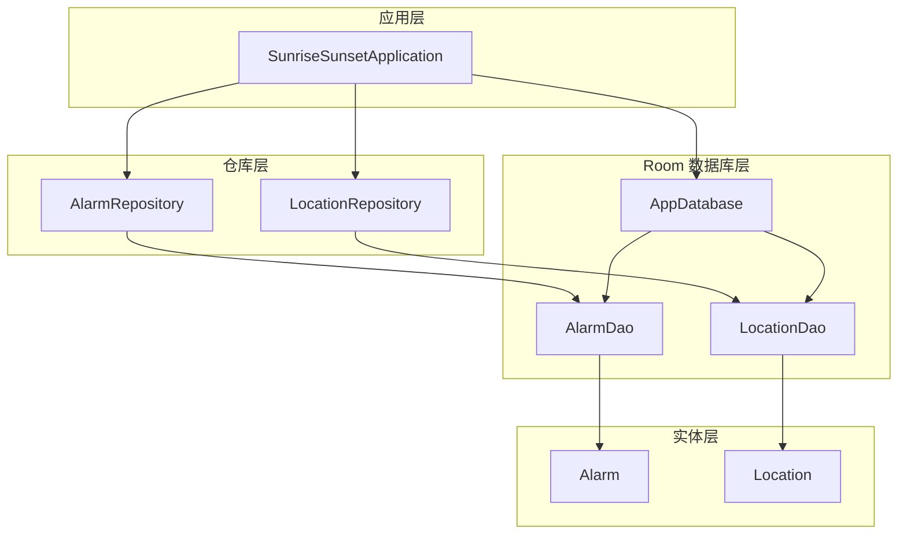
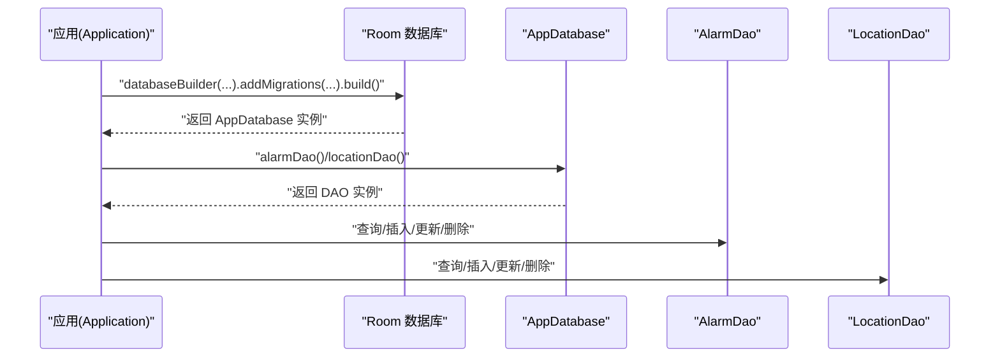
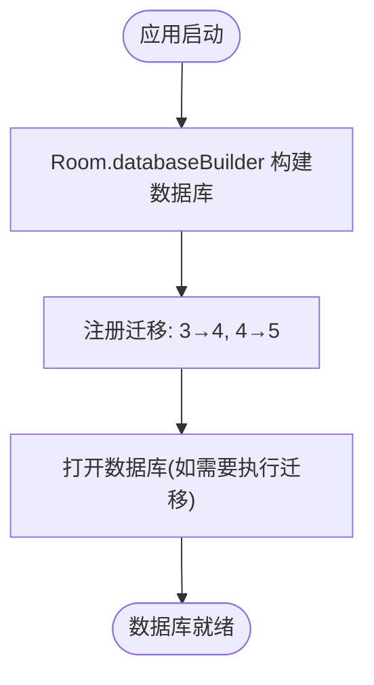
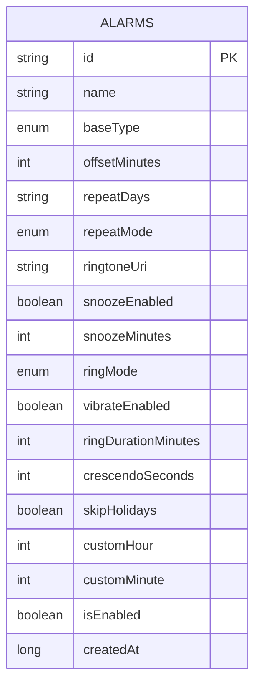
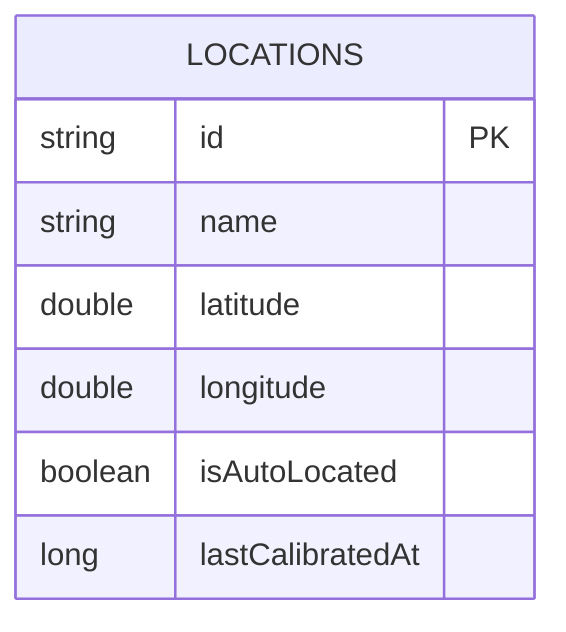
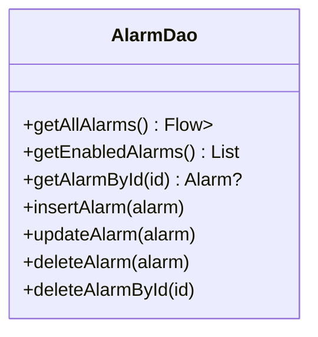
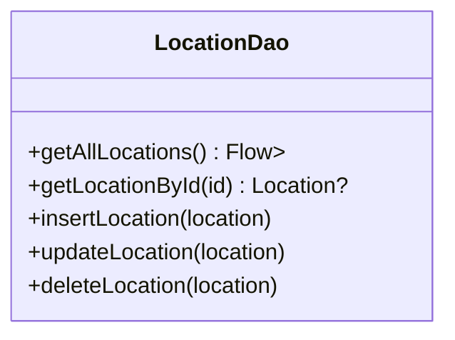
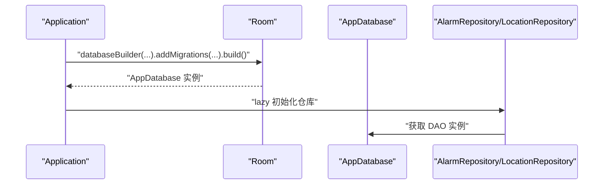
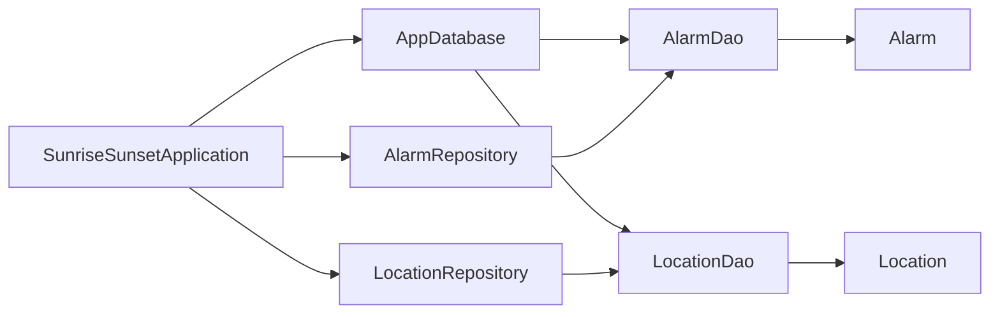

# 数据库架构

<cite>
**本文引用的文件**
- [AppDatabase.kt](file://app/src/main/java/com/snuabar/sunrisesunsetalarm/data/database/AppDatabase.kt)
- [AlarmDao.kt](file://app/src/main/java/com/snuabar/sunrisesunsetalarm/data/database/AlarmDao.kt)
- [LocationDao.kt](file://app/src/main/java/com/snuabar/sunrisesunsetalarm/data/database/LocationDao.kt)
- [Alarm.kt](file://app/src/main/java/com/snuabar/sunrisesunsetalarm/data/model/Alarm.kt)
- [Location.kt](file://app/src/main/java/com/snuabar/sunrisesunsetalarm/data/model/Location.kt)
- [AlarmRepository.kt](file://app/src/main/java/com/snuabar/sunrisesunsetalarm/data/repository/AlarmRepository.kt)
- [LocationRepository.kt](file://app/src/main/java/com/snuabar/sunrisesunsetalarm/data/repository/LocationRepository.kt)
- [SunriseSunsetApplication.kt](file://app/src/main/java/com/snuabar/sunrisesunsetalarm/SunriseSunsetApplication.kt)
- [HolidayUtil.kt](file://app/src/main/java/com/snuabar/sunrisesunsetalarm/util/HolidayUtil.kt)
</cite>

## 目录
1. [简介](#简介)
2. [项目结构](#项目结构)
3. [核心组件](#核心组件)
4. [架构总览](#架构总览)
5. [详细组件分析](#详细组件分析)
6. [依赖分析](#依赖分析)
7. [性能考虑](#性能考虑)
8. [故障排查指南](#故障排查指南)
9. [结论](#结论)
10. [附录](#附录)

## 简介
本文件系统性梳理了应用的数据库架构，重点覆盖 Room 数据库的整体设计、AppDatabase 主数据库类配置、数据库版本与迁移策略、alarms 与 locations 表结构与约束、AlarmDao/LocationDao 接口设计与查询模式、数据库初始化与并发控制、缓存与懒加载策略、以及调试与性能监控方法。目标是帮助开发者快速理解并高效维护数据库层。

## 项目结构
数据库相关代码采用“实体-DAO-数据库-仓库-应用”分层组织，职责清晰、耦合度低：
- 实体层：Alarm、Location 定义表结构与主键
- DAO 层：AlarmDao、LocationDao 提供 CRUD 与查询接口
- 数据库层：AppDatabase 统一管理实体、版本与迁移
- 仓库层：AlarmRepository、LocationRepository 对外暴露业务接口
- 应用层：SunriseSunsetApplication 负责数据库初始化与后台任务调度

图表来源
- [SunriseSunsetApplication.kt:36-53](file://app/src/main/java/com/snuabar/sunrisesunsetalarm/SunriseSunsetApplication.kt#L36-L53)
- [AppDatabase.kt:10-17](file://app/src/main/java/com/snuabar/sunrisesunsetalarm/data/database/AppDatabase.kt#L10-L17)
- [AlarmRepository.kt:7-21](file://app/src/main/java/com/snuabar/sunrisesunsetalarm/data/repository/AlarmRepository.kt#L7-L21)
- [LocationRepository.kt:7-17](file://app/src/main/java/com/snuabar/sunrisesunsetalarm/data/repository/LocationRepository.kt#L7-L17)
- [AlarmDao.kt:7-29](file://app/src/main/java/com/snuabar/sunrisesunsetalarm/data/database/AlarmDao.kt#L7-L29)
- [LocationDao.kt:7-23](file://app/src/main/java/com/snuabar/sunrisesunsetalarm/data/database/LocationDao.kt#L7-L23)
- [Alarm.kt:6-37](file://app/src/main/java/com/snuabar/sunrisesunsetalarm/data/model/Alarm.kt#L6-L37)
- [Location.kt:6-15](file://app/src/main/java/com/snuabar/sunrisesunsetalarm/data/model/Location.kt#L6-L15)

章节来源
- [SunriseSunsetApplication.kt:36-53](file://app/src/main/java/com/snuabar/sunrisesunsetalarm/SunriseSunsetApplication.kt#L36-L53)
- [AppDatabase.kt:10-17](file://app/src/main/java/com/snuabar/sunrisesunsetalarm/data/database/AppDatabase.kt#L10-L17)
- [AlarmRepository.kt:7-21](file://app/src/main/java/com/snuabar/sunrisesunsetalarm/data/repository/AlarmRepository.kt#L7-L21)
- [LocationRepository.kt:7-17](file://app/src/main/java/com/snuabar/sunrisesunsetalarm/data/repository/LocationRepository.kt#L7-L17)

## 核心组件
- AppDatabase：声明实体集合、数据库版本、导出模式；定义迁移策略（3→4、4→5）
- AlarmDao/LocationDao：定义查询、插入、更新、删除接口，支持 Flow 响应式流与协程挂起函数
- Alarm/Location：Room 实体，标注表名与主键，包含业务字段与默认值
- AlarmRepository/LocationRepository：对 DAO 的轻封装，统一对外提供业务接口
- SunriseSunsetApplication：应用级单例持有数据库实例，负责初始化与后台任务调度

章节来源
- [AppDatabase.kt:10-32](file://app/src/main/java/com/snuabar/sunrisesunsetalarm/data/database/AppDatabase.kt#L10-L32)
- [AlarmDao.kt:7-29](file://app/src/main/java/com/snuabar/sunrisesunsetalarm/data/database/AlarmDao.kt#L7-L29)
- [LocationDao.kt:7-23](file://app/src/main/java/com/snuabar/sunrisesunsetalarm/data/database/LocationDao.kt#L7-L23)
- [Alarm.kt:6-37](file://app/src/main/java/com/snuabar/sunrisesunsetalarm/data/model/Alarm.kt#L6-L37)
- [Location.kt:6-15](file://app/src/main/java/com/snuabar/sunrisesunsetalarm/data/model/Location.kt#L6-L15)
- [AlarmRepository.kt:7-21](file://app/src/main/java/com/snuabar/sunrisesunsetalarm/data/repository/AlarmRepository.kt#L7-L21)
- [LocationRepository.kt:7-17](file://app/src/main/java/com/snuabar/sunrisesunsetalarm/data/repository/LocationRepository.kt#L7-L17)
- [SunriseSunsetApplication.kt:25-53](file://app/src/main/java/com/snuabar/sunrisesunsetalarm/SunriseSunsetApplication.kt#L25-L53)

## 架构总览
数据库层采用 Room 提供的编译期校验与线程安全保证，结合协程与 Flow 实现响应式数据流。应用启动时构建数据库并注册迁移；仓库层向上提供统一接口；UI 层通过仓库消费数据流或发起协程操作。

图表来源
- [SunriseSunsetApplication.kt:39-45](file://app/src/main/java/com/snuabar/sunrisesunsetalarm/SunriseSunsetApplication.kt#L39-L45)
- [AppDatabase.kt:15-17](file://app/src/main/java/com/snuabar/sunrisesunsetalarm/data/database/AppDatabase.kt#L15-L17)
- [AlarmDao.kt:9-28](file://app/src/main/java/com/snuabar/sunrisesunsetalarm/data/database/AlarmDao.kt#L9-L28)
- [LocationDao.kt:9-22](file://app/src/main/java/com/snuabar/sunrisesunsetalarm/data/database/LocationDao.kt#L9-L22)

## 详细组件分析

### AppDatabase 设计与迁移策略
- 实体声明：包含 Alarm 与 Location 两个实体
- 版本管理：当前版本为 5
- 迁移策略：
  - 3→4：为 alarms 表新增 customHour 与 customMinute 两列，默认值均为 -1
  - 4→5：为 alarms 表新增 repeatMode 列，默认值为 CUSTOM
- 初始化：应用启动时通过 Room.databaseBuilder 构建数据库并注册上述迁移

图表来源
- [SunriseSunsetApplication.kt:39-45](file://app/src/main/java/com/snuabar/sunrisesunsetalarm/SunriseSunsetApplication.kt#L39-L45)
- [AppDatabase.kt:19-32](file://app/src/main/java/com/snuabar/sunrisesunsetalarm/data/database/AppDatabase.kt#L19-L32)

章节来源
- [AppDatabase.kt:10-32](file://app/src/main/java/com/snuabar/sunrisesunsetalarm/data/database/AppDatabase.kt#L10-L32)
- [SunriseSunsetApplication.kt:39-45](file://app/src/main/java/com/snuabar/sunrisesunsetalarm/SunriseSunsetApplication.kt#L39-L45)

### alarms 表结构与约束
- 表名：alarms
- 主键：id（字符串）
- 关键字段与默认值：
  - repeatMode 默认 CUSTOM
  - customHour/customMinute 默认 -1
  - isEnabled 默认 true
  - createdAt 默认当前时间戳
  - 其他业务字段见实体定义
- 约束与完整性：
  - 主键约束：id 唯一且非空
  - 非空约束：repeatMode、customHour、customMinute 在迁移中以默认值保障非空
  - 业务一致性：重复模式枚举限制 repeatMode 取值范围

图表来源
- [Alarm.kt:6-37](file://app/src/main/java/com/snuabar/sunrisesunsetalarm/data/model/Alarm.kt#L6-L37)
- [AppDatabase.kt:19-32](file://app/src/main/java/com/snuabar/sunrisesunsetalarm/data/database/AppDatabase.kt#L19-L32)

章节来源
- [Alarm.kt:6-37](file://app/src/main/java/com/snuabar/sunrisesunsetalarm/data/model/Alarm.kt#L6-L37)
- [AppDatabase.kt:19-32](file://app/src/main/java/com/snuabar/sunrisesunsetalarm/data/database/AppDatabase.kt#L19-L32)

### locations 表结构与约束
- 表名：locations
- 主键：id（字符串）
- 字段：
  - name、latitude、longitude、isAutoLocated、lastCalibratedAt
- 约束与完整性：
  - 主键约束：id 唯一且非空
  - 其余字段为普通字段，无显式非空约束

图表来源
- [Location.kt:6-15](file://app/src/main/java/com/snuabar/sunrisesunsetalarm/data/model/Location.kt#L6-L15)

章节来源
- [Location.kt:6-15](file://app/src/main/java/com/snuabar/sunrisesunsetalarm/data/model/Location.kt#L6-L15)

### AlarmDao 接口设计
- 查询：
  - 全量列表（Flow）：按创建时间倒序
  - 启用中的闹钟：按启用状态过滤
  - 按 id 查询
- 写入：
  - 插入（冲突替换）
  - 更新
  - 删除（对象或 id）

图表来源
- [AlarmDao.kt:7-29](file://app/src/main/java/com/snuabar/sunrisesunsetalarm/data/database/AlarmDao.kt#L7-L29)

章节来源
- [AlarmDao.kt:7-29](file://app/src/main/java/com/snuabar/sunrisesunsetalarm/data/database/AlarmDao.kt#L7-L29)

### LocationDao 接口设计
- 查询：全量列表（Flow）、按 id 查询
- 写入：插入（冲突替换）、更新、删除（对象或 id）

图表来源
- [LocationDao.kt:7-23](file://app/src/main/java/com/snuabar/sunrisesunsetalarm/data/database/LocationDao.kt#L7-L23)

章节来源
- [LocationDao.kt:7-23](file://app/src/main/java/com/snuabar/sunrisesunsetalarm/data/database/LocationDao.kt#L7-L23)

### 数据库初始化与并发控制
- 初始化流程：
  - 应用 onCreate 中通过 Room.databaseBuilder 创建数据库实例
  - 注册迁移策略
  - 通过 lazy 懒加载仓库层，避免过早初始化
- 并发与线程：
  - DAO 方法多为 suspend 函数，配合协程在 IO 线程执行
  - Flow 返回类型用于响应式数据流，自动处理线程切换
- 连接池与内存：
  - Room 默认管理连接池与内存缓存
  - 建议避免在主线程执行数据库操作，仓库层已封装协程调用

图表来源
- [SunriseSunsetApplication.kt:36-53](file://app/src/main/java/com/snuabar/sunrisesunsetalarm/SunriseSunsetApplication.kt#L36-L53)
- [AlarmRepository.kt:28-34](file://app/src/main/java/com/snuabar/sunrisesunsetalarm/SunriseSunsetApplication.kt#L28-L34)
- [LocationRepository.kt:32-34](file://app/src/main/java/com/snuabar/sunrisesunsetalarm/SunriseSunsetApplication.kt#L32-L34)

章节来源
- [SunriseSunsetApplication.kt:36-53](file://app/src/main/java/com/snuabar/sunrisesunsetalarm/SunriseSunsetApplication.kt#L36-L53)
- [AlarmRepository.kt:28-34](file://app/src/main/java/com/snuabar/sunrisesunsetalarm/SunriseSunsetApplication.kt#L28-L34)
- [LocationRepository.kt:32-34](file://app/src/main/java/com/snuabar/sunrisesunsetalarm/SunriseSunsetApplication.kt#L32-L34)

### 缓存策略、懒加载与生命周期
- 懒加载：
  - 仓库通过 lazy 延迟初始化，降低应用启动成本
- 数据缓存：
  - 仓库层不直接缓存数据库结果，但可结合 UI 层使用 Flow 订阅实现 UI 级缓存
- 生命周期：
  - 数据库实例随 Application 生命周期存在
  - 后台任务（如定时重排闹钟）通过 WorkManager 管理

章节来源
- [SunriseSunsetApplication.kt:28-34](file://app/src/main/java/com/snuabar/sunrisesunsetalarm/SunriseSunsetApplication.kt#L28-L34)
- [AlarmRepository.kt:7-21](file://app/src/main/java/com/snuabar/sunrisesunsetalarm/data/repository/AlarmRepository.kt#L7-L21)
- [LocationRepository.kt:7-17](file://app/src/main/java/com/snuabar/sunrisesunsetalarm/data/repository/LocationRepository.kt#L7-L17)

## 依赖分析
- 组件耦合：
  - Application 依赖 AppDatabase，AppDatabase 依赖 DAO
  - Repository 依赖 DAO，DAO 依赖实体
- 外部依赖：
  - Room、WorkManager、协程运行时
- 循环依赖：
  - 当前结构无循环依赖，职责边界清晰

图表来源
- [SunriseSunsetApplication.kt:25-34](file://app/src/main/java/com/snuabar/sunrisesunsetalarm/SunriseSunsetApplication.kt#L25-L34)
- [AppDatabase.kt:15-17](file://app/src/main/java/com/snuabar/sunrisesunsetalarm/data/database/AppDatabase.kt#L15-L17)
- [AlarmRepository.kt:7-21](file://app/src/main/java/com/snuabar/sunrisesunsetalarm/data/repository/AlarmRepository.kt#L7-L21)
- [LocationRepository.kt:7-17](file://app/src/main/java/com/snuabar/sunrisesunsetalarm/data/repository/LocationRepository.kt#L7-L17)

章节来源
- [SunriseSunsetApplication.kt:25-34](file://app/src/main/java/com/snuabar/sunrisesunsetalarm/SunriseSunsetApplication.kt#L25-L34)
- [AppDatabase.kt:15-17](file://app/src/main/java/com/snuabar/sunrisesunsetalarm/data/database/AppDatabase.kt#L15-L17)
- [AlarmRepository.kt:7-21](file://app/src/main/java/com/snuabar/sunrisesunsetalarm/data/repository/AlarmRepository.kt#L7-L21)
- [LocationRepository.kt:7-17](file://app/src/main/java/com/snuabar/sunrisesunsetalarm/data/repository/LocationRepository.kt#L7-L17)

## 性能考虑
- 查询优化：
  - 使用 Flow 实现响应式查询，避免手动轮询
  - 对高频查询（如启用中的闹钟）建议在 DAO 层增加索引（可在后续版本添加）
- 写入优化：
  - 批量插入/更新建议使用事务（Room 支持事务注解）
  - 冲突策略采用 REPLACE，适合幂等写入场景
- 线程与内存：
  - 所有数据库操作在 IO 线程执行，避免阻塞主线程
  - Room 自动管理连接池与内存缓存，无需手动干预
- 后台任务：
  - 使用 WorkManager 定期任务进行周期性维护（如重排闹钟）

章节来源
- [AlarmDao.kt:9-28](file://app/src/main/java/com/snuabar/sunrisesunsetalarm/data/database/AlarmDao.kt#L9-L28)
- [LocationDao.kt:9-22](file://app/src/main/java/com/snuabar/sunrisesunsetalarm/data/database/LocationDao.kt#L9-L22)
- [SunriseSunsetApplication.kt:55-65](file://app/src/main/java/com/snuabar/sunrisesunsetalarm/SunriseSunsetApplication.kt#L55-L65)

## 故障排查指南
- 版本迁移失败：
  - 检查迁移脚本是否正确执行（新增列与默认值）
  - 确认 Room.databaseBuilder 已注册对应迁移
- 查询无结果：
  - 确认查询条件（如 isEnabled）与实体字段一致
  - 检查 Flow 是否被正确订阅
- 写入异常：
  - 确认主键唯一性
  - 检查冲突策略与业务幂等性
- 调试与监控：
  - 使用日志输出关键路径（如数据库构建、查询开始/结束）
  - 对耗时操作使用基准测试或性能分析工具定位瓶颈

章节来源
- [AppDatabase.kt:19-32](file://app/src/main/java/com/snuabar/sunrisesunsetalarm/data/database/AppDatabase.kt#L19-L32)
- [AlarmDao.kt:9-28](file://app/src/main/java/com/snuabar/sunrisesunsetalarm/data/database/AlarmDao.kt#L9-L28)
- [LocationDao.kt:9-22](file://app/src/main/java/com/snuabar/sunrisesunsetalarm/data/database/LocationDao.kt#L9-L22)

## 结论
该数据库架构以 Room 为核心，结构清晰、扩展性强。通过合理的迁移策略、DAO 接口设计与协程/Flow 并发模型，满足了应用对数据持久化与实时性的需求。建议后续根据查询热点引入索引与事务优化，并完善单元测试覆盖关键 DAO 逻辑。

## 附录

### 数据库查询与操作示例（路径指引）
- 查询所有闹钟（响应式）：[AlarmDao.getAllAlarms:9-10](file://app/src/main/java/com/snuabar/sunrisesunsetalarm/data/database/AlarmDao.kt#L9-L10)
- 查询启用中的闹钟：[AlarmDao.getEnabledAlarms:12-13](file://app/src/main/java/com/snuabar/sunrisesunsetalarm/data/database/AlarmDao.kt#L12-L13)
- 按 id 查询闹钟：[AlarmDao.getAlarmById:15-16](file://app/src/main/java/com/snuabar/sunrisesunsetalarm/data/database/AlarmDao.kt#L15-L16)
- 插入/更新/删除闹钟：[AlarmDao.insert/update/delete:18-28](file://app/src/main/java/com/snuabar/sunrisesunsetalarm/data/database/AlarmDao.kt#L18-L28)
- 查询所有地点（响应式）：[LocationDao.getAllLocations:9-10](file://app/src/main/java/com/snuabar/sunrisesunsetalarm/data/database/LocationDao.kt#L9-L10)
- 按 id 查询地点：[LocationDao.getLocationById:12-13](file://app/src/main/java/com/snuabar/sunrisesunsetalarm/data/database/LocationDao.kt#L12-L13)
- 插入/更新/删除地点：[LocationDao.insert/update/delete:15-22](file://app/src/main/java/com/snuabar/sunrisesunsetalarm/data/database/LocationDao.kt#L15-L22)

### 批量操作与事务建议
- 批量插入/更新：将多次 DAO 调用包裹在 Room 事务中，减少开销
- 事务注解：使用 Room 的事务注解简化事务边界管理

### 错误处理机制
- DAO 层：通过 suspend 函数抛出底层异常，上层捕获并处理
- 迁移失败：检查迁移脚本与版本号，必要时清理/重建数据库进行验证

### 数据缓存策略与懒加载
- 懒加载：仓库层使用 lazy 初始化，降低启动时数据库压力
- UI 缓存：结合 Flow 订阅实现 UI 级缓存，避免重复查询

### 调试工具与性能监控
- 日志：在关键路径输出日志（构建数据库、查询开始/结束）
- 性能分析：使用 Android Profiler 或自定义基准测试定位慢查询与高占用