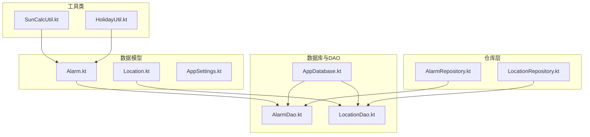
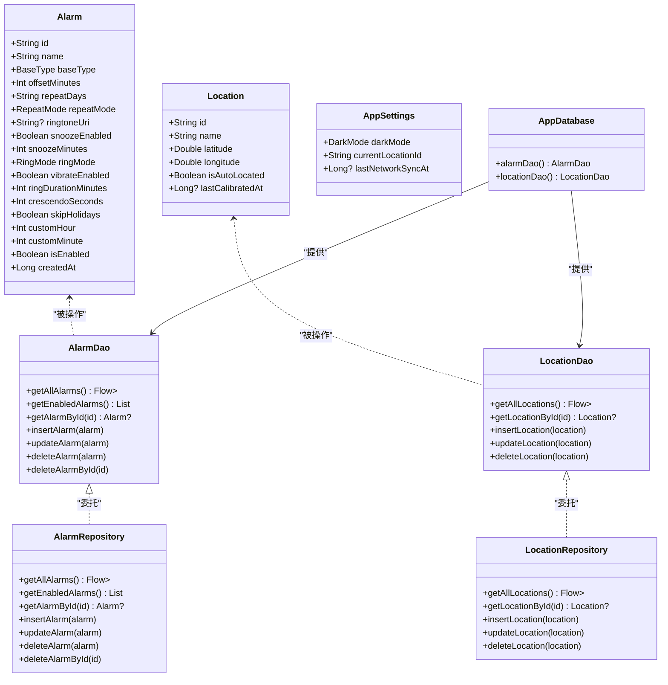
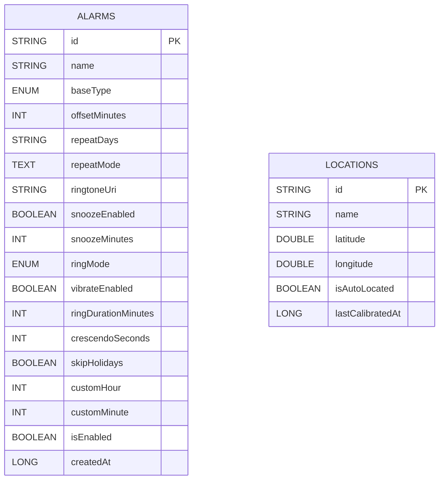
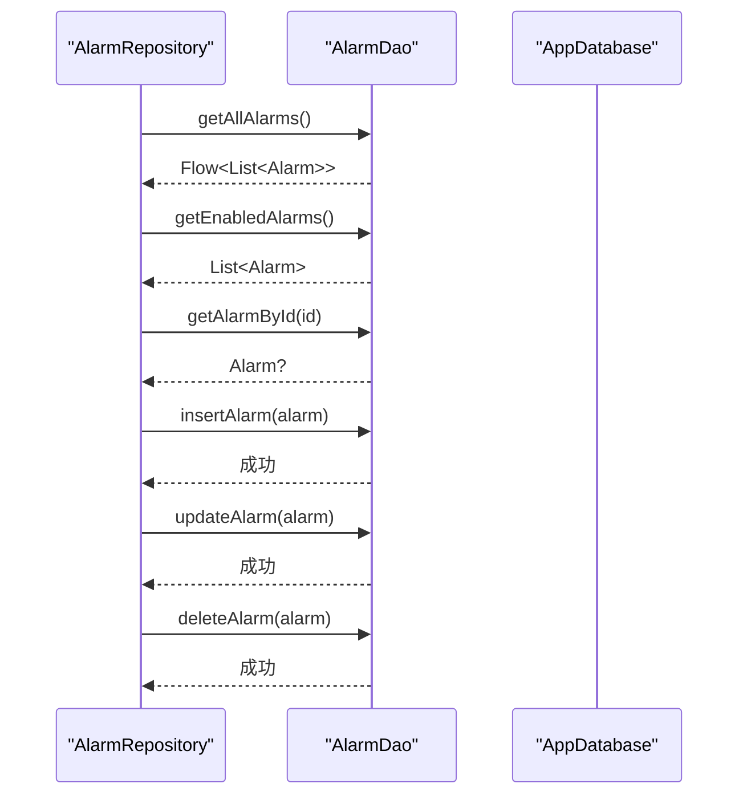
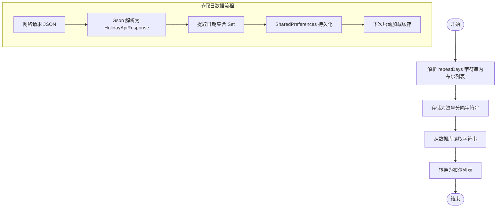
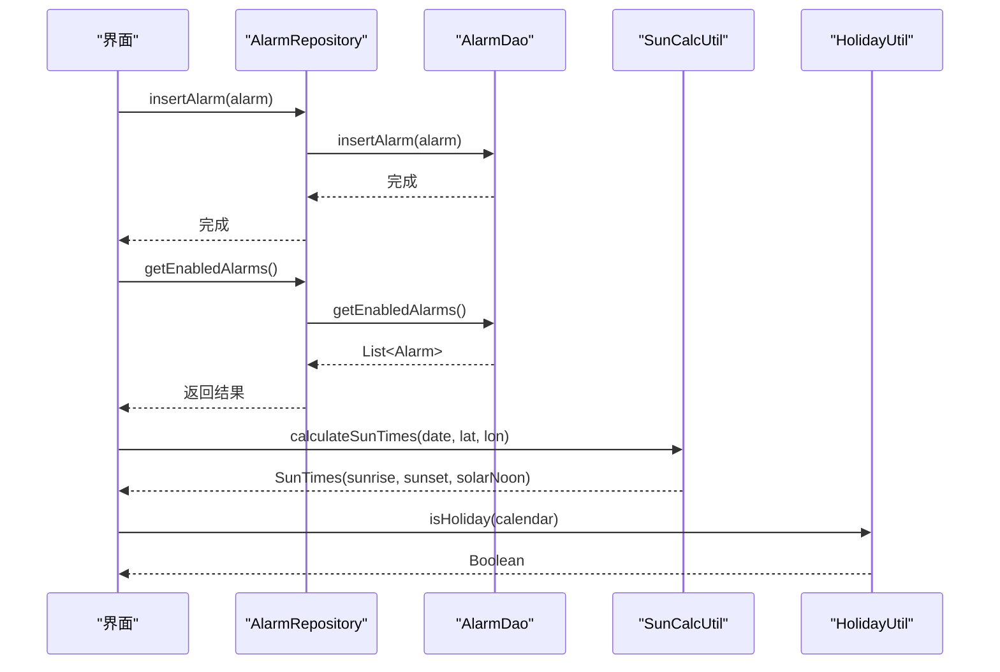
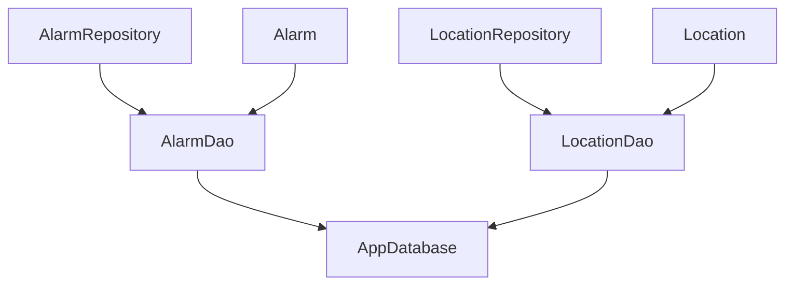

# 数据模型

<cite>
**本文引用的文件**
- [Alarm.kt](file://app/src/main/java/com/snuabar/sunrisesunsetalarm/data/model/Alarm.kt)
- [Location.kt](file://app/src/main/java/com/snuabar/sunrisesunsetalarm/data/model/Location.kt)
- [AppSettings.kt](file://app/src/main/java/com/snuabar/sunrisesunsetalarm/data/model/AppSettings.kt)
- [AlarmDao.kt](file://app/src/main/java/com/snuabar/sunrisesunsetalarm/data/database/AlarmDao.kt)
- [LocationDao.kt](file://app/src/main/java/com/snuabar/sunrisesunsetalarm/data/database/LocationDao.kt)
- [AppDatabase.kt](file://app/src/main/java/com/snuabar/sunrisesunsetalarm/data/database/AppDatabase.kt)
- [AlarmRepository.kt](file://app/src/main/java/com/snuabar/sunrisesunsetalarm/data/repository/AlarmRepository.kt)
- [LocationRepository.kt](file://app/src/main/java/com/snuabar/sunrisesunsetalarm/data/repository/LocationRepository.kt)
- [SunCalcUtil.kt](file://app/src/main/java/com/snuabar/sunrisesunsetalarm/util/SunCalcUtil.kt)
- [HolidayUtil.kt](file://app/src/main/java/com/snuabar/sunrisesunsetalarm/util/HolidayUtil.kt)
</cite>

## 目录
1. [简介](#简介)
2. [项目结构](#项目结构)
3. [核心组件](#核心组件)
4. [架构总览](#架构总览)
5. [详细组件分析](#详细组件分析)
6. [依赖分析](#依赖分析)
7. [性能考虑](#性能考虑)
8. [故障排查指南](#故障排查指南)
9. [结论](#结论)
10. [附录](#附录)

## 简介
本文件系统性梳理“日出日落智能闹钟”应用的数据模型与持久化层设计，覆盖以下主题：
- 实体模型：Alarm（闹钟）、Location（位置）、AppSettings（应用设置）的字段、类型与业务规则
- Room 数据库表结构：主键、索引、约束与迁移策略
- 数据访问对象（DAO）接口与查询方法
- 数据序列化与反序列化（含节假日数据的 JSON 序列化）
- 实体关系图与使用示例，帮助开发者掌握最佳实践

## 项目结构
数据模型与持久化相关的核心文件组织如下：
- 数据模型：位于 data/model 下，包含 Alarm、Location、AppSettings
- 数据库与DAO：位于 data/database 下，包含 AppDatabase、AlarmDao、LocationDao
- 仓库层：位于 data/repository 下，封装 DAO 的使用
- 工具类：位于 util 下，包含太阳时间计算与节假日数据处理

图表来源
- [Alarm.kt:1-50](file://app/src/main/java/com/snuabar/sunrisesunsetalarm/data/model/Alarm.kt#L1-L50)
- [Location.kt:1-16](file://app/src/main/java/com/snuabar/sunrisesunsetalarm/data/model/Location.kt#L1-L16)
- [AppSettings.kt:1-12](file://app/src/main/java/com/snuabar/sunrisesunsetalarm/data/model/AppSettings.kt#L1-L12)
- [AppDatabase.kt:1-34](file://app/src/main/java/com/snuabar/sunrisesunsetalarm/data/database/AppDatabase.kt#L1-L34)
- [AlarmDao.kt:1-30](file://app/src/main/java/com/snuabar/sunrisesunsetalarm/data/database/AlarmDao.kt#L1-L30)
- [LocationDao.kt:1-24](file://app/src/main/java/com/snuabar/sunrisesunsetalarm/data/database/LocationDao.kt#L1-L24)
- [AlarmRepository.kt:1-22](file://app/src/main/java/com/snuabar/sunrisesunsetalarm/data/repository/AlarmRepository.kt#L1-L22)
- [LocationRepository.kt:1-18](file://app/src/main/java/com/snuabar/sunrisesunsetalarm/data/repository/LocationRepository.kt#L1-L18)
- [SunCalcUtil.kt:1-138](file://app/src/main/java/com/snuabar/sunrisesunsetalarm/util/SunCalcUtil.kt#L1-L138)
- [HolidayUtil.kt:1-223](file://app/src/main/java/com/snuabar/sunrisesunsetalarm/util/HolidayUtil.kt#L1-L223)

章节来源
- [Alarm.kt:1-50](file://app/src/main/java/com/snuabar/sunrisesunsetalarm/data/model/Alarm.kt#L1-L50)
- [Location.kt:1-16](file://app/src/main/java/com/snuabar/sunrisesunsetalarm/data/model/Location.kt#L1-L16)
- [AppSettings.kt:1-12](file://app/src/main/java/com/snuabar/sunrisesunsetalarm/data/model/AppSettings.kt#L1-L12)
- [AppDatabase.kt:1-34](file://app/src/main/java/com/snuabar/sunrisesunsetalarm/data/database/AppDatabase.kt#L1-L34)
- [AlarmDao.kt:1-30](file://app/src/main/java/com/snuabar/sunrisesunsetalarm/data/database/AlarmDao.kt#L1-L30)
- [LocationDao.kt:1-24](file://app/src/main/java/com/snuabar/sunrisesunsetalarm/data/database/LocationDao.kt#L1-L24)
- [AlarmRepository.kt:1-22](file://app/src/main/java/com/snuabar/sunrisesunsetalarm/data/repository/AlarmRepository.kt#L1-L22)
- [LocationRepository.kt:1-18](file://app/src/main/java/com/snuabar/sunrisesunsetalarm/data/repository/LocationRepository.kt#L1-L18)
- [SunCalcUtil.kt:1-138](file://app/src/main/java/com/snuabar/sunrisesunsetalarm/util/SunCalcUtil.kt#L1-L138)
- [HolidayUtil.kt:1-223](file://app/src/main/java/com/snuabar/sunrisesunsetalarm/util/HolidayUtil.kt#L1-L223)

## 核心组件
本节对三个核心实体模型进行字段定义、数据类型与业务规则的说明。

- Alarm（闹钟）
  - 字段与类型
    - id: String（主键）
    - name: String
    - baseType: 枚举（BaseType：SUNRISE、SUNSET、CUSTOM）
    - offsetMinutes: Int（相对于日出/日落的时间偏移，分钟）
    - repeatDays: String（逗号分隔的布尔值字符串，表示每周重复日）
    - repeatMode: 枚举（RepeatMode：ONCE、DAILY、WEEKDAYS、WEEKENDS、CUSTOM，默认 CUSTOM）
    - ringtoneUri: String?（铃声 URI）
    - snoozeEnabled: Boolean（是否启用贪睡）
    - snoozeMinutes: Int（贪睡时长，默认 5 分钟）
    - ringMode: 枚举（RingMode：FULL_SCREEN、NOTIFICATION、LIVE_ACTIVITY，默认 FULL_SCREEN）
    - vibrateEnabled: Boolean（是否震动，默认 true）
    - ringDurationMinutes: Int（响铃时长，默认 5 分钟）
    - crescendoSeconds: Int（渐强时长，默认 0 秒）
    - skipHolidays: Boolean（节假日跳过，默认 false）
    - customHour/customMinute: Int（自定义时间的小时/分钟，默认 -1 表示未设置）
    - isEnabled: Boolean（是否启用，默认 true）
    - createdAt: Long（创建时间戳，默认当前毫秒）
  - 业务规则
    - repeatDays 与 getRepeatDaysList/fromRepeatDaysList 提供列表与字符串互转
    - 自定义闹钟（CUSTOM）不显示 offset 文案
    - repeatMode 为 CUSTOM 时，根据 repeatDays 计算具体重复日
    - skipHolidays 可结合节假日工具类判断是否跳过当天

- Location（位置）
  - 字段与类型
    - id: String（主键）
    - name: String
    - latitude: Double
    - longitude: Double
    - isAutoLocated: Boolean（是否自动定位，默认 false）
    - lastCalibratedAt: Long?（最后校准时间）
  - 业务规则
    - 主键唯一标识位置
    - 用于计算日出/日落时间（结合 SunCalcUtil）

- AppSettings（应用设置）
  - 字段与类型
    - darkMode: 枚举（DarkMode：SYSTEM、LIGHT、DARK，默认 SYSTEM）
    - currentLocationId: String（当前选中位置 ID，默认空串）
    - lastNetworkSyncAt: Long?（最后网络同步时间）
  - 业务规则
    - 控制主题与当前定位上下文

章节来源
- [Alarm.kt:1-50](file://app/src/main/java/com/snuabar/sunrisesunsetalarm/data/model/Alarm.kt#L1-L50)
- [Location.kt:1-16](file://app/src/main/java/com/snuabar/sunrisesunsetalarm/data/model/Location.kt#L1-L16)
- [AppSettings.kt:1-12](file://app/src/main/java/com/snuabar/sunrisesunsetalarm/data/model/AppSettings.kt#L1-L12)

## 架构总览
下图展示数据模型、DAO、仓库层与数据库的整体交互关系：

图表来源
- [Alarm.kt:1-50](file://app/src/main/java/com/snuabar/sunrisesunsetalarm/data/model/Alarm.kt#L1-L50)
- [Location.kt:1-16](file://app/src/main/java/com/snuabar/sunrisesunsetalarm/data/model/Location.kt#L1-L16)
- [AppSettings.kt:1-12](file://app/src/main/java/com/snuabar/sunrisesunsetalarm/data/model/AppSettings.kt#L1-L12)
- [AlarmDao.kt:1-30](file://app/src/main/java/com/snuabar/sunrisesunsetalarm/data/database/AlarmDao.kt#L1-L30)
- [LocationDao.kt:1-24](file://app/src/main/java/com/snuabar/sunrisesunsetalarm/data/database/LocationDao.kt#L1-L24)
- [AlarmRepository.kt:1-22](file://app/src/main/java/com/snuabar/sunrisesunsetalarm/data/repository/AlarmRepository.kt#L1-L22)
- [LocationRepository.kt:1-18](file://app/src/main/java/com/snuabar/sunrisesunsetalarm/data/repository/LocationRepository.kt#L1-L18)
- [AppDatabase.kt:1-34](file://app/src/main/java/com/snuabar/sunrisesunsetalarm/data/database/AppDatabase.kt#L1-L34)

## 详细组件分析

### Room 数据库与表结构
- 数据库版本：5
- 实体映射：
  - alarms 表：对应 Alarm 实体
  - locations 表：对应 Location 实体
- 主键与约束：
  - alarms.id：主键（String）
  - locations.id：主键（String）
  - 迁移新增字段默认值保证向后兼容
- 索引与外键：
  - 当前未显式声明索引或外键；如需按位置或启用状态查询可考虑添加索引
- 迁移策略：
  - 3 → 4：为 alarms 表新增 customHour、customMinute（整型，默认 -1）
  - 4 → 5：为 alarms 表新增 repeatMode（文本，默认 'CUSTOM'）

图表来源
- [AppDatabase.kt:10-34](file://app/src/main/java/com/snuabar/sunrisesunsetalarm/data/database/AppDatabase.kt#L10-L34)
- [Alarm.kt:6-27](file://app/src/main/java/com/snuabar/sunrisesunsetalarm/data/model/Alarm.kt#L6-L27)
- [Location.kt:6-15](file://app/src/main/java/com/snuabar/sunrisesunsetalarm/data/model/Location.kt#L6-L15)

章节来源
- [AppDatabase.kt:10-34](file://app/src/main/java/com/snuabar/sunrisesunsetalarm/data/database/AppDatabase.kt#L10-L34)
- [Alarm.kt:6-27](file://app/src/main/java/com/snuabar/sunrisesunsetalarm/data/model/Alarm.kt#L6-L27)
- [Location.kt:6-15](file://app/src/main/java/com/snuabar/sunrisesunsetalarm/data/model/Location.kt#L6-L15)

### 数据访问对象（DAO）接口设计
- AlarmDao
  - 查询全部：返回 Flow<List<Alarm>>，按创建时间倒序
  - 查询启用的闹钟：返回 List<Alarm>
  - 按 id 查询：返回 Alarm?
  - 插入/更新/删除：支持按 id 删除
  - 冲突策略：插入使用 REPLACE
- LocationDao
  - 查询全部：返回 Flow<List<Location>>
  - 按 id 查询：返回 Location?
  - 插入/更新/删除：支持按 id 删除
  - 冲突策略：插入使用 REPLACE

图表来源
- [AlarmRepository.kt:7-21](file://app/src/main/java/com/snuabar/sunrisesunsetalarm/data/repository/AlarmRepository.kt#L7-L21)
- [AlarmDao.kt:9-28](file://app/src/main/java/com/snuabar/sunrisesunsetalarm/data/database/AlarmDao.kt#L9-L28)
- [AppDatabase.kt:15-17](file://app/src/main/java/com/snuabar/sunrisesunsetalarm/data/database/AppDatabase.kt#L15-L17)

章节来源
- [AlarmDao.kt:1-30](file://app/src/main/java/com/snuabar/sunrisesunsetalarm/data/database/AlarmDao.kt#L1-L30)
- [LocationDao.kt:1-24](file://app/src/main/java/com/snuabar/sunrisesunsetalarm/data/database/LocationDao.kt#L1-L24)
- [AlarmRepository.kt:1-22](file://app/src/main/java/com/snuabar/sunrisesunsetalarm/data/repository/AlarmRepository.kt#L1-L22)
- [LocationRepository.kt:1-18](file://app/src/main/java/com/snuabar/sunrisesunsetalarm/data/repository/LocationRepository.kt#L1-L18)

### 数据序列化与反序列化
- Alarm.repeatDays 的序列化/反序列化
  - 存储为逗号分隔的布尔字符串
  - 提供 getRepeatDaysList（字符串转布尔列表）与 fromRepeatDaysList（布尔列表转字符串）
- 节假日数据的序列化/反序列化
  - 使用 Gson 将 Set<String>（日期字符串集合）序列化为 JSON 并保存到 SharedPreferences
  - 响应解析：HolidayUtil.HolidayApiResponse 与 HolidayDay 结构
  - 缓存策略：内存缓存 + 本地 SharedPreferences 缓存 + 硬编码兜底

图表来源
- [Alarm.kt:28-36](file://app/src/main/java/com/snuabar/sunrisesunsetalarm/data/model/Alarm.kt#L28-L36)
- [HolidayUtil.kt:131-167](file://app/src/main/java/com/snuabar/sunrisesunsetalarm/util/HolidayUtil.kt#L131-L167)

章节来源
- [Alarm.kt:28-36](file://app/src/main/java/com/snuabar/sunrisesunsetalarm/data/model/Alarm.kt#L28-L36)
- [HolidayUtil.kt:41-94](file://app/src/main/java/com/snuabar/sunrisesunsetalarm/util/HolidayUtil.kt#L41-L94)
- [HolidayUtil.kt:131-167](file://app/src/main/java/com/snuabar/sunrisesunsetalarm/util/HolidayUtil.kt#L131-L167)

### 数据模型之间的关系与使用示例
- 关系说明
  - Alarm 依赖 Location（通过 AppSettings.currentLocationId 或业务逻辑关联），用于计算日出/日落
  - AppSettings.currentLocationId 作为应用级上下文，影响 Alarm 的实际触发时间
- 使用示例（路径指引）
  - 创建/更新 Alarm：调用 AlarmRepository.insertAlarm 或 updateAlarm
  - 查询启用的 Alarm：AlarmRepository.getEnabledAlarms
  - 计算日出/日落：SunCalcUtil.calculateSunTimes
  - 判断节假日：HolidayUtil.isHoliday
  - 设置主题与当前定位：AppSettings.darkMode、AppSettings.currentLocationId

图表来源
- [AlarmRepository.kt:14-16](file://app/src/main/java/com/snuabar/sunrisesunsetalarm/data/repository/AlarmRepository.kt#L14-L16)
- [AlarmDao.kt:12-13](file://app/src/main/java/com/snuabar/sunrisesunsetalarm/data/database/AlarmDao.kt#L12-L13)
- [SunCalcUtil.kt:19-45](file://app/src/main/java/com/snuabar/sunrisesunsetalarm/util/SunCalcUtil.kt#L19-L45)
- [HolidayUtil.kt:80-94](file://app/src/main/java/com/snuabar/sunrisesunsetalarm/util/HolidayUtil.kt#L80-L94)

章节来源
- [AlarmRepository.kt:1-22](file://app/src/main/java/com/snuabar/sunrisesunsetalarm/data/repository/AlarmRepository.kt#L1-L22)
- [AlarmDao.kt:1-30](file://app/src/main/java/com/snuabar/sunrisesunsetalarm/data/database/AlarmDao.kt#L1-L30)
- [SunCalcUtil.kt:1-138](file://app/src/main/java/com/snuabar/sunrisesunsetalarm/util/SunCalcUtil.kt#L1-L138)
- [HolidayUtil.kt:1-223](file://app/src/main/java/com/snuabar/sunrisesunsetalarm/util/HolidayUtil.kt#L1-L223)

## 依赖分析
- 组件耦合
  - AlarmRepository 与 LocationRepository 分别委托 AlarmDao 与 LocationDao，职责清晰
  - AppDatabase 提供 DAO 单例，避免全局状态分散
- 外部依赖
  - Room：提供 ORM 能力与迁移支持
  - Gson：用于节假日数据的 JSON 序列化
- 潜在风险
  - Alarm.repeatDays 采用字符串存储，建议在 UI 层统一转换，避免重复解析
  - 未见索引，按状态或位置查询可能需要优化

图表来源
- [AlarmRepository.kt:7-21](file://app/src/main/java/com/snuabar/sunrisesunsetalarm/data/repository/AlarmRepository.kt#L7-L21)
- [LocationRepository.kt:7-17](file://app/src/main/java/com/snuabar/sunrisesunsetalarm/data/repository/LocationRepository.kt#L7-L17)
- [AlarmDao.kt:7-28](file://app/src/main/java/com/snuabar/sunrisesunsetalarm/data/database/AlarmDao.kt#L7-L28)
- [LocationDao.kt:7-23](file://app/src/main/java/com/snuabar/sunrisesunsetalarm/data/database/LocationDao.kt#L7-L23)
- [AppDatabase.kt:15-17](file://app/src/main/java/com/snuabar/sunrisesunsetalarm/data/database/AppDatabase.kt#L15-L17)

章节来源
- [AlarmRepository.kt:1-22](file://app/src/main/java/com/snuabar/sunrisesunsetalarm/data/repository/AlarmRepository.kt#L1-L22)
- [LocationRepository.kt:1-18](file://app/src/main/java/com/snuabar/sunrisesunsetalarm/data/repository/LocationRepository.kt#L1-L18)
- [AlarmDao.kt:1-30](file://app/src/main/java/com/snuabar/sunrisesunsetalarm/data/database/AlarmDao.kt#L1-L30)
- [LocationDao.kt:1-24](file://app/src/main/java/com/snuabar/sunrisesunsetalarm/data/database/LocationDao.kt#L1-L24)
- [AppDatabase.kt:1-34](file://app/src/main/java/com/snuabar/sunrisesunsetalarm/data/database/AppDatabase.kt#L1-L34)

## 性能考虑
- 查询优化
  - AlarmDao.getAllAlarms 返回 Flow，适合实时 UI 更新；如需频繁筛选，可在 DAO 新增带条件的查询并建立索引
  - LocationDao.getAllLocations 返回 Flow，建议在 UI 层使用 rememberUpdatedState 避免不必要的重组
- 写入策略
  - AlarmDao.insert 使用 OnConflictStrategy.REPLACE，注意幂等写入场景下的数据一致性
- 序列化开销
  - repeatDays 字符串与布尔列表互转简单高效；节假日数据缓存减少网络与解析成本

## 故障排查指南
- 数据库迁移失败
  - 检查 AppDatabase 的迁移脚本是否正确执行，确认字段名与默认值一致
- 闹钟重复日显示异常
  - 确认 repeatDays 字符串格式正确，使用 getRepeatDaysList 与 fromRepeatDaysList 进行转换
- 节假日判断不准确
  - 确保 HolidayUtil.preload 已在应用启动时调用；检查本地缓存与网络请求状态
- 日出/日落时间偏差
  - 核对 Location 的经纬度与 SunCalcUtil 的输入参数；确认时区与本地时间转换逻辑

章节来源
- [AppDatabase.kt:19-31](file://app/src/main/java/com/snuabar/sunrisesunsetalarm/data/database/AppDatabase.kt#L19-L31)
- [Alarm.kt:28-36](file://app/src/main/java/com/snuabar/sunrisesunsetalarm/data/model/Alarm.kt#L28-L36)
- [HolidayUtil.kt:41-75](file://app/src/main/java/com/snuabar/sunrisesunsetalarm/util/HolidayUtil.kt#L41-L75)
- [SunCalcUtil.kt:115-127](file://app/src/main/java/com/snuabar/sunrisesunsetalarm/util/SunCalcUtil.kt#L115-L127)

## 结论
本数据模型以 Room 为核心，通过简洁的实体与 DAO 接口实现高效的本地数据持久化。Alarm 与 Location 的组合满足日出/日落计算需求，AppSettings 提供应用级上下文。配合 AlarmRepository 与 LocationRepository 的封装，既保证了数据访问的一致性，也为后续扩展（如索引、复杂查询、离线优先策略）提供了良好基础。

## 附录
- 常用查询与操作路径
  - 查询全部闹钟：AlarmRepository.getAllAlarms → AlarmDao.getAllAlarms
  - 查询启用闹钟：AlarmRepository.getEnabledAlarms → AlarmDao.getEnabledAlarms
  - 按 id 查询：AlarmRepository.getAlarmById → AlarmDao.getAlarmById
  - 插入/更新/删除：AlarmRepository.insert/update/delete → AlarmDao.insert/update/delete
  - 位置查询同理：LocationRepository + LocationDao
- 最佳实践
  - 在 UI 层统一处理 repeatDays 的字符串与布尔列表转换
  - 对高频查询（如按 isEnabled、按位置）考虑添加索引与专用查询方法
  - 使用 Flow 进行响应式 UI 更新，避免阻塞主线程