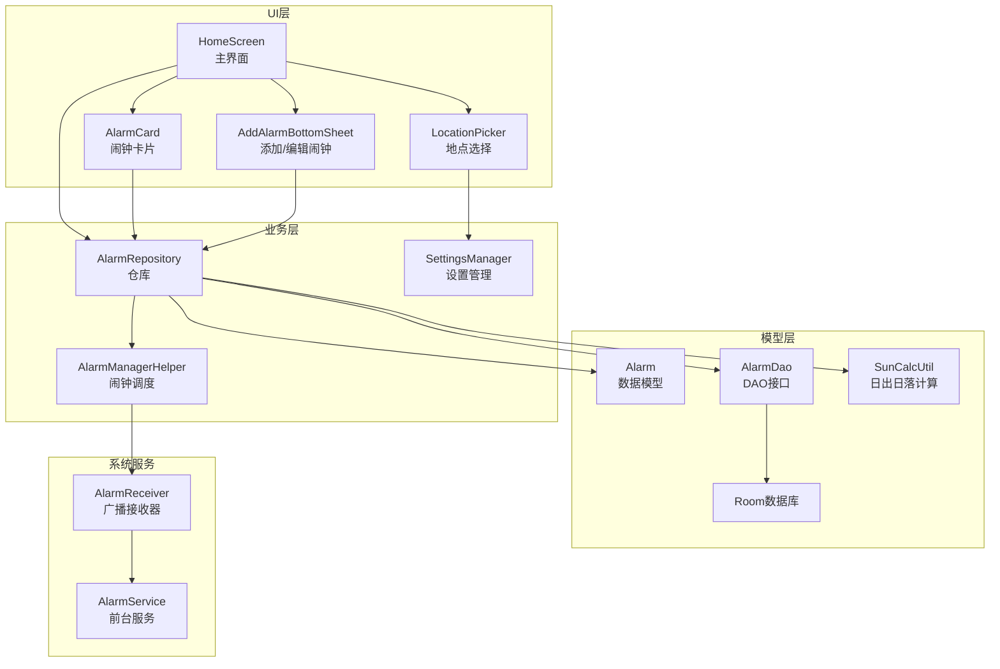
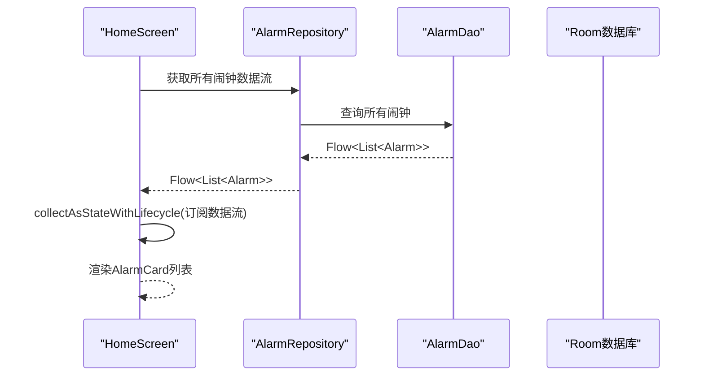
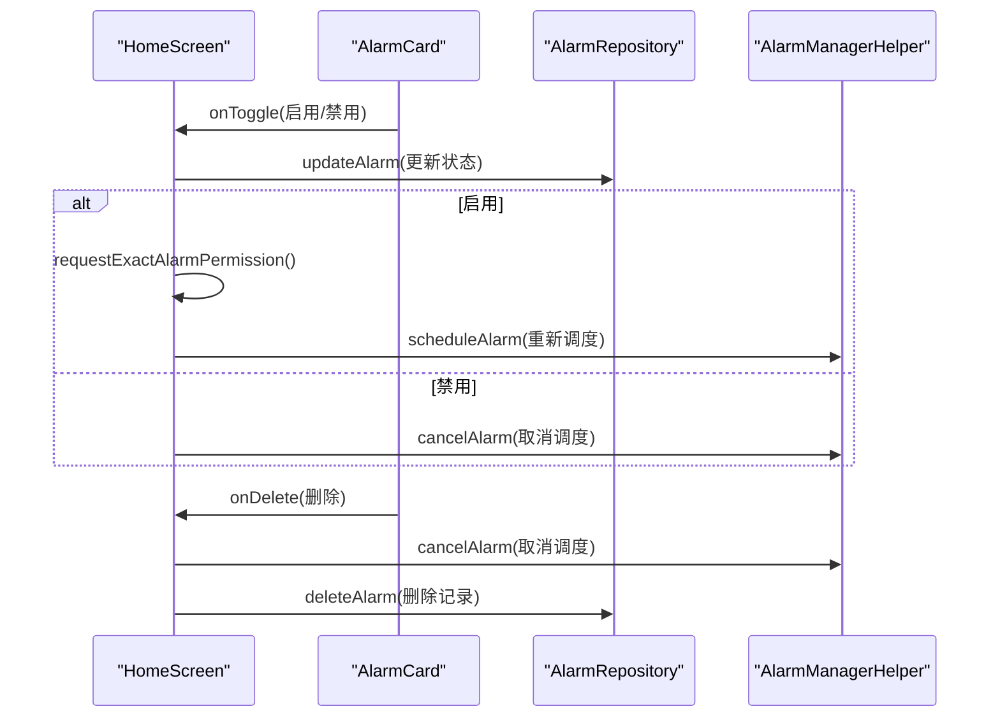
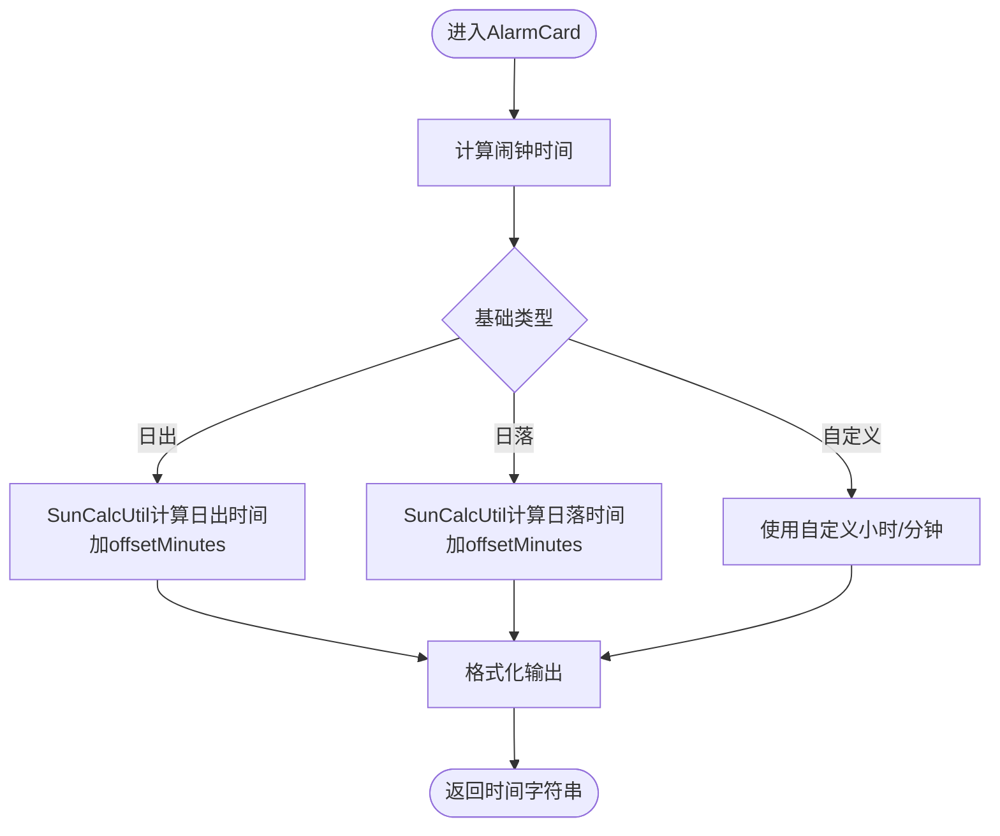
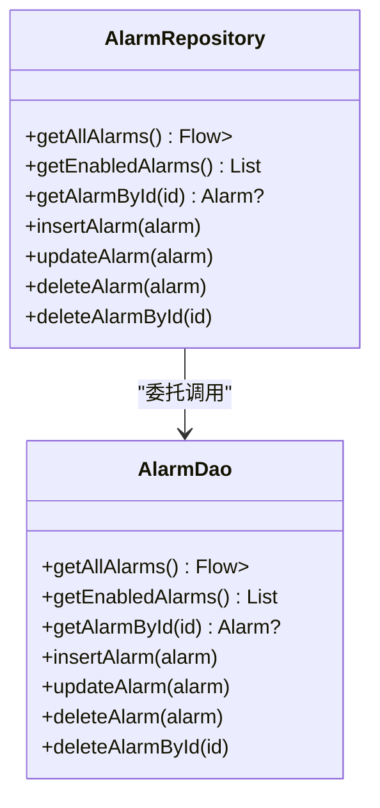
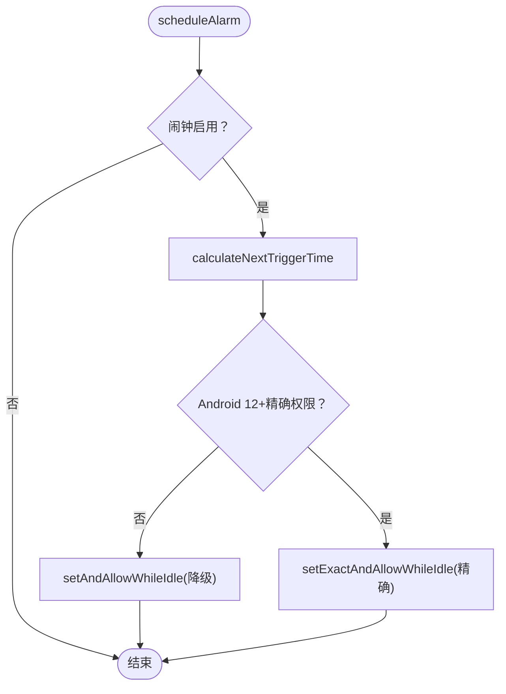
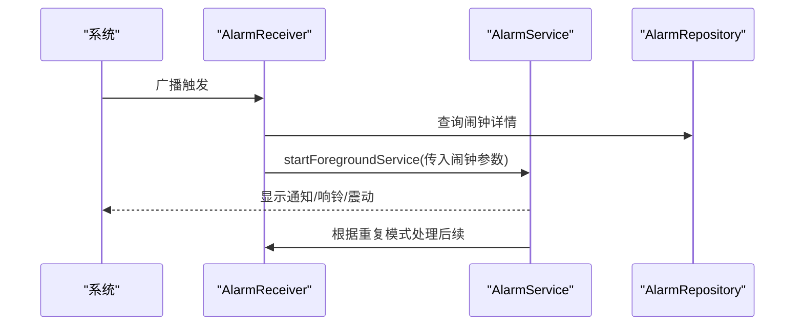
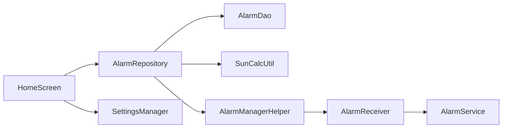

# MVVM架构模式

<cite>
**本文档引用的文件**
- [HomeScreen.kt](file://app/src/main/java/com/snuabar/sunrisesunsetalarm/ui/screens/HomeScreen.kt)
- [AlarmCard.kt](file://app/src/main/java/com/snuabar/sunrisesunsetalarm/ui/components/AlarmCard.kt)
- [AlarmRepository.kt](file://app/src/main/java/com/snuabar/sunrisesunsetalarm/data/repository/AlarmRepository.kt)
- [Alarm.kt](file://app/src/main/java/com/snuabar/sunrisesunsetalarm/data/model/Alarm.kt)
- [AlarmDao.kt](file://app/src/main/java/com/snuabar/sunrisesunsetalarm/data/database/AlarmDao.kt)
- [AlarmManagerHelper.kt](file://app/src/main/java/com/snuabar/sunrisesunsetalarm/service/AlarmManagerHelper.kt)
- [AlarmService.kt](file://app/src/main/java/com/snuabar/sunrisesunsetalarm/service/AlarmService.kt)
- [AlarmReceiver.kt](file://app/src/main/java/com/snuabar/sunrisesunsetalarm/receiver/AlarmReceiver.kt)
- [SunCalcUtil.kt](file://app/src/main/java/com/snuabar/sunrisesunsetalarm/util/SunCalcUtil.kt)
- [SettingsManager.kt](file://app/src/main/java/com/snuabar/sunrisesunsetalarm/util/SettingsManager.kt)
- [Theme.kt](file://app/src/main/java/com/snuabar/sunrisesunsetalarm/ui/theme/Theme.kt)
- [AddAlarmBottomSheet.kt](file://app/src/main/java/com/snuabar/sunrisesunsetalarm/ui/components/AddAlarmBottomSheet.kt)
- [LocationPicker.kt](file://app/src/main/java/com/snuabar/sunrisesunsetalarm/ui/components/LocationPicker.kt)
</cite>

## 目录
1. [简介](#简介)
2. [项目结构](#项目结构)
3. [核心组件](#核心组件)
4. [架构总览](#架构总览)
5. [详细组件分析](#详细组件分析)
6. [依赖关系分析](#依赖关系分析)
7. [性能考虑](#性能考虑)
8. [故障排除指南](#故障排除指南)
9. [结论](#结论)

## 简介
本文件深入解析日出日落闹钟应用的MVVM架构实现，重点阐述View层（Jetpack Compose UI组件）、ViewModel层（通过状态收集与业务逻辑分离）、Model层（数据模型与仓库）在实际代码中的协作方式。文档涵盖：
- View层如何通过collectAsStateWithLifecycle收集数据流
- ViewModel如何处理业务逻辑和数据转换
- Model层如何管理数据状态
- LiveData/Flow的使用模式、状态提升策略和组件间通信机制
- 具体代码示例路径，帮助读者快速定位实现细节

## 项目结构
该应用采用典型的Android MVVM分层架构，结合Jetpack Compose进行UI开发，并通过Room数据库持久化数据。核心目录组织如下：
- ui：包含屏幕与组件，负责UI渲染与用户交互
- data：包含数据库、模型与仓库，负责数据访问与业务数据管理
- service：包含服务与广播接收器，负责后台闹钟调度与触发
- util：工具类，如位置计算、设置管理等
- receiver：系统广播接收器，处理闹钟触发事件
- service：前台服务，负责闹钟响铃与通知

图表来源
- [HomeScreen.kt:46-296](file://app/src/main/java/com/snuabar/sunrisesunsetalarm/ui/screens/HomeScreen.kt#L46-L296)
- [AlarmRepository.kt:7-21](file://app/src/main/java/com/snuabar/sunrisesunsetalarm/data/repository/AlarmRepository.kt#L7-L21)
- [AlarmDao.kt:7-29](file://app/src/main/java/com/snuabar/sunrisesunsetalarm/data/database/AlarmDao.kt#L7-L29)
- [AlarmManagerHelper.kt:17-165](file://app/src/main/java/com/snuabar/sunrisesunsetalarm/service/AlarmManagerHelper.kt#L17-L165)
- [AlarmReceiver.kt:17-68](file://app/src/main/java/com/snuabar/sunrisesunsetalarm/receiver/AlarmReceiver.kt#L17-L68)
- [AlarmService.kt:24-246](file://app/src/main/java/com/snuabar/sunrisesunsetalarm/service/AlarmService.kt#L24-L246)
- [SunCalcUtil.kt:6-137](file://app/src/main/java/com/snuabar/sunrisesunsetalarm/util/SunCalcUtil.kt#L6-L137)

章节来源
- [HomeScreen.kt:46-296](file://app/src/main/java/com/snuabar/sunrisesunsetalarm/ui/screens/HomeScreen.kt#L46-L296)
- [AlarmRepository.kt:7-21](file://app/src/main/java/com/snuabar/sunrisesunsetalarm/data/repository/AlarmRepository.kt#L7-L21)
- [AlarmDao.kt:7-29](file://app/src/main/java/com/snuabar/sunrisesunsetalarm/data/database/AlarmDao.kt#L7-L29)

## 核心组件
- View层（Jetpack Compose）
  - HomeScreen：主界面，展示日出日落时间、闹钟列表，处理权限请求与设置
  - AlarmCard：单个闹钟项，展示闹钟信息与开关控制
  - AddAlarmBottomSheet：添加/编辑闹钟的底部弹窗
  - LocationPicker：地点选择与搜索
- ViewModel层（通过状态收集与业务逻辑分离）
  - 本项目采用状态提升策略，将状态提升到HomeScreen，各组件通过回调函数与HomeScreen交互
- Model层（数据模型与仓库）
  - Alarm：数据模型，包含闹钟配置与状态
  - AlarmRepository：仓库，封装数据访问与业务数据转换
  - AlarmDao：Room DAO，提供Flow/List查询
  - SunCalcUtil：日出日落时间计算工具
  - SettingsManager：应用设置管理

章节来源
- [HomeScreen.kt:46-296](file://app/src/main/java/com/snuabar/sunrisesunsetalarm/ui/screens/HomeScreen.kt#L46-L296)
- [AlarmCard.kt:21-91](file://app/src/main/java/com/snuabar/sunrisesunsetalarm/ui/components/AlarmCard.kt#L21-L91)
- [AlarmRepository.kt:7-21](file://app/src/main/java/com/snuabar/sunrisesunsetalarm/data/repository/AlarmRepository.kt#L7-L21)
- [Alarm.kt:6-37](file://app/src/main/java/com/snuabar/sunrisesunsetalarm/data/model/Alarm.kt#L6-L37)
- [AlarmDao.kt:7-29](file://app/src/main/java/com/snuabar/sunrisesunsetalarm/data/database/AlarmDao.kt#L7-L29)
- [SunCalcUtil.kt:6-137](file://app/src/main/java/com/snuabar/sunrisesunsetalarm/util/SunCalcUtil.kt#L6-L137)
- [SettingsManager.kt:8-48](file://app/src/main/java/com/snuabar/sunrisesunsetalarm/util/SettingsManager.kt#L8-L48)

## 架构总览
MVVM在本项目中的体现：
- View层（Composable）只负责UI渲染与用户交互，不直接操作数据
- ViewModel层（通过状态收集）负责从仓库读取数据流，转换为UI可用的状态
- Model层（仓库+DAO+实体）负责数据持久化与业务数据转换

图表来源
- [HomeScreen.kt:65-66](file://app/src/main/java/com/snuabar/sunrisesunsetalarm/ui/screens/HomeScreen.kt#L65-L66)
- [AlarmRepository.kt](file://app/src/main/java/com/snuabar/sunrisesunsetalarm/data/repository/AlarmRepository.kt#L8)
- [AlarmDao.kt:9-10](file://app/src/main/java/com/snuabar/sunrisesunsetalarm/data/database/AlarmDao.kt#L9-L10)
- [Alarm.kt:6-37](file://app/src/main/java/com/snuabar/sunrisesunsetalarm/data/model/Alarm.kt#L6-L37)

## 详细组件分析

### HomeScreen：状态收集与交互
- 数据流收集
  - 使用collectAsStateWithLifecycle订阅AlarmRepository.getAllAlarms()返回的Flow<List<Alarm>>，确保生命周期安全
  - 代码路径：[HomeScreen.kt:65-66](file://app/src/main/java/com/snuabar/sunrisesunsetalarm/ui/screens/HomeScreen.kt#L65-L66)
- 状态提升
  - 将UI状态（如主题、位置、是否显示底部弹窗等）提升至HomeScreen，避免状态分散
  - 代码路径：[HomeScreen.kt:51-84](file://app/src/main/java/com/snuabar/sunrisesunsetalarm/ui/screens/HomeScreen.kt#L51-L84)
- 用户交互
  - AlarmCard的开关、点击、删除回调在HomeScreen中处理，调用AlarmRepository与AlarmManagerHelper
  - 代码路径：[HomeScreen.kt:185-219](file://app/src/main/java/com/snuabar/sunrisesunsetalarm/ui/screens/HomeScreen.kt#L185-L219)
- 权限与系统集成
  - 处理精确闹钟权限与通知权限，必要时引导用户前往系统设置
  - 代码路径：[HomeScreen.kt:88-147](file://app/src/main/java/com/snuabar/sunrisesunsetalarm/ui/screens/HomeScreen.kt#L88-L147)

图表来源
- [HomeScreen.kt:185-219](file://app/src/main/java/com/snuabar/sunrisesunsetalarm/ui/screens/HomeScreen.kt#L185-L219)
- [AlarmCard.kt:21-91](file://app/src/main/java/com/snuabar/sunrisesunsetalarm/ui/components/AlarmCard.kt#L21-L91)
- [AlarmRepository.kt:14-18](file://app/src/main/java/com/snuabar/sunrisesunsetalarm/data/repository/AlarmRepository.kt#L14-L18)
- [AlarmManagerHelper.kt:56-60](file://app/src/main/java/com/snuabar/sunrisesunsetalarm/service/AlarmManagerHelper.kt#L56-L60)

章节来源
- [HomeScreen.kt:46-296](file://app/src/main/java/com/snuabar/sunrisesunsetalarm/ui/screens/HomeScreen.kt#L46-L296)
- [AlarmCard.kt:21-91](file://app/src/main/java/com/snuabar/sunrisesunsetalarm/ui/components/AlarmCard.kt#L21-L91)

### AlarmCard：响应用户交互
- 组件职责
  - 展示闹钟名称、描述、时间与开关控件
  - 通过回调函数向父组件传递用户操作
- 状态与计算
  - 计算闹钟时间：根据BaseType（日出/日落/自定义）与offsetMinutes动态计算
  - 代码路径：[AlarmCard.kt:130-149](file://app/src/main/java/com/snuabar/sunrisesunsetalarm/ui/components/AlarmCard.kt#L130-L149)
- 描述格式化
  - 根据RepeatMode生成重复规则文本
  - 代码路径：[AlarmCard.kt:109-128](file://app/src/main/java/com/snuabar/sunrisesunsetalarm/ui/components/AlarmCard.kt#L109-L128)

图表来源
- [AlarmCard.kt:130-149](file://app/src/main/java/com/snuabar/sunrisesunsetalarm/ui/components/AlarmCard.kt#L130-L149)
- [SunCalcUtil.kt:19-44](file://app/src/main/java/com/snuabar/sunrisesunsetalarm/util/SunCalcUtil.kt#L19-L44)

章节来源
- [AlarmCard.kt:21-91](file://app/src/main/java/com/snuabar/sunrisesunsetalarm/ui/components/AlarmCard.kt#L21-L91)
- [Alarm.kt:6-37](file://app/src/main/java/com/snuabar/sunrisesunsetalarm/data/model/Alarm.kt#L6-L37)

### AlarmRepository：数据访问与转换
- 角色定位
  - 对外暴露Flow<List<Alarm>>供UI订阅
  - 提供增删改查方法，封装数据访问细节
- 关键方法
  - getAllAlarms()：返回Flow<List<Alarm>>
  - updateAlarm()/deleteAlarm()：异步更新/删除
  - 代码路径：[AlarmRepository.kt:7-21](file://app/src/main/java/com/snuabar/sunrisesunsetalarm/data/repository/AlarmRepository.kt#L7-L21)

图表来源
- [AlarmRepository.kt:7-21](file://app/src/main/java/com/snuabar/sunrisesunsetalarm/data/repository/AlarmRepository.kt#L7-L21)
- [AlarmDao.kt:7-29](file://app/src/main/java/com/snuabar/sunrisesunsetalarm/data/database/AlarmDao.kt#L7-L29)

章节来源
- [AlarmRepository.kt:7-21](file://app/src/main/java/com/snuabar/sunrisesunsetalarm/data/repository/AlarmRepository.kt#L7-L21)
- [AlarmDao.kt:7-29](file://app/src/main/java/com/snuabar/sunrisesunsetalarm/data/database/AlarmDao.kt#L7-L29)

### AlarmManagerHelper：闹钟调度与复播
- 功能概述
  - 计算下一次触发时间（考虑重复模式、节假日跳过、日出日落偏移）
  - 创建PendingIntent并调用AlarmManager.setExactAndAllowWhileIdle或降级策略
  - 支持取消闹钟
- 关键流程
  - 计算触发时间：遍历未来几天，过滤重复日与节假日
  - 创建PendingIntent并注册AlarmReceiver
  - 代码路径：[AlarmManagerHelper.kt:21-151](file://app/src/main/java/com/snuabar/sunrisesunsetalarm/service/AlarmManagerHelper.kt#L21-L151)

图表来源
- [AlarmManagerHelper.kt:21-54](file://app/src/main/java/com/snuabar/sunrisesunsetalarm/service/AlarmManagerHelper.kt#L21-L54)

章节来源
- [AlarmManagerHelper.kt:17-165](file://app/src/main/java/com/snuabar/sunrisesunsetalarm/service/AlarmManagerHelper.kt#L17-L165)

### AlarmReceiver与AlarmService：闹钟触发与响铃
- AlarmReceiver
  - 接收系统广播，启动AlarmService
  - 根据重复模式决定禁用一次性闹钟或重新调度
  - 代码路径：[AlarmReceiver.kt:17-68](file://app/src/main/java/com/snuabar/sunrisesunsetalarm/receiver/AlarmReceiver.kt#L17-L68)
- AlarmService
  - 前台服务，构建通知通道与通知
  - 根据RingMode播放铃声、震动或全屏活动
  - 自动停止定时器，避免长时间响铃
  - 代码路径：[AlarmService.kt:24-246](file://app/src/main/java/com/snuabar/sunrisesunsetalarm/service/AlarmService.kt#L24-L246)

图表来源
- [AlarmReceiver.kt:17-68](file://app/src/main/java/com/snuabar/sunrisesunsetalarm/receiver/AlarmReceiver.kt#L17-L68)
- [AlarmService.kt:24-83](file://app/src/main/java/com/snuabar/sunrisesunsetalarm/service/AlarmService.kt#L24-L83)

章节来源
- [AlarmReceiver.kt:17-68](file://app/src/main/java/com/snuabar/sunrisesunsetalarm/receiver/AlarmReceiver.kt#L17-L68)
- [AlarmService.kt:24-246](file://app/src/main/java/com/snuabar/sunrisesunsetalarm/service/AlarmService.kt#L24-L246)

### AddAlarmBottomSheet：表单与状态提升
- 表单设计
  - 基础类型选择（日出/日落/自定义）
  - 偏移滑块或时间选择器
  - 重复模式与自定义重复日
  - 高级设置（铃声、震动、响铃时长、渐强、贪睡等）
- 状态提升
  - 所有输入状态均在组件内部维护，保存时统一构造Alarm对象并回调父组件
  - 代码路径：[AddAlarmBottomSheet.kt:28-147](file://app/src/main/java/com/snuabar/sunrisesunsetalarm/ui/components/AddAlarmBottomSheet.kt#L28-L147)

章节来源
- [AddAlarmBottomSheet.kt:28-480](file://app/src/main/java/com/snuabar/sunrisesunsetalarm/ui/components/AddAlarmBottomSheet.kt#L28-L480)

### LocationPicker：位置选择与搜索
- 功能特性
  - 本地城市列表搜索与Geocoder网络搜索
  - GPS定位获取当前位置并反向地理编码
  - 去重与结果合并
- 协程与IO
  - 使用withContext(Dispatchers.IO)执行网络搜索，避免阻塞UI
  - 代码路径：[LocationPicker.kt:42-98](file://app/src/main/java/com/snuabar/sunrisesunsetalarm/ui/components/LocationPicker.kt#L42-L98)

章节来源
- [LocationPicker.kt:26-260](file://app/src/main/java/com/snuabar/sunrisesunsetalarm/ui/components/LocationPicker.kt#L26-L260)

## 依赖关系分析
- 组件耦合与内聚
  - View层与业务层解耦：HomeScreen通过回调与AlarmRepository交互，不直接依赖具体实现
  - 仓库聚合DAO与工具类，提供稳定的对外接口
- 外部依赖
  - Room：提供Flow<List<Alarm>>，支持响应式UI
  - AlarmManager：精确闹钟调度，Android 12+需特殊权限
  - 系统服务：前台服务与通知通道

图表来源
- [HomeScreen.kt:65-86](file://app/src/main/java/com/snuabar/sunrisesunsetalarm/ui/screens/HomeScreen.kt#L65-L86)
- [AlarmRepository.kt:7-21](file://app/src/main/java/com/snuabar/sunrisesunsetalarm/data/repository/AlarmRepository.kt#L7-L21)
- [AlarmDao.kt:7-29](file://app/src/main/java/com/snuabar/sunrisesunsetalarm/data/database/AlarmDao.kt#L7-L29)
- [AlarmManagerHelper.kt:17-165](file://app/src/main/java/com/snuabar/sunrisesunsetalarm/service/AlarmManagerHelper.kt#L17-L165)
- [AlarmReceiver.kt:17-68](file://app/src/main/java/com/snuabar/sunrisesunsetalarm/receiver/AlarmReceiver.kt#L17-L68)
- [AlarmService.kt:24-246](file://app/src/main/java/com/snuabar/sunrisesunsetalarm/service/AlarmService.kt#L24-L246)
- [SettingsManager.kt:8-48](file://app/src/main/java/com/snuabar/sunrisesunsetalarm/util/SettingsManager.kt#L8-L48)

章节来源
- [HomeScreen.kt:46-296](file://app/src/main/java/com/snuabar/sunrisesunsetalarm/ui/screens/HomeScreen.kt#L46-L296)
- [AlarmRepository.kt:7-21](file://app/src/main/java/com/snuabar/sunrisesunsetalarm/data/repository/AlarmRepository.kt#L7-L21)

## 性能考虑
- Flow与collectAsStateWithLifecycle
  - 使用collectAsStateWithLifecycle确保UI订阅在生命周期内自动清理，避免内存泄漏
  - 代码路径：[HomeScreen.kt:65-66](file://app/src/main/java/com/snuabar/sunrisesunsetalarm/ui/screens/HomeScreen.kt#L65-L66)
- 精确闹钟权限
  - Android 12+需SCHEDULE_EXACT_ALARM权限，若未授予则降级为setAndAllowWhileIdle，保证基本功能可用
  - 代码路径：[AlarmManagerHelper.kt:32-54](file://app/src/main/java/com/snuabar/sunrisesunsetalarm/service/AlarmManagerHelper.kt#L32-L54)
- IO线程与协程
  - LocationPicker使用withContext(Dispatchers.IO)执行网络搜索，避免阻塞主线程
  - 代码路径：[LocationPicker.kt:55-97](file://app/src/main/java/com/snuabar/sunrisesunsetalarm/ui/components/LocationPicker.kt#L55-L97)
- 响铃时长与渐强
  - AlarmService提供响铃时长与渐强功能，避免长时间持续响铃影响用户体验
  - 代码路径：[AlarmService.kt:229-240](file://app/src/main/java/com/snuabar/sunrisesunsetalarm/service/AlarmService.kt#L229-L240)

## 故障排除指南
- 精确闹钟权限问题
  - 现象：闹钟无法准时响起
  - 处理：HomeScreen中检测canScheduleExactAlarms()，必要时引导用户前往系统设置开启
  - 代码路径：[HomeScreen.kt:88-113](file://app/src/main/java/com/snuabar/sunrisesunsetalarm/ui/screens/HomeScreen.kt#L88-L113)
- 通知权限问题（Android 13+）
  - 现象：通知无法正常显示
  - 处理：首次启动请求POST_NOTIFICATIONS权限
  - 代码路径：[HomeScreen.kt:132-147](file://app/src/main/java/com/snuabar/sunrisesunsetalarm/ui/screens/HomeScreen.kt#L132-L147)
- 闹钟未响或重复异常
  - 现象：一次性闹钟未禁用或重复闹钟未重新调度
  - 处理：AlarmReceiver根据RepeatMode处理后续逻辑
  - 代码路径：[AlarmReceiver.kt:52-66](file://app/src/main/java/com/snuabar/sunrisesunsetalarm/receiver/AlarmReceiver.kt#L52-L66)
- 日出日落时间计算异常
  - 现象：极昼/极夜地区日出日落时间异常
  - 处理：SunCalcUtil对cosH越界情况进行处理
  - 代码路径：[SunCalcUtil.kt:92-95](file://app/src/main/java/com/snuabar/sunrisesunsetalarm/util/SunCalcUtil.kt#L92-L95)

章节来源
- [HomeScreen.kt:88-147](file://app/src/main/java/com/snuabar/sunrisesunsetalarm/ui/screens/HomeScreen.kt#L88-L147)
- [AlarmReceiver.kt:52-66](file://app/src/main/java/com/snuabar/sunrisesunsetalarm/receiver/AlarmReceiver.kt#L52-L66)
- [SunCalcUtil.kt:92-95](file://app/src/main/java/com/snuabar/sunrisesunsetalarm/util/SunCalcUtil.kt#L92-L95)

## 结论
本项目通过MVVM架构实现了清晰的职责分离：
- View层专注UI与交互，通过collectAsStateWithLifecycle订阅数据流
- ViewModel层（通过状态提升与仓库）处理业务逻辑与数据转换
- Model层通过Room与工具类提供稳定的数据访问与计算能力
配合AlarmManager与前台服务，系统实现了可靠的闹钟调度与响铃体验。建议在后续迭代中进一步抽象出真正的ViewModel类以增强可测试性与可维护性。