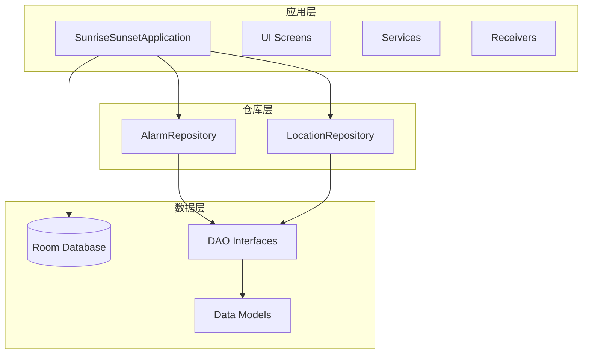
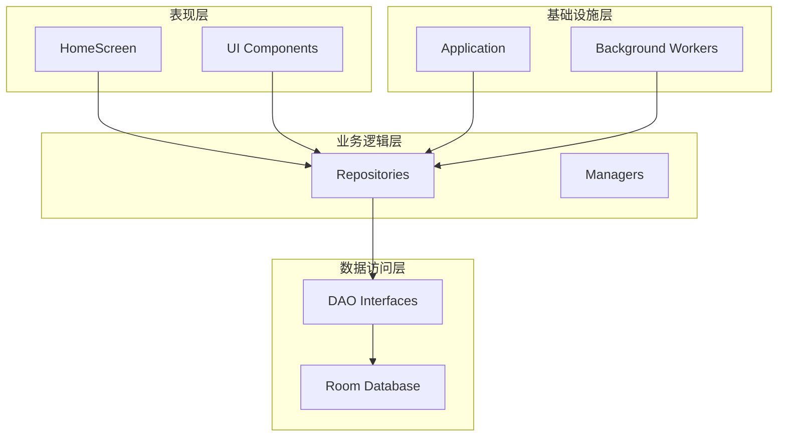
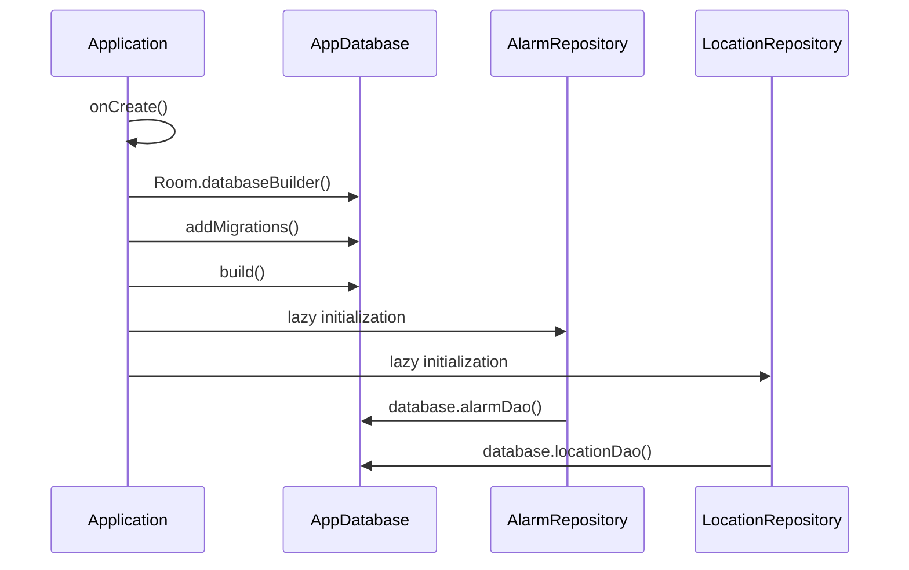
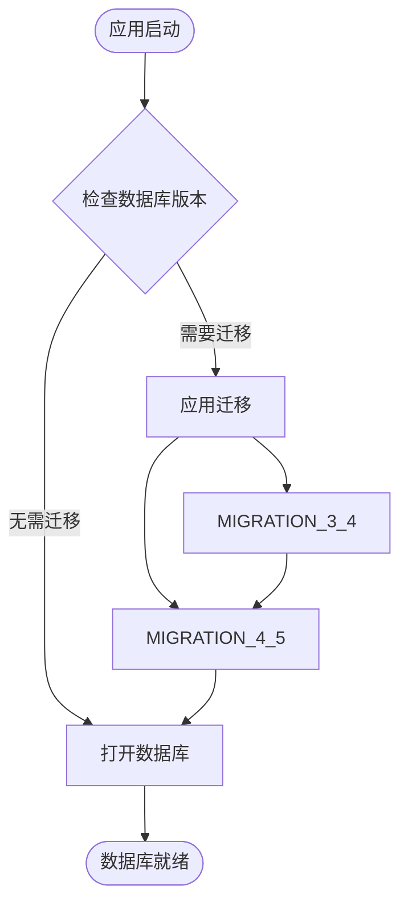
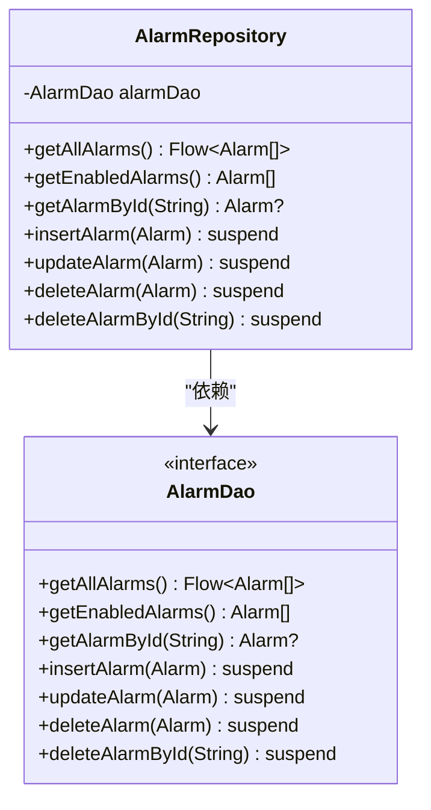
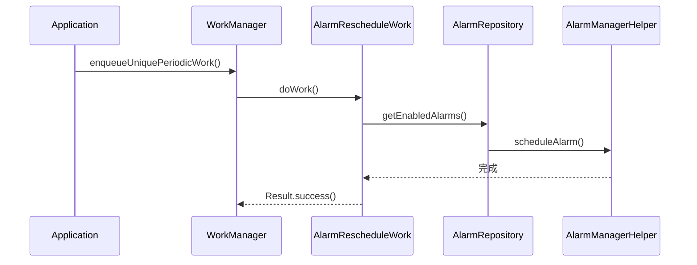
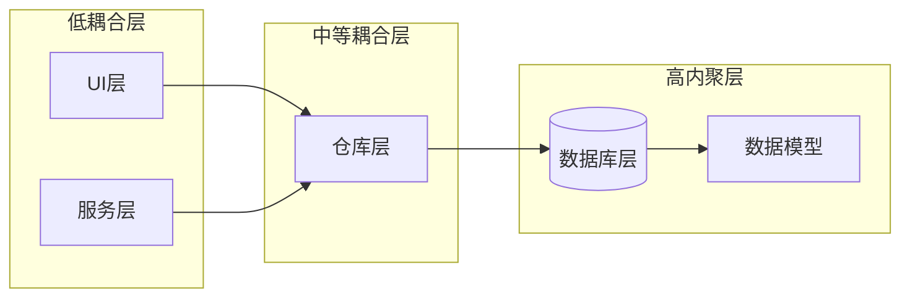

# 依赖注入与单例模式

<cite>
**本文档引用的文件**
- [SunriseSunsetApplication.kt](file://app/src/main/java/com/snuabar/sunrisesunsetalarm/SunriseSunsetApplication.kt)
- [AppDatabase.kt](file://app/src/main/java/com/snuabar/sunrisesunsetalarm/data/database/AppDatabase.kt)
- [AlarmRepository.kt](file://app/src/main/java/com/snuabar/sunrisesunsetalarm/data/repository/AlarmRepository.kt)
- [LocationRepository.kt](file://app/src/main/java/com/snuabar/sunrisesunsetalarm/data/repository/LocationRepository.kt)
- [AlarmDao.kt](file://app/src/main/java/com/snuabar/sunrisesunsetalarm/data/database/AlarmDao.kt)
- [LocationDao.kt](file://app/src/main/java/com/snuabar/sunrisesunsetalarm/data/database/LocationDao.kt)
- [AlarmRescheduleWorker.kt](file://app/src/main/java/com/snuabar/sunrisesunsetalarm/receiver/AlarmRescheduleWorker.kt)
- [HomeScreen.kt](file://app/src/main/java/com/snuabar/sunrisesunsetalarm/ui/screens/HomeScreen.kt)
- [Alarm.kt](file://app/src/main/java/com/snuabar/sunrisesunsetalarm/data/model/Alarm.kt)
- [Location.kt](file://app/src/main/java/com/snuabar/sunrisesunsetalarm/data/model/Location.kt)
- [SettingsManager.kt](file://app/src/main/java/com/snuabar/sunrisesunsetalarm/util/SettingsManager.kt)
</cite>

## 目录
1. [引言](#引言)
2. [项目结构](#项目结构)
3. [核心组件](#核心组件)
4. [架构概览](#架构概览)
5. [详细组件分析](#详细组件分析)
6. [依赖关系分析](#依赖关系分析)
7. [性能考虑](#性能考虑)
8. [故障排除指南](#故障排除指南)
9. [结论](#结论)

## 引言

本文件深入解析Android应用中的依赖注入与单例模式实现，重点分析SunriseSunsetApplication如何实现全局依赖管理。该应用采用简洁而有效的依赖注入模式，通过Application类集中管理数据库、仓库层等核心组件的生命周期。

## 项目结构

应用采用按功能模块组织的目录结构，核心文件分布如下：

**图表来源**
- [SunriseSunsetApplication.kt:18-66](file://app/src/main/java/com/snuabar/sunrisesunsetalarm/SunriseSunsetApplication.kt#L18-L66)
- [AlarmRepository.kt:7-21](file://app/src/main/java/com/snuabar/sunrisesunsetalarm/data/repository/AlarmRepository.kt#L7-L21)
- [LocationRepository.kt:7-17](file://app/src/main/java/com/snuabar/sunrisesunsetalarm/data/repository/LocationRepository.kt#L7-L17)

**章节来源**
- [SunriseSunsetApplication.kt:18-66](file://app/src/main/java/com/snuabar/sunrisesunsetalarm/SunriseSunsetApplication.kt#L18-L66)

## 核心组件

### Application级依赖管理

SunriseSunsetApplication实现了完整的依赖注入容器功能：

- **全局实例管理**：通过companion object维护应用实例引用
- **延迟初始化**：使用lazy委托确保按需创建
- **生命周期集成**：在onCreate中初始化所有依赖项

### 数据库单例实现

AppDatabase采用Room框架的标准单例模式：

- **抽象数据库定义**：@Database注解声明实体和版本
- **DAO接口暴露**：提供类型安全的数据访问接口
- **迁移策略**：内置版本升级支持

**章节来源**
- [SunriseSunsetApplication.kt:25-34](file://app/src/main/java/com/snuabar/sunrisesunsetalarm/SunriseSunsetApplication.kt#L25-L34)
- [AppDatabase.kt:10-32](file://app/src/main/java/com/snuabar/sunrisesunsetalarm/data/database/AppDatabase.kt#L10-L32)

## 架构概览

应用采用分层架构设计，实现清晰的关注点分离：

**图表来源**
- [HomeScreen.kt:46-66](file://app/src/main/java/com/snuabar/sunrisesunsetalarm/ui/screens/HomeScreen.kt#L46-L66)
- [AlarmRepository.kt:7-21](file://app/src/main/java/com/snuabar/sunrisesunsetalarm/data/repository/AlarmRepository.kt#L7-L21)
- [LocationRepository.kt:7-17](file://app/src/main/java/com/snuabar/sunrisesunsetalarm/data/repository/LocationRepository.kt#L7-L17)

## 详细组件分析

### SunriseSunsetApplication - 全局依赖容器

#### 延迟初始化模式

应用使用kotlin lazy委托实现线程安全的延迟初始化：

**图表来源**
- [SunriseSunsetApplication.kt:36-53](file://app/src/main/java/com/snuabar/sunrisesunsetalarm/SunriseSunsetApplication.kt#L36-L53)
- [SunriseSunsetApplication.kt:28-34](file://app/src/main/java/com/snuabar/sunrisesunsetalarm/SunriseSunsetApplication.kt#L28-L34)

#### 单例生命周期管理

应用实现了多层级的单例管理：

1. **Application实例单例**：全局唯一的应用实例
2. **数据库单例**：进程级别的数据库连接
3. **仓库层单例**：基于懒加载的延迟初始化

**章节来源**
- [SunriseSunsetApplication.kt:20-34](file://app/src/main/java/com/snuabar/sunrisesunsetalarm/SunriseSunsetApplication.kt#L20-L34)

### 数据库层 - Room集成

#### 数据库配置与迁移

AppDatabase实现了完整的数据库生命周期管理：

**图表来源**
- [AppDatabase.kt:19-32](file://app/src/main/java/com/snuabar/sunrisesunsetalarm/data/database/AppDatabase.kt#L19-L32)
- [SunriseSunsetApplication.kt:44](file://app/src/main/java/com/snuabar/sunrisesunsetalarm/SunriseSunsetApplication.kt#L44)

#### DAO接口设计

每个DAO接口提供完整的CRUD操作和查询方法：

**章节来源**
- [AlarmDao.kt:8-29](file://app/src/main/java/com/snuabar/sunrisesunsetalarm/data/database/AlarmDao.kt#L8-L29)
- [LocationDao.kt:8-23](file://app/src/main/java/com/snuabar/sunrisesunsetalarm/data/database/LocationDao.kt#L8-L23)

### 仓库层 - 业务逻辑封装

#### AlarmRepository实现

仓库层提供了类型安全的业务操作接口：

**图表来源**
- [AlarmRepository.kt:7-21](file://app/src/main/java/com/snuabar/sunrisesunsetalarm/data/repository/AlarmRepository.kt#L7-L21)
- [AlarmDao.kt:8-29](file://app/src/main/java/com/snuabar/sunrisesunsetalarm/data/database/AlarmDao.kt#L8-L29)

#### LocationRepository实现

位置管理仓库提供了完整的位置数据操作：

**章节来源**
- [LocationRepository.kt:7-17](file://app/src/main/java/com/snuabar/sunrisesunsetalarm/data/repository/LocationRepository.kt#L7-L17)

### 背景任务与预加载机制

#### 定时任务调度

应用实现了基于WorkManager的定时任务系统：

**图表来源**
- [AlarmRescheduleWorker.kt:26-47](file://app/src/main/java/com/snuabar/sunrisesunsetalarm/receiver/AlarmRescheduleWorker.kt#L26-L47)
- [SunriseSunsetApplication.kt:55-65](file://app/src/main/java/com/snuabar/sunrisesunsetalarm/SunriseSunsetApplication.kt#L55-L65)

#### 预加载机制

应用实现了智能的节假日数据预加载策略：

**章节来源**
- [SunriseSunsetApplication.kt:49-52](file://app/src/main/java/com/snuabar/sunrisesunsetalarm/SunriseSunsetApplication.kt#L49-L52)
- [AlarmRescheduleWorker.kt:38-41](file://app/src/main/java/com/snuabar/sunrisesunsetalarm/receiver/AlarmRescheduleWorker.kt#L38-L41)

## 依赖关系分析

### 组件耦合度分析

应用采用了松耦合的设计原则：

**图表来源**
- [HomeScreen.kt:65](file://app/src/main/java/com/snuabar/sunrisesunsetalarm/ui/screens/HomeScreen.kt#L65)
- [AlarmRepository.kt:7](file://app/src/main/java/com/snuabar/sunrisesunsetalarm/data/repository/AlarmRepository.kt#L7)

### 生命周期管理

应用实现了完整的生命周期管理策略：

1. **Application级别**：全局依赖的创建和销毁
2. **Repository级别**：按需创建的业务逻辑对象
3. **DAO级别**：Room框架管理的数据库连接

**章节来源**
- [SunriseSunsetApplication.kt:36-53](file://app/src/main/java/com/snuabar/sunrisesunsetalarm/SunriseSunsetApplication.kt#L36-L53)

## 性能考虑

### 内存优化策略

应用采用了多项内存优化技术：

1. **延迟初始化**：避免不必要的对象创建
2. **单例模式**：减少重复的对象分配
3. **协程使用**：异步处理耗时操作

### 线程安全保证

应用通过以下方式确保线程安全：

- **lazy委托的原子性**：Kotlin lazy委托天然线程安全
- **Room的并发控制**：Room框架内置线程安全机制
- **协程作用域管理**：合理的协程作用域隔离

## 故障排除指南

### 常见问题及解决方案

#### 数据库迁移失败

**问题症状**：应用启动时报数据库版本错误

**解决方案**：
1. 检查Migration对象的版本号
2. 验证SQL语句的正确性
3. 确认数据迁移的向后兼容性

#### 内存泄漏排查

**问题症状**：应用长时间运行后内存占用持续增长

**排查步骤**：
1. 检查Application单例的生命周期
2. 确认协程作用域的正确使用
3. 验证回调注册和注销的平衡

#### 依赖注入失效

**问题症状**：某些组件无法获取到依赖对象

**诊断方法**：
1. 验证Application的onCreate是否正确执行
2. 检查lazy委托的初始化顺序
3. 确认依赖对象的类型匹配

**章节来源**
- [SunriseSunsetApplication.kt:20-23](file://app/src/main/java/com/snuabar/sunrisesunsetalarm/SunriseSunsetApplication.kt#L20-L23)

## 结论

该应用成功实现了简洁而高效的依赖注入与单例模式。通过Application级别的集中管理，应用实现了：

- **清晰的依赖层次**：从Application到Repository再到DAO的明确分层
- **线程安全保证**：利用Kotlin特性确保并发安全性
- **性能优化**：通过延迟初始化和单例模式提升运行效率
- **可维护性**：松耦合设计便于后续功能扩展

这种实现模式为Android应用开发提供了良好的参考范式，特别适合中小型应用的架构设计。