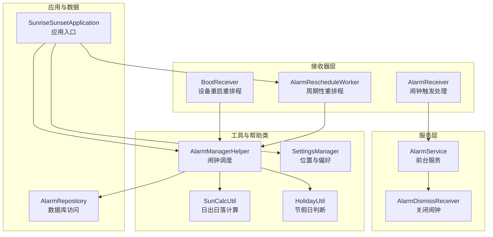
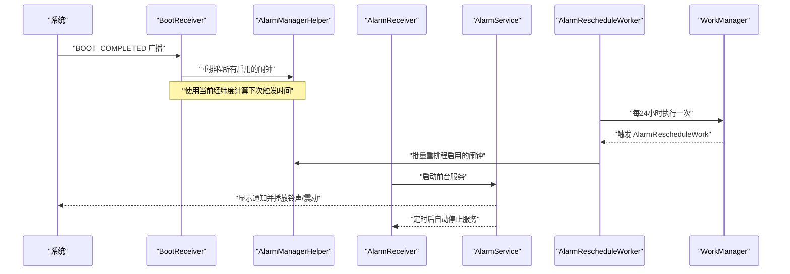
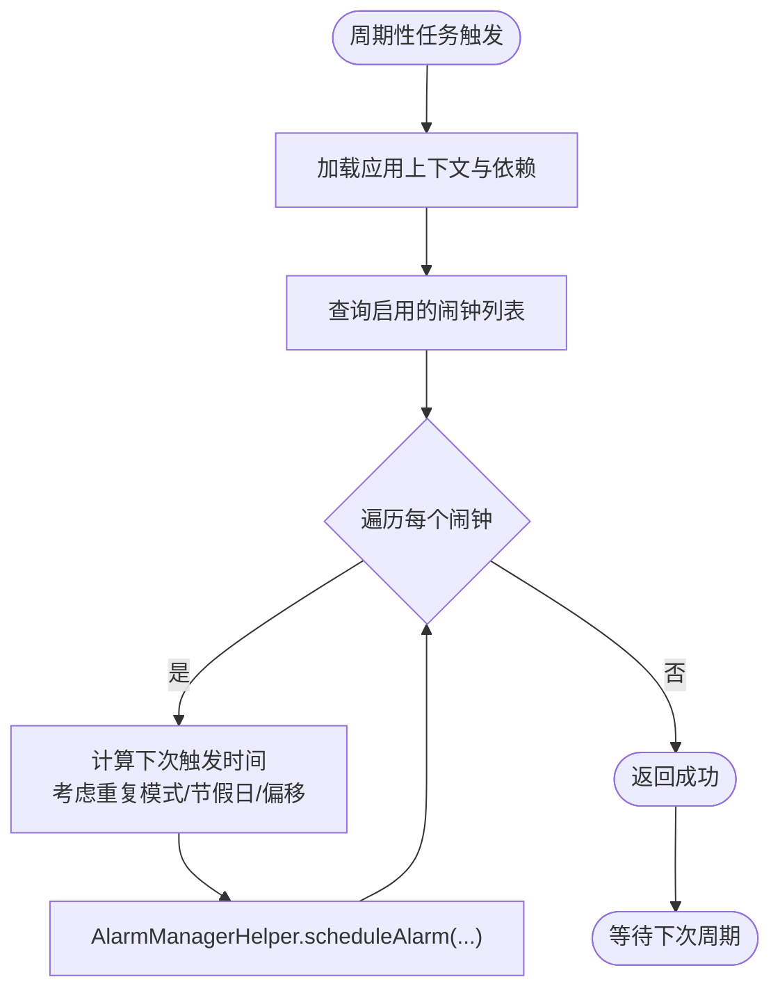
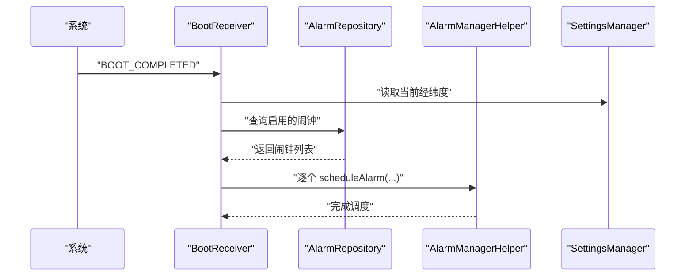
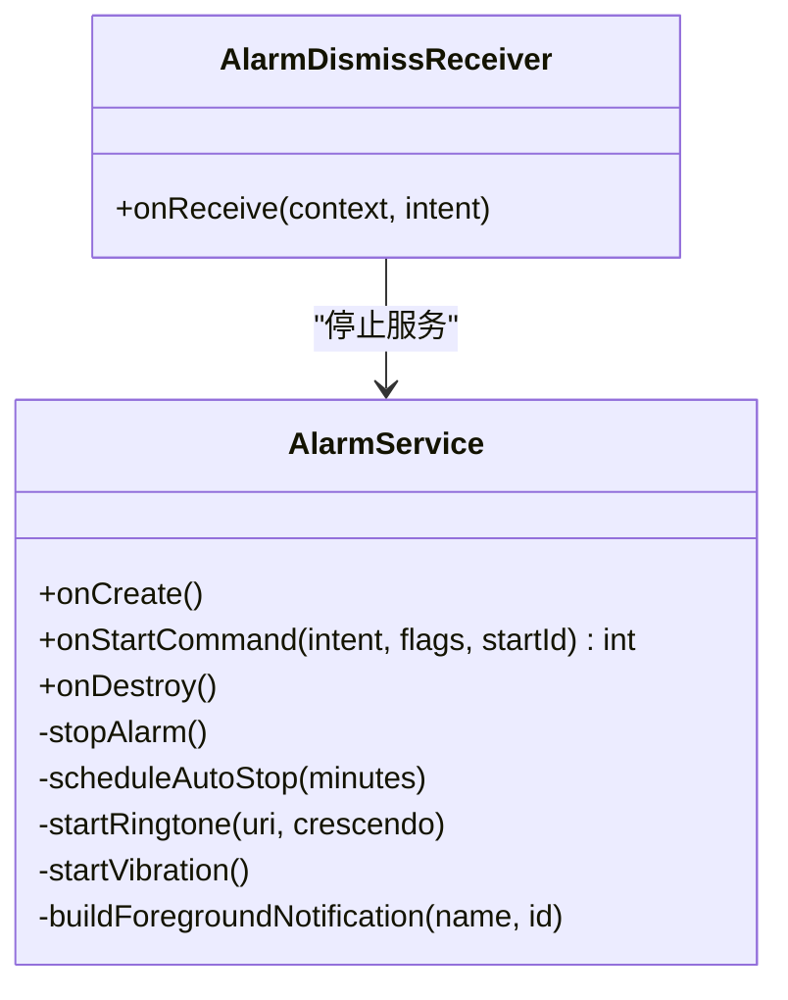
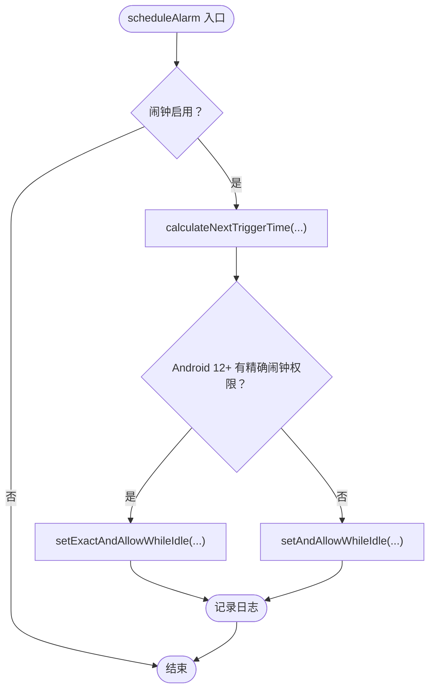
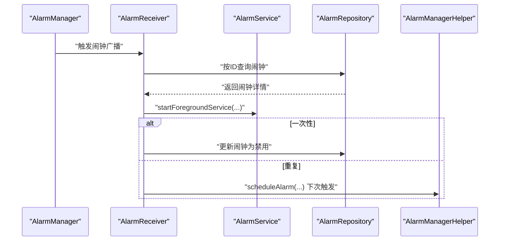
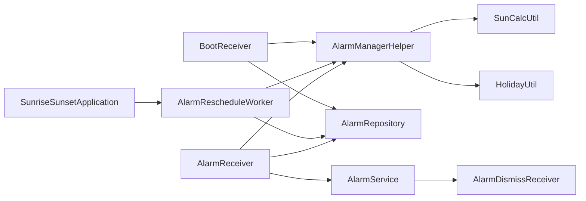

# 后台服务与工作调度

<cite>
**本文档引用的文件**
- [AlarmRescheduleWorker.kt](file://app/src/main/java/com/snuabar/sunrisesunsetalarm/receiver/AlarmRescheduleWorker.kt)
- [BootReceiver.kt](file://app/src/main/java/com/snuabar/sunrisesunsetalarm/receiver/BootReceiver.kt)
- [AlarmService.kt](file://app/src/main/java/com/snuabar/sunrisesunsetalarm/service/AlarmService.kt)
- [AlarmManagerHelper.kt](file://app/src/main/java/com/snuabar/sunrisesunsetalarm/service/AlarmManagerHelper.kt)
- [AlarmReceiver.kt](file://app/src/main/java/com/snuabar/sunrisesunsetalarm/receiver/AlarmReceiver.kt)
- [SunriseSunsetApplication.kt](file://app/src/main/java/com/snuabar/sunrisesunsetalarm/SunriseSunsetApplication.kt)
- [SettingsManager.kt](file://app/src/main/java/com/snuabar/sunrisesunsetalarm/util/SettingsManager.kt)
- [AlarmRepository.kt](file://app/src/main/java/com/snuabar/sunrisesunsetalarm/data/repository/AlarmRepository.kt)
- [SunCalcUtil.kt](file://app/src/main/java/com/snuabar/sunrisesunsetalarm/util/SunCalcUtil.kt)
- [HolidayUtil.kt](file://app/src/main/java/com/snuabar/sunrisesunsetalarm/util/HolidayUtil.kt)
- [AlarmDismissReceiver.kt](file://app/src/main/java/com/snuabar/sunrisesunsetalarm/service/AlarmDismissReceiver.kt)
- [AndroidManifest.xml](file://app/src/main/AndroidManifest.xml)
</cite>

## 目录
1. [简介](#简介)
2. [项目结构](#项目结构)
3. [核心组件](#核心组件)
4. [架构总览](#架构总览)
5. [详细组件分析](#详细组件分析)
6. [依赖关系分析](#依赖关系分析)
7. [性能考虑](#性能考虑)
8. [故障排除指南](#故障排除指南)
9. [结论](#结论)
10. [附录](#附录)

## 简介
本文件面向后台服务与工作调度的架构文档，重点阐述以下内容：
- AlarmRescheduleWorker 如何实现周期性任务调度，以确保日出日落型闹钟在位置变化或时间推移后仍能正确触发
- BootReceiver 如何处理设备重启后的闹钟重排程
- AlarmService 的生命周期管理与前台服务实现策略
- WorkManager 与 AlarmManager 的协同工作机制
- 电池优化与后台限制的应对策略
- 服务启动策略、资源管理最佳实践与性能优化技巧
- 提供后台任务调度的时序图与异常处理方案

## 项目结构
该项目采用按功能域分层的组织方式，核心与后台调度相关的模块包括：
- 接收器层：BootReceiver、AlarmReceiver、AlarmRescheduleWorker
- 服务层：AlarmService、AlarmDismissReceiver
- 工具与帮助类：AlarmManagerHelper、SunCalcUtil、HolidayUtil、SettingsManager
- 应用入口：SunriseSunsetApplication
- 数据仓库：AlarmRepository
- 清单配置：AndroidManifest.xml

图表来源
- [BootReceiver.kt:11-33](file://app/src/main/java/com/snuabar/sunrisesunsetalarm/receiver/BootReceiver.kt#L11-L33)
- [AlarmReceiver.kt:17-68](file://app/src/main/java/com/snuabar/sunrisesunsetalarm/receiver/AlarmReceiver.kt#L17-L68)
- [AlarmRescheduleWorker.kt:12-47](file://app/src/main/java/com/snuabar/sunrisesunsetalarm/receiver/AlarmRescheduleWorker.kt#L12-L47)
- [AlarmService.kt:24-246](file://app/src/main/java/com/snuabar/sunrisesunsetalarm/service/AlarmService.kt#L24-L246)
- [AlarmDismissReceiver.kt:7-18](file://app/src/main/java/com/snuabar/sunrisesunsetalarm/service/AlarmDismissReceiver.kt#L7-L18)
- [AlarmManagerHelper.kt:17-165](file://app/src/main/java/com/snuabar/sunrisesunsetalarm/service/AlarmManagerHelper.kt#L17-L165)
- [SunCalcUtil.kt:6-137](file://app/src/main/java/com/snuabar/sunrisesunsetalarm/util/SunCalcUtil.kt#L6-L137)
- [HolidayUtil.kt:22-222](file://app/src/main/java/com/snuabar/sunrisesunsetalarm/util/HolidayUtil.kt#L22-L222)
- [SunriseSunsetApplication.kt:18-66](file://app/src/main/java/com/snuabar/sunrisesunsetalarm/SunriseSunsetApplication.kt#L18-L66)
- [AlarmRepository.kt:7-21](file://app/src/main/java/com/snuabar/sunrisesunsetalarm/data/repository/AlarmRepository.kt#L7-L21)
- [SettingsManager.kt:8-48](file://app/src/main/java/com/snuabar/sunrisesunsetalarm/util/SettingsManager.kt#L8-L48)

章节来源
- [AndroidManifest.xml:1-88](file://app/src/main/AndroidManifest.xml#L1-L88)

## 核心组件
- AlarmRescheduleWorker：基于 WorkManager 的周期性任务，每24小时扫描启用的闹钟并重新调度，确保日出日落型闹钟随位置变化保持准确
- BootReceiver：监听系统开机完成广播，在应用上下文中初始化并重排程所有启用的闹钟
- AlarmService：前台服务，负责播放铃声、震动、显示全屏界面，并在超时后自动停止
- AlarmManagerHelper：封装 AlarmManager 的调度逻辑，支持精确与非精确闹钟、重复模式、节假日跳过等
- AlarmReceiver：闹钟触发的广播接收器，启动 AlarmService 并根据重复模式进行后续处理（禁用或重排程）
- SunriseSunsetApplication：应用入口，负责初始化数据库、预加载节假日数据，并在应用启动时注册周期性重排程任务
- SettingsManager：统一管理位置信息与应用偏好
- AlarmRepository：Room 数据访问对象的封装，提供启用闹钟列表与按ID查询
- SunCalcUtil：日出日落时间计算工具
- HolidayUtil：节假日数据预加载与查询
- AlarmDismissReceiver：用户点击“关闭”时取消通知并停止前台服务

章节来源
- [AlarmRescheduleWorker.kt:12-47](file://app/src/main/java/com/snuabar/sunrisesunsetalarm/receiver/AlarmRescheduleWorker.kt#L12-L47)
- [BootReceiver.kt:11-33](file://app/src/main/java/com/snuabar/sunrisesunsetalarm/receiver/BootReceiver.kt#L11-L33)
- [AlarmService.kt:24-246](file://app/src/main/java/com/snuabar/sunrisesunsetalarm/service/AlarmService.kt#L24-L246)
- [AlarmManagerHelper.kt:17-165](file://app/src/main/java/com/snuabar/sunrisesunsetalarm/service/AlarmManagerHelper.kt#L17-L165)
- [AlarmReceiver.kt:17-68](file://app/src/main/java/com/snuabar/sunrisesunsetalarm/receiver/AlarmReceiver.kt#L17-L68)
- [SunriseSunsetApplication.kt:18-66](file://app/src/main/java/com/snuabar/sunrisesunsetalarm/SunriseSunsetApplication.kt#L18-L66)
- [SettingsManager.kt:8-48](file://app/src/main/java/com/snuabar/sunrisesunsetalarm/util/SettingsManager.kt#L8-L48)
- [AlarmRepository.kt:7-21](file://app/src/main/java/com/snuabar/sunrisesunsetalarm/data/repository/AlarmRepository.kt#L7-L21)
- [SunCalcUtil.kt:6-137](file://app/src/main/java/com/snuabar/sunrisesunsetalarm/util/SunCalcUtil.kt#L6-L137)
- [HolidayUtil.kt:22-222](file://app/src/main/java/com/snuabar/sunrisesunsetalarm/util/HolidayUtil.kt#L22-L222)
- [AlarmDismissReceiver.kt:7-18](file://app/src/main/java/com/snuabar/sunrisesunsetalarm/service/AlarmDismissReceiver.kt#L7-L18)

## 架构总览
下图展示了从设备开机到闹钟触发再到前台服务响铃的整体流程，以及周期性重排程的工作流。

图表来源
- [BootReceiver.kt:11-33](file://app/src/main/java/com/snuabar/sunrisesunsetalarm/receiver/BootReceiver.kt#L11-L33)
- [AlarmRescheduleWorker.kt:12-47](file://app/src/main/java/com/snuabar/sunrisesunsetalarm/receiver/AlarmRescheduleWorker.kt#L12-L47)
- [AlarmReceiver.kt:17-68](file://app/src/main/java/com/snuabar/sunrisesunsetalarm/receiver/AlarmReceiver.kt#L17-L68)
- [AlarmService.kt:24-246](file://app/src/main/java/com/snuabar/sunrisesunsetalarm/service/AlarmService.kt#L24-L246)

## 详细组件分析

### AlarmRescheduleWorker：周期性任务调度
- 角色定位：通过 WorkManager 注册唯一周期性任务，每24小时运行一次，用于重排程启用的闹钟
- 关键点：
  - 使用唯一工作名“alarm_reschedule”，保留现有任务策略，避免重复排队
  - 在 doWork 中获取应用实例、设置管理器、仓库与 AlarmManagerHelper，遍历启用的闹钟并逐个调度
  - 异常捕获返回失败结果，便于 WorkManager 进行重试策略
- 适用场景：位置变更、时间推移、节假日调整导致的日出日落型闹钟需要重新计算触发时间

图表来源
- [AlarmRescheduleWorker.kt:26-47](file://app/src/main/java/com/snuabar/sunrisesunsetalarm/receiver/AlarmRescheduleWorker.kt#L26-L47)
- [AlarmManagerHelper.kt:21-54](file://app/src/main/java/com/snuabar/sunrisesunsetalarm/service/AlarmManagerHelper.kt#L21-L54)

章节来源
- [AlarmRescheduleWorker.kt:12-47](file://app/src/main/java/com/snuabar/sunrisesunsetalarm/receiver/AlarmRescheduleWorker.kt#L12-L47)
- [SunriseSunsetApplication.kt:55-65](file://app/src/main/java/com/snuabar/sunrisesunsetalarm/SunriseSunsetApplication.kt#L55-L65)

### BootReceiver：设备重启后的闹钟重排程
- 角色定位：监听系统开机完成广播，立即重排程所有启用的闹钟
- 关键点：
  - 仅在 ACTION_BOOT_COMPLETED 时执行
  - 使用 SettingsManager 获取当前位置，AlarmRepository 查询启用的闹钟，AlarmManagerHelper 逐一调度
  - 使用协程阻塞方式保证重排程在广播线程内完成，避免竞态
- 与 AlarmRescheduleWorker 的关系：前者保证开机即刻生效，后者保证长期稳定性

图表来源
- [BootReceiver.kt:11-33](file://app/src/main/java/com/snuabar/sunrisesunsetalarm/receiver/BootReceiver.kt#L11-L33)
- [AlarmRepository.kt:10](file://app/src/main/java/com/snuabar/sunrisesunsetalarm/data/repository/AlarmRepository.kt#L10)
- [AlarmManagerHelper.kt:21-54](file://app/src/main/java/com/snuabar/sunrisesunsetalarm/service/AlarmManagerHelper.kt#L21-L54)
- [SettingsManager.kt:27-33](file://app/src/main/java/com/snuabar/sunrisesunsetalarm/util/SettingsManager.kt#L27-L33)

章节来源
- [BootReceiver.kt:11-33](file://app/src/main/java/com/snuabar/sunrisesunsetalarm/receiver/BootReceiver.kt#L11-L33)

### AlarmService：前台服务生命周期与实现策略
- 角色定位：前台服务，负责播放铃声、震动、显示全屏界面，并在设定时长后自动停止
- 生命周期要点：
  - onCreate：创建通知通道
  - onStartCommand：解析启动参数（闹钟ID、名称、铃声URI、震动开关、响铃时长、渐强秒数、响铃模式），停止上一个闹钟状态，启动前台通知，按模式执行响铃/震动/全屏，定时自动停止
  - onDestroy：清理音视频与震动资源
- 前台服务类型：声明为特殊用途前台服务（alarm subtype），满足系统对闹钟类前台服务的要求
- 铃声与震动：
  - 支持默认或自定义铃声，支持渐强效果
  - 震动模式使用波形序列
- 通知与交互：通知通道重要性高，支持“关闭”动作，点击进入主界面

图表来源
- [AlarmService.kt:24-246](file://app/src/main/java/com/snuabar/sunrisesunsetalarm/service/AlarmService.kt#L24-L246)
- [AlarmDismissReceiver.kt:7-18](file://app/src/main/java/com/snuabar/sunrisesunsetalarm/service/AlarmDismissReceiver.kt#L7-L18)

章节来源
- [AlarmService.kt:24-246](file://app/src/main/java/com/snuabar/sunrisesunsetalarm/service/AlarmService.kt#L24-L246)
- [AndroidManifest.xml:64-73](file://app/src/main/AndroidManifest.xml#L64-L73)

### AlarmManagerHelper：与 AlarmManager 的协同机制
- 角色定位：封装 AlarmManager 的调度与取消逻辑，支持精确与非精确闹钟、重复模式、节假日跳过
- 关键算法：
  - 计算下次触发时间：支持自定义时间与日出/日落基准，结合偏移分钟、重复天数、节假日跳过策略
  - 精确调度：Android 12+ 检查精确闹钟权限，具备权限时使用 setExactAndAllowWhileIdle，否则回退到 setAndAllowWhileIdle
  - 取消：通过 PendingIntent 取消 AlarmManager 定时
- 复杂度：每次调度为 O(1)，但计算下次触发时间在最坏情况下可能需要最多8天尝试，平均复杂度受重复模式影响

图表来源
- [AlarmManagerHelper.kt:21-54](file://app/src/main/java/com/snuabar/sunrisesunsetalarm/service/AlarmManagerHelper.kt#L21-L54)
- [AlarmManagerHelper.kt:62-151](file://app/src/main/java/com/snuabar/sunrisesunsetalarm/service/AlarmManagerHelper.kt#L62-L151)

章节来源
- [AlarmManagerHelper.kt:17-165](file://app/src/main/java/com/snuabar/sunrisesunsetalarm/service/AlarmManagerHelper.kt#L17-L165)
- [SunCalcUtil.kt:6-137](file://app/src/main/java/com/snuabar/sunrisesunsetalarm/util/SunCalcUtil.kt#L6-L137)
- [HolidayUtil.kt:80-94](file://app/src/main/java/com/snuabar/sunrisesunsetalarm/util/HolidayUtil.kt#L80-L94)

### AlarmReceiver：闹钟触发处理与后续逻辑
- 角色定位：接收 AlarmManager 的广播，启动 AlarmService，并根据重复模式进行后续处理
- 关键流程：
  - 从数据库加载闹钟详情
  - 启动 AlarmService 并传入响铃参数
  - 对一次性闹钟：禁用该闹钟
  - 对重复闹钟：使用 AlarmManagerHelper 重新计算并调度下一次触发
- 与 AlarmDismissReceiver 协作：用户点击“关闭”时取消通知并停止服务

图表来源
- [AlarmReceiver.kt:17-68](file://app/src/main/java/com/snuabar/sunrisesunsetalarm/receiver/AlarmReceiver.kt#L17-L68)
- [AlarmService.kt:36-45](file://app/src/main/java/com/snuabar/sunrisesunsetalarm/service/AlarmService.kt#L36-L45)
- [AlarmManagerHelper.kt:21-54](file://app/src/main/java/com/snuabar/sunrisesunsetalarm/service/AlarmManagerHelper.kt#L21-L54)

章节来源
- [AlarmReceiver.kt:17-68](file://app/src/main/java/com/snuabar/sunrisesunsetalarm/receiver/AlarmReceiver.kt#L17-L68)

### SunriseSunsetApplication：应用启动策略与资源预热
- 角色定位：应用入口，负责数据库初始化、节假日数据预热、周期性重排程任务注册
- 关键点：
  - 初始化 Room 数据库并应用迁移
  - 预加载节假日数据到内存，减少后续查询开销
  - 启动周期性重排程任务，确保长期稳定性

章节来源
- [SunriseSunsetApplication.kt:18-66](file://app/src/main/java/com/snuabar/sunrisesunsetalarm/SunriseSunsetApplication.kt#L18-L66)

### SettingsManager、AlarmRepository、SunCalcUtil、HolidayUtil：支撑组件
- SettingsManager：统一管理位置信息（纬度/经度）与应用偏好
- AlarmRepository：提供启用闹钟列表与按ID查询，支持协程安全
- SunCalcUtil：基于 NOAA 算法计算日出/日落时间，支持极昼/极夜场景
- HolidayUtil：节假日数据预加载与查询，支持网络、本地缓存与硬编码兜底

章节来源
- [SettingsManager.kt:8-48](file://app/src/main/java/com/snuabar/sunrisesunsetalarm/util/SettingsManager.kt#L8-L48)
- [AlarmRepository.kt:7-21](file://app/src/main/java/com/snuabar/sunrisesunsetalarm/data/repository/AlarmRepository.kt#L7-L21)
- [SunCalcUtil.kt:6-137](file://app/src/main/java/com/snuabar/sunrisesunsetalarm/util/SunCalcUtil.kt#L6-L137)
- [HolidayUtil.kt:22-222](file://app/src/main/java/com/snuabar/sunrisesunsetalarm/util/HolidayUtil.kt#L22-L222)

## 依赖关系分析
- 组件耦合：
  - BootReceiver/AlarmRescheduleWorker 依赖 AlarmManagerHelper 与 AlarmRepository
  - AlarmReceiver 依赖 AlarmRepository 与 AlarmManagerHelper
  - AlarmService 依赖 AlarmDismissReceiver 与 AlarmManagerHelper（间接）
  - SunriseSunsetApplication 依赖 WorkManager 与 AlarmRescheduleWorker
- 外部依赖：
  - AlarmManager、WorkManager、Room、MediaPlayer、Vibrator、NotificationManager
- 潜在循环依赖：无直接循环；AlarmReceiver 与 AlarmManagerHelper 通过广播与服务解耦

图表来源
- [BootReceiver.kt:11-33](file://app/src/main/java/com/snuabar/sunrisesunsetalarm/receiver/BootReceiver.kt#L11-L33)
- [AlarmRescheduleWorker.kt:26-47](file://app/src/main/java/com/snuabar/sunrisesunsetalarm/receiver/AlarmRescheduleWorker.kt#L26-L47)
- [AlarmReceiver.kt:17-68](file://app/src/main/java/com/snuabar/sunrisesunsetalarm/receiver/AlarmReceiver.kt#L17-L68)
- [AlarmService.kt:24-246](file://app/src/main/java/com/snuabar/sunrisesunsetalarm/service/AlarmService.kt#L24-L246)
- [AlarmDismissReceiver.kt:7-18](file://app/src/main/java/com/snuabar/sunrisesunsetalarm/service/AlarmDismissReceiver.kt#L7-L18)
- [AlarmManagerHelper.kt:17-165](file://app/src/main/java/com/snuabar/sunrisesunsetalarm/service/AlarmManagerHelper.kt#L17-L165)
- [SunriseSunsetApplication.kt:55-65](file://app/src/main/java/com/snuabar/sunrisesunsetalarm/SunriseSunsetApplication.kt#L55-L65)

章节来源
- [AlarmManagerHelper.kt:17-165](file://app/src/main/java/com/snuabar/sunrisesunsetalarm/service/AlarmManagerHelper.kt#L17-L165)
- [AlarmReceiver.kt:17-68](file://app/src/main/java/com/snuabar/sunrisesunsetalarm/receiver/AlarmReceiver.kt#L17-L68)

## 性能考虑
- 闹钟调度性能：
  - AlarmManagerHelper 的计算复杂度与重复模式相关，建议合理设置重复天数与节假日跳过策略，减少无效尝试
  - 对于大量闹钟，AlarmRescheduleWorker 的批量调度应避免在主线程执行，当前实现已在协程中进行
- 前台服务资源管理：
  - AlarmService 在 onDestroy 中释放 MediaPlayer/Vibrator，避免内存泄漏
  - 使用 Handler/Runnable 管理渐强与定时停止，及时移除回调防止泄漏
- 网络与本地缓存：
  - HolidayUtil 预加载节假日数据，减少运行时网络请求
  - 本地SharedPreferences 缓存当年节假日，提升查询速度
- 电池优化与后台限制：
  - AlarmManagerHelper 在 Android 12+ 检查精确闹钟权限，无权限时回退到非精确闹钟
  - AlarmService 声明为前台服务（特殊用途），确保在后台也能正常响铃
  - WorkManager 的周期性任务在系统节电策略下仍可按计划运行

[本节为通用性能指导，不直接分析具体文件]

## 故障排除指南
- 无法精确闹钟：
  - 现象：日志提示缺少精确闹钟权限
  - 处理：引导用户在系统设置中开启“允许安排精确闹钟”
- 闹钟未触发：
  - 检查 AlarmReceiver 是否收到广播
  - 检查 AlarmManagerHelper 的调度日志与权限检查
  - 确认重复模式与节假日跳过策略是否导致跳过当天
- 响铃后无法停止：
  - 检查 AlarmService 的定时停止逻辑与 Handler 回调移除
  - 确认 AlarmDismissReceiver 是否被正确注册与调用
- 周期性重排程未执行：
  - 检查 WorkManager 的唯一工作名与策略
  - 确认 SunriseSunsetApplication 是否在应用启动时注册了周期性任务

章节来源
- [AlarmManagerHelper.kt:32-46](file://app/src/main/java/com/snuabar/sunrisesunsetalarm/service/AlarmManagerHelper.kt#L32-L46)
- [AlarmReceiver.kt:17-68](file://app/src/main/java/com/snuabar/sunrisesunsetalarm/receiver/AlarmReceiver.kt#L17-L68)
- [AlarmService.kt:214-240](file://app/src/main/java/com/snuabar/sunrisesunsetalarm/service/AlarmService.kt#L214-L240)
- [AlarmDismissReceiver.kt:7-18](file://app/src/main/java/com/snuabar/sunrisesunsetalarm/service/AlarmDismissReceiver.kt#L7-L18)
- [SunriseSunsetApplication.kt:55-65](file://app/src/main/java/com/snuabar/sunrisesunsetalarm/SunriseSunsetApplication.kt#L55-L65)

## 结论
本架构通过 BootReceiver 与 AlarmRescheduleWorker 实现开机即时与周期性双重保障，配合 AlarmManagerHelper 的精确/非精确调度策略，确保日出日落型与自定义闹钟在位置变化与系统节电策略下仍能可靠触发。AlarmService 以前台服务形式提供稳定的响铃体验，并通过 AlarmDismissReceiver 提供用户交互入口。整体设计兼顾可靠性、可维护性与用户体验。

[本节为总结性内容，不直接分析具体文件]

## 附录
- 权限与前台服务声明：
  - 前台服务权限与特殊用途声明见清单文件
  - 精确闹钟权限与开机广播权限在清单中声明
- 数据模型与算法：
  - 日出日落计算采用 NOAA 简化算法
  - 节假日数据支持网络拉取、本地缓存与硬编码兜底

章节来源
- [AndroidManifest.xml:17-87](file://app/src/main/AndroidManifest.xml#L17-L87)
- [SunCalcUtil.kt:6-137](file://app/src/main/java/com/snuabar/sunrisesunsetalarm/util/SunCalcUtil.kt#L6-L137)
- [HolidayUtil.kt:22-222](file://app/src/main/java/com/snuabar/sunrisesunsetalarm/util/HolidayUtil.kt#L22-L222)