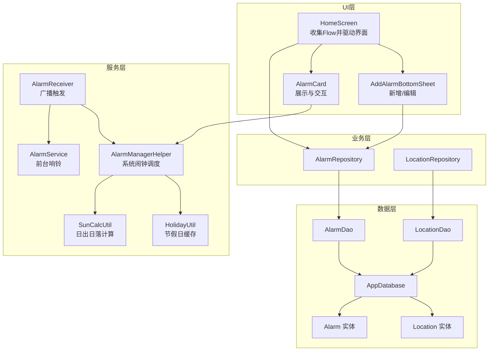
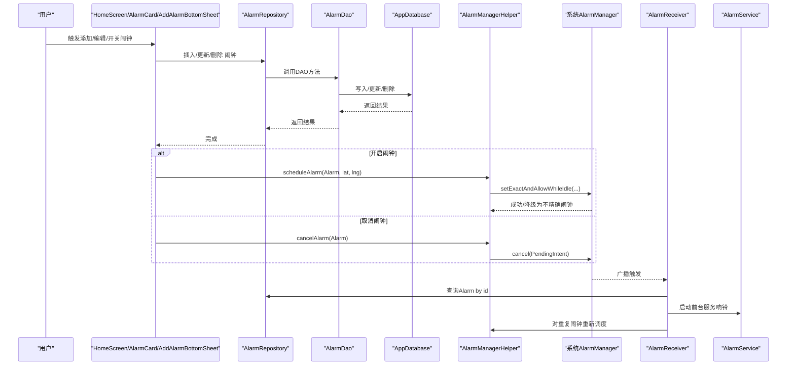
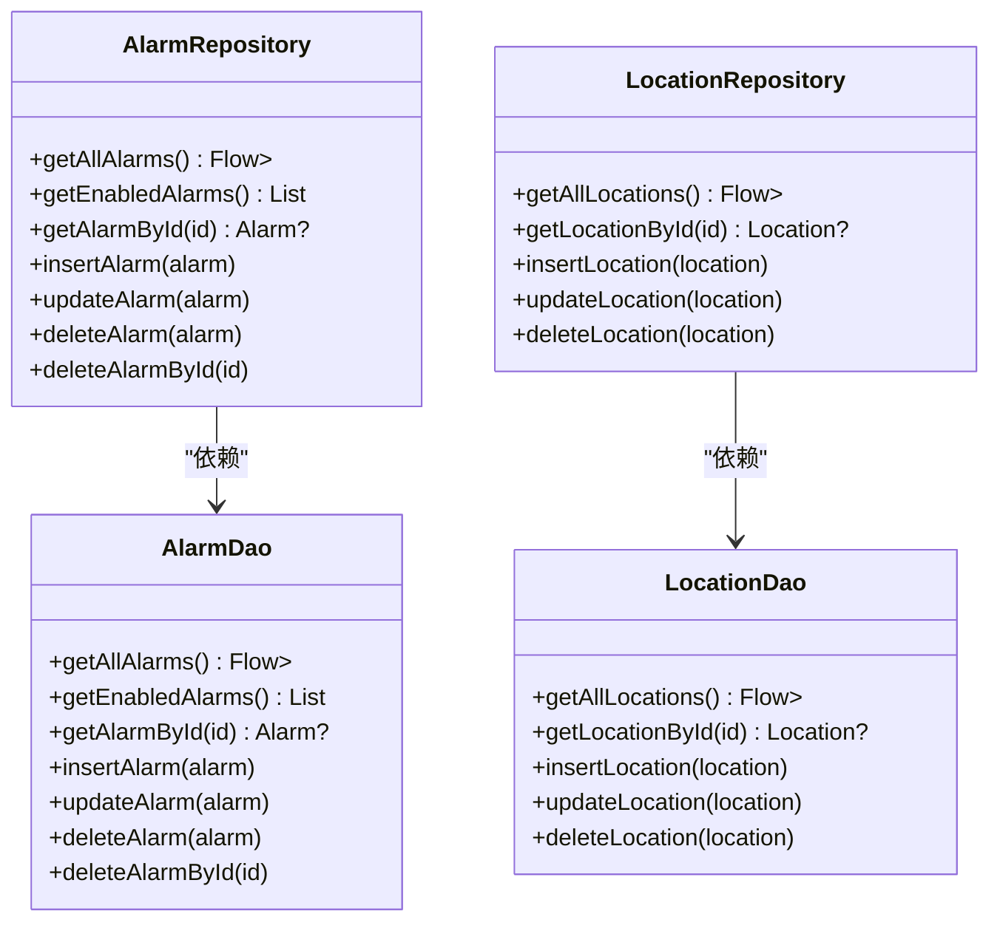
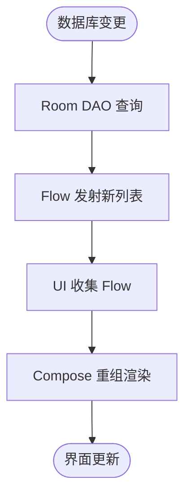
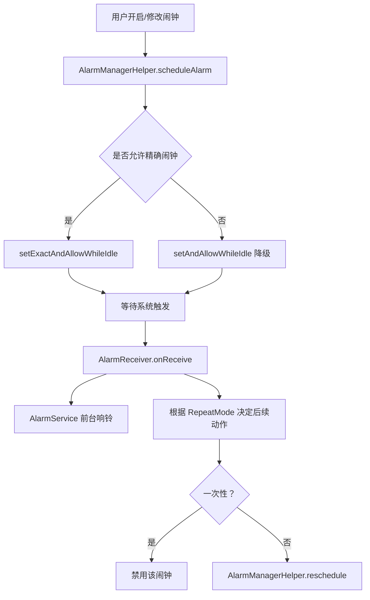
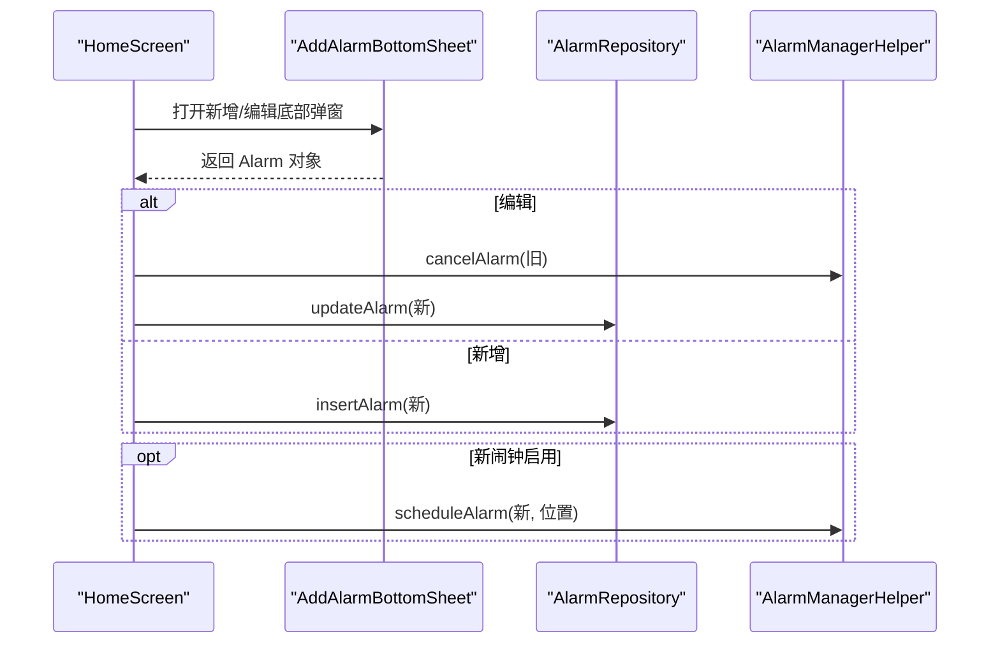
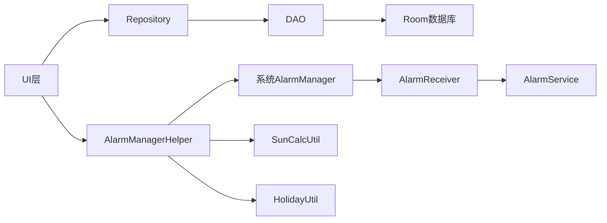

# 数据流管理

<cite>
**本文引用的文件**
- [AlarmRepository.kt](file://app/src/main/java/com/snuabar/sunrisesunsetalarm/data/repository/AlarmRepository.kt)
- [LocationRepository.kt](file://app/src/main/java/com/snuabar/sunrisesunsetalarm/data/repository/LocationRepository.kt)
- [AlarmDao.kt](file://app/src/main/java/com/snuabar/sunrisesunsetalarm/data/database/AlarmDao.kt)
- [LocationDao.kt](file://app/src/main/java/com/snuabar/sunrisesunsetalarm/data/database/LocationDao.kt)
- [AppDatabase.kt](file://app/src/main/java/com/snuabar/sunrisesunsetalarm/data/database/AppDatabase.kt)
- [Alarm.kt](file://app/src/main/java/com/snuabar/sunrisesunsetalarm/data/model/Alarm.kt)
- [Location.kt](file://app/src/main/java/com/snuabar/sunrisesunsetalarm/data/model/Location.kt)
- [HomeScreen.kt](file://app/src/main/java/com/snuabar/sunrisesunsetalarm/ui/screens/HomeScreen.kt)
- [AlarmCard.kt](file://app/src/main/java/com/snuabar/sunrisesunsetalarm/ui/components/AlarmCard.kt)
- [AddAlarmBottomSheet.kt](file://app/src/main/java/com/snuabar/sunrisesunsetalarm/ui/components/AddAlarmBottomSheet.kt)
- [AlarmReceiver.kt](file://app/src/main/java/com/snuabar/sunrisesunsetalarm/receiver/AlarmReceiver.kt)
- [AlarmManagerHelper.kt](file://app/src/main/java/com/snuabar/sunrisesunsetalarm/service/AlarmManagerHelper.kt)
- [AlarmService.kt](file://app/src/main/java/com/snuabar/sunrisesunsetalarm/service/AlarmService.kt)
- [SunCalcUtil.kt](file://app/src/main/java/com/snuabar/sunrisesunsetalarm/util/SunCalcUtil.kt)
- [SunriseSunsetApplication.kt](file://app/src/main/java/com/snuabar/sunrisesunsetalarm/SunriseSunsetApplication.kt)
- [HolidayUtil.kt](file://app/src/main/java/com/snuabar/sunrisesunsetalarm/util/HolidayUtil.kt)
</cite>

## 目录
1. [引言](#引言)
2. [项目结构](#项目结构)
3. [核心组件](#核心组件)
4. [架构总览](#架构总览)
5. [详细组件分析](#详细组件分析)
6. [依赖关系分析](#依赖关系分析)
7. [性能考量](#性能考量)
8. [故障排查指南](#故障排查指南)
9. [结论](#结论)
10. [附录](#附录)

## 引言
本文件系统性梳理应用中“从UI层到数据库层”的完整数据流，重点解释Repository模式（AlarmRepository、LocationRepository）如何封装数据访问逻辑；Room数据库如何通过Flow实现响应式数据更新；AlarmManagerHelper如何协调系统闹钟服务与应用数据同步；以及数据缓存策略、异步处理与错误恢复机制。文末提供多幅数据流图示，帮助读者快速把握各组件之间的数据传递路径。

## 项目结构
应用采用典型的分层架构：
- UI层：Compose界面与组件（HomeScreen、AlarmCard、AddAlarmBottomSheet）
- 业务层：Repository（AlarmRepository、LocationRepository）
- 数据层：Room数据库（AppDatabase、AlarmDao、LocationDao）、实体模型（Alarm、Location）
- 服务层：AlarmManagerHelper（系统闹钟调度）、AlarmService（前台服务响铃）、AlarmReceiver（广播触发）
- 工具层：SunCalcUtil（日出日落计算）、HolidayUtil（节假日缓存）

图表来源
- [HomeScreen.kt](file://app/src/main/java/com/snuabar/sunrisesunsetalarm/ui/screens/HomeScreen.kt)
- [AlarmRepository.kt](file://app/src/main/java/com/snuabar/sunrisesunsetalarm/data/repository/AlarmRepository.kt)
- [LocationRepository.kt](file://app/src/main/java/com/snuabar/sunrisesunsetalarm/data/repository/LocationRepository.kt)
- [AlarmDao.kt](file://app/src/main/java/com/snuabar/sunrisesunsetalarm/data/database/AlarmDao.kt)
- [LocationDao.kt](file://app/src/main/java/com/snuabar/sunrisesunsetalarm/data/database/LocationDao.kt)
- [AppDatabase.kt](file://app/src/main/java/com/snuabar/sunrisesunsetalarm/data/database/AppDatabase.kt)
- [AlarmManagerHelper.kt](file://app/src/main/java/com/snuabar/sunrisesunsetalarm/service/AlarmManagerHelper.kt)
- [AlarmService.kt](file://app/src/main/java/com/snuabar/sunrisesunsetalarm/service/AlarmService.kt)
- [AlarmReceiver.kt](file://app/src/main/java/com/snuabar/sunrisesunsetalarm/receiver/AlarmReceiver.kt)
- [SunCalcUtil.kt](file://app/src/main/java/com/snuabar/sunrisesunsetalarm/util/SunCalcUtil.kt)
- [HolidayUtil.kt](file://app/src/main/java/com/snuabar/sunrisesunsetalarm/util/HolidayUtil.kt)

章节来源
- [SunriseSunsetApplication.kt](file://app/src/main/java/com/snuabar/sunrisesunsetalarm/SunriseSunsetApplication.kt)
- [AppDatabase.kt](file://app/src/main/java/com/snuabar/sunrisesunsetalarm/data/database/AppDatabase.kt)

## 核心组件
- Repository层：封装DAO访问，暴露统一接口，屏蔽Room与协程细节
  - AlarmRepository：提供查询全部闹钟（Flow）、按条件查询、增删改等
  - LocationRepository：提供查询全部地点（Flow）、按ID查询、增删改
- DAO层：Room接口，声明查询与写入方法，部分返回Flow以支持响应式
- 实体层：Alarm、Location，标注@Entity，映射表结构
- UI层：HomeScreen订阅AlarmRepository的Flow，实时渲染；AlarmCard、AddAlarmBottomSheet负责交互
- 服务层：AlarmManagerHelper负责系统闹钟调度；AlarmReceiver接收广播并启动AlarmService；AlarmService执行响铃、震动、通知等

章节来源
- [AlarmRepository.kt](file://app/src/main/java/com/snuabar/sunrisesunsetalarm/data/repository/AlarmRepository.kt)
- [LocationRepository.kt](file://app/src/main/java/com/snuabar/sunrisesunsetalarm/data/repository/LocationRepository.kt)
- [AlarmDao.kt](file://app/src/main/java/com/snuabar/sunrisesunsetalarm/data/database/AlarmDao.kt)
- [LocationDao.kt](file://app/src/main/java/com/snuabar/sunrisesunsetalarm/data/database/LocationDao.kt)
- [Alarm.kt](file://app/src/main/java/com/snuabar/sunrisesunsetalarm/data/model/Alarm.kt)
- [Location.kt](file://app/src/main/java/com/snuabar/sunrisesunsetalarm/data/model/Location.kt)
- [HomeScreen.kt](file://app/src/main/java/com/snuabar/sunrisesunsetalarm/ui/screens/HomeScreen.kt)

## 架构总览
下图展示从用户操作到系统闹钟响铃的端到端数据流：

图表来源
- [HomeScreen.kt](file://app/src/main/java/com/snuabar/sunrisesunsetalarm/ui/screens/HomeScreen.kt)
- [AlarmRepository.kt](file://app/src/main/java/com/snuabar/sunrisesunsetalarm/data/repository/AlarmRepository.kt)
- [AlarmDao.kt](file://app/src/main/java/com/snuabar/sunrisesunsetalarm/data/database/AlarmDao.kt)
- [AlarmManagerHelper.kt](file://app/src/main/java/com/snuabar/sunrisesunsetalarm/service/AlarmManagerHelper.kt)
- [AlarmReceiver.kt](file://app/src/main/java/com/snuabar/sunrisesunsetalarm/receiver/AlarmReceiver.kt)
- [AlarmService.kt](file://app/src/main/java/com/snuabar/sunrisesunsetalarm/service/AlarmService.kt)

## 详细组件分析

### Repository模式与数据访问封装
- AlarmRepository
  - 暴露：getAllAlarms（Flow<List<Alarm>>）、getEnabledAlarms（suspend）、getAlarmById（suspend）、insert/update/delete等
  - 作用：向上屏蔽DAO细节，向下委托给AlarmDao；统一异常与日志入口
- LocationRepository
  - 暴露：getAllLocations（Flow<List<Location>>）、getLocationById（suspend）、insert/update/delete
  - 作用：同上，封装LocationDao

图表来源
- [AlarmRepository.kt](file://app/src/main/java/com/snuabar/sunrisesunsetalarm/data/repository/AlarmRepository.kt)
- [LocationRepository.kt](file://app/src/main/java/com/snuabar/sunrisesunsetalarm/data/repository/LocationRepository.kt)
- [AlarmDao.kt](file://app/src/main/java/com/snuabar/sunrisesunsetalarm/data/database/AlarmDao.kt)
- [LocationDao.kt](file://app/src/main/java/com/snuabar/sunrisesunsetalarm/data/database/LocationDao.kt)

章节来源
- [AlarmRepository.kt](file://app/src/main/java/com/snuabar/sunrisesunsetalarm/data/repository/AlarmRepository.kt)
- [LocationRepository.kt](file://app/src/main/java/com/snuabar/sunrisesunsetalarm/data/repository/LocationRepository.kt)
- [AlarmDao.kt](file://app/src/main/java/com/snuabar/sunrisesunsetalarm/data/database/AlarmDao.kt)
- [LocationDao.kt](file://app/src/main/java/com/snuabar/sunrisesunsetalarm/data/database/LocationDao.kt)

### Room数据库与Flow响应式更新
- AppDatabase：声明entities与版本迁移，暴露alarmDao()/locationDao()
- AlarmDao/LocationDao：
  - 使用@Query返回Flow<List<T>>，实现数据库变更自动推送到UI
  - 使用suspend方法进行插入/更新/删除等写操作
- UI侧HomeScreen通过collectAsStateWithLifecycle订阅AlarmRepository.getAllAlarms()，实现列表实时刷新

图表来源
- [AppDatabase.kt](file://app/src/main/java/com/snuabar/sunrisesunsetalarm/data/database/AppDatabase.kt)
- [AlarmDao.kt](file://app/src/main/java/com/snuabar/sunrisesunsetalarm/data/database/AlarmDao.kt)
- [LocationDao.kt](file://app/src/main/java/com/snuabar/sunrisesunsetalarm/data/database/LocationDao.kt)
- [HomeScreen.kt](file://app/src/main/java/com/snuabar/sunrisesunsetalarm/ui/screens/HomeScreen.kt)

章节来源
- [AppDatabase.kt](file://app/src/main/java/com/snuabar/sunrisesunsetalarm/data/database/AppDatabase.kt)
- [AlarmDao.kt](file://app/src/main/java/com/snuabar/sunrisesunsetalarm/data/database/AlarmDao.kt)
- [LocationDao.kt](file://app/src/main/java/com/snuabar/sunrisesunsetalarm/data/database/LocationDao.kt)
- [HomeScreen.kt](file://app/src/main/java/com/snuabar/sunrisesunsetalarm/ui/screens/HomeScreen.kt)

### AlarmManagerHelper：系统闹钟与应用数据同步
- 功能要点
  - scheduleAlarm：根据Alarm配置与SunCalcUtil计算下次触发时间，创建PendingIntent，调用AlarmManager.setExactAndAllowWhileIdle或降级为setAndAllowWhileIdle
  - cancelAlarm：取消PendingIntent
  - calculateNextTriggerTime：考虑重复周期、节假日跳过、日出/日落偏移等复杂逻辑
- 与应用数据同步
  - UI层开启/关闭闹钟时调用AlarmManagerHelper
  - AlarmReceiver收到系统广播后，查询数据库确认闹钟存在，启动AlarmService，并对重复闹钟重新调度

图表来源
- [AlarmManagerHelper.kt](file://app/src/main/java/com/snuabar/sunrisesunsetalarm/service/AlarmManagerHelper.kt)
- [AlarmReceiver.kt](file://app/src/main/java/com/snuabar/sunrisesunsetalarm/receiver/AlarmReceiver.kt)
- [AlarmService.kt](file://app/src/main/java/com/snuabar/sunrisesunsetalarm/service/AlarmService.kt)
- [SunCalcUtil.kt](file://app/src/main/java/com/snuabar/sunrisesunsetalarm/util/SunCalcUtil.kt)
- [HolidayUtil.kt](file://app/src/main/java/com/snuabar/sunrisesunsetalarm/util/HolidayUtil.kt)

章节来源
- [AlarmManagerHelper.kt](file://app/src/main/java/com/snuabar/sunrisesunsetalarm/service/AlarmManagerHelper.kt)
- [AlarmReceiver.kt](file://app/src/main/java/com/snuabar/sunrisesunsetalarm/receiver/AlarmReceiver.kt)
- [AlarmService.kt](file://app/src/main/java/com/snuabar/sunrisesunsetalarm/service/AlarmService.kt)
- [SunCalcUtil.kt](file://app/src/main/java/com/snuabar/sunrisesunsetalarm/util/SunCalcUtil.kt)
- [HolidayUtil.kt](file://app/src/main/java/com/snuabar/sunrisesunsetalarm/util/HolidayUtil.kt)

### UI层数据流与交互
- HomeScreen
  - 订阅AlarmRepository.getAllAlarms()，首次启动初始化演示闹钟
  - 添加/编辑：通过AddAlarmBottomSheet构建Alarm，调用Repository写入，必要时调用AlarmManagerHelper调度
  - 删除：先取消系统闹钟，再删除数据库记录，支持撤销
  - 切换位置：遍历所有启用闹钟，取消并重新调度
- AlarmCard：展示闹钟信息，计算显示时间（日出/日落+偏移或自定义时间）
- AddAlarmBottomSheet：表单化配置Alarm，支持铃声选择、响铃模式、震动、渐强、节假日跳过、贪睡等

图表来源
- [HomeScreen.kt](file://app/src/main/java/com/snuabar/sunrisesunsetalarm/ui/screens/HomeScreen.kt)
- [AddAlarmBottomSheet.kt](file://app/src/main/java/com/snuabar/sunrisesunsetalarm/ui/components/AddAlarmBottomSheet.kt)
- [AlarmRepository.kt](file://app/src/main/java/com/snuabar/sunrisesunsetalarm/data/repository/AlarmRepository.kt)
- [AlarmManagerHelper.kt](file://app/src/main/java/com/snuabar/sunrisesunsetalarm/service/AlarmManagerHelper.kt)

章节来源
- [HomeScreen.kt](file://app/src/main/java/com/snuabar/sunrisesunsetalarm/ui/screens/HomeScreen.kt)
- [AlarmCard.kt](file://app/src/main/java/com/snuabar/sunrisesunsetalarm/ui/components/AlarmCard.kt)
- [AddAlarmBottomSheet.kt](file://app/src/main/java/com/snuabar/sunrisesunsetalarm/ui/components/AddAlarmBottomSheet.kt)

### 数据缓存策略与异步处理
- 应用级缓存
  - SunriseSunsetApplication：在onCreate中构建Room数据库，注册周期性重排班任务，预热节假日数据
- 节假日缓存（HolidayUtil）
  - 策略：内存缓存 + 本地SharedPreferences缓存 + 网络回源 + 硬编码兜底
  - 预加载：Application.onCreate中通过协程调用preload，避免运行时阻塞
- 异步处理
  - Repository方法多为suspend或返回Flow，配合协程在IO线程执行数据库操作
  - AlarmReceiver使用runBlocking获取Alarm，随后在IO协程中更新数据库状态

章节来源
- [SunriseSunsetApplication.kt](file://app/src/main/java/com/snuabar/sunrisesunsetalarm/SunriseSunsetApplication.kt)
- [HolidayUtil.kt](file://app/src/main/java/com/snuabar/sunrisesunsetalarm/util/HolidayUtil.kt)
- [AlarmReceiver.kt](file://app/src/main/java/com/snuabar/sunrisesunsetalarm/receiver/AlarmReceiver.kt)

### 错误恢复机制
- 精确闹钟权限
  - AlarmManagerHelper在Android 12+检查canScheduleExactAlarms，若无权限则降级为不精确闹钟并提示用户前往系统设置授权
- 日出/日落计算异常
  - UI层在SunCalcUtil计算失败时提供默认时间，保证界面可用
- 数据一致性
  - 删除闹钟流程：先取消系统闹钟，再删除数据库记录，支持撤销恢复
  - 重复闹钟：AlarmReceiver根据RepeatMode决定禁用或重新调度

章节来源
- [AlarmManagerHelper.kt](file://app/src/main/java/com/snuabar/sunrisesunsetalarm/service/AlarmManagerHelper.kt)
- [HomeScreen.kt](file://app/src/main/java/com/snuabar/sunrisesunsetalarm/ui/screens/HomeScreen.kt)
- [AlarmReceiver.kt](file://app/src/main/java/com/snuabar/sunrisesunsetalarm/receiver/AlarmReceiver.kt)

## 依赖关系分析
- 组件耦合
  - UI层仅依赖Repository接口，不直接接触DAO/数据库，降低耦合
  - AlarmManagerHelper与AlarmReceiver解耦：前者负责调度，后者负责触发与后续处理
- 外部依赖
  - Room：数据库ORM
  - AlarmManager：系统闹钟服务
  - WorkManager：周期性重排班任务
  - 网络：节假日API（可选）

图表来源
- [AlarmRepository.kt](file://app/src/main/java/com/snuabar/sunrisesunsetalarm/data/repository/AlarmRepository.kt)
- [AlarmDao.kt](file://app/src/main/java/com/snuabar/sunrisesunsetalarm/data/database/AlarmDao.kt)
- [AlarmManagerHelper.kt](file://app/src/main/java/com/snuabar/sunrisesunsetalarm/service/AlarmManagerHelper.kt)
- [AlarmReceiver.kt](file://app/src/main/java/com/snuabar/sunrisesunsetalarm/receiver/AlarmReceiver.kt)
- [AlarmService.kt](file://app/src/main/java/com/snuabar/sunrisesunsetalarm/service/AlarmService.kt)
- [SunCalcUtil.kt](file://app/src/main/java/com/snuabar/sunrisesunsetalarm/util/SunCalcUtil.kt)
- [HolidayUtil.kt](file://app/src/main/java/com/snuabar/sunrisesunsetalarm/util/HolidayUtil.kt)

章节来源
- [SunriseSunsetApplication.kt](file://app/src/main/java/com/snuabar/sunrisesunsetalarm/SunriseSunsetApplication.kt)
- [AppDatabase.kt](file://app/src/main/java/com/snuabar/sunrisesunsetalarm/data/database/AppDatabase.kt)

## 性能考量
- 响应式渲染：使用Flow驱动UI，减少手动刷新与过度重组
- 协程与IO线程：数据库操作在IO线程执行，避免阻塞主线程
- 精确闹钟降级：在权限不足时自动降级，保证基本功能可用
- 节假日缓存：预加载与多级缓存策略，降低网络依赖与冷启动成本
- 通知与前台服务：AlarmService使用前台通知，提升用户体验与系统信任度

## 故障排查指南
- 闹钟不响
  - 检查系统“精确闹钟”权限是否开启（Android 12+）
  - 查看AlarmManagerHelper日志输出，确认是否降级为不精确闹钟
  - 确认Alarm.isEnabled为true，且RepeatMode正确
- 位置变更后时间不变
  - 确认HomeScreen中是否调用了批量取消与重新调度
  - 检查AlarmManagerHelper的calculateNextTriggerTime逻辑是否被正确调用
- UI不更新
  - 确认HomeScreen订阅的是AlarmRepository.getAllAlarms()返回的Flow
  - 检查Room查询是否返回Flow（@Query返回Flow<List<T>>），而非普通List
- 删除后撤销无效
  - 确认删除流程先取消系统闹钟，再删除数据库记录，并正确处理撤销逻辑

章节来源
- [AlarmManagerHelper.kt](file://app/src/main/java/com/snuabar/sunrisesunsetalarm/service/AlarmManagerHelper.kt)
- [HomeScreen.kt](file://app/src/main/java/com/snuabar/sunrisesunsetalarm/ui/screens/HomeScreen.kt)
- [AlarmReceiver.kt](file://app/src/main/java/com/snuabar/sunrisesunsetalarm/receiver/AlarmReceiver.kt)

## 结论
本应用通过Repository模式清晰分离UI与数据层，结合Room的Flow实现响应式更新；AlarmManagerHelper将系统闹钟与应用数据紧密衔接，形成闭环。配合节假日缓存、权限降级与错误恢复机制，整体具备良好的可用性与扩展性。建议在后续迭代中进一步细化错误日志与监控埋点，增强可观测性。

## 附录
- 关键实体字段与枚举
  - Alarm：包含基础类型（SUNRISE/SUNSET/CUSTOM）、偏移分钟、重复模式、响铃参数、启用状态等
  - Location：经纬度、是否自动定位、最后校准时间
- 工具函数
  - SunCalcUtil：日出/日落时间计算
  - HolidayUtil：节假日数据预加载与查询

章节来源
- [Alarm.kt](file://app/src/main/java/com/snuabar/sunrisesunsetalarm/data/model/Alarm.kt)
- [Location.kt](file://app/src/main/java/com/snuabar/sunrisesunsetalarm/data/model/Location.kt)
- [SunCalcUtil.kt](file://app/src/main/java/com/snuabar/sunrisesunsetalarm/util/SunCalcUtil.kt)
- [HolidayUtil.kt](file://app/src/main/java/com/snuabar/sunrisesunsetalarm/util/HolidayUtil.kt)