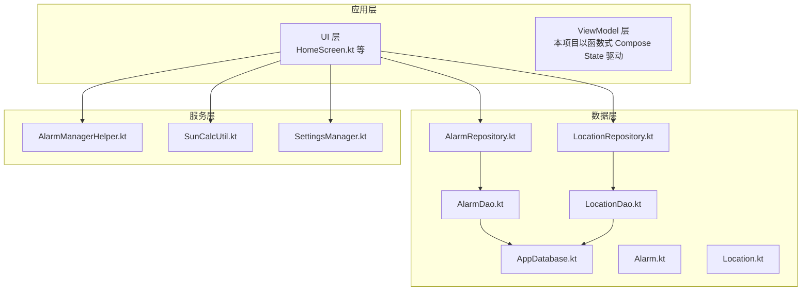
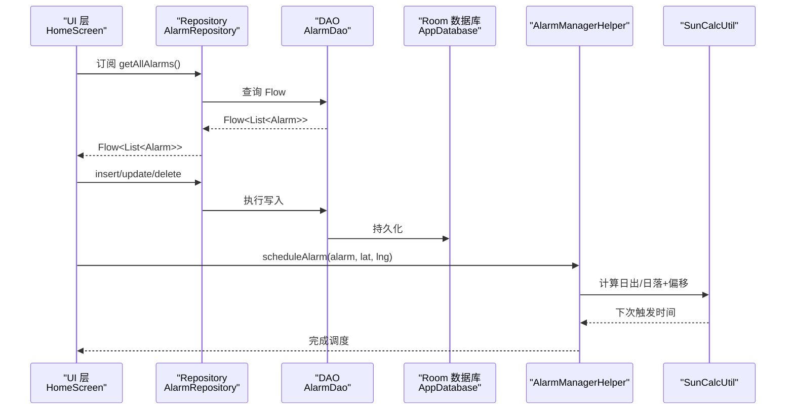
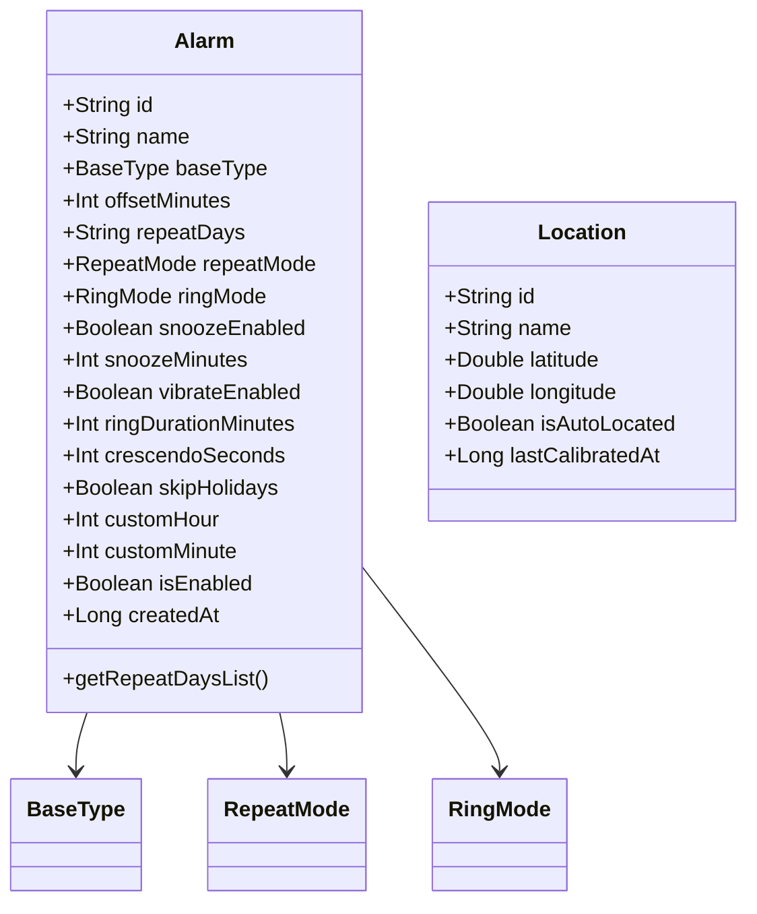
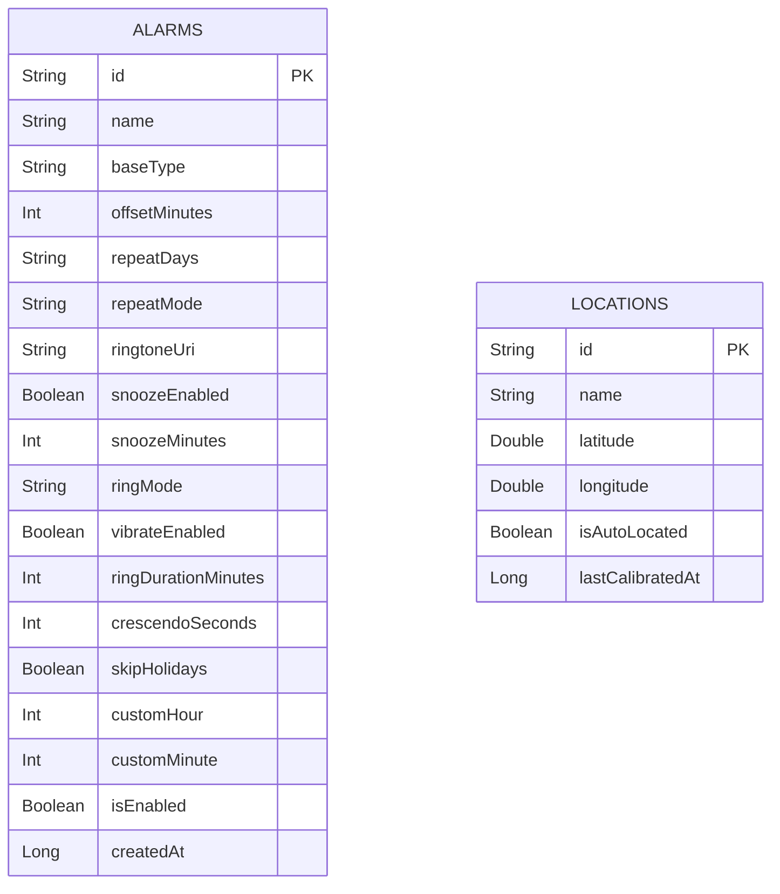
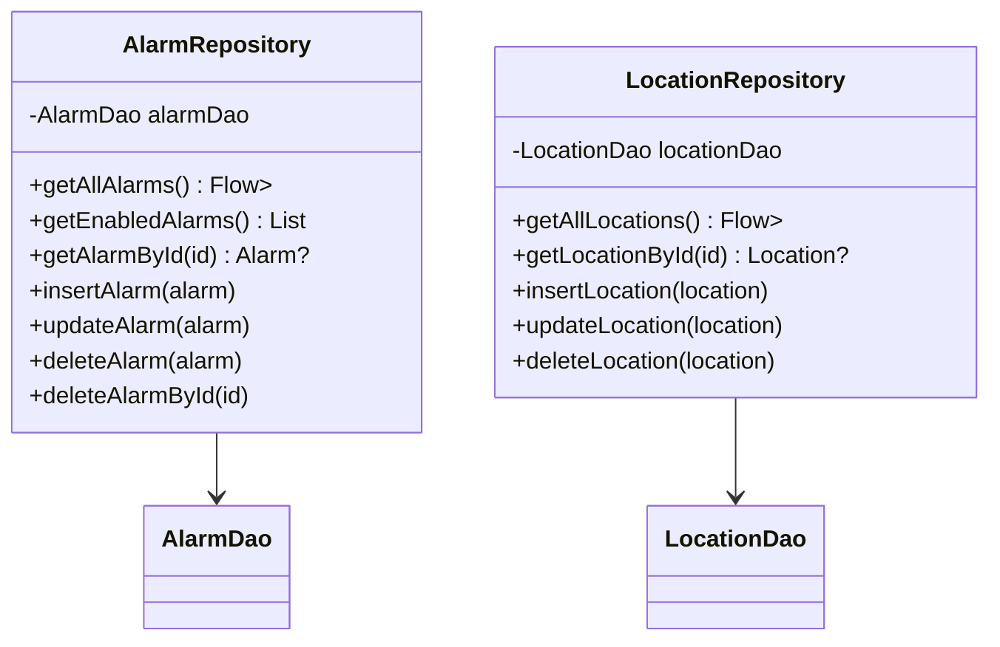
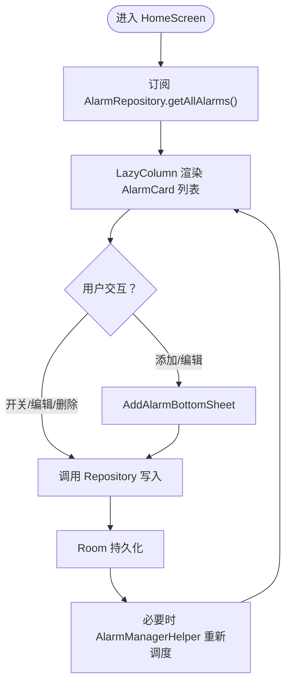
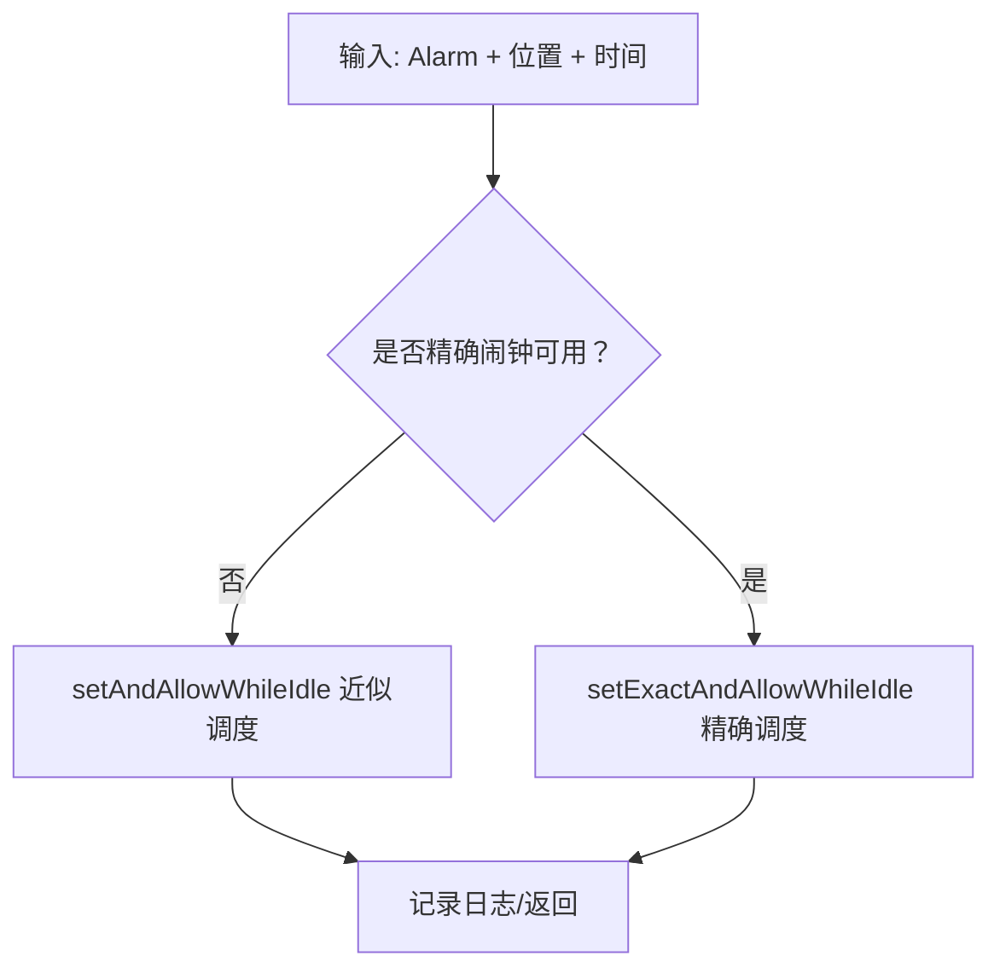
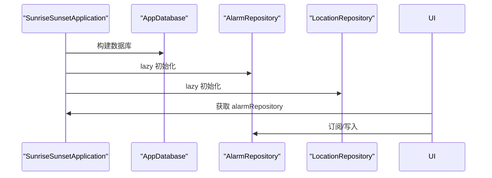
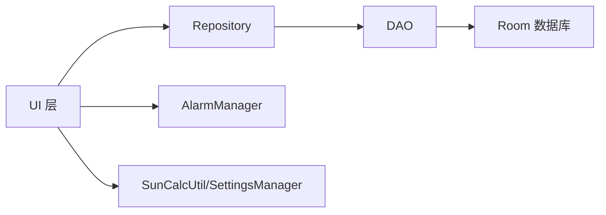

# 架构设计

<cite>
**本文引用的文件**
- [SunriseSunsetApplication.kt](file://app/src/main/java/com/snuabar/sunrisesunsetalarm/SunriseSunsetApplication.kt)
- [AppDatabase.kt](file://app/src/main/java/com/snuabar/sunrisesunsetalarm/data/database/AppDatabase.kt)
- [AlarmDao.kt](file://app/src/main/java/com/snuabar/sunrisesunsetalarm/data/database/AlarmDao.kt)
- [LocationDao.kt](file://app/src/main/java/com/snuabar/sunrisesunsetalarm/data/database/LocationDao.kt)
- [AlarmRepository.kt](file://app/src/main/java/com/snuabar/sunrisesunsetalarm/data/repository/AlarmRepository.kt)
- [LocationRepository.kt](file://app/src/main/java/com/snuabar/sunrisesunsetalarm/data/repository/LocationRepository.kt)
- [Alarm.kt](file://app/src/main/java/com/snuabar/sunrisesunsetalarm/data/model/Alarm.kt)
- [Location.kt](file://app/src/main/java/com/snuabar/sunrisesunsetalarm/data/model/Location.kt)
- [HomeScreen.kt](file://app/src/main/java/com/snuabar/sunrisesunsetalarm/ui/screens/HomeScreen.kt)
- [AlarmManagerHelper.kt](file://app/src/main/java/com/snuabar/sunrisesunsetalarm/service/AlarmManagerHelper.kt)
- [SunCalcUtil.kt](file://app/src/main/java/com/snuabar/sunrisesunsetalarm/util/SunCalcUtil.kt)
- [SettingsManager.kt](file://app/src/main/java/com/snuabar/sunrisesunsetalarm/util/SettingsManager.kt)
- [AlarmCard.kt](file://app/src/main/java/com/snuabar/sunrisesunsetalarm/ui/components/AlarmCard.kt)
- [AddAlarmBottomSheet.kt](file://app/src/main/java/com/snuabar/sunrisesunsetalarm/ui/components/AddAlarmBottomSheet.kt)
</cite>

## 目录
1. [引言](#引言)
2. [项目结构](#项目结构)
3. [核心组件](#核心组件)
4. [架构总览](#架构总览)
5. [详细组件分析](#详细组件分析)
6. [依赖分析](#依赖分析)
7. [性能考虑](#性能考虑)
8. [故障排查指南](#故障排查指南)
9. [结论](#结论)
10. [附录](#附录)

## 引言
本设计文档围绕“日出日落智能闹钟”应用，系统阐述基于 MVVM 的架构实现与数据流路径。重点覆盖：
- Model-View-ViewModel 各层职责与交互
- 数据流：从 UI 层数据绑定到 Repository 层数据访问，再到 Room 持久化
- 依赖注入与全局状态管理（Application 单例与懒加载）
- 架构决策的技术考量、性能优化策略与可扩展性设计
- 组件间依赖关系与数据流向图示

## 项目结构
应用采用按功能域分层的目录组织方式：
- data：模型、数据库、DAO、仓库
- service：系统服务封装（AlarmManager、通知等）
- ui：Compose UI 屏幕与可复用组件
- util：工具类（位置计算、设置管理、节假日等）
- receiver：广播接收器（闹钟触发、开机重排等）
- 主入口：Application、MainActivity

**图表来源**
- [HomeScreen.kt:65-66](file://app/src/main/java/com/snuabar/sunrisesunsetalarm/ui/screens/HomeScreen.kt#L65-L66)
- [AlarmRepository.kt:7-21](file://app/src/main/java/com/snuabar/sunrisesunsetalarm/data/repository/AlarmRepository.kt#L7-L21)
- [LocationRepository.kt:7-17](file://app/src/main/java/com/snuabar/sunrisesunsetalarm/data/repository/LocationRepository.kt#L7-L17)
- [AlarmDao.kt:8-29](file://app/src/main/java/com/snuabar/sunrisesunsetalarm/data/database/AlarmDao.kt#L8-L29)
- [LocationDao.kt:7-23](file://app/src/main/java/com/snuabar/sunrisesunsetalarm/data/database/LocationDao.kt#L7-L23)
- [AppDatabase.kt:10-17](file://app/src/main/java/com/snuabar/sunrisesunsetalarm/data/database/AppDatabase.kt#L10-L17)
- [AlarmManagerHelper.kt:17-54](file://app/src/main/java/com/snuabar/sunrisesunsetalarm/service/AlarmManagerHelper.kt#L17-L54)
- [SunCalcUtil.kt:6-45](file://app/src/main/java/com/snuabar/sunrisesunsetalarm/util/SunCalcUtil.kt#L6-L45)
- [SettingsManager.kt:8-48](file://app/src/main/java/com/snuabar/sunrisesunsetalarm/util/SettingsManager.kt#L8-L48)

**章节来源**
- [SunriseSunsetApplication.kt:18-66](file://app/src/main/java/com/snuabar/sunrisesunsetalarm/SunriseSunsetApplication.kt#L18-L66)
- [AppDatabase.kt:10-33](file://app/src/main/java/com/snuabar/sunrisesunsetalarm/data/database/AppDatabase.kt#L10-L33)

## 核心组件
- 应用入口与全局状态
  - Application 负责构建数据库、初始化仓库单例、调度周期任务与预热资源
  - 通过伴生对象暴露全局实例，供 UI 直接访问仓库
- 数据层
  - Room 数据库与 DAO 提供本地持久化
  - Repository 封装数据访问接口，向上提供 Flow/List
- UI 层
  - Compose Screen 使用 collectAsStateWithLifecycle 订阅 Flow，驱动界面刷新
  - 组件化 UI（AlarmCard、AddAlarmBottomSheet）负责具体交互
- 服务层
  - AlarmManagerHelper 负责闹钟调度与取消
  - SunCalcUtil 提供日出日落时间计算
  - SettingsManager 管理用户偏好与位置信息

**章节来源**
- [SunriseSunsetApplication.kt:20-66](file://app/src/main/java/com/snuabar/sunrisesunsetalarm/SunriseSunsetApplication.kt#L20-L66)
- [AlarmRepository.kt:7-21](file://app/src/main/java/com/snuabar/sunrisesunsetalarm/data/repository/AlarmRepository.kt#L7-L21)
- [LocationRepository.kt:7-17](file://app/src/main/java/com/snuabar/sunrisesunsetalarm/data/repository/LocationRepository.kt#L7-L17)
- [HomeScreen.kt:46-296](file://app/src/main/java/com/snuabar/sunrisesunsetalarm/ui/screens/HomeScreen.kt#L46-L296)
- [AlarmManagerHelper.kt:17-165](file://app/src/main/java/com/snuabar/sunrisesunsetalarm/service/AlarmManagerHelper.kt#L17-L165)
- [SunCalcUtil.kt:6-137](file://app/src/main/java/com/snuabar/sunrisesunsetalarm/util/SunCalcUtil.kt#L6-L137)
- [SettingsManager.kt:8-48](file://app/src/main/java/com/snuabar/sunrisesunsetalarm/util/SettingsManager.kt#L8-L48)

## 架构总览
MVVM 在本项目中的体现：
- Model：Room 实体 + Repository（数据源抽象）
- View：Compose Screen/Component（声明式 UI）
- ViewModel：以函数式状态与协程替代传统 ViewModel，通过 collectAsStateWithLifecycle 驱动 UI

数据流主路径：
- UI 读取：HomeScreen 订阅 AlarmRepository.getAllAlarms() 返回的 Flow，实时渲染列表
- UI 写入：用户操作触发 Repository 插入/更新/删除，Room 持久化
- 闹钟调度：AlarmManagerHelper 基于 SunCalcUtil 计算下次触发时间，调用系统 AlarmManager

**图表来源**
- [HomeScreen.kt:65-66](file://app/src/main/java/com/snuabar/sunrisesunsetalarm/ui/screens/HomeScreen.kt#L65-L66)
- [AlarmRepository.kt:8-18](file://app/src/main/java/com/snuabar/sunrisesunsetalarm/data/repository/AlarmRepository.kt#L8-L18)
- [AlarmDao.kt:9-28](file://app/src/main/java/com/snuabar/sunrisesunsetalarm/data/database/AlarmDao.kt#L9-L28)
- [AlarmManagerHelper.kt:21-54](file://app/src/main/java/com/snuabar/sunrisesunsetalarm/service/AlarmManagerHelper.kt#L21-L54)
- [SunCalcUtil.kt:19-44](file://app/src/main/java/com/snuabar/sunrisesunsetalarm/util/SunCalcUtil.kt#L19-L44)

## 详细组件分析

### 数据模型与实体
- Alarm 实体包含闹钟基础信息、重复规则、响铃行为等字段；支持从字符串解析/生成重复天列表
- Location 实体记录城市经纬度与自动定位标记

**图表来源**
- [Alarm.kt:6-37](file://app/src/main/java/com/snuabar/sunrisesunsetalarm/data/model/Alarm.kt#L6-L37)
- [Location.kt:6-15](file://app/src/main/java/com/snuabar/sunrisesunsetalarm/data/model/Location.kt#L6-L15)

**章节来源**
- [Alarm.kt:6-50](file://app/src/main/java/com/snuabar/sunrisesunsetalarm/data/model/Alarm.kt#L6-L50)
- [Location.kt:6-16](file://app/src/main/java/com/snuabar/sunrisesunsetalarm/data/model/Location.kt#L6-L16)

### 数据库与 DAO
- AppDatabase 声明实体与版本，提供 AlarmDao/LocationDao 抽象
- AlarmDao/LocationDao 定义查询、插入、更新、删除与迁移策略

**图表来源**
- [AppDatabase.kt:10-17](file://app/src/main/java/com/snuabar/sunrisesunsetalarm/data/database/AppDatabase.kt#L10-L17)
- [AlarmDao.kt:8-28](file://app/src/main/java/com/snuabar/sunrisesunsetalarm/data/database/AlarmDao.kt#L8-L28)
- [LocationDao.kt:7-22](file://app/src/main/java/com/snuabar/sunrisesunsetalarm/data/database/LocationDao.kt#L7-L22)

**章节来源**
- [AppDatabase.kt:10-33](file://app/src/main/java/com/snuabar/sunrisesunsetalarm/data/database/AppDatabase.kt#L10-L33)
- [AlarmDao.kt:8-29](file://app/src/main/java/com/snuabar/sunrisesunsetalarm/data/database/AlarmDao.kt#L8-L29)
- [LocationDao.kt:7-23](file://app/src/main/java/com/snuabar/sunrisesunsetalarm/data/database/LocationDao.kt#L7-L23)

### 仓库层（Repository）
- AlarmRepository/LocationRepository 对外暴露统一的数据访问接口，内部委托 DAO
- 支持 Flow 订阅与挂起函数同步调用，便于在 UI 中直接收集

**图表来源**
- [AlarmRepository.kt:7-21](file://app/src/main/java/com/snuabar/sunrisesunsetalarm/data/repository/AlarmRepository.kt#L7-L21)
- [LocationRepository.kt:7-17](file://app/src/main/java/com/snuabar/sunrisesunsetalarm/data/repository/LocationRepository.kt#L7-L17)

**章节来源**
- [AlarmRepository.kt:7-21](file://app/src/main/java/com/snuabar/sunrisesunsetalarm/data/repository/AlarmRepository.kt#L7-L21)
- [LocationRepository.kt:7-17](file://app/src/main/java/com/snuabar/sunrisesunsetalarm/data/repository/LocationRepository.kt#L7-L17)

### UI 层（MVVM 的 View 与状态）
- HomeScreen 使用 collectAsStateWithLifecycle 订阅 AlarmRepository 的 Flow，实现响应式 UI
- 通过 AlarmCard/ AddAlarmBottomSheet 组合 UI 与业务交互
- 初次启动自动初始化演示闹钟，简化用户体验

**图表来源**
- [HomeScreen.kt:65-247](file://app/src/main/java/com/snuabar/sunrisesunsetalarm/ui/screens/HomeScreen.kt#L65-L247)
- [AlarmCard.kt:21-91](file://app/src/main/java/com/snuabar/sunrisesunsetalarm/ui/components/AlarmCard.kt#L21-L91)
- [AddAlarmBottomSheet.kt:28-147](file://app/src/main/java/com/snuabar/sunrisesunsetalarm/ui/components/AddAlarmBottomSheet.kt#L28-L147)

**章节来源**
- [HomeScreen.kt:46-296](file://app/src/main/java/com/snuabar/sunrisesunsetalarm/ui/screens/HomeScreen.kt#L46-L296)
- [AlarmCard.kt:21-150](file://app/src/main/java/com/snuabar/sunrisesunsetalarm/ui/components/AlarmCard.kt#L21-L150)
- [AddAlarmBottomSheet.kt:28-480](file://app/src/main/java/com/snuabar/sunrisesunsetalarm/ui/components/AddAlarmBottomSheet.kt#L28-L480)

### 服务层（闹钟调度与计算）
- AlarmManagerHelper 负责：
  - 计算下一次触发时间（基于日出/日落或自定义时间+偏移）
  - 根据系统权限选择精确/近似闹钟
  - 创建 PendingIntent 并交由系统 AlarmManager 调度
- SunCalcUtil 提供日出/日落时间计算，支持极昼/极夜场景处理

**图表来源**
- [AlarmManagerHelper.kt:21-54](file://app/src/main/java/com/snuabar/sunrisesunsetalarm/service/AlarmManagerHelper.kt#L21-L54)
- [SunCalcUtil.kt:19-44](file://app/src/main/java/com/snuabar/sunrisesunsetalarm/util/SunCalcUtil.kt#L19-L44)

**章节来源**
- [AlarmManagerHelper.kt:17-165](file://app/src/main/java/com/snuabar/sunrisesunsetalarm/service/AlarmManagerHelper.kt#L17-L165)
- [SunCalcUtil.kt:6-137](file://app/src/main/java/com/snuabar/sunrisesunsetalarm/util/SunCalcUtil.kt#L6-L137)

### 全局状态与依赖注入
- Application 单例持有全局数据库实例，并通过 lazy 初始化仓库，避免重复创建
- UI 通过上下文获取 Application 实例，直接访问仓库，形成简化的“应用级 DI”
- 预热节假日数据与定时重排任务，提升运行期稳定性

**图表来源**
- [SunriseSunsetApplication.kt:25-34](file://app/src/main/java/com/snuabar/sunrisesunsetalarm/SunriseSunsetApplication.kt#L25-L34)
- [AlarmRepository.kt:7-21](file://app/src/main/java/com/snuabar/sunrisesunsetalarm/data/repository/AlarmRepository.kt#L7-L21)
- [LocationRepository.kt:7-17](file://app/src/main/java/com/snuabar/sunrisesunsetalarm/data/repository/LocationRepository.kt#L7-L17)

**章节来源**
- [SunriseSunsetApplication.kt:18-66](file://app/src/main/java/com/snuabar/sunrisesunsetalarm/SunriseSunsetApplication.kt#L18-L66)

## 依赖分析
- 组件耦合与内聚
  - UI 仅依赖 Repository 接口，不直接依赖 DAO/数据库，保持高内聚低耦合
  - Repository 仅依赖 DAO，DAO 依赖 Room，职责清晰
- 外部依赖
  - Room 用于本地持久化
  - AlarmManager 用于系统级闹钟调度
  - Compose 用于声明式 UI
- 可能的循环依赖
  - 当前结构无循环依赖，UI 不反向依赖 Repository 实现

**图表来源**
- [HomeScreen.kt:65-66](file://app/src/main/java/com/snuabar/sunrisesunsetalarm/ui/screens/HomeScreen.kt#L65-L66)
- [AlarmRepository.kt:7-21](file://app/src/main/java/com/snuabar/sunrisesunsetalarm/data/repository/AlarmRepository.kt#L7-L21)
- [AlarmDao.kt:8-29](file://app/src/main/java/com/snuabar/sunrisesunsetalarm/data/database/AlarmDao.kt#L8-L29)
- [AlarmManagerHelper.kt:17-54](file://app/src/main/java/com/snuabar/sunrisesunsetalarm/service/AlarmManagerHelper.kt#L17-L54)
- [SunCalcUtil.kt:6-45](file://app/src/main/java/com/snuabar/sunrisesunsetalarm/util/SunCalcUtil.kt#L6-L45)

**章节来源**
- [AlarmRepository.kt:7-21](file://app/src/main/java/com/snuabar/sunrisesunsetalarm/data/repository/AlarmRepository.kt#L7-L21)
- [AlarmDao.kt:8-29](file://app/src/main/java/com/snuabar/sunrisesunsetalarm/data/database/AlarmDao.kt#L8-L29)

## 性能考虑
- 数据流与响应式更新
  - 使用 Flow 订阅数据库变更，避免手动刷新，减少无效渲染
- 计算开销控制
  - 日出/日落计算仅在位置变化或首次渲染时触发
  - AlarmManagerHelper 在权限不足时回退为近似调度，保证可用性
- I/O 与后台任务
  - Application 启动时异步预热节假日数据，避免阻塞主线程
  - 周期性重排任务通过 WorkManager 异步执行，降低前台影响
- UI 渲染优化
  - 列表使用 LazyColumn，卡片组件拆分职责，减少重组范围

[本节为通用性能建议，无需特定文件引用]

## 故障排查指南
- 闹钟未按时响起
  - 检查系统“精确闹钟”权限是否授予；若未授予，AlarmManagerHelper 会回退为近似调度
  - 核对 AlarmManagerHelper 的日志输出，确认调度成功
- 位置变更后闹钟时间未更新
  - 确认 HomeScreen 已重新调度所有启用的闹钟
  - 检查 Location 权限与权限请求流程
- 数据不同步
  - 确认 UI 已订阅 Repository 的 Flow
  - 检查 Room 迁移是否成功，数据库版本与迁移脚本匹配

**章节来源**
- [AlarmManagerHelper.kt:32-53](file://app/src/main/java/com/snuabar/sunrisesunsetalarm/service/AlarmManagerHelper.kt#L32-L53)
- [HomeScreen.kt:260-268](file://app/src/main/java/com/snuabar/sunrisesunsetalarm/ui/screens/HomeScreen.kt#L260-L268)

## 结论
本项目以 MVVM 为核心，结合 Compose 响应式 UI、Room 持久化与 AlarmManager 系统服务，构建了清晰、可维护且高性能的智能闹钟应用。通过 Application 全局状态与懒加载仓库，简化了依赖注入与生命周期管理；通过 Flow 驱动的响应式数据流，确保 UI 与数据一致。未来可在以下方面进一步演进：
- 引入更完善的 ViewModel 与 Navigation
- 增加 Repository 缓存层与离线优先策略
- 扩展 WorkManager 的任务编排与错误重试
- 增设单元测试与集成测试覆盖关键路径

[本节为总结性内容，无需特定文件引用]

## 附录
- 关键配置与常量
  - 数据库版本与迁移脚本
  - 默认演示闹钟初始化标志
  - 偏移量与重复模式枚举值

**章节来源**
- [AppDatabase.kt:19-32](file://app/src/main/java/com/snuabar/sunrisesunsetalarm/data/database/AppDatabase.kt#L19-L32)
- [HomeScreen.kt:68-79](file://app/src/main/java/com/snuabar/sunrisesunsetalarm/ui/screens/HomeScreen.kt#L68-L79)
- [Alarm.kt:39-49](file://app/src/main/java/com/snuabar/sunrisesunsetalarm/data/model/Alarm.kt#L39-L49)