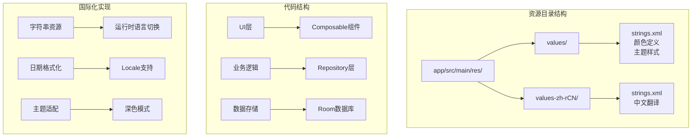
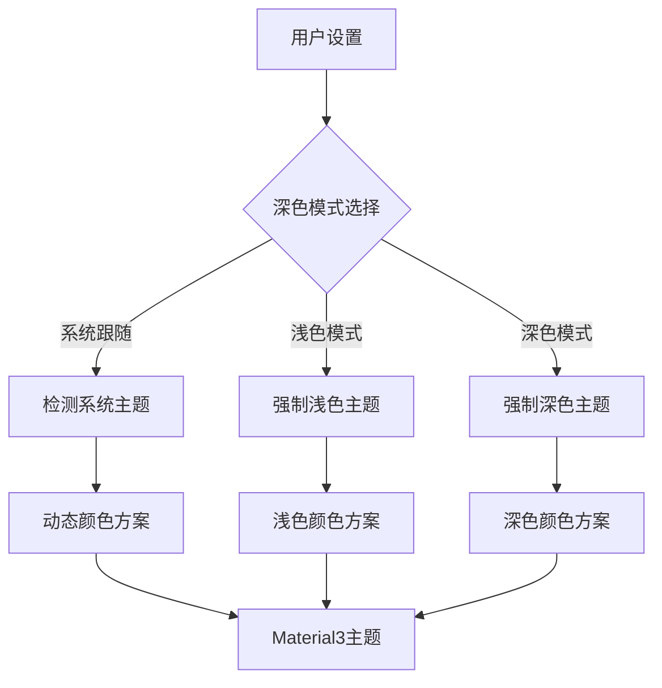
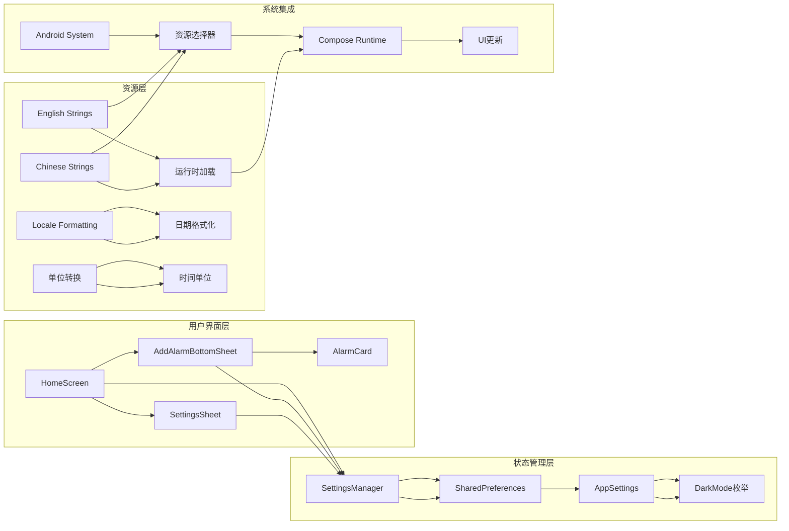
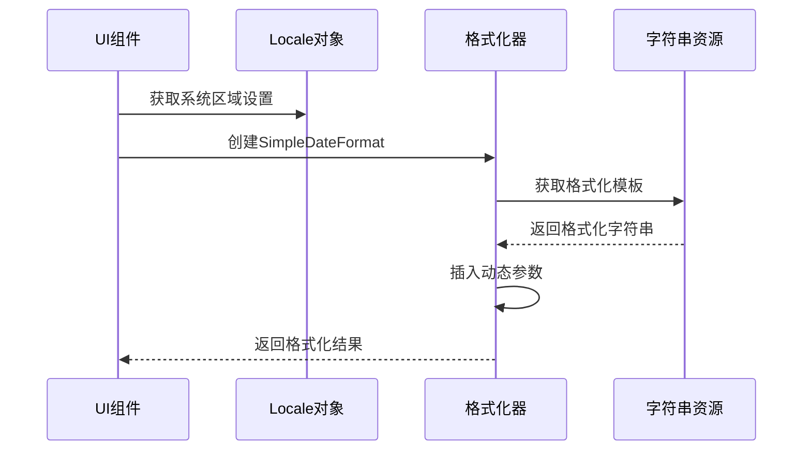
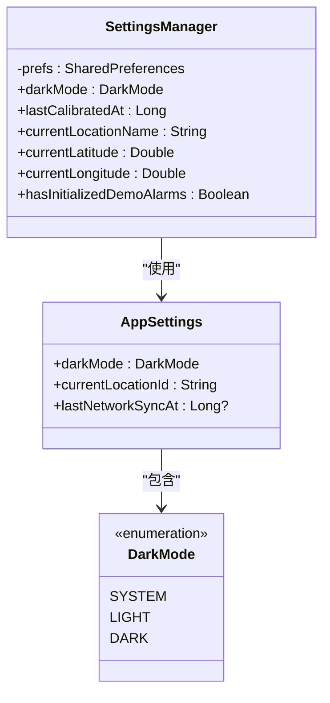
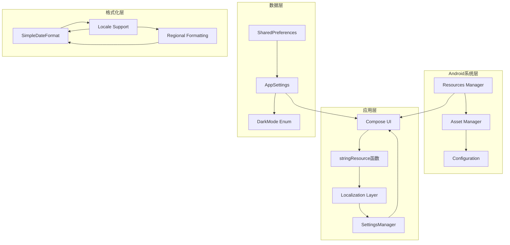

# 国际化支持

<cite>
**本文档引用的文件**
- [strings.xml](file://app/src/main/res/values/strings.xml)
- [strings.xml](file://app/src/main/res/values-zh-rCN/strings.xml)
- [SunriseSunsetApplication.kt](file://app/src/main/java/com/snuabar/sunrisesunsetalarm/SunriseSunsetApplication.kt)
- [SettingsManager.kt](file://app/src/main/java/com/snuabar/sunrisesunsetalarm/util/SettingsManager.kt)
- [AppSettings.kt](file://app/src/main/java/com/snuabar/sunrisesunsetalarm/data/model/AppSettings.kt)
- [Theme.kt](file://app/src/main/java/com/snuabar/sunrisesunsetalarm/ui/theme/Theme.kt)
- [AddAlarmBottomSheet.kt](file://app/src/main/java/com/snuabar/sunrisesunsetalarm/ui/components/AddAlarmBottomSheet.kt)
- [HomeScreen.kt](file://app/src/main/java/com/snuabar/sunrisesunsetalarm/ui/screens/HomeScreen.kt)
- [colors.xml](file://app/src/main/res/values/colors.xml)
- [themes.xml](file://app/src/main/res/values/themes.xml)
- [build.gradle.kts](file://app/build.gradle.kts)
</cite>

## 目录
1. [简介](#简介)
2. [项目结构](#项目结构)
3. [核心组件](#核心组件)
4. [架构概览](#架构概览)
5. [详细组件分析](#详细组件分析)
6. [依赖关系分析](#依赖关系分析)
7. [性能考虑](#性能考虑)
8. [故障排除指南](#故障排除指南)
9. [结论](#结论)

## 简介

这是一个基于Android Jetpack Compose开发的日出日落闹钟应用，实现了完整的国际化支持。应用通过Android标准的资源管理机制，为英文和简体中文提供了完整的本地化支持。该应用不仅支持文本内容的多语言显示，还支持日期格式、数字单位等本地化特性。

## 项目结构

应用采用标准的Android项目结构，国际化资源按照Android规范进行组织：

**图表来源**
- [strings.xml:1-115](file://app/src/main/res/values/strings.xml#L1-L115)
- [strings.xml:1-115](file://app/src/main/res/values-zh-rCN/strings.xml#L1-L115)

**章节来源**
- [strings.xml:1-115](file://app/src/main/res/values/strings.xml#L1-L115)
- [strings.xml:1-115](file://app/src/main/res/values-zh-rCN/strings.xml#L1-L115)

## 核心组件

### 字符串资源管理

应用实现了双语支持，包含完整的英文和简体中文资源：

| 资源类别 | 英文资源数量 | 中文资源数量 | 差异说明 |
|---------|-------------|-------------|----------|
| 应用标题 | 1 | 1 | 完全对应 |
| 导航栏 | 3 | 3 | 功能按钮翻译 |
| 天气信息 | 4 | 4 | 日出日落标签 |
| 消息提示 | 6 | 6 | 用户操作反馈 |
| 设置界面 | 13 | 13 | 配置选项翻译 |
| 闹钟编辑 | 22 | 22 | 编辑界面元素 |
| 城市选择 | 8 | 8 | 地理位置功能 |
| 全屏闹钟 | 4 | 4 | 闹钟界面 |

### 主题与外观国际化

应用支持深色模式，并根据系统设置自动适配：

**图表来源**
- [Theme.kt:71-105](file://app/src/main/java/com/snuabar/sunrisesunsetalarm/ui/theme/Theme.kt#L71-L105)

**章节来源**
- [Theme.kt:1-106](file://app/src/main/java/com/snuabar/sunrisesunsetalarm/ui/theme/Theme.kt#L1-L106)

## 架构概览

应用的国际化架构基于Android标准的资源管理机制，结合Jetpack Compose的状态管理：

**图表来源**
- [HomeScreen.kt:80-344](file://app/src/main/java/com/snuabar/sunrisesunsetalarm/ui/screens/HomeScreen.kt#L80-L344)
- [SettingsManager.kt:8-48](file://app/src/main/java/com/snuabar/sunrisesunsetalarm/util/SettingsManager.kt#L8-L48)

## 详细组件分析

### 字符串资源系统

应用的字符串资源系统采用了分组管理的方式，每个功能模块都有对应的资源键：

#### 核心功能字符串

| 功能模块 | 资源键前缀 | 数量 | 用途描述 |
|---------|-----------|------|----------|
| 应用基础 | app_name, top_bar_title | 2 | 应用标识和标题栏 |
| 权限提示 | snackbar_exact_alarm_permission, snackbar_location_permission | 6 | 用户权限请求反馈 |
| 设置界面 | settings_title, dark_mode_title, location_settings | 13 | 配置界面元素 |
| 闹钟编辑 | edit_alarm, add_alarm, alarm_name_label | 22 | 闹钟创建和编辑界面 |
| 城市选择 | select_city, search_city, use_current_location | 8 | 地理位置选择功能 |
| 全屏闹钟 | default_alarm_name_short, cd_snooze, dismiss_alarm | 4 | 闹钟响铃界面 |

#### 格式化字符串处理

应用使用了参数化的字符串格式，支持动态内容插入：

**图表来源**
- [HomeScreen.kt:161-163](file://app/src/main/java/com/snuabar/sunrisesunsetalarm/ui/screens/HomeScreen.kt#L161-L163)

**章节来源**
- [strings.xml:1-115](file://app/src/main/res/values/strings.xml#L1-L115)
- [strings.xml:1-115](file://app/src/main/res/values-zh-rCN/strings.xml#L1-L115)

### 设置管理系统

应用通过SettingsManager类统一管理用户偏好设置，包括语言、主题、位置等配置：

**图表来源**
- [SettingsManager.kt:8-48](file://app/src/main/java/com/snuabar/sunrisesunsetalarm/util/SettingsManager.kt#L8-L48)
- [AppSettings.kt:3-11](file://app/src/main/java/com/snuabar/sunrisesunsetalarm/data/model/AppSettings.kt#L3-L11)

**章节来源**
- [SettingsManager.kt:1-49](file://app/src/main/java/com/snuabar/sunrisesunsetalarm/util/SettingsManager.kt#L1-L49)
- [AppSettings.kt:1-12](file://app/src/main/java/com/snuabar/sunrisesunsetalarm/data/model/AppSettings.kt#L1-L12)

### UI组件国际化实现

应用的UI组件通过stringResource函数动态加载本地化字符串：

#### 主屏幕国际化特性

主屏幕实现了完整的国际化支持，包括：

- **顶部应用栏**：显示本地化的应用标题
- **太阳时间显示**：根据当前地理位置计算并显示日出日落时间
- **闹钟列表**：支持本地化的重复模式和时间格式
- **设置界面**：提供深色模式切换和位置设置

#### 闹钟编辑界面国际化

闹钟编辑底部表单支持多语言：

- **基础类型选择**：日出、日落、自定义三种模式
- **重复模式设置**：一次性、每日、工作日、周末、自定义
- **高级设置**：响铃模式、振动、渐强等功能的本地化描述
- **时间单位**：分钟和秒的本地化显示

**章节来源**
- [HomeScreen.kt:193-344](file://app/src/main/java/com/snuabar/sunrisesunsetalarm/ui/screens/HomeScreen.kt#L193-L344)
- [AddAlarmBottomSheet.kt:30-491](file://app/src/main/java/com/snuabar/sunrisesunsetalarm/ui/components/AddAlarmBottomSheet.kt#L30-L491)

## 依赖关系分析

应用的国际化实现涉及多个层次的依赖关系：

**图表来源**
- [HomeScreen.kt:97-98](file://app/src/main/java/com/snuabar/sunrisesunsetalarm/ui/screens/HomeScreen.kt#L97-L98)
- [Theme.kt:71-105](file://app/src/main/java/com/snuabar/sunrisesunsetalarm/ui/theme/Theme.kt#L71-L105)

**章节来源**
- [HomeScreen.kt:1-450](file://app/src/main/java/com/snuabar/sunrisesunsetalarm/ui/screens/HomeScreen.kt#L1-L450)
- [Theme.kt:1-106](file://app/src/main/java/com/snuabar/sunrisesunsetalarm/ui/theme/Theme.kt#L1-L106)

## 性能考虑

### 资源加载优化

应用在国际化实现中采用了以下性能优化策略：

- **延迟加载**：字符串资源按需加载，避免启动时的资源预加载
- **缓存机制**：Compose的remember函数缓存了常用的UI状态
- **懒加载仓库**：数据库连接和仓库实例采用lazy初始化

### 内存管理

- **轻量级状态**：SettingsManager使用SharedPreferences存储轻量级配置
- **避免内存泄漏**：正确处理Compose中的remember引用和协程作用域

## 故障排除指南

### 常见国际化问题

#### 字符串显示异常

**问题症状**：某些字符串显示为英文或乱码
**解决方案**：
1. 检查strings.xml文件是否完整
2. 验证资源文件编码是否为UTF-8
3. 确认字符串键名是否一致

#### 日期格式错误

**问题症状**：日期显示不符合当地习惯
**解决方案**：
1. 使用Locale.getDefault()获取系统区域设置
2. 通过SimpleDateFormat实现本地化格式化
3. 在不同语言环境下测试日期显示

#### 主题适配问题

**问题症状**：深色模式切换不生效
**解决方案**：
1. 检查DarkMode枚举值的正确性
2. 验证Theme.kt中的颜色方案配置
3. 确认系统深色模式设置

**章节来源**
- [HomeScreen.kt:134-159](file://app/src/main/java/com/snuabar/sunrisesunsetalarm/ui/screens/HomeScreen.kt#L134-L159)
- [Theme.kt:71-105](file://app/src/main/java/com/snuabar/sunrisesunsetalarm/ui/theme/Theme.kt#L71-L105)

## 结论

该日出日落闹钟应用实现了完整的国际化支持，具有以下特点：

### 技术优势

- **标准实现**：严格按照Android国际化最佳实践实现
- **全面覆盖**：涵盖UI文本、日期格式、数字单位等各个方面
- **性能优化**：采用延迟加载和缓存机制提升用户体验
- **扩展性强**：易于添加新的语言支持

### 实现特色

- **双语支持**：英文和简体中文的完整本地化
- **动态适配**：支持深色模式和系统主题跟随
- **用户友好**：提供直观的设置界面和操作反馈
- **技术先进**：基于Jetpack Compose和现代Android架构

该实现为Android应用的国际化开发提供了良好的参考范例，展示了如何在保持代码简洁的同时实现全面的本地化支持。