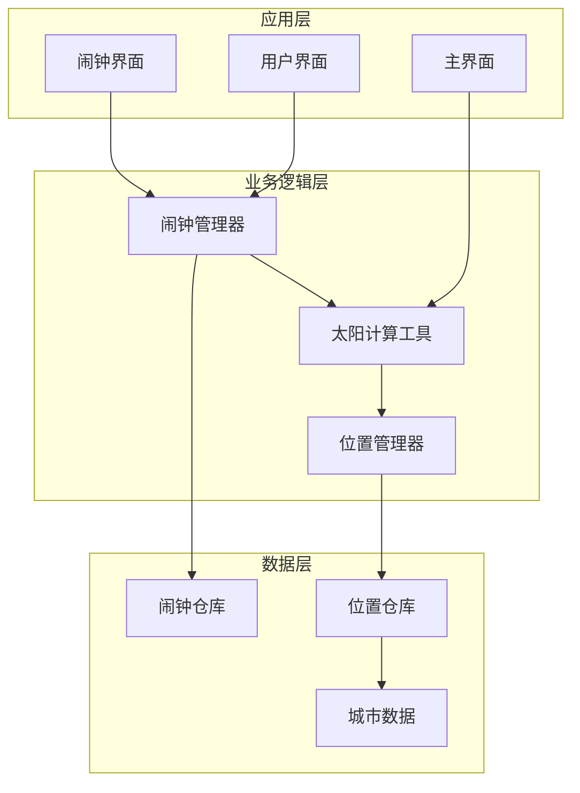
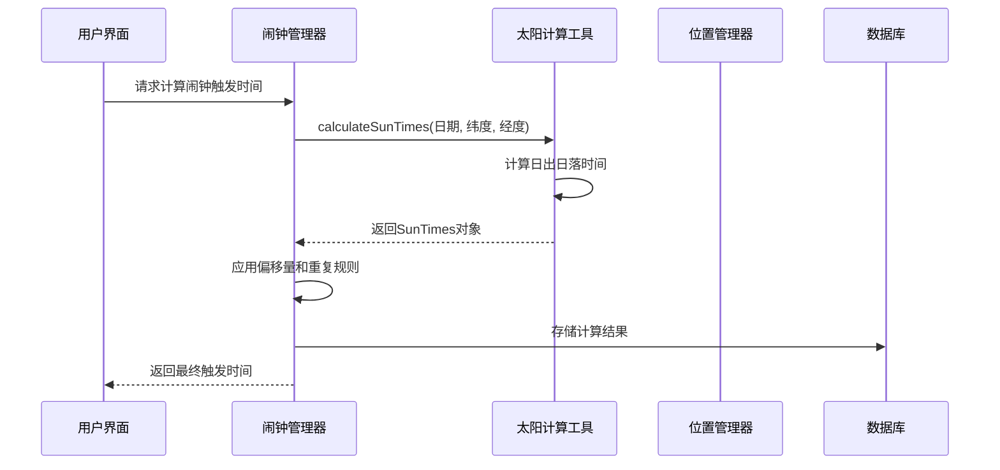
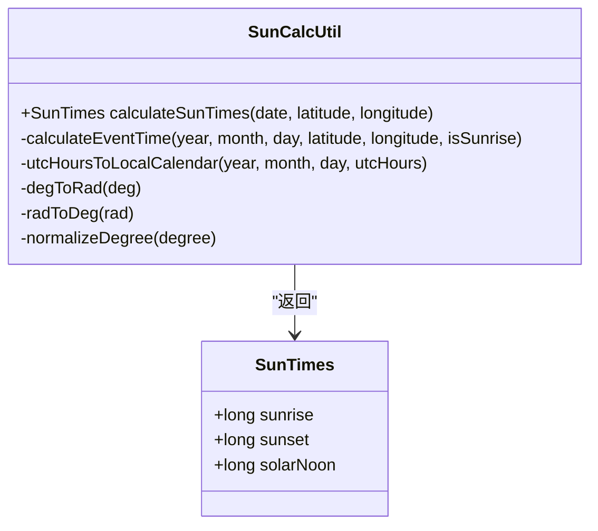
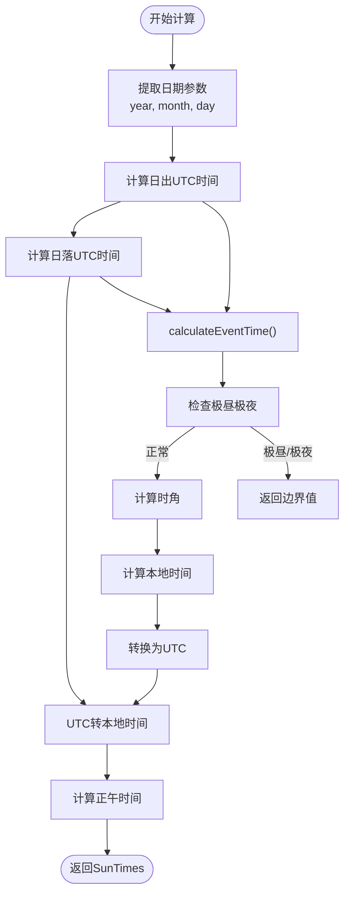
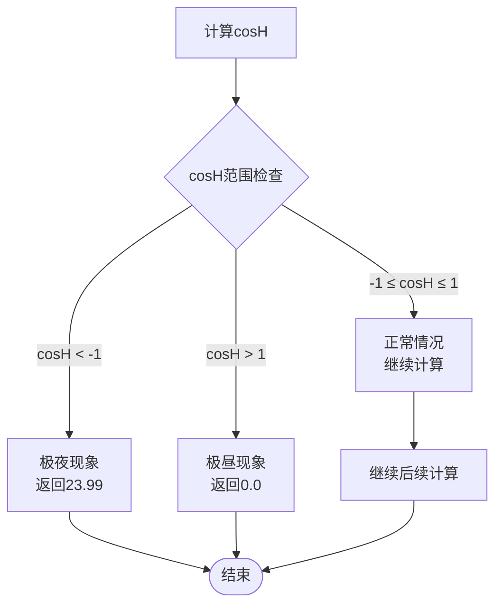
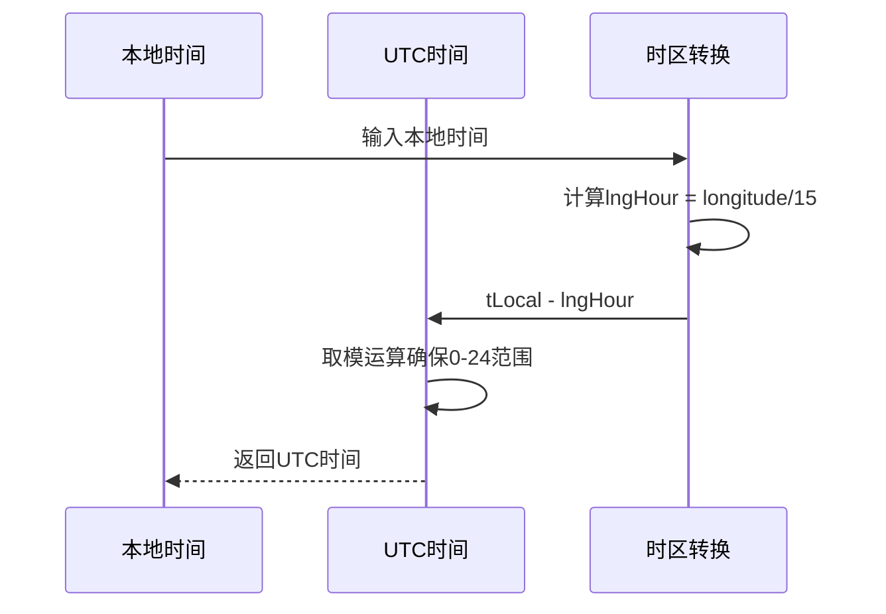
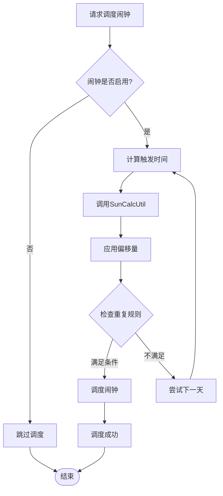
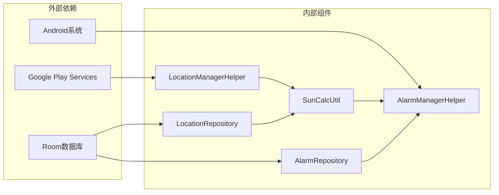

# 天文时间计算

<cite>
**本文档引用的文件**
- [SunCalcUtil.kt](file://app/src/main/java/com/snuabar/sunrisesunsetalarm/util/SunCalcUtil.kt)
- [AlarmManagerHelper.kt](file://app/src/main/java/com/snuabar/sunrisesunsetalarm/service/AlarmManagerHelper.kt)
- [LocationManagerHelper.kt](file://app/src/main/java/com/snuabar/sunrisesunsetalarm/util/LocationManagerHelper.kt)
- [Location.kt](file://app/src/main/java/com/snuabar/sunrisesunsetalarm/data/model/Location.kt)
- [LocationRepository.kt](file://app/src/main/java/com/snuabar/sunrisesunsetalarm/data/repository/LocationRepository.kt)
- [CityData.kt](file://app/src/main/java/com/snuabar/sunrisesunsetalarm/data/CityData.kt)
- [LocationPicker.kt](file://app/src/main/java/com/snuabar/sunrisesunsetalarm/ui/components/LocationPicker.kt)
- [Alarm.kt](file://app/src/main/java/com/snuabar/sunrisesunsetalarm/data/model/Alarm.kt)
- [HomeScreen.kt](file://app/src/main/java/com/snuabar/sunrisesunsetalarm/ui/screens/HomeScreen.kt)
- [README.md](file://README.md)
</cite>

## 目录
1. [简介](#简介)
2. [项目结构](#项目结构)
3. [核心组件](#核心组件)
4. [架构概览](#架构概览)
5. [详细组件分析](#详细组件分析)
6. [依赖关系分析](#依赖关系分析)
7. [性能考量](#性能考量)
8. [故障排除指南](#故障排除指南)
9. [结论](#结论)

## 简介
本项目实现了基于NOAA简化太阳计算算法的天文时间计算功能，能够精确计算任意日期、任意地理位置的日出、日落时间和正午时间。该算法无需联网即可运行，为智能闹钟应用提供了可靠的天文时间基础。

## 项目结构
项目采用典型的Android MVVM架构，主要包含以下模块：
- **util**: 工具类库，包含天文计算核心算法
- **data**: 数据模型和仓库层
- **service**: 后台服务和闹钟管理
- **ui**: 用户界面组件
- **receiver**: 系统广播接收器

**图表来源**
- [SunCalcUtil.kt:1-138](file://app/src/main/java/com/snuabar/sunrisesunsetalarm/util/SunCalcUtil.kt#L1-L138)
- [AlarmManagerHelper.kt:1-166](file://app/src/main/java/com/snuabar/sunrisesunsetalarm/service/AlarmManagerHelper.kt#L1-L166)

**章节来源**
- [README.md:49-92](file://README.md#L49-L92)

## 核心组件
本项目的核心是SunCalcUtil类，它实现了完整的NOAA简化太阳计算算法，包括：
- 日出日落时间计算
- 正午时间计算
- 极昼极夜现象处理
- 时区转换机制

**章节来源**
- [SunCalcUtil.kt:6-45](file://app/src/main/java/com/snuabar/sunrisesunsetalarm/util/SunCalcUtil.kt#L6-L45)

## 架构概览
系统采用分层架构设计，各层职责清晰分离：

**图表来源**
- [AlarmManagerHelper.kt:62-151](file://app/src/main/java/com/snuabar/sunrisesunsetalarm/service/AlarmManagerHelper.kt#L62-L151)
- [SunCalcUtil.kt:19-45](file://app/src/main/java/com/snuabar/sunrisesunsetalarm/util/SunCalcUtil.kt#L19-L45)

## 详细组件分析

### SunCalcUtil类详解

SunCalcUtil是整个天文计算的核心，实现了NOAA简化太阳计算算法的完整流程：

#### 核心数据结构

**图表来源**
- [SunCalcUtil.kt:8-45](file://app/src/main/java/com/snuabar/sunrisesunsetalarm/util/SunCalcUtil.kt#L8-L45)

#### calculateSunTimes方法工作流程

该方法是整个算法的入口点，执行以下步骤：

1. **参数提取**: 从Calendar对象中提取年、月、日信息
2. **日出日落计算**: 分别调用calculateEventTime计算日出和日落的UTC时间
3. **UTC转本地**: 将UTC时间转换为本地时间
4. **正午时间计算**: 基于日出日落时间计算正午时间

**图表来源**
- [SunCalcUtil.kt:19-45](file://app/src/main/java/com/snuabar/sunrisesunsetalarm/util/SunCalcUtil.kt#L19-L45)
- [SunCalcUtil.kt:47-110](file://app/src/main/java/com/snuabar/sunrisesunsetalarm/util/SunCalcUtil.kt#L47-L110)

#### calculateEventTime方法详细实现

这是NOAA算法的核心实现，包含12个关键步骤：

**第1步：计算年中日序数**
- 使用公式计算一年中的第几天
- 考虑闰年的特殊情况

**第2步：经度转换为时区小时**
- 经度除以15得到时区小时值
- 用于后续时间计算

**第3步：估算近似时间**
- 日出：从6点开始估算
- 日落：从18点开始估算
- 考虑经度对时间的影响

**第4步：计算平均异常**
- 基于地球公转运动计算平均异常角度

**第5步：计算真太阳时**
- 结合平均异常和摄动项计算真太阳时

**第6步：计算赤经**
- 通过球面三角函数计算太阳的赤经

**第7步：象限调整**
- 确保赤经在正确的象限范围内

**第8步：计算赤纬**
- 计算太阳的赤纬角度

**第9步：计算时角**
- 使用球面三角函数计算太阳时角
- 这里应用了重要的球面三角恒等式

**第10步：极昼极夜检查**
- 当cosH < -1或cosH > 1时，表示极昼或极夜
- 返回边界值而非实际时间

**第11步：计算本地时角**
- 根据日出或日落分别计算不同的时角

**第12步：转换为UTC时间**
- 将本地时间转换为UTC时间

**章节来源**
- [SunCalcUtil.kt:47-110](file://app/src/main/java/com/snuabar/sunrisesunsetalarm/util/SunCalcUtil.kt#L47-L110)

#### 极昼极夜现象处理机制

算法通过检查cosH值来识别极昼极夜现象：

**图表来源**
- [SunCalcUtil.kt:92-95](file://app/src/main/java/com/snuabar/sunrisesunsetalarm/util/SunCalcUtil.kt#L92-L95)

#### 时区转换和UTC处理

算法采用了巧妙的UTC处理策略：

**图表来源**
- [SunCalcUtil.kt:115-127](file://app/src/main/java/com/snuabar/sunrisesunsetalarm/util/SunCalcUtil.kt#L115-L127)

**章节来源**
- [SunCalcUtil.kt:115-127](file://app/src/main/java/com/snuabar/sunrisesunsetalarm/util/SunCalcUtil.kt#L115-L127)

### 位置管理系统

系统提供了多种位置获取方式：

#### GPS定位管理
- 使用Google Play Services获取精确位置
- 支持一次性定位和持续位置更新
- 实现了协程友好的异步接口

#### 城市数据管理
- 内置500+城市的经纬度数据
- 支持模糊搜索和网络Geocoder搜索
- 提供本地搜索和网络搜索双重机制

**章节来源**
- [LocationManagerHelper.kt:14-79](file://app/src/main/java/com/snuabar/sunrisesunsetalarm/util/LocationManagerHelper.kt#L14-L79)
- [CityData.kt:10-554](file://app/src/main/java/com/snuabar/sunrisesunsetalarm/data/CityData.kt#L10-L554)

### 闹钟管理系统

AlarmManagerHelper负责闹钟的调度和管理：

**图表来源**
- [AlarmManagerHelper.kt:21-54](file://app/src/main/java/com/snuabar/sunrisesunsetalarm/service/AlarmManagerHelper.kt#L21-L54)
- [AlarmManagerHelper.kt:62-151](file://app/src/main/java/com/snuabar/sunrisesunsetalarm/service/AlarmManagerHelper.kt#L62-L151)

**章节来源**
- [AlarmManagerHelper.kt:62-151](file://app/src/main/java/com/snuabar/sunrisesunsetalarm/service/AlarmManagerHelper.kt#L62-L151)

## 依赖关系分析

系统各组件之间的依赖关系如下：

**图表来源**
- [SunCalcUtil.kt:1-138](file://app/src/main/java/com/snuabar/sunrisesunsetalarm/util/SunCalcUtil.kt#L1-L138)
- [AlarmManagerHelper.kt:1-166](file://app/src/main/java/com/snuabar/sunrisesunsetalarm/service/AlarmManagerHelper.kt#L1-L166)

**章节来源**
- [AlarmManagerHelper.kt:1-166](file://app/src/main/java/com/snuabar/sunrisesunsetalarm/service/AlarmManagerHelper.kt#L1-L166)

## 性能考量

### 算法复杂度分析
- **时间复杂度**: O(1) - 所有计算都是确定性的数学运算
- **空间复杂度**: O(1) - 使用固定大小的临时变量
- **计算开销**: 主要集中在三角函数计算和浮点运算

### 优化建议
1. **缓存机制**: 对于连续日期的计算，可以实现简单的缓存避免重复计算
2. **批量处理**: 在批量计算多个日期时，可以考虑并行处理
3. **精度控制**: 根据需求调整三角函数的精度，平衡准确性和性能
4. **内存管理**: 避免在热路径上创建不必要的对象

### 线程安全
- SunCalcUtil是单例对象，线程安全
- 但需要确保传入的Calendar对象不是共享状态
- 建议在调用前创建独立的Calendar实例

## 故障排除指南

### 常见问题及解决方案

#### 1. 极昼极夜计算异常
**症状**: 某些高纬度地区出现日出时间为23:59或00:00
**原因**: 极昼极夜现象导致cosH超出[-1,1]范围
**解决方案**: 算法已内置处理，直接使用返回的边界值

#### 2. 时区转换错误
**症状**: 计算出的时间与本地时间不符
**原因**: 经度转换或时区处理错误
**解决方案**: 检查longitude/15的计算和取模运算

#### 3. GPS定位失败
**症状**: 无法获取当前位置
**原因**: 权限不足或GPS服务不可用
**解决方案**: 检查权限声明和GPS服务状态

#### 4. 闹钟调度失败
**症状**: 闹钟无法按时响起
**原因**: Android版本限制或权限问题
**解决方案**: 检查exact alarm权限和系统设置

**章节来源**
- [SunCalcUtil.kt:92-95](file://app/src/main/java/com/snuabar/sunrisesunsetalarm/util/SunCalcUtil.kt#L92-L95)
- [AlarmManagerHelper.kt:32-46](file://app/src/main/java/com/snuabar/sunrisesunsetalarm/service/AlarmManagerHelper.kt#L32-L46)

## 结论

本项目成功实现了基于NOAA简化太阳计算算法的天文时间计算功能，具有以下特点：

1. **算法准确性**: 严格按照NOAA算法实现，计算精度高
2. **功能完整性**: 支持日出、日落、正午时间计算，包含极昼极夜处理
3. **用户体验**: 提供多种位置获取方式，界面友好
4. **系统集成**: 与Android系统深度集成，支持精确闹钟调度

该实现为智能闹钟应用提供了可靠的天文时间基础，能够满足日常使用和高精度需求。通过合理的架构设计和性能优化，系统能够在保证准确性的同时提供良好的用户体验。