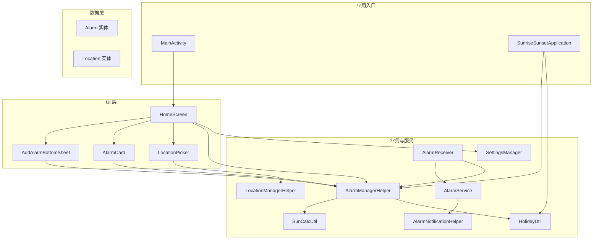
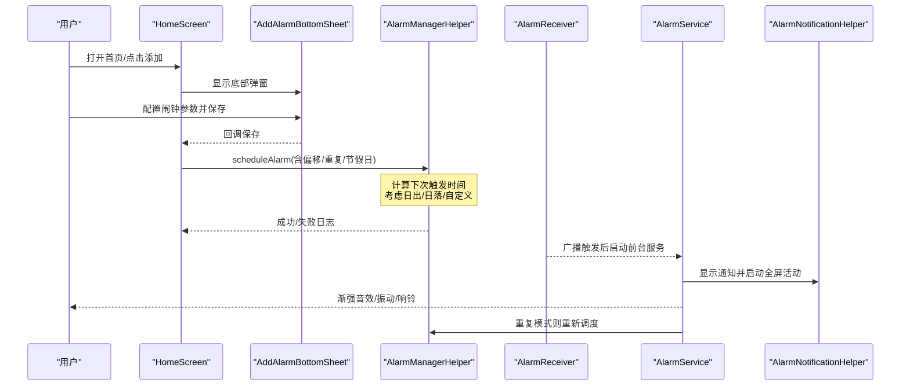
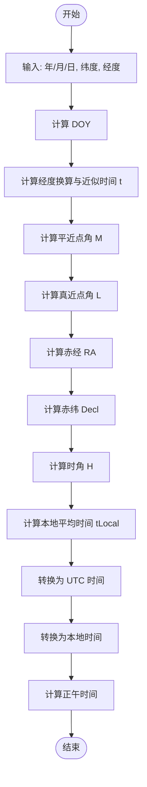
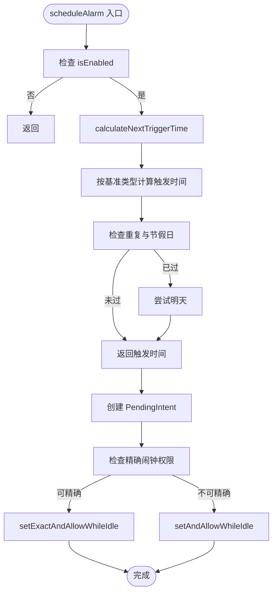
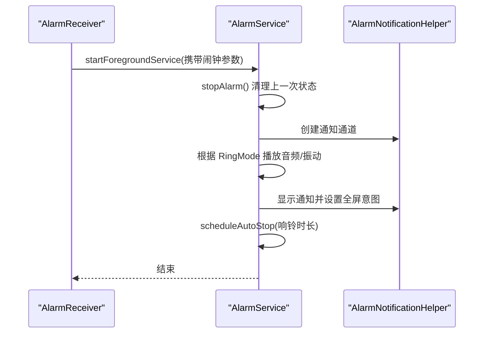
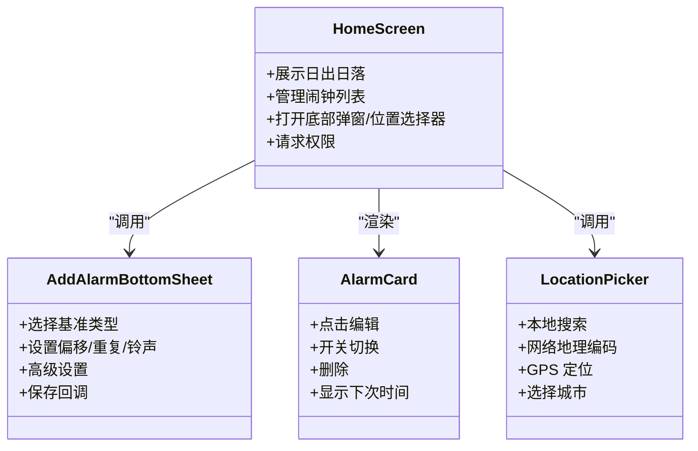
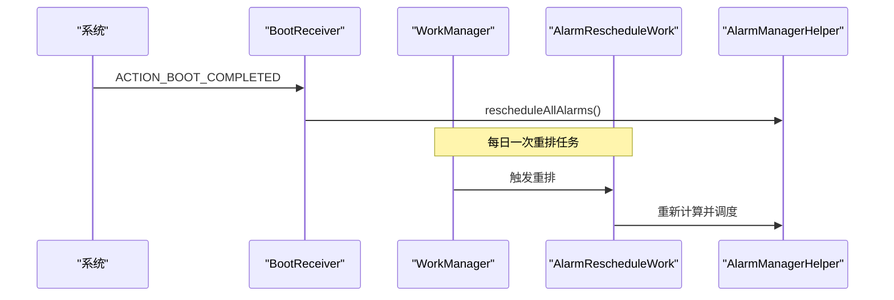
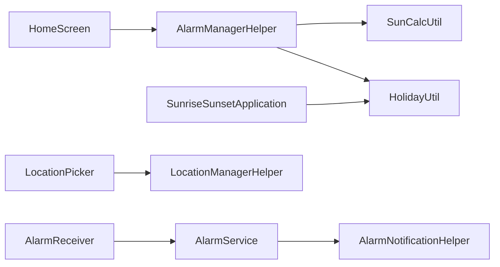

# 核心功能

<cite>
**本文引用的文件**
- [SunriseSunsetApplication.kt](file://app/src/main/java/com/snuabar/sunrisesunsetalarm/SunriseSunsetApplication.kt)
- [MainActivity.kt](file://app/src/main/java/com/snuabar/sunrisesunsetalarm/MainActivity.kt)
- [HomeScreen.kt](file://app/src/main/java/com/snuabar/sunrisesunsetalarm/ui/screens/HomeScreen.kt)
- [Alarm.kt](file://app/src/main/java/com/snuabar/sunrisesunsetalarm/data/model/Alarm.kt)
- [Location.kt](file://app/src/main/java/com/snuabar/sunrisesunsetalarm/data/model/Location.kt)
- [AlarmManagerHelper.kt](file://app/src/main/java/com/snuabar/sunrisesunsetalarm/service/AlarmManagerHelper.kt)
- [SunCalcUtil.kt](file://app/src/main/java/com/snuabar/sunrisesunsetalarm/util/SunCalcUtil.kt)
- [AlarmReceiver.kt](file://app/src/main/java/com/snuabar/sunrisesunsetalarm/receiver/AlarmReceiver.kt)
- [AlarmService.kt](file://app/src/main/java/com/snuabar/sunrisesunsetalarm/service/AlarmService.kt)
- [AlarmNotificationHelper.kt](file://app/src/main/java/com/snuabar/sunrisesunsetalarm/service/AlarmNotificationHelper.kt)
- [AddAlarmBottomSheet.kt](file://app/src/main/java/com/snuabar/sunrisesunsetalarm/ui/components/AddAlarmBottomSheet.kt)
- [AlarmCard.kt](file://app/src/main/java/com/snuabar/sunrisesunsetalarm/ui/components/AlarmCard.kt)
- [LocationPicker.kt](file://app/src/main/java/com/snuabar/sunrisesunsetalarm/ui/components/LocationPicker.kt)
- [LocationManagerHelper.kt](file://app/src/main/java/com/snuabar/sunrisesunsetalarm/util/LocationManagerHelper.kt)
- [HolidayUtil.kt](file://app/src/main/java/com/snuabar/sunrisesunsetalarm/util/HolidayUtil.kt)
- [BootReceiver.kt](file://app/src/main/java/com/snuabar/sunrisesunsetalarm/receiver/BootReceiver.kt)
- [SettingsManager.kt](file://app/src/main/java/com/snuabar/sunrisesunsetalarm/util/SettingsManager.kt)
</cite>

## 目录
1. [简介](#简介)
2. [项目结构](#项目结构)
3. [核心组件](#核心组件)
4. [架构总览](#架构总览)
5. [详细组件分析](#详细组件分析)
6. [依赖关系分析](#依赖关系分析)
7. [性能考量](#性能考量)
8. [故障排查指南](#故障排查指南)
9. [结论](#结论)
10. [附录](#附录)

## 简介
本文件聚焦于“日出日落智能闹钟”的核心功能与实现，涵盖以下方面：
- 日出日落时间计算：基于 NOAA 简化算法的天文计算流程与实现要点
- 闹钟调度机制：AlarmManager 的精确/近似调度、重复模式处理、偏移时间计算、开机自启动与周期性重排
- 用户界面交互：底部弹窗添加闹钟、闹钟卡片管理、位置选择器等 UI 组件
- 系统集成特性：通知管理、前台服务、渐强音效、振动、贪睡与关闭操作
- 使用示例与最佳实践：如何配置闹钟、处理权限、优化体验

## 项目结构
应用采用典型的 Android Jetpack Compose + Room + WorkManager 架构，按领域分层组织：
- ui：Compose 屏幕与可复用组件（底部弹窗、卡片、位置选择器）
- service：闹钟触发后的前台服务、通知助手、闹钟管理辅助
- receiver：广播接收器（闹钟触发、开机重排、闹钟关闭）
- util：工具类（日出日落计算、节假日、位置、设置）
- data：Room 实体与仓库（Alarm、Location、数据库、DAO）
- 主入口：MainActivity 与 SunriseSunsetApplication 应用级初始化

图表来源
- [MainActivity.kt:17-38](file://app/src/main/java/com/snuabar/sunrisesunsetalarm/MainActivity.kt#L17-L38)
- [SunriseSunsetApplication.kt:36-65](file://app/src/main/java/com/snuabar/sunrisesunsetalarm/SunriseSunsetApplication.kt#L36-L65)
- [HomeScreen.kt:46-296](file://app/src/main/java/com/snuabar/sunrisesunsetalarm/ui/screens/HomeScreen.kt#L46-L296)
- [AlarmManagerHelper.kt:17-165](file://app/src/main/java/com/snuabar/sunrisesunsetalarm/service/AlarmManagerHelper.kt#L17-L165)
- [AlarmReceiver.kt:17-68](file://app/src/main/java/com/snuabar/sunrisesunsetalarm/receiver/AlarmReceiver.kt#L17-L68)
- [AlarmService.kt:24-246](file://app/src/main/java/com/snuabar/sunrisesunsetalarm/service/AlarmService.kt#L24-L246)
- [AlarmNotificationHelper.kt:13-78](file://app/src/main/java/com/snuabar/sunrisesunsetalarm/service/AlarmNotificationHelper.kt#L13-L78)
- [SunCalcUtil.kt:6-137](file://app/src/main/java/com/snuabar/sunrisesunsetalarm/util/SunCalcUtil.kt#L6-L137)
- [HolidayUtil.kt:22-222](file://app/src/main/java/com/snuabar/sunrisesunsetalarm/util/HolidayUtil.kt#L22-L222)
- [LocationManagerHelper.kt:14-78](file://app/src/main/java/com/snuabar/sunrisesunsetalarm/util/LocationManagerHelper.kt#L14-L78)
- [Alarm.kt:6-49](file://app/src/main/java/com/snuabar/sunrisesunsetalarm/data/model/Alarm.kt#L6-L49)
- [Location.kt:6-15](file://app/src/main/java/com/snuabar/sunrisesunsetalarm/data/model/Location.kt#L6-L15)

章节来源
- [MainActivity.kt:17-38](file://app/src/main/java/com/snuabar/sunrisesunsetalarm/MainActivity.kt#L17-L38)
- [SunriseSunsetApplication.kt:36-65](file://app/src/main/java/com/snuabar/sunrisesunsetalarm/SunriseSunsetApplication.kt#L36-L65)
- [HomeScreen.kt:46-296](file://app/src/main/java/com/snuabar/sunrisesunsetalarm/ui/screens/HomeScreen.kt#L46-L296)

## 核心组件
- 闹钟模型与存储：Alarm、Location 实体，配合 Room DAO 与仓库进行持久化与查询
- 日出日落计算：SunCalcUtil 基于 NOAA 简化算法，返回日出/日落/正午时刻
- 闹钟调度：AlarmManagerHelper 负责 AlarmManager 的精确/近似调度、重复模式与节假日跳过逻辑
- 触发处理：AlarmReceiver 接收广播，启动 AlarmService 并根据重复模式决定是否重排
- 前台服务与通知：AlarmService 提供渐强音效、振动、前台通知；AlarmNotificationHelper 管理通知通道与全屏意图
- UI 交互：HomeScreen 管理首页列表、权限提示、位置切换；AddAlarmBottomSheet 编辑/新增；AlarmCard 展示与开关；LocationPicker 支持搜索与 GPS 定位
- 系统集成：BootReceiver 在开机后重排所有启用闹钟；WorkManager 周期性重排任务

章节来源
- [Alarm.kt:6-49](file://app/src/main/java/com/snuabar/sunrisesunsetalarm/data/model/Alarm.kt#L6-L49)
- [Location.kt:6-15](file://app/src/main/java/com/snuabar/sunrisesunsetalarm/data/model/Location.kt#L6-L15)
- [SunCalcUtil.kt:6-137](file://app/src/main/java/com/snuabar/sunrisesunsetalarm/util/SunCalcUtil.kt#L6-L137)
- [AlarmManagerHelper.kt:17-165](file://app/src/main/java/com/snuabar/sunrisesunsetalarm/service/AlarmManagerHelper.kt#L17-L165)
- [AlarmReceiver.kt:17-68](file://app/src/main/java/com/snuabar/sunrisesunsetalarm/receiver/AlarmReceiver.kt#L17-L68)
- [AlarmService.kt:24-246](file://app/src/main/java/com/snuabar/sunrisesunsetalarm/service/AlarmService.kt#L24-L246)
- [AlarmNotificationHelper.kt:13-78](file://app/src/main/java/com/snuabar/sunrisesunsetalarm/service/AlarmNotificationHelper.kt#L13-L78)
- [AddAlarmBottomSheet.kt:30-471](file://app/src/main/java/com/snuabar/sunrisesunsetalarm/ui/components/AddAlarmBottomSheet.kt#L30-L471)
- [AlarmCard.kt:21-149](file://app/src/main/java/com/snuabar/sunrisesunsetalarm/ui/components/AlarmCard.kt#L21-L149)
- [LocationPicker.kt:26-260](file://app/src/main/java/com/snuabar/sunrisesunsetalarm/ui/components/LocationPicker.kt#L26-L260)
- [BootReceiver.kt:11-33](file://app/src/main/java/com/snuabar/sunrisesunsetalarm/receiver/BootReceiver.kt#L11-L33)

## 架构总览
下图展示从用户操作到闹钟触发与响铃的端到端流程。

图表来源
- [HomeScreen.kt:161-247](file://app/src/main/java/com/snuabar/sunrisesunsetalarm/ui/screens/HomeScreen.kt#L161-L247)
- [AddAlarmBottomSheet.kt:123-142](file://app/src/main/java/com/snuabar/sunrisesunsetalarm/ui/components/AddAlarmBottomSheet.kt#L123-L142)
- [AlarmManagerHelper.kt:21-54](file://app/src/main/java/com/snuabar/sunrisesunsetalarm/service/AlarmManagerHelper.kt#L21-L54)
- [AlarmReceiver.kt:35-67](file://app/src/main/java/com/snuabar/sunrisesunsetalarm/receiver/AlarmReceiver.kt#L35-L67)
- [AlarmService.kt:44-83](file://app/src/main/java/com/snuabar/sunrisesunsetalarm/service/AlarmService.kt#L44-L83)
- [AlarmNotificationHelper.kt:42-73](file://app/src/main/java/com/snuabar/sunrisesunsetalarm/service/AlarmNotificationHelper.kt#L42-L73)

## 详细组件分析

### 日出日落时间计算（NOAA 简化算法）
- 输入：年、月、日、纬度、经度
- 输出：日出、日落、正午时刻（本地时间）
- 关键步骤
  - 计算 DOY、经度换算为时区、近似时间 t
  - 计算平近点角 M、真近点角 L、赤经 RA、赤纬 Decl
  - 计算时角 H，进而得到本地平均时间 tLocal，转换为 UTC 后再转回本地时间
  - 处理极昼/极夜（cosH 越界）场景
- 复杂度：单次计算 O(1)，适合每日周期性重排时批量调用

图表来源
- [SunCalcUtil.kt:19-45](file://app/src/main/java/com/snuabar/sunrisesunsetalarm/util/SunCalcUtil.kt#L19-L45)
- [SunCalcUtil.kt:47-110](file://app/src/main/java/com/snuabar/sunrisesunsetalarm/util/SunCalcUtil.kt#L47-L110)
- [SunCalcUtil.kt:115-127](file://app/src/main/java/com/snuabar/sunrisesunsetalarm/util/SunCalcUtil.kt#L115-L127)

章节来源
- [SunCalcUtil.kt:6-137](file://app/src/main/java/com/snuabar/sunrisesunsetalarm/util/SunCalcUtil.kt#L6-L137)

### 闹钟调度机制（AlarmManager 精确调度与重复模式）
- 精确调度
  - Android 12+ 需要精确闹钟权限；若未授予，回退到允许在节电模式下唤醒的近似调度
- 下次触发时间计算
  - 支持三种基准：日出、日落、自定义
  - 自定义：直接使用设定的小时/分钟
  - 日出/日落：调用 SunCalcUtil 计算，再叠加偏移分钟数
  - 重复模式：遍历未来 8 天，过滤掉未选中的星期几与节假日（可配置）
  - 若当天已过，则尝试明天
- 重复模式映射
  - ONCE：不重复
  - DAILY：每周七天
  - WEEKDAYS/WEEKENDS：工作日/周末
  - CUSTOM：由 7 个布尔值表示具体星期几
- 取消与更新
  - 开关闹钟或修改闹钟时，先取消旧的 PendingIntent，再重新调度

图表来源
- [AlarmManagerHelper.kt:21-54](file://app/src/main/java/com/snuabar/sunrisesunsetalarm/service/AlarmManagerHelper.kt#L21-L54)
- [AlarmManagerHelper.kt:62-151](file://app/src/main/java/com/snuabar/sunrisesunsetalarm/service/AlarmManagerHelper.kt#L62-L151)
- [Alarm.kt:28-36](file://app/src/main/java/com/snuabar/sunrisesunsetalarm/data/model/Alarm.kt#L28-L36)

章节来源
- [AlarmManagerHelper.kt:17-165](file://app/src/main/java/com/snuabar/sunrisesunsetalarm/service/AlarmManagerHelper.kt#L17-L165)
- [Alarm.kt:6-49](file://app/src/main/java/com/snuabar/sunrisesunsetalarm/data/model/Alarm.kt#L6-L49)
- [HolidayUtil.kt:80-94](file://app/src/main/java/com/snuabar/sunrisesunsetalarm/util/HolidayUtil.kt#L80-L94)

### 闹钟触发与响铃（前台服务与通知）
- 触发路径
  - AlarmReceiver 收到广播后，读取 Alarm 信息，启动 AlarmService
  - 根据 RingMode 决定响铃方式：全屏、通知栏、Live Activity
- 响铃特性
  - 渐强音效：按秒级步进提升音量至最大
  - 振动：可配置波形
  - 自动停止：按响铃时长定时关闭
- 通知
  - 通知通道创建
  - 全屏意图与“关闭”动作按钮
  - 前台服务持续运行直至手动关闭或超时

图表来源
- [AlarmReceiver.kt:35-67](file://app/src/main/java/com/snuabar/sunrisesunsetalarm/receiver/AlarmReceiver.kt#L35-L67)
- [AlarmService.kt:44-83](file://app/src/main/java/com/snuabar/sunrisesunsetalarm/service/AlarmService.kt#L44-L83)
- [AlarmNotificationHelper.kt:27-73](file://app/src/main/java/com/snuabar/sunrisesunsetalarm/service/AlarmNotificationHelper.kt#L27-L73)

章节来源
- [AlarmReceiver.kt:17-68](file://app/src/main/java/com/snuabar/sunrisesunsetalarm/receiver/AlarmReceiver.kt#L17-L68)
- [AlarmService.kt:24-246](file://app/src/main/java/com/snuabar/sunrisesunsetalarm/service/AlarmService.kt#L24-L246)
- [AlarmNotificationHelper.kt:13-78](file://app/src/main/java/com/snuabar/sunrisesunsetalarm/service/AlarmNotificationHelper.kt#L13-L78)

### 用户界面交互（底部弹窗、卡片、位置选择器）
- 添加/编辑闹钟
  - 底部弹窗支持：基准类型（日出/日落/自定义）、偏移滑条或时间选择器、重复模式（一次性/每日/工作日/周末/自定义）、自定义星期选择、铃声选择、高级设置（振动、响铃时长、渐强、节假日跳过、贪睡）
- 闹钟卡片
  - 展示名称、描述（基准+偏移+重复）、下次时间预估、开关与删除
- 位置选择器
  - 支持本地搜索与网络地理编码搜索，GPS 定位并反向地理编码获取地名
- 首页
  - 展示当日日出/日落与当前城市，支持切换位置并重排所有启用闹钟

图表来源
- [HomeScreen.kt:161-296](file://app/src/main/java/com/snuabar/sunrisesunsetalarm/ui/screens/HomeScreen.kt#L161-L296)
- [AddAlarmBottomSheet.kt:30-471](file://app/src/main/java/com/snuabar/sunrisesunsetalarm/ui/components/AddAlarmBottomSheet.kt#L30-L471)
- [AlarmCard.kt:21-149](file://app/src/main/java/com/snuabar/sunrisesunsetalarm/ui/components/AlarmCard.kt#L21-L149)
- [LocationPicker.kt:26-260](file://app/src/main/java/com/snuabar/sunrisesunsetalarm/ui/components/LocationPicker.kt#L26-L260)

章节来源
- [HomeScreen.kt:46-296](file://app/src/main/java/com/snuabar/sunrisesunsetalarm/ui/screens/HomeScreen.kt#L46-L296)
- [AddAlarmBottomSheet.kt:30-471](file://app/src/main/java/com/snuabar/sunrisesunsetalarm/ui/components/AddAlarmBottomSheet.kt#L30-L471)
- [AlarmCard.kt:21-149](file://app/src/main/java/com/snuabar/sunrisesunsetalarm/ui/components/AlarmCard.kt#L21-L149)
- [LocationPicker.kt:26-260](file://app/src/main/java/com/snuabar/sunrisesunsetalarm/ui/components/LocationPicker.kt#L26-L260)

### 系统集成特性（开机自启动、后台任务、通知）
- 开机自启动
  - BootReceiver 在开机完成后扫描启用的闹钟并重排
- 周期性重排
  - Application 初始化时注册每日一次的周期性任务，用于重排跨日变化的闹钟
- 通知与前台服务
  - AlarmService 以前台服务运行，避免被系统回收；通知通道与全屏意图确保用户体验
- 权限与兼容性
  - Android 12+ 精确闹钟权限检测与引导
  - Android 13+ 通知权限申请
  - 地理位置权限申请与 GPS 定位

图表来源
- [BootReceiver.kt:18-32](file://app/src/main/java/com/snuabar/sunrisesunsetalarm/receiver/BootReceiver.kt#L18-L32)
- [SunriseSunsetApplication.kt:55-65](file://app/src/main/java/com/snuabar/sunrisesunsetalarm/SunriseSunsetApplication.kt#L55-L65)

章节来源
- [BootReceiver.kt:11-33](file://app/src/main/java/com/snuabar/sunrisesunsetalarm/receiver/BootReceiver.kt#L11-L33)
- [SunriseSunsetApplication.kt:36-65](file://app/src/main/java/com/snuabar/sunrisesunsetalarm/SunriseSunsetApplication.kt#L36-L65)
- [AlarmService.kt:85-98](file://app/src/main/java/com/snuabar/sunrisesunsetalarm/service/AlarmService.kt#L85-L98)

## 依赖关系分析
- 组件耦合
  - AlarmManagerHelper 依赖 SunCalcUtil 与 HolidayUtil，耦合度低，职责清晰
  - AlarmReceiver 与 AlarmService 解耦，前者负责触发与后续调度，后者专注响铃与通知
  - UI 层通过 AlarmManagerHelper 间接依赖调度逻辑，保持 UI 与业务分离
- 外部依赖
  - Google Play Services（FusedLocationProvider）用于 GPS 定位
  - WorkManager 用于周期性任务
  - Room 用于本地数据持久化

图表来源
- [HomeScreen.kt:65-66](file://app/src/main/java/com/snuabar/sunrisesunsetalarm/ui/screens/HomeScreen.kt#L65-L66)
- [AlarmManagerHelper.kt:17-165](file://app/src/main/java/com/snuabar/sunrisesunsetalarm/service/AlarmManagerHelper.kt#L17-L165)
- [AlarmReceiver.kt:26-33](file://app/src/main/java/com/snuabar/sunrisesunsetalarm/receiver/AlarmReceiver.kt#L26-L33)
- [AlarmService.kt:39-42](file://app/src/main/java/com/snuabar/sunrisesunsetalarm/service/AlarmService.kt#L39-L42)
- [LocationPicker.kt:33-34](file://app/src/main/java/com/snuabar/sunrisesunsetalarm/ui/components/LocationPicker.kt#L33-L34)
- [SunriseSunsetApplication.kt:49-52](file://app/src/main/java/com/snuabar/sunrisesunsetalarm/SunriseSunsetApplication.kt#L49-L52)

章节来源
- [AlarmManagerHelper.kt:17-165](file://app/src/main/java/com/snuabar/sunrisesunsetalarm/service/AlarmManagerHelper.kt#L17-L165)
- [AlarmReceiver.kt:17-68](file://app/src/main/java/com/snuabar/sunrisesunsetalarm/receiver/AlarmReceiver.kt#L17-L68)
- [AlarmService.kt:24-246](file://app/src/main/java/com/snuabar/sunrisesunsetalarm/service/AlarmService.kt#L24-L246)
- [LocationPicker.kt:26-260](file://app/src/main/java/com/snuabar/sunrisesunsetalarm/ui/components/LocationPicker.kt#L26-L260)
- [SunriseSunsetApplication.kt:25-34](file://app/src/main/java/com/snuabar/sunrisesunsetalarm/SunriseSunsetApplication.kt#L25-L34)

## 性能考量
- 日出日落计算
  - 单次 O(1)，可在 UI 预览与周期任务中调用；注意异常兜底，避免阻塞主线程
- 闹钟调度
  - 重复模式遍历最多 8 天，复杂度 O(1)，对性能影响可忽略
  - 建议在位置变更或闹钟状态变化时批量重排，减少频繁调度
- 响铃与通知
  - 前台服务与通知通道创建应一次性完成，避免重复创建造成资源浪费
  - 渐强音效使用 Handler 定时器，注意在 onDestroy 中清理，防止泄漏
- 网络与定位
  - 地理编码与节假日数据采用本地缓存与网络回退策略，降低冷启动与弱网风险

## 故障排查指南
- 闹钟不准时
  - 检查精确闹钟权限是否授予；若未授予，系统会降级为近似调度
  - 核对当前经纬度与城市是否正确；位置变更后需重排
- 无法响铃
  - 确认通知权限已授予（Android 13+）
  - 检查是否被省电策略限制；必要时加入白名单
- 触发后未显示全屏
  - 确认 RingMode 设置为全屏；检查通知是否被屏蔽
- 节假日跳过无效
  - 确认节假日数据已预加载；检查 skipHolidays 开关
- 开机未响
  - 确认开机广播接收器已注册；检查 BootReceiver 是否成功重排

章节来源
- [HomeScreen.kt:88-113](file://app/src/main/java/com/snuabar/sunrisesunsetalarm/ui/screens/HomeScreen.kt#L88-L113)
- [AlarmService.kt:144-179](file://app/src/main/java/com/snuabar/sunrisesunsetalarm/service/AlarmService.kt#L144-L179)
- [AlarmNotificationHelper.kt:27-40](file://app/src/main/java/com/snuabar/sunrisesunsetalarm/service/AlarmNotificationHelper.kt#L27-L40)
- [HolidayUtil.kt:41-75](file://app/src/main/java/com/snuabar/sunrisesunsetalarm/util/HolidayUtil.kt#L41-L75)
- [BootReceiver.kt:18-32](file://app/src/main/java/com/snuabar/sunrisesunsetalarm/receiver/BootReceiver.kt#L18-L32)

## 结论
本项目通过清晰的分层架构与模块化设计，实现了高可用的日出日落智能闹钟。核心亮点包括：
- 基于 NOAA 简化算法的日出日落计算，兼顾精度与性能
- 精确/近似双轨调度与完善的重复/节假日处理
- 丰富的 UI 交互与系统权限适配
- 前台服务与通知体系保障用户体验
建议在生产环境中进一步完善异常监控与日志采样，持续优化节假日数据与定位精度。

## 附录
- 功能使用示例
  - 新增闹钟：打开首页，点击“+”，选择基准（日出/日落/自定义），设置偏移/重复/铃声，保存
  - 切换位置：点击顶部位置卡片，搜索或使用 GPS 定位，确认后自动重排启用的闹钟
  - 修改闹钟：点击闹钟卡片进入编辑，调整后保存，系统自动取消旧调度并重新计算
- 最佳实践
  - 始终授予精确闹钟与通知权限，确保准时响铃
  - 合理设置响铃时长与渐强时长，避免过度打扰
  - 使用节假日跳过功能避开法定节假日
  - 定期校准位置，保证日出日落时间准确