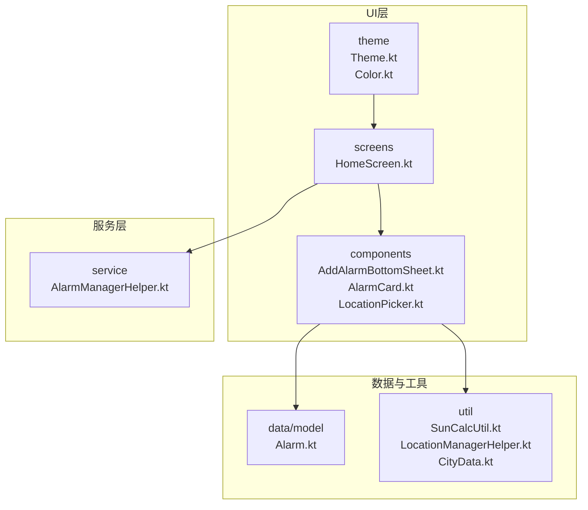
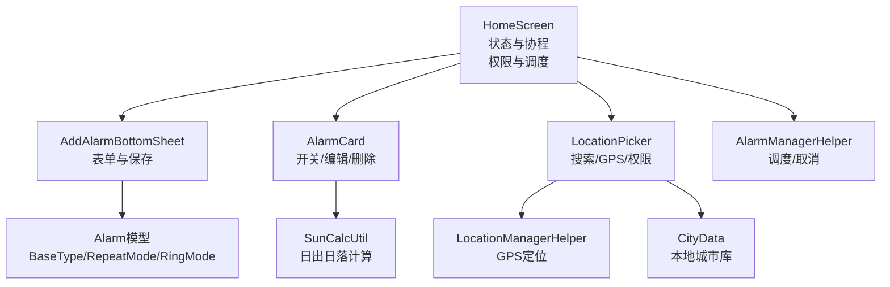
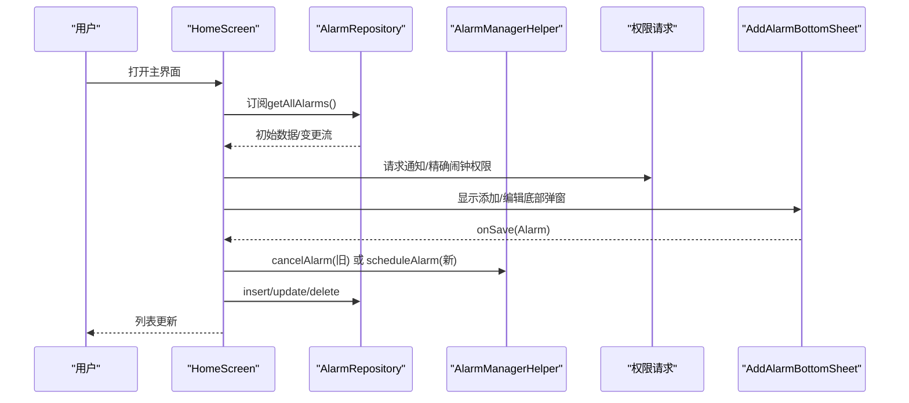
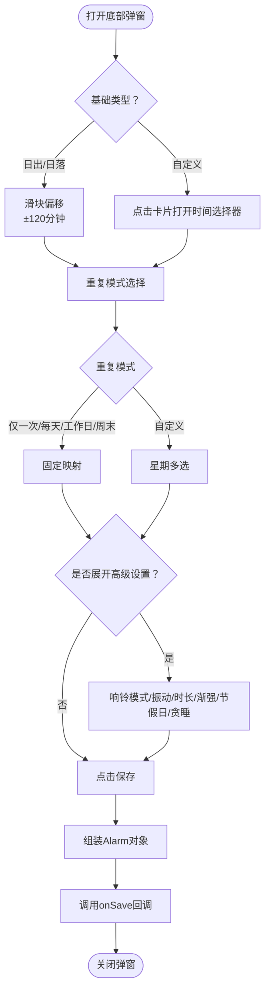
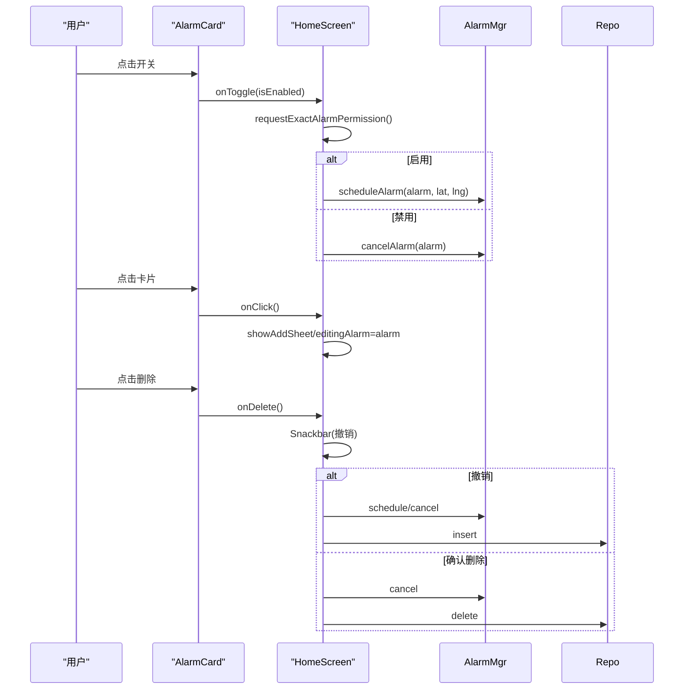
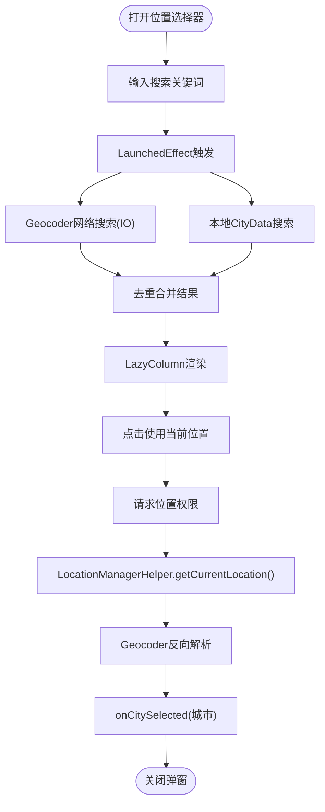
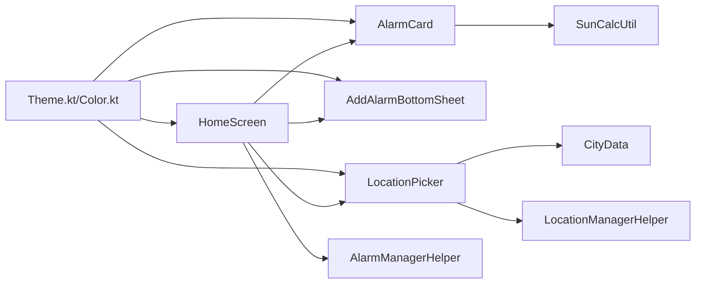

# 用户界面交互

<cite>
**本文档引用的文件**
- [HomeScreen.kt](file://app/src/main/java/com/snuabar/sunrisesunsetalarm/ui/screens/HomeScreen.kt)
- [AddAlarmBottomSheet.kt](file://app/src/main/java/com/snuabar/sunrisesunsetalarm/ui/components/AddAlarmBottomSheet.kt)
- [AlarmCard.kt](file://app/src/main/java/com/snuabar/sunrisesunsetalarm/ui/components/AlarmCard.kt)
- [LocationPicker.kt](file://app/src/main/java/com/snuabar/sunrisesunsetalarm/ui/components/LocationPicker.kt)
- [Alarm.kt](file://app/src/main/java/com/snuabar/sunrisesunsetalarm/data/model/Alarm.kt)
- [SunCalcUtil.kt](file://app/src/main/java/com/snuabar/sunrisesunsetalarm/util/SunCalcUtil.kt)
- [LocationManagerHelper.kt](file://app/src/main/java/com/snuabar/sunrisesunsetalarm/util/LocationManagerHelper.kt)
- [CityData.kt](file://app/src/main/java/com/snuabar/sunrisesunsetalarm/data/CityData.kt)
- [AlarmManagerHelper.kt](file://app/src/main/java/com/snuabar/sunrisesunsetalarm/service/AlarmManagerHelper.kt)
- [Theme.kt](file://app/src/main/java/com/snuabar/sunrisesunsetalarm/ui/theme/Theme.kt)
- [Color.kt](file://app/src/main/java/com/snuabar/sunrisesunsetalarm/ui/theme/Color.kt)
</cite>

## 目录
1. [简介](#简介)
2. [项目结构](#项目结构)
3. [核心组件](#核心组件)
4. [架构总览](#架构总览)
5. [详细组件分析](#详细组件分析)
6. [依赖关系分析](#依赖关系分析)
7. [性能考虑](#性能考虑)
8. [故障排除指南](#故障排除指南)
9. [结论](#结论)
10. [附录](#附录)

## 简介
本文件聚焦于应用的用户界面交互功能，围绕HomeScreen主界面与三大核心UI组件展开：AddAlarmBottomSheet（底部弹窗）、AlarmCard（闹钟卡片）、LocationPicker（位置选择器）。文档从Jetpack Compose响应式状态管理、协程异步操作、Material Design 3组件应用等现代Android开发技术角度，深入解析这些组件的设计架构与交互逻辑，并提供UI组件复用、状态管理与用户体验优化的实践指导。

## 项目结构
应用采用按功能模块组织的目录结构，UI层位于app/src/main/java/com/snuabar/sunrisesunsetalarm/ui，包含screens与components两大子模块；数据模型与工具类分别位于data与util；服务层位于service；主题样式位于ui/theme。

图表来源
- [HomeScreen.kt:1-402](file://app/src/main/java/com/snuabar/sunrisesunsetalarm/ui/screens/HomeScreen.kt#L1-L402)
- [AddAlarmBottomSheet.kt:1-480](file://app/src/main/java/com/snuabar/sunrisesunsetalarm/ui/components/AddAlarmBottomSheet.kt#L1-L480)
- [AlarmCard.kt:1-150](file://app/src/main/java/com/snuabar/sunrisesunsetalarm/ui/components/AlarmCard.kt#L1-L150)
- [LocationPicker.kt:1-260](file://app/src/main/java/com/snuabar/sunrisesunsetalarm/ui/components/LocationPicker.kt#L1-L260)
- [Alarm.kt:1-50](file://app/src/main/java/com/snuabar/sunrisesunsetalarm/data/model/Alarm.kt#L1-L50)
- [SunCalcUtil.kt:1-138](file://app/src/main/java/com/snuabar/sunrisesunsetalarm/util/SunCalcUtil.kt#L1-L138)
- [LocationManagerHelper.kt:1-79](file://app/src/main/java/com/snuabar/sunrisesunsetalarm/util/LocationManagerHelper.kt#L1-L79)
- [CityData.kt:1-554](file://app/src/main/java/com/snuabar/sunrisesunsetalarm/data/CityData.kt#L1-L554)
- [AlarmManagerHelper.kt:1-166](file://app/src/main/java/com/snuabar/sunrisesunsetalarm/service/AlarmManagerHelper.kt#L1-L166)
- [Theme.kt:1-106](file://app/src/main/java/com/snuabar/sunrisesunsetalarm/ui/theme/Theme.kt#L1-L106)
- [Color.kt:1-52](file://app/src/main/java/com/snuabar/sunrisesunsetalarm/ui/theme/Color.kt#L1-L52)

章节来源
- [HomeScreen.kt:1-402](file://app/src/main/java/com/snuabar/sunrisesunsetalarm/ui/screens/HomeScreen.kt#L1-L402)
- [Theme.kt:1-106](file://app/src/main/java/com/snuabar/sunrisesunsetalarm/ui/theme/Theme.kt#L1-L106)

## 核心组件
- HomeScreen：主界面容器，负责响应式状态管理、权限请求、协程调度、导航与底部弹窗/设置页的条件渲染。
- AddAlarmBottomSheet：底部弹窗，负责闹钟新增/编辑的表单构建、数据绑定、验证与保存回调。
- AlarmCard：单个闹钟项，负责展示、开关切换、点击编辑、删除确认等交互。
- LocationPicker：位置选择器，负责城市列表展示、搜索过滤、GPS定位与权限请求。

章节来源
- [HomeScreen.kt:46-296](file://app/src/main/java/com/snuabar/sunrisesunsetalarm/ui/screens/HomeScreen.kt#L46-L296)
- [AddAlarmBottomSheet.kt:29-471](file://app/src/main/java/com/snuabar/sunrisesunsetalarm/ui/components/AddAlarmBottomSheet.kt#L29-L471)
- [AlarmCard.kt:22-91](file://app/src/main/java/com/snuabar/sunrisesunsetalarm/ui/components/AlarmCard.kt#L22-L91)
- [LocationPicker.kt:27-243](file://app/src/main/java/com/snuabar/sunrisesunsetalarm/ui/components/LocationPicker.kt#L27-L243)

## 架构总览
整体采用“屏幕容器 + 组合式UI组件 + 工具与服务”的分层设计：
- 屏幕容器（HomeScreen）持有全局状态与协程作用域，协调权限、通知与精确闹钟策略。
- UI组件通过参数注入回调函数，实现解耦的交互逻辑。
- 工具类（SunCalcUtil、LocationManagerHelper）提供计算与定位能力。
- 服务层（AlarmManagerHelper）负责闹钟调度与取消。

图表来源
- [HomeScreen.kt:46-296](file://app/src/main/java/com/snuabar/sunrisesunsetalarm/ui/screens/HomeScreen.kt#L46-L296)
- [AddAlarmBottomSheet.kt:29-471](file://app/src/main/java/com/snuabar/sunrisesunsetalarm/ui/components/AddAlarmBottomSheet.kt#L29-L471)
- [AlarmCard.kt:22-91](file://app/src/main/java/com/snuabar/sunrisesunsetalarm/ui/components/AlarmCard.kt#L22-L91)
- [LocationPicker.kt:27-243](file://app/src/main/java/com/snuabar/sunrisesunsetalarm/ui/components/LocationPicker.kt#L27-L243)
- [Alarm.kt:1-50](file://app/src/main/java/com/snuabar/sunrisesunsetalarm/data/model/Alarm.kt#L1-L50)
- [SunCalcUtil.kt:1-138](file://app/src/main/java/com/snuabar/sunrisesunsetalarm/util/SunCalcUtil.kt#L1-L138)
- [LocationManagerHelper.kt:1-79](file://app/src/main/java/com/snuabar/sunrisesunsetalarm/util/LocationManagerHelper.kt#L1-L79)
- [CityData.kt:1-554](file://app/src/main/java/com/snuabar/sunrisesunsetalarm/data/CityData.kt#L1-L554)
- [AlarmManagerHelper.kt:1-166](file://app/src/main/java/com/snuabar/sunrisesunsetalarm/service/AlarmManagerHelper.kt#L1-L166)

## 详细组件分析

### HomeScreen 主界面
- 响应式状态管理
  - 使用mutableStateOf与remember管理主题、位置、经纬度、日出日落时间等状态。
  - 使用collectAsStateWithLifecycle订阅AlarmRepository的流式数据，实现UI自动刷新。
- 协程与异步
  - 使用LaunchedEffect在首次启动时初始化演示闹钟。
  - 使用rememberCoroutineScope与协程launch处理异步操作（如删除撤销、权限提示）。
  - 使用rememberLauncherForActivityResult处理权限请求结果。
- 权限与系统能力
  - Android 13+请求通知权限；Android 12+检查并引导精确闹钟权限。
  - 使用AlarmManagerHelper进行闹钟调度与取消。
- 底部弹窗与设置页
  - 条件渲染AddAlarmBottomSheet与SettingsSheet，通过onSave/onDismiss回调驱动数据持久化与UI状态同步。
- 位置切换与重排
  - LocationPicker选择新城市后，对所有启用的闹钟进行重新调度。

图表来源
- [HomeScreen.kt:46-296](file://app/src/main/java/com/snuabar/sunrisesunsetalarm/ui/screens/HomeScreen.kt#L46-L296)
- [AlarmManagerHelper.kt:1-166](file://app/src/main/java/com/snuabar/sunrisesunsetalarm/service/AlarmManagerHelper.kt#L1-L166)

章节来源
- [HomeScreen.kt:46-296](file://app/src/main/java/com/snuabar/sunrisesunsetalarm/ui/screens/HomeScreen.kt#L46-L296)

### AddAlarmBottomSheet 底部弹窗
- 表单与状态绑定
  - 使用rememberState管理基础类型、名称、偏移量、重复模式、重复星期、铃声、高级设置等字段。
  - 自定义时间选择器与滑块联动，支持日出/日落偏移与自定义时间两种模式。
- 数据绑定与保存
  - 将表单字段组装为Alarm对象，调用onSave回调返回给HomeScreen。
  - 支持编辑模式下预填初始值。
- 高级设置
  - 响铃模式、振动、响铃时长、渐强、节假日跳过、贪睡开关与时长等。
- 铃声选择
  - 通过RingtoneManager启动系统铃声选择器，ActivityResult回调接收URI并保存。

图表来源
- [AddAlarmBottomSheet.kt:29-471](file://app/src/main/java/com/snuabar/sunrisesunsetalarm/ui/components/AddAlarmBottomSheet.kt#L29-L471)
- [Alarm.kt:1-50](file://app/src/main/java/com/snuabar/sunrisesunsetalarm/data/model/Alarm.kt#L1-L50)

章节来源
- [AddAlarmBottomSheet.kt:29-471](file://app/src/main/java/com/snuabar/sunrisesunsetalarm/ui/components/AddAlarmBottomSheet.kt#L29-L471)

### AlarmCard 闹钟卡片
- 展示逻辑
  - 根据BaseType选择图标与颜色，构建描述文本（含偏移与重复模式）。
  - 计算并展示实际触发时间（日出/日落或自定义）。
- 交互逻辑
  - 开关切换：调用onToggle，HomeScreen中根据权限与开关状态决定调度或取消。
  - 编辑点击：调用onClick，HomeScreen打开AddAlarmBottomSheet进入编辑模式。
  - 删除确认：调用onDelete，HomeScreen使用Snackbar提供撤销操作。

图表来源
- [AlarmCard.kt:22-91](file://app/src/main/java/com/snuabar/sunrisesunsetalarm/ui/components/AlarmCard.kt#L22-L91)
- [HomeScreen.kt:185-219](file://app/src/main/java/com/snuabar/sunrisesunsetalarm/ui/screens/HomeScreen.kt#L185-L219)
- [AlarmManagerHelper.kt:1-166](file://app/src/main/java/com/snuabar/sunrisesunsetalarm/service/AlarmManagerHelper.kt#L1-L166)

章节来源
- [AlarmCard.kt:22-91](file://app/src/main/java/com/snuabar/sunrisesunsetalarm/ui/components/AlarmCard.kt#L22-L91)

### LocationPicker 位置选择器
- 搜索与过滤
  - 使用LaunchedEffect监听搜索框变化，本地CityData搜索与Geocoder网络搜索并行，去重合并展示。
- GPS定位
  - 请求位置权限后，使用LocationManagerHelper获取当前位置，Geocoder反向解析地名。
- UI与交互
  - ModalBottomSheet布局，支持“本地数据/网络搜索”分组展示，点击城市回调onCitySelected。
- 性能与体验
  - 搜索使用协程IO线程执行，避免阻塞UI；定位过程显示加载指示。

图表来源
- [LocationPicker.kt:27-243](file://app/src/main/java/com/snuabar/sunrisesunsetalarm/ui/components/LocationPicker.kt#L27-L243)
- [CityData.kt:1-554](file://app/src/main/java/com/snuabar/sunrisesunsetalarm/data/CityData.kt#L1-L554)
- [LocationManagerHelper.kt:1-79](file://app/src/main/java/com/snuabar/sunrisesunsetalarm/util/LocationManagerHelper.kt#L1-L79)

章节来源
- [LocationPicker.kt:27-243](file://app/src/main/java/com/snuabar/sunrisesunsetalarm/ui/components/LocationPicker.kt#L27-L243)

## 依赖关系分析
- 组件耦合
  - HomeScreen与AlarmCard/LocationPicker/AddAlarmBottomSheet通过回调解耦，降低直接依赖。
  - AlarmCard依赖SunCalcUtil计算时间，保持UI与业务逻辑分离。
  - LocationPicker依赖CityData与LocationManagerHelper，提供本地与网络双重搜索能力。
- 外部依赖
  - AlarmManagerHelper封装系统AlarmManager，统一调度策略与权限处理。
  - Material3主题与颜色方案由Theme.kt集中管理，确保一致性。

图表来源
- [HomeScreen.kt:46-296](file://app/src/main/java/com/snuabar/sunrisesunsetalarm/ui/screens/HomeScreen.kt#L46-L296)
- [AlarmCard.kt:22-91](file://app/src/main/java/com/snuabar/sunrisesunsetalarm/ui/components/AlarmCard.kt#L22-L91)
- [LocationPicker.kt:27-243](file://app/src/main/java/com/snuabar/sunrisesunsetalarm/ui/components/LocationPicker.kt#L27-L243)
- [AddAlarmBottomSheet.kt:29-471](file://app/src/main/java/com/snuabar/sunrisesunsetalarm/ui/components/AddAlarmBottomSheet.kt#L29-L471)
- [SunCalcUtil.kt:1-138](file://app/src/main/java/com/snuabar/sunrisesunsetalarm/util/SunCalcUtil.kt#L1-L138)
- [CityData.kt:1-554](file://app/src/main/java/com/snuabar/sunrisesunsetalarm/data/CityData.kt#L1-L554)
- [LocationManagerHelper.kt:1-79](file://app/src/main/java/com/snuabar/sunrisesunsetalarm/util/LocationManagerHelper.kt#L1-L79)
- [AlarmManagerHelper.kt:1-166](file://app/src/main/java/com/snuabar/sunrisesunsetalarm/service/AlarmManagerHelper.kt#L1-L166)
- [Theme.kt:1-106](file://app/src/main/java/com/snuabar/sunrisesunsetalarm/ui/theme/Theme.kt#L1-L106)
- [Color.kt:1-52](file://app/src/main/java/com/snuabar/sunrisesunsetalarm/ui/theme/Color.kt#L1-L52)

章节来源
- [HomeScreen.kt:46-296](file://app/src/main/java/com/snuabar/sunrisesunsetalarm/ui/screens/HomeScreen.kt#L46-L296)

## 性能考虑
- 响应式状态与重组
  - 使用remember与collectAsStateWithLifecycle减少不必要的重组，避免在每次重组中重建昂贵对象。
- 异步与IO
  - 搜索与定位使用协程IO线程，避免阻塞主线程；LaunchedEffect监听搜索框变化，配合去抖动提升性能。
- 计算优化
  - 日出日落计算在必要时才执行，且异常时提供兜底时间，保证UI稳定性。
- UI渲染
  - 使用LazyColumn按需渲染列表项；ModalBottomSheet内容垂直滚动，避免过度嵌套导致的重组成本。

## 故障排除指南
- 精确闹钟权限
  - 当系统版本≥Android 12且权限未授予时，HomeScreen会通过Snackbar引导用户前往系统设置开启；若拒绝，系统将以“不精确”方式调度，可能导致延迟。
- 通知权限
  - Android 13+首次启动会请求通知权限，未授予会影响通知提醒显示。
- 位置权限
  - LocationPicker在点击“使用当前位置”时请求位置权限，未授权时提示并终止定位流程。
- 删除撤销
  - 删除闹钟后提供Snackbar撤销选项，点击撤销会恢复闹钟并重新调度。
- 地理编码失败
  - 网络搜索可能因异常返回空结果，UI会自动过滤并提示“未找到匹配的城市”。

章节来源
- [HomeScreen.kt:88-147](file://app/src/main/java/com/snuabar/sunrisesunsetalarm/ui/screens/HomeScreen.kt#L88-L147)
- [HomeScreen.kt:198-218](file://app/src/main/java/com/snuabar/sunrisesunsetalarm/ui/screens/HomeScreen.kt#L198-L218)
- [LocationPicker.kt:141-195](file://app/src/main/java/com/snuabar/sunrisesunsetalarm/ui/components/LocationPicker.kt#L141-L195)

## 结论
该应用以HomeScreen为核心，结合Material Design 3与Jetpack Compose实现了现代化的UI交互体验。通过组合式组件与回调机制，实现了清晰的状态管理与职责分离；借助协程与权限系统，保障了异步操作与系统能力的正确使用。AddAlarmBottomSheet、AlarmCard与LocationPicker三大组件覆盖了新增编辑、展示交互与位置选择的核心场景，具备良好的扩展性与可维护性。

## 附录
- 实践建议
  - 状态管理：优先使用remember与collectAsStateWithLifecycle，避免在重组中创建昂贵对象。
  - 组合式组件：通过参数注入回调，保持组件解耦与可测试性。
  - 权限与系统能力：在HomeScreen中统一处理权限请求与策略引导，避免分散在各组件。
  - 错误与兜底：对计算与网络操作提供异常兜底，保证UI稳定性与用户体验。