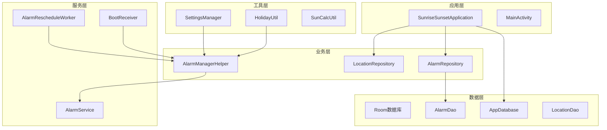
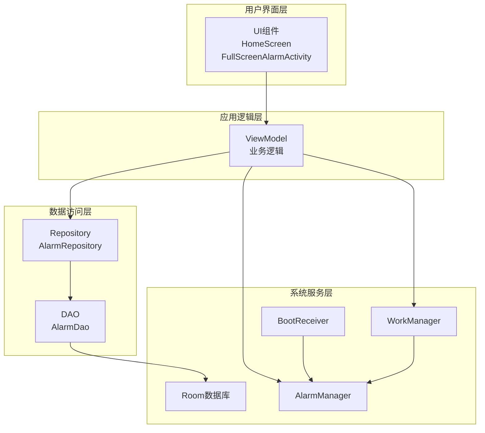
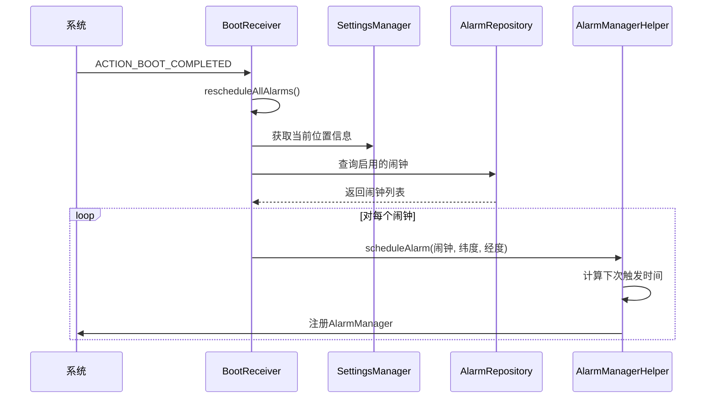
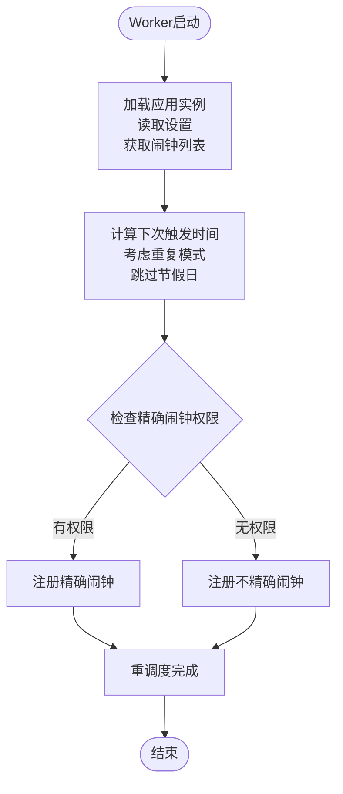
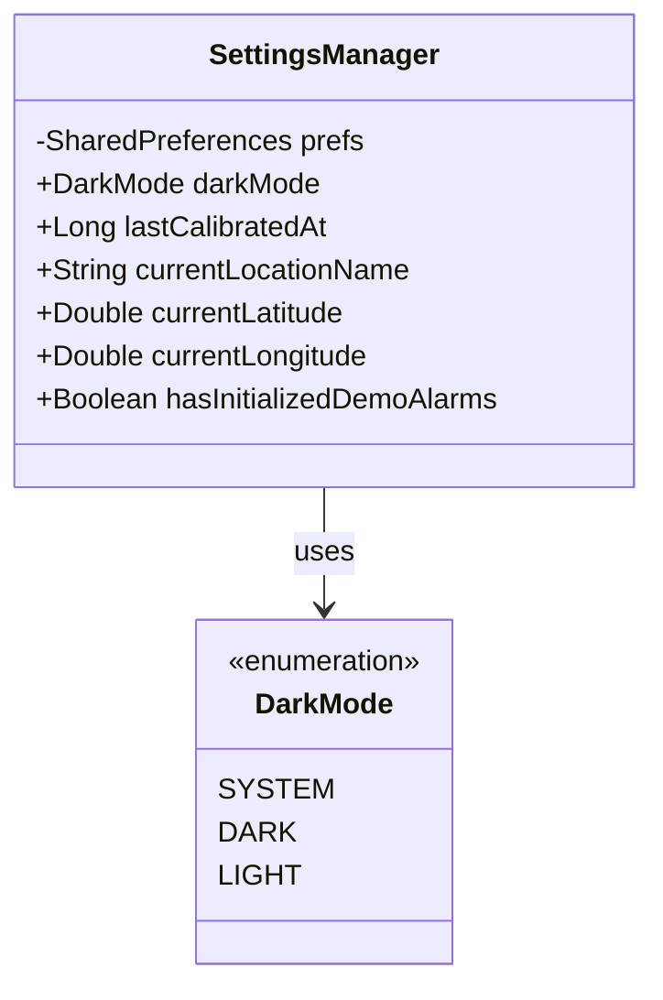
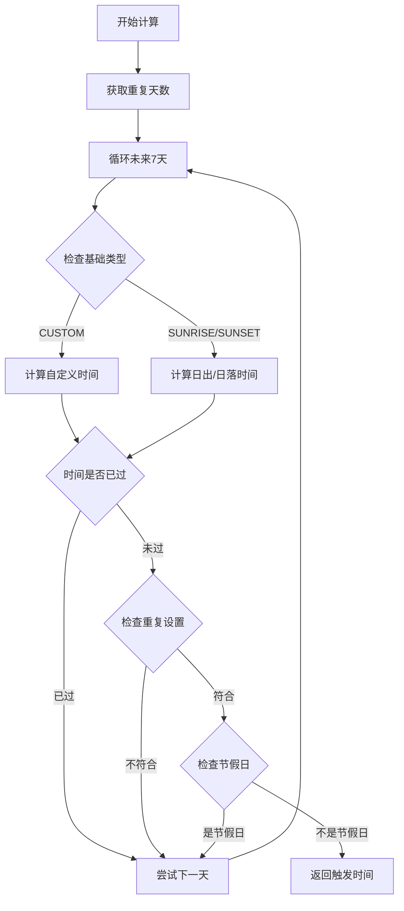
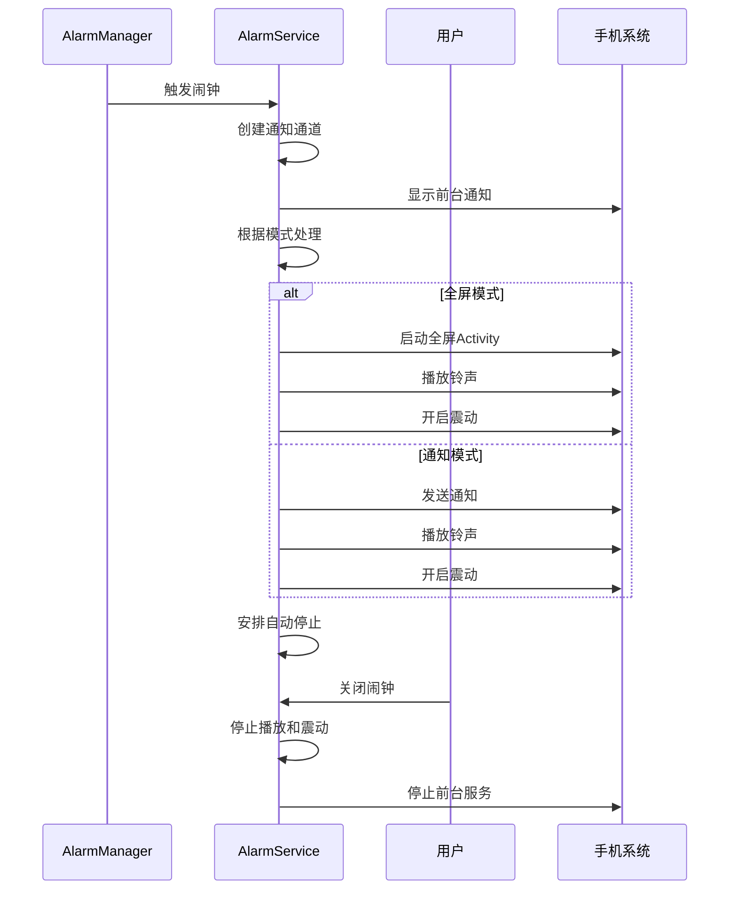
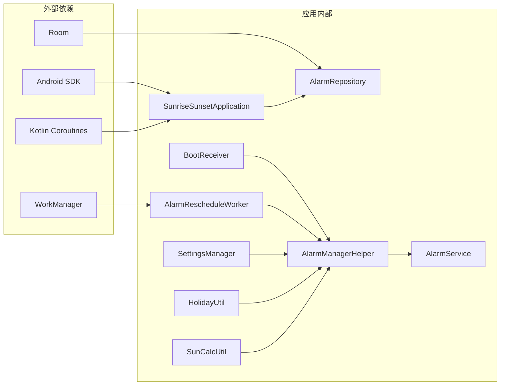

# 系统集成功能

<cite>
**本文档引用的文件**
- [SunriseSunsetApplication.kt](file://app/src/main/java/com/snuabar/sunrisesunsetalarm/SunriseSunsetApplication.kt)
- [BootReceiver.kt](file://app/src/main/java/com/snuabar/sunrisesunsetalarm/receiver/BootReceiver.kt)
- [AlarmRescheduleWorker.kt](file://app/src/main/java/com/snuabar/sunrisesunsetalarm/receiver/AlarmRescheduleWorker.kt)
- [SettingsManager.kt](file://app/src/main/java/com/snuabar/sunrisesunsetalarm/util/SettingsManager.kt)
- [AppDatabase.kt](file://app/src/main/java/com/snuabar/sunrisesunsetalarm/data/database/AppDatabase.kt)
- [AlarmRepository.kt](file://app/src/main/java/com/snuabar/sunrisesunsetalarm/data/repository/AlarmRepository.kt)
- [AlarmDao.kt](file://app/src/main/java/com/snuabar/sunrisesunsetalarm/data/database/AlarmDao.kt)
- [AlarmManagerHelper.kt](file://app/src/main/java/com/snuabar/sunrisesunsetalarm/service/AlarmManagerHelper.kt)
- [AlarmService.kt](file://app/src/main/java/com/snuabar/sunrisesunsetalarm/service/AlarmService.kt)
- [HolidayUtil.kt](file://app/src/main/java/com/snuabar/sunrisesunsetalarm/util/HolidayUtil.kt)
- [SunCalcUtil.kt](file://app/src/main/java/com/snuabar/sunrisesunsetalarm/util/SunCalcUtil.kt)
- [Alarm.kt](file://app/src/main/java/com/snuabar/sunrisesunsetalarm/data/model/Alarm.kt)
- [AndroidManifest.xml](file://app/src/main/AndroidManifest.xml)
</cite>

## 目录
1. [简介](#简介)
2. [项目结构](#项目结构)
3. [核心组件](#核心组件)
4. [架构概览](#架构概览)
5. [详细组件分析](#详细组件分析)
6. [依赖关系分析](#依赖关系分析)
7. [性能考虑](#性能考虑)
8. [故障排除指南](#故障排除指南)
9. [结论](#结论)

## 简介

SunriseSunsetApplication 是一个基于Android平台的智能闹钟应用，集成了多种系统级服务以提供可靠的闹钟功能。该应用的核心目标是通过精确的太阳日出日落时间计算，结合用户自定义的闹钟设置，为用户提供智能化的唤醒体验。

本应用实现了完整的系统集成功能，包括：
- Room数据库配置与Repository层注入
- WorkManager定时任务调度
- 开机自启动广播接收器
- 后台任务工作机制
- 设置管理器功能
- Android平台特定的权限适配

## 项目结构

应用采用清晰的分层架构设计，按照功能模块进行组织：

**图表来源**
- [SunriseSunsetApplication.kt:18-66](file://app/src/main/java/com/snuabar/sunrisesunsetalarm/SunriseSunsetApplication.kt#L18-L66)
- [AppDatabase.kt:10-33](file://app/src/main/java/com/snuabar/sunrisesunsetalarm/data/database/AppDatabase.kt#L10-L33)

**章节来源**
- [SunriseSunsetApplication.kt:1-67](file://app/src/main/java/com/snuabar/sunrisesunsetalarm/SunriseSunsetApplication.kt#L1-L67)
- [AndroidManifest.xml:17-87](file://app/src/main/AndroidManifest.xml#L17-L87)

## 核心组件

### 应用级初始化流程

SunriseSunsetApplication作为应用的全局入口点，负责初始化所有核心系统服务：

1. **Room数据库初始化**：配置数据库连接，应用迁移策略
2. **Repository层注入**：创建数据访问层实例
3. **WorkManager任务调度**：设置每日闹钟重调度任务
4. **预加载数据**：提前加载节假日数据以提升性能

### 数据库配置

应用使用Room持久化库管理本地数据，支持版本迁移和数据完整性：

- 支持从版本3到版本5的数据库迁移
- 定义了alarms和locations两个实体表
- 提供类型安全的DAO接口

### Repository模式

采用Repository模式实现数据访问抽象：
- AlarmRepository提供异步数据操作
- 支持Flow响应式数据流
- 封装数据库访问细节

**章节来源**
- [SunriseSunsetApplication.kt:36-53](file://app/src/main/java/com/snuabar/sunrisesunsetalarm/SunriseSunsetApplication.kt#L36-L53)
- [AppDatabase.kt:19-32](file://app/src/main/java/com/snuabar/sunrisesunsetalarm/data/database/AppDatabase.kt#L19-L32)
- [AlarmRepository.kt:7-21](file://app/src/main/java/com/snuabar/sunrisesunsetalarm/data/repository/AlarmRepository.kt#L7-L21)

## 架构概览

应用采用MVVM架构模式，结合Android官方架构组件：

**图表来源**
- [SunriseSunsetApplication.kt:28-34](file://app/src/main/java/com/snuabar/sunrisesunsetalarm/SunriseSunsetApplication.kt#L28-L34)
- [AlarmRepository.kt:8-10](file://app/src/main/java/com/snuabar/sunrisesunsetalarm/data/repository/AlarmRepository.kt#L8-L10)

## 详细组件分析

### BootReceiver开机自启动广播接收器

BootReceiver负责系统启动后的闹钟重新调度：

**图表来源**
- [BootReceiver.kt:18-32](file://app/src/main/java/com/snuabar/sunrisesunsetalarm/receiver/BootReceiver.kt#L18-L32)
- [AlarmManagerHelper.kt:21-54](file://app/src/main/java/com/snuabar/sunrisesunsetalarm/service/AlarmManagerHelper.kt#L21-L54)

关键实现特性：
- 系统启动检测：监听BOOT_COMPLETED广播
- 位置信息获取：从SettingsManager读取当前经纬度
- 权限检查：验证Exact Alarm权限
- 错误处理：降级到不精确闹钟

**章节来源**
- [BootReceiver.kt:11-33](file://app/src/main/java/com/snuabar/sunrisesunsetalarm/receiver/BootReceiver.kt#L11-L33)

### AlarmRescheduleWorker后台任务

AlarmRescheduleWorker实现每日自动重调度机制：

**图表来源**
- [AlarmRescheduleWorker.kt:26-47](file://app/src/main/java/com/snuabar/sunrisesunsetalarm/receiver/AlarmRescheduleWorker.kt#L26-L47)
- [AlarmManagerHelper.kt:62-151](file://app/src/main/java/com/snuabar/sunrisesunsetalarm/service/AlarmManagerHelper.kt#L62-L151)

工作机制：
- 周期性任务：每24小时执行一次
- 动态重计算：根据当前时间和位置重新计算触发时间
- 省电优化：在权限不足时使用不精确闹钟

**章节来源**
- [AlarmRescheduleWorker.kt:12-47](file://app/src/main/java/com/snuabar/sunrisesunsetalarm/receiver/AlarmRescheduleWorker.kt#L12-L47)

### SettingsManager设置管理器

SettingsManager提供统一的应用设置管理：

**图表来源**
- [SettingsManager.kt:8-48](file://app/src/main/java/com/snuabar/sunrisesunsetalarm/util/SettingsManager.kt#L8-L48)

功能特性：
- 主题切换：支持系统、深色、浅色三种模式
- 位置管理：存储用户当前位置信息
- 初始化状态：跟踪演示闹钟初始化状态
- 类型安全：提供类型转换和默认值处理

**章节来源**
- [SettingsManager.kt:8-48](file://app/src/main/java/com/snuabar/sunrisesunsetalarm/util/SettingsManager.kt#L8-L48)

### AlarmManagerHelper闹钟管理器

AlarmManagerHelper封装了复杂的闹钟调度逻辑：

**图表来源**
- [AlarmManagerHelper.kt:62-151](file://app/src/main/java/com/snuabar/sunrisesunsetalarm/service/AlarmManagerHelper.kt#L62-L151)

核心算法：
- 太阳计算：使用NOAA简化算法计算日出日落时间
- 重复模式：支持一次性、每日、工作日、周末、自定义
- 节假日跳过：集成节假日数据管理系统
- 精确度控制：根据Android版本和权限动态调整精度

**章节来源**
- [AlarmManagerHelper.kt:17-165](file://app/src/main/java/com/snuabar/sunrisesunsetalarm/service/AlarmManagerHelper.kt#L17-L165)

### AlarmService前台服务

AlarmService提供闹钟触发时的前台服务体验：

**图表来源**
- [AlarmService.kt:44-83](file://app/src/main/java/com/snuabar/sunrisesunsetalarm/service/AlarmService.kt#L44-L83)
- [AlarmService.kt:135-142](file://app/src/main/java/com/snuabar/sunrisesunsetalarm/service/AlarmService.kt#L135-L142)

服务特性：
- 前台服务：确保闹钟触发时不被系统回收
- 多模式支持：全屏、通知、Live Activity
- 渐强音效：可选的音量渐增功能
- 自动停止：支持定时自动关闭

**章节来源**
- [AlarmService.kt:24-246](file://app/src/main/java/com/snuabar/sunrisesunsetalarm/service/AlarmService.kt#L24-L246)

## 依赖关系分析

应用的依赖关系呈现清晰的层次结构：

**图表来源**
- [SunriseSunsetApplication.kt:3-16](file://app/src/main/java/com/snuabar/sunrisesunsetalarm/SunriseSunsetApplication.kt#L3-L16)
- [AlarmRescheduleWorker.kt:3-10](file://app/src/main/java/com/snuabar/sunrisesunsetalarm/receiver/AlarmRescheduleWorker.kt#L3-L10)

**章节来源**
- [SunriseSunsetApplication.kt:1-67](file://app/src/main/java/com/snuabar/sunrisesunsetalarm/SunriseSunsetApplication.kt#L1-L67)
- [AndroidManifest.xml:5-15](file://app/src/main/AndroidManifest.xml#L5-L15)

## 性能考虑

### 数据库优化

- **迁移策略**：实现版本间数据迁移，确保向后兼容
- **查询优化**：使用Flow提供响应式数据流，减少不必要的UI更新
- **索引设计**：合理设计数据库索引提高查询性能

### 内存管理

- **协程作用域**：使用适当的协程作用域避免内存泄漏
- **资源释放**：及时释放MediaPlayer和Vibrator资源
- **缓存策略**：节假日数据采用多级缓存机制

### 省电优化

- **精确度权衡**：根据权限动态调整闹钟精度
- **批量处理**：合并多个闹钟的调度操作
- **后台限制**：遵循Android后台运行限制

## 故障排除指南

### 常见问题及解决方案

**问题1：开机自启动失败**
- 检查BootReceiver权限配置
- 确认RECEIVE_BOOT_COMPLETED权限已声明
- 验证系统启动完成广播是否正常接收

**问题2：闹钟无法精确触发**
- 检查SCHEDULE_EXACT_ALARM权限
- 确认用户已在系统设置中授权
- 实现降级到不精确闹钟的逻辑

**问题3：节假日数据加载失败**
- 检查网络连接状态
- 验证CDN访问权限
- 实现本地缓存和硬编码数据回退

**问题4：前台服务被系统回收**
- 确保正确创建通知通道
- 使用适当的前台服务类型
- 处理系统内存压力情况

**章节来源**
- [BootReceiver.kt:13-15](file://app/src/main/java/com/snuabar/sunrisesunsetalarm/receiver/BootReceiver.kt#L13-L15)
- [AlarmManagerHelper.kt:32-46](file://app/src/main/java/com/snuabar/sunrisesunsetalarm/service/AlarmManagerHelper.kt#L32-L46)
- [HolidayUtil.kt:98-119](file://app/src/main/java/com/snuabar/sunrisesunsetalarm/util/HolidayUtil.kt#L98-L119)

## 结论

SunriseSunsetApplication展现了现代Android应用的系统集成功能最佳实践。通过精心设计的架构和完善的系统服务集成，应用实现了：

1. **可靠性**：通过WorkManager和BootReceiver确保闹钟功能的持续性
2. **准确性**：使用精确的太阳计算算法和位置服务
3. **用户体验**：提供多种闹钟模式和个性化的设置选项
4. **性能优化**：采用多级缓存和省电策略
5. **平台适配**：全面支持Android各版本的权限和行为变化

该应用为开发者提供了Android系统集成功能的完整参考实现，涵盖了从应用初始化到后台服务管理的各个方面。