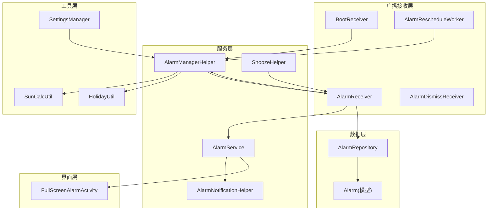
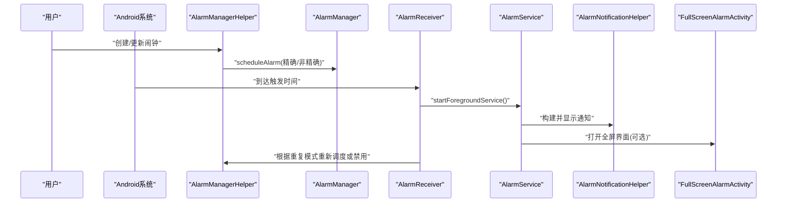
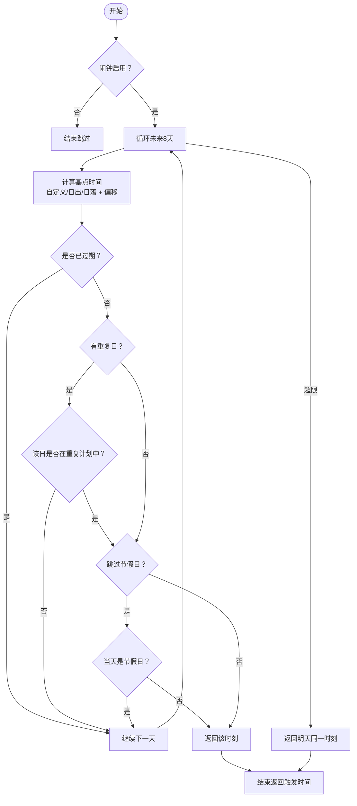
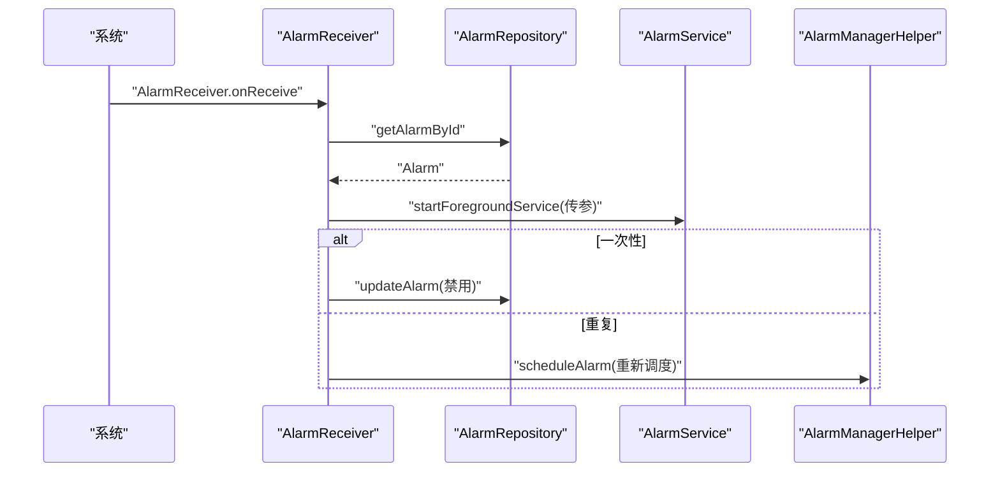
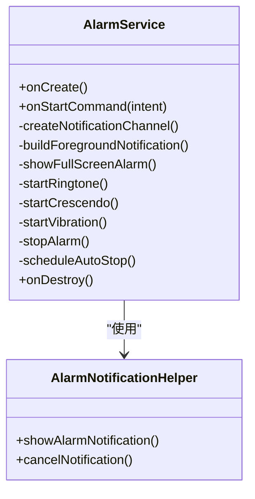
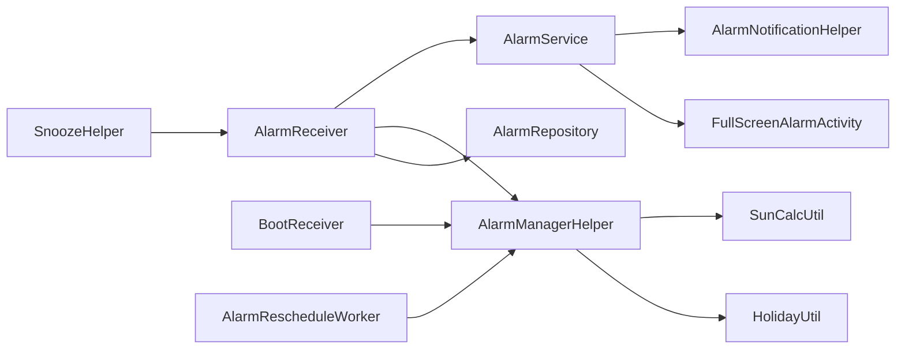

# 闹钟调度管理

<cite>
**本文引用的文件**
- [AlarmManagerHelper.kt](file://app/src/main/java/com/snuabar/sunrisesunsetalarm/service/AlarmManagerHelper.kt)
- [AlarmReceiver.kt](file://app/src/main/java/com/snuabar/sunrisesunsetalarm/receiver/AlarmReceiver.kt)
- [AlarmService.kt](file://app/src/main/java/com/snuabar/sunrisesunsetalarm/service/AlarmService.kt)
- [AlarmNotificationHelper.kt](file://app/src/main/java/com/snuabar/sunrisesunsetalarm/service/AlarmNotificationHelper.kt)
- [AlarmDismissReceiver.kt](file://app/src/main/java/com/snuabar/sunrisesunsetalarm/service/AlarmDismissReceiver.kt)
- [AlarmRescheduleWorker.kt](file://app/src/main/java/com/snuabar/sunrisesunsetalarm/receiver/AlarmRescheduleWorker.kt)
- [BootReceiver.kt](file://app/src/main/java/com/snuabar/sunrisesunsetalarm/receiver/BootReceiver.kt)
- [Alarm.kt](file://app/src/main/java/com/snuabar/sunrisesunsetalarm/data/model/Alarm.kt)
- [SunCalcUtil.kt](file://app/src/main/java/com/snuabar/sunrisesunsetalarm/util/SunCalcUtil.kt)
- [SnoozeHelper.kt](file://app/src/main/java/com/snuabar/sunrisesunsetalarm/service/SnoozeHelper.kt)
- [AndroidManifest.xml](file://app/src/main/AndroidManifest.xml)
- [AlarmRepository.kt](file://app/src/main/java/com/snuabar/sunrisesunsetalarm/data/repository/AlarmRepository.kt)
- [SettingsManager.kt](file://app/src/main/java/com/snuabar/sunrisesunsetalarm/util/SettingsManager.kt)
- [HolidayUtil.kt](file://app/src/main/java/com/snuabar/sunrisesunsetalarm/util/HolidayUtil.kt)
- [FullScreenAlarmActivity.kt](file://app/src/main/java/com/snuabar/sunrisesunsetalarm/ui/screens/FullScreenAlarmActivity.kt)
</cite>

## 目录
1. [简介](#简介)
2. [项目结构](#项目结构)
3. [核心组件](#核心组件)
4. [架构总览](#架构总览)
5. [详细组件分析](#详细组件分析)
6. [依赖关系分析](#依赖关系分析)
7. [性能考量](#性能考量)
8. [故障排查指南](#故障排查指南)
9. [结论](#结论)
10. [附录](#附录)

## 简介
本文件面向“闹钟调度管理系统”的实现与运维，重点围绕 AlarmManagerHelper 的调度算法、重复模式与偏移时间计算、Android 12+ 精确闹钟权限适配、以及闹钟触发后的广播接收、服务执行与通知管理流程进行深入解析。同时提供最佳实践、性能优化建议与常见问题解决方案，帮助开发者在多版本 Android 上稳定可靠地运行闹钟功能。

## 项目结构
应用采用按职责分层的组织方式：
- service 层：负责闹钟调度、通知与服务执行（AlarmManagerHelper、AlarmService、AlarmNotificationHelper、SnoozeHelper）
- receiver 层：负责系统事件与广播处理（AlarmReceiver、BootReceiver、AlarmDismissReceiver、AlarmRescheduleWorker）
- data 层：模型与仓库（Alarm、AlarmRepository）
- util 层：工具类（SunCalcUtil、HolidayUtil、SettingsManager）
- ui 层：前台交互（FullScreenAlarmActivity）

图表来源
- [AlarmManagerHelper.kt:17-166](file://app/src/main/java/com/snuabar/sunrisesunsetalarm/service/AlarmManagerHelper.kt#L17-L166)
- [AlarmReceiver.kt:17-69](file://app/src/main/java/com/snuabar/sunrisesunsetalarm/receiver/AlarmReceiver.kt#L17-L69)
- [AlarmService.kt:24-247](file://app/src/main/java/com/snuabar/sunrisesunsetalarm/service/AlarmService.kt#L24-L247)
- [AlarmNotificationHelper.kt:13-79](file://app/src/main/java/com/snuabar/sunrisesunsetalarm/service/AlarmNotificationHelper.kt#L13-L79)
- [SnoozeHelper.kt:10-46](file://app/src/main/java/com/snuabar/sunrisesunsetalarm/service/SnoozeHelper.kt#L10-L46)
- [BootReceiver.kt:11-34](file://app/src/main/java/com/snuabar/sunrisesunsetalarm/receiver/BootReceiver.kt#L11-L34)
- [AlarmRescheduleWorker.kt:12-48](file://app/src/main/java/com/snuabar/sunrisesunsetalarm/receiver/AlarmRescheduleWorker.kt#L12-L48)
- [Alarm.kt:6-50](file://app/src/main/java/com/snuabar/sunrisesunsetalarm/data/model/Alarm.kt#L6-L50)
- [AlarmRepository.kt:7-22](file://app/src/main/java/com/snuabar/sunrisesunsetalarm/data/repository/AlarmRepository.kt#L7-L22)
- [SunCalcUtil.kt:6-138](file://app/src/main/java/com/snuabar/sunrisesunsetalarm/util/SunCalcUtil.kt#L6-L138)
- [HolidayUtil.kt:22-223](file://app/src/main/java/com/snuabar/sunrisesunsetalarm/util/HolidayUtil.kt#L22-L223)
- [SettingsManager.kt:8-49](file://app/src/main/java/com/snuabar/sunrisesunsetalarm/util/SettingsManager.kt#L8-L49)
- [FullScreenAlarmActivity.kt:26-172](file://app/src/main/java/com/snuabar/sunrisesunsetalarm/ui/screens/FullScreenAlarmActivity.kt#L26-L172)

章节来源
- [AlarmManagerHelper.kt:17-166](file://app/src/main/java/com/snuabar/sunrisesunsetalarm/service/AlarmManagerHelper.kt#L17-L166)
- [AlarmReceiver.kt:17-69](file://app/src/main/java/com/snuabar/sunrisesunsetalarm/receiver/AlarmReceiver.kt#L17-L69)
- [AlarmService.kt:24-247](file://app/src/main/java/com/snuabar/sunrisesunsetalarm/service/AlarmService.kt#L24-L247)
- [AlarmNotificationHelper.kt:13-79](file://app/src/main/java/com/snuabar/sunrisesunsetalarm/service/AlarmNotificationHelper.kt#L13-L79)
- [SnoozeHelper.kt:10-46](file://app/src/main/java/com/snuabar/sunrisesunsetalarm/service/SnoozeHelper.kt#L10-L46)
- [BootReceiver.kt:11-34](file://app/src/main/java/com/snuabar/sunrisesunsetalarm/receiver/BootReceiver.kt#L11-L34)
- [AlarmRescheduleWorker.kt:12-48](file://app/src/main/java/com/snuabar/sunrisesunsetalarm/receiver/AlarmRescheduleWorker.kt#L12-L48)
- [Alarm.kt:6-50](file://app/src/main/java/com/snuabar/sunrisesunsetalarm/data/model/Alarm.kt#L6-L50)
- [AlarmRepository.kt:7-22](file://app/src/main/java/com/snuabar/sunrisesunsetalarm/data/repository/AlarmRepository.kt#L7-L22)
- [SunCalcUtil.kt:6-138](file://app/src/main/java/com/snuabar/sunrisesunsetalarm/util/SunCalcUtil.kt#L6-L138)
- [HolidayUtil.kt:22-223](file://app/src/main/java/com/snuabar/sunrisesunsetalarm/util/HolidayUtil.kt#L22-L223)
- [SettingsManager.kt:8-49](file://app/src/main/java/com/snuabar/sunrisesunsetalarm/util/SettingsManager.kt#L8-L49)
- [FullScreenAlarmActivity.kt:26-172](file://app/src/main/java/com/snuabar/sunrisesunsetalarm/ui/screens/FullScreenAlarmActivity.kt#L26-L172)

## 核心组件
- AlarmManagerHelper：负责闹钟调度与取消，包含精确/非精确调度、重复日过滤、节假日跳过、偏移时间计算等核心逻辑。
- AlarmReceiver：系统广播接收器，触发后启动 AlarmService 并根据重复模式决定禁用或重新调度。
- AlarmService：前台服务，负责播放铃声、震动、显示通知与全屏闹钟界面，支持渐强音效与自动停止。
- AlarmNotificationHelper：独立的通知助手，用于构建与展示全屏通知。
- SnoozeHelper：提供贪睡闹钟的二次调度能力。
- BootReceiver 与 AlarmRescheduleWorker：设备重启与周期性重排程，保证闹钟持久性与准确性。
- Alarm 与 AlarmRepository：数据模型与数据访问接口。
- SunCalcUtil 与 HolidayUtil：日出日落时间计算与节假日判定。
- SettingsManager：位置与偏好设置读取。
- FullScreenAlarmActivity：全屏交互界面，支持关闭与贪睡。

章节来源
- [AlarmManagerHelper.kt:17-166](file://app/src/main/java/com/snuabar/sunrisesunsetalarm/service/AlarmManagerHelper.kt#L17-L166)
- [AlarmReceiver.kt:17-69](file://app/src/main/java/com/snuabar/sunrisesunsetalarm/receiver/AlarmReceiver.kt#L17-L69)
- [AlarmService.kt:24-247](file://app/src/main/java/com/snuabar/sunrisesunsetalarm/service/AlarmService.kt#L24-L247)
- [AlarmNotificationHelper.kt:13-79](file://app/src/main/java/com/snuabar/sunrisesunsetalarm/service/AlarmNotificationHelper.kt#L13-L79)
- [SnoozeHelper.kt:10-46](file://app/src/main/java/com/snuabar/sunrisesunsetalarm/service/SnoozeHelper.kt#L10-L46)
- [BootReceiver.kt:11-34](file://app/src/main/java/com/snuabar/sunrisesunsetalarm/receiver/BootReceiver.kt#L11-L34)
- [AlarmRescheduleWorker.kt:12-48](file://app/src/main/java/com/snuabar/sunrisesunsetalarm/receiver/AlarmRescheduleWorker.kt#L12-L48)
- [Alarm.kt:6-50](file://app/src/main/java/com/snuabar/sunrisesunsetalarm/data/model/Alarm.kt#L6-L50)
- [AlarmRepository.kt:7-22](file://app/src/main/java/com/snuabar/sunrisesunsetalarm/data/repository/AlarmRepository.kt#L7-L22)
- [SunCalcUtil.kt:6-138](file://app/src/main/java/com/snuabar/sunrisesunsetalarm/util/SunCalcUtil.kt#L6-L138)
- [HolidayUtil.kt:22-223](file://app/src/main/java/com/snuabar/sunrisesunsetalarm/util/HolidayUtil.kt#L22-L223)
- [SettingsManager.kt:8-49](file://app/src/main/java/com/snuabar/sunrisesunsetalarm/util/SettingsManager.kt#L8-L49)
- [FullScreenAlarmActivity.kt:26-172](file://app/src/main/java/com/snuabar/sunrisesunsetalarm/ui/screens/FullScreenAlarmActivity.kt#L26-L172)

## 架构总览
下图展示了从调度到触发再到交互的关键流程：

图表来源
- [AlarmManagerHelper.kt:21-54](file://app/src/main/java/com/snuabar/sunrisesunsetalarm/service/AlarmManagerHelper.kt#L21-L54)
- [AlarmReceiver.kt:18-67](file://app/src/main/java/com/snuabar/sunrisesunsetalarm/receiver/AlarmReceiver.kt#L18-L67)
- [AlarmService.kt:44-83](file://app/src/main/java/com/snuabar/sunrisesunsetalarm/service/AlarmService.kt#L44-L83)
- [AlarmNotificationHelper.kt:42-73](file://app/src/main/java/com/snuabar/sunrisesunsetalarm/service/AlarmNotificationHelper.kt#L42-L73)
- [FullScreenAlarmActivity.kt:135-142](file://app/src/main/java/com/snuabar/sunrisesunsetalarm/ui/screens/FullScreenAlarmActivity.kt#L135-L142)

## 详细组件分析

### AlarmManagerHelper：调度与重复逻辑
- 精确闹钟权限与降级策略
  - 在 Android 12+（S）检查精确闹钟权限，若无权限则回退到非精确调度，确保在受限环境下仍能尽量按时触发。
- 下次触发时间计算
  - 支持三种基点：自定义时间、日出、日落；均支持偏移分钟数；对一次性闹钟跳过后的时间直接忽略，重复闹钟则遍历未来最多 8 天寻找下一个有效日期。
  - 重复日过滤：将 Calendar DAY_OF_WEEK 映射到模型中的周日索引，仅选择勾选的重复日。
  - 节假日跳过：当开启跳过节假日时，若目标日期为节假日则继续向后查找。
  - 回退策略：若 8 天内未找到有效日期，则返回明天同一时刻。
- PendingIntent 创建
  - 使用不可变标志与 alarm id 哈希作为请求码，携带 alarm_id 与 alarm_name，供后续广播与服务识别。

图表来源
- [AlarmManagerHelper.kt:62-151](file://app/src/main/java/com/snuabar/sunrisesunsetalarm/service/AlarmManagerHelper.kt#L62-L151)

章节来源
- [AlarmManagerHelper.kt:21-54](file://app/src/main/java/com/snuabar/sunrisesunsetalarm/service/AlarmManagerHelper.kt#L21-L54)
- [AlarmManagerHelper.kt:62-151](file://app/src/main/java/com/snuabar/sunrisesunsetalarm/service/AlarmManagerHelper.kt#L62-L151)
- [Alarm.kt:28-36](file://app/src/main/java/com/snuabar/sunrisesunsetalarm/data/model/Alarm.kt#L28-L36)
- [SunCalcUtil.kt:19-45](file://app/src/main/java/com/snuabar/sunrisesunsetalarm/util/SunCalcUtil.kt#L19-L45)
- [HolidayUtil.kt:80-94](file://app/src/main/java/com/snuabar/sunrisesunsetalarm/util/HolidayUtil.kt#L80-L94)

### AlarmReceiver：触发后的处理流程
- 从广播中提取 alarm_id，查询数据库获取完整闹钟信息。
- 启动前台服务 AlarmService 传递铃声、震动、时长、渐强等参数。
- 根据重复模式执行后续动作：
  - ONCE：触发后禁用该闹钟。
  - DAILY/WEEKDAYS/WEEKENDS/CUSTOM：重新计算下次触发时间并调度。
- 读取当前位置用于日出日落计算。

图表来源
- [AlarmReceiver.kt:18-67](file://app/src/main/java/com/snuabar/sunrisesunsetalarm/receiver/AlarmReceiver.kt#L18-L67)
- [AlarmRepository.kt:12-12](file://app/src/main/java/com/snuabar/sunrisesunsetalarm/data/repository/AlarmRepository.kt#L12-L12)
- [AlarmManagerHelper.kt:21-54](file://app/src/main/java/com/snuabar/sunrisesunsetalarm/service/AlarmManagerHelper.kt#L21-L54)

章节来源
- [AlarmReceiver.kt:18-67](file://app/src/main/java/com/snuabar/sunrisesunsetalarm/receiver/AlarmReceiver.kt#L18-L67)
- [AlarmRepository.kt:12-12](file://app/src/main/java/com/snuabar/sunrisesunsetalarm/data/repository/AlarmRepository.kt#L12-L12)

### AlarmService：前台服务与交互
- 通知通道创建与前台通知构建，包含关闭按钮与全屏意图。
- 根据 ringMode 分支：
  - FULL_SCREEN：播放铃声与震动，打开全屏活动。
  - NOTIFICATION：仅通知与播放铃声/震动。
  - LIVE_ACTIVITY：前台通知+震动，不额外打开全屏。
- 渐强音效：以固定步进逐步提升音量至最大。
- 自动停止：按 ringDurationMinutes 定时停止媒体与震动并停止自身。

图表来源
- [AlarmService.kt:24-247](file://app/src/main/java/com/snuabar/sunrisesunsetalarm/service/AlarmService.kt#L24-L247)
- [AlarmNotificationHelper.kt:13-79](file://app/src/main/java/com/snuabar/sunrisesunsetalarm/service/AlarmNotificationHelper.kt#L13-L79)

章节来源
- [AlarmService.kt:44-83](file://app/src/main/java/com/snuabar/sunrisesunsetalarm/service/AlarmService.kt#L44-L83)
- [AlarmService.kt:144-200](file://app/src/main/java/com/snuabar/sunrisesunsetalarm/service/AlarmService.kt#L144-L200)
- [AlarmService.kt:229-240](file://app/src/main/java/com/snuabar/sunrisesunsetalarm/service/AlarmService.kt#L229-L240)
- [AlarmNotificationHelper.kt:42-73](file://app/src/main/java/com/snuabar/sunrisesunsetalarm/service/AlarmNotificationHelper.kt#L42-L73)

### SnoozeHelper：贪睡调度
- 计算贪睡触发时间（当前时间 + 贪睡分钟），构造 PendingIntent 并调用 AlarmManager 设置。
- 在 Android 12+ 条件检查精确权限后再调度，保障稳定性。

章节来源
- [SnoozeHelper.kt:14-44](file://app/src/main/java/com/snuabar/sunrisesunsetalarm/service/SnoozeHelper.kt#L14-L44)

### BootReceiver 与 AlarmRescheduleWorker：持久化与周期性重排程
- BootReceiver：开机完成后扫描所有启用的闹钟并重新调度。
- AlarmRescheduleWorker：通过 WorkManager 每 24 小时周期性重排程，确保长期稳定性与位置变化后的准确性。

章节来源
- [BootReceiver.kt:18-32](file://app/src/main/java/com/snuabar/sunrisesunsetalarm/receiver/BootReceiver.kt#L18-L32)
- [AlarmRescheduleWorker.kt:14-46](file://app/src/main/java/com/snuabar/sunrisesunsetalarm/receiver/AlarmRescheduleWorker.kt#L14-L46)

### FullScreenAlarmActivity：交互与控制
- 锁屏可见、常亮、解锁等窗口标志，确保闹钟被强制唤醒。
- 提供“关闭”和“贪睡”按钮，分别停止服务与发起贪睡调度。

章节来源
- [FullScreenAlarmActivity.kt:33-105](file://app/src/main/java/com/snuabar/sunrisesunsetalarm/ui/screens/FullScreenAlarmActivity.kt#L33-L105)

## 依赖关系分析
- 组件耦合
  - AlarmReceiver 依赖 AlarmRepository、AlarmManagerHelper、SettingsManager。
  - AlarmService 依赖 AlarmNotificationHelper、FullScreenAlarmActivity。
  - AlarmManagerHelper 依赖 SunCalcUtil、HolidayUtil、AlarmReceiver。
  - SnoozeHelper 依赖 AlarmReceiver。
- 外部依赖
  - Android AlarmManager、NotificationManager、MediaPlayer、Vibrator。
  - WorkManager（周期性任务）。
- 潜在环路
  - 触发链路为单向：AlarmReceiver -> AlarmService -> FullScreenAlarmActivity，无循环依赖。
- 权限与清单
  - 精确闹钟权限、前台服务特殊用途、全屏意图、振动、网络等权限已在清单声明。

图表来源
- [AlarmReceiver.kt:18-67](file://app/src/main/java/com/snuabar/sunrisesunsetalarm/receiver/AlarmReceiver.kt#L18-L67)
- [AlarmService.kt:24-247](file://app/src/main/java/com/snuabar/sunrisesunsetalarm/service/AlarmService.kt#L24-L247)
- [AlarmManagerHelper.kt:17-166](file://app/src/main/java/com/snuabar/sunrisesunsetalarm/service/AlarmManagerHelper.kt#L17-L166)
- [SunCalcUtil.kt:6-138](file://app/src/main/java/com/snuabar/sunrisesunsetalarm/util/SunCalcUtil.kt#L6-L138)
- [HolidayUtil.kt:22-223](file://app/src/main/java/com/snuabar/sunrisesunsetalarm/util/HolidayUtil.kt#L22-L223)
- [AlarmNotificationHelper.kt:13-79](file://app/src/main/java/com/snuabar/sunrisesunsetalarm/service/AlarmNotificationHelper.kt#L13-L79)
- [FullScreenAlarmActivity.kt:26-172](file://app/src/main/java/com/snuabar/sunrisesunsetalarm/ui/screens/FullScreenAlarmActivity.kt#L26-L172)
- [SnoozeHelper.kt:10-46](file://app/src/main/java/com/snuabar/sunrisesunsetalarm/service/SnoozeHelper.kt#L10-L46)
- [BootReceiver.kt:11-34](file://app/src/main/java/com/snuabar/sunrisesunsetalarm/receiver/BootReceiver.kt#L11-L34)
- [AlarmRescheduleWorker.kt:12-48](file://app/src/main/java/com/snuabar/sunrisesunsetalarm/receiver/AlarmRescheduleWorker.kt#L12-L48)

章节来源
- [AndroidManifest.xml:1-88](file://app/src/main/AndroidManifest.xml#L1-L88)

## 性能考量
- 调度精度与功耗平衡
  - Android 12+ 优先使用精确闹钟；若无权限则回退非精确，避免频繁唤醒导致耗电。
  - 通过“未来 8 天内查找”与“节假日跳过”减少无效唤醒。
- 媒体与震动资源管理
  - 渐强音效采用定时器步进，避免阻塞主线程；自动停止定时器防止资源泄漏。
  - 震动使用波形模式，避免长时间持续震动。
- 前台服务与通知
  - 使用前台服务与通知通道，确保系统在低功耗场景下仍能及时唤醒。
- 周期性重排程
  - 每 24 小时一次的重排程可修正漂移，同时避免过于频繁的调度。

## 故障排查指南
- 无法精确闹钟
  - 现象：日志提示无法精确调度，系统弹窗引导开启“特殊应用权限”。
  - 处理：引导用户在系统设置中授予“闹钟与提醒”的“允许安排精确闹钟”权限。
- 闹钟未触发
  - 检查：是否被禁用、是否已过期、是否处于节假日跳过、重复日是否勾选。
  - 处理：调整重复日、关闭节假日跳过、确认偏移分钟数合理。
- 开机后未重排程
  - 检查：BootReceiver 是否注册成功、是否授予开机广播权限。
  - 处理：确认清单与权限，必要时手动触发重排程。
- 全屏界面无法唤起
  - 检查：是否授予全屏意图权限、锁屏显示权限。
  - 处理：在系统设置中开启相应权限。
- 贪睡无效
  - 检查：SnoozeHelper 是否具备精确闹钟权限、PendingIntent 请求码是否冲突。
  - 处理：确保权限与请求码唯一性。

章节来源
- [AlarmManagerHelper.kt:32-46](file://app/src/main/java/com/snuabar/sunrisesunsetalarm/service/AlarmManagerHelper.kt#L32-L46)
- [BootReceiver.kt:13-15](file://app/src/main/java/com/snuabar/sunrisesunsetalarm/receiver/BootReceiver.kt#L13-L15)
- [AndroidManifest.xml:13-15](file://app/src/main/AndroidManifest.xml#L13-L15)

## 结论
本系统通过 AlarmManagerHelper 的精确/非精确调度、完善的重复与节假日处理、以及 AlarmReceiver/AlarmService 的完整触发链路，实现了跨 Android 版本的稳定闹钟体验。配合 BootReceiver 与周期性重排程，进一步增强了可靠性。建议在生产环境中持续监控权限状态与调度偏差，并结合用户反馈优化重复日与节假日策略。

## 附录
- 最佳实践
  - 优先申请精确闹钟权限，确保高精度；在无权限时保持非精确回退路径。
  - 为一次性闹钟在触发后立即禁用，避免重复触发。
  - 使用不可变 PendingIntent 与稳定的请求码，避免覆盖或冲突。
  - 对媒体与震动资源进行显式释放，防止内存泄漏。
- 常见问题
  - 权限缺失导致调度失败：引导用户在系统设置中授权。
  - 闹钟时间漂移：利用周期性重排程与日出日落动态计算校正。
  - 节假日误触发：开启节假日跳过或调整重复日。