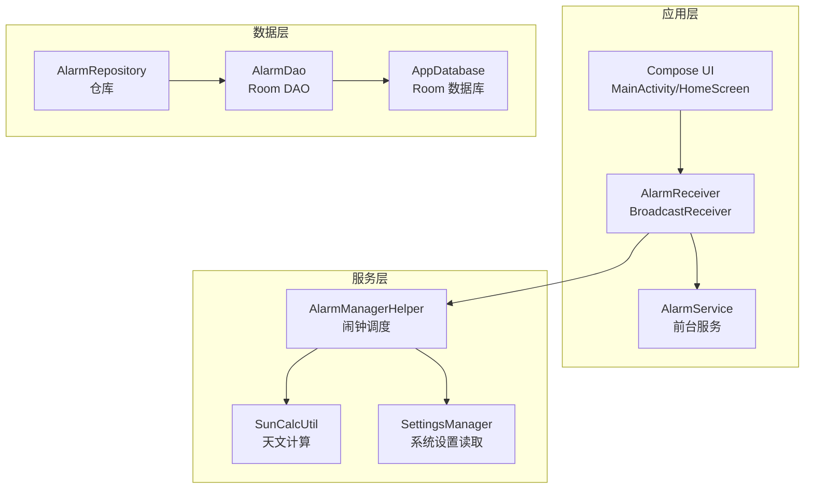
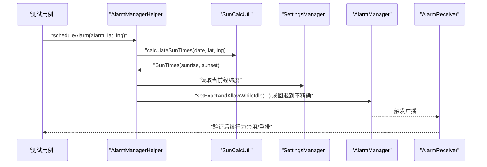
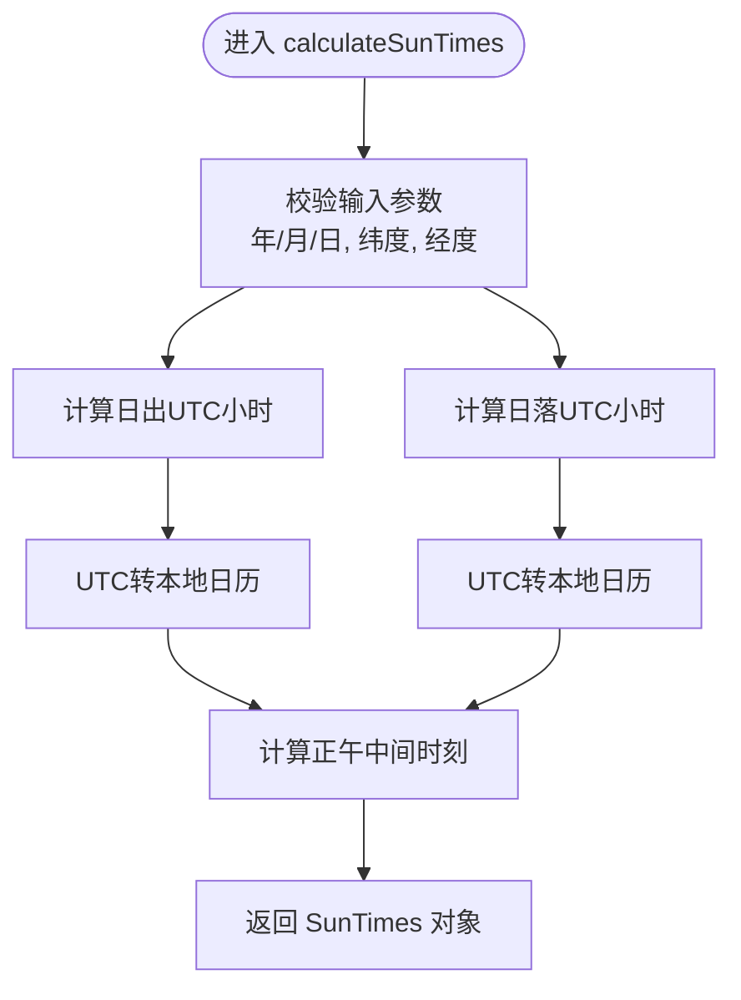
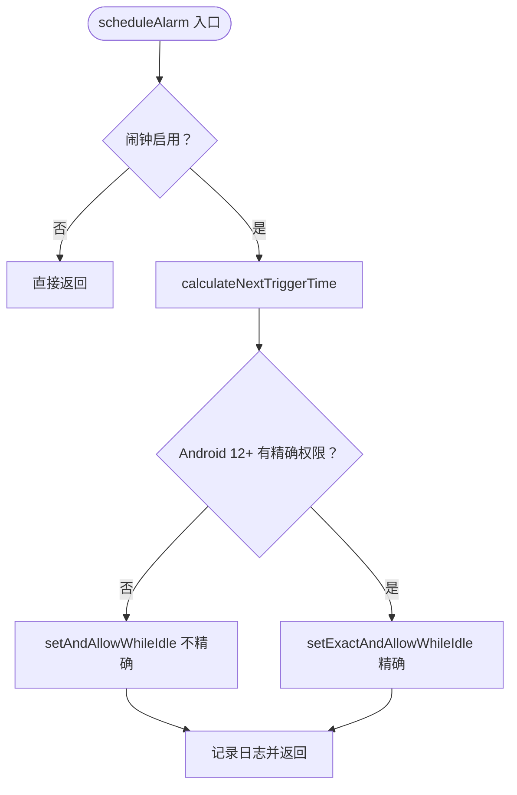
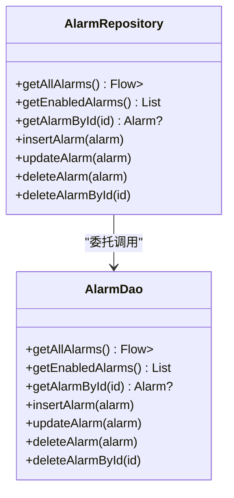
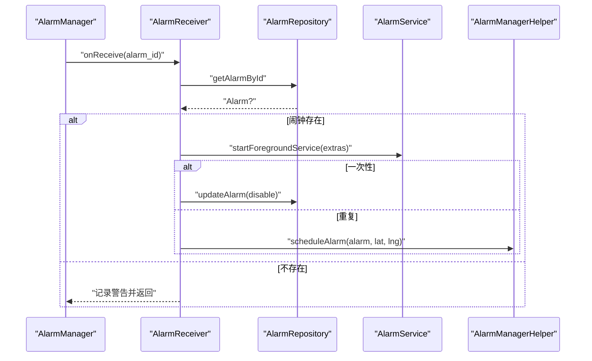
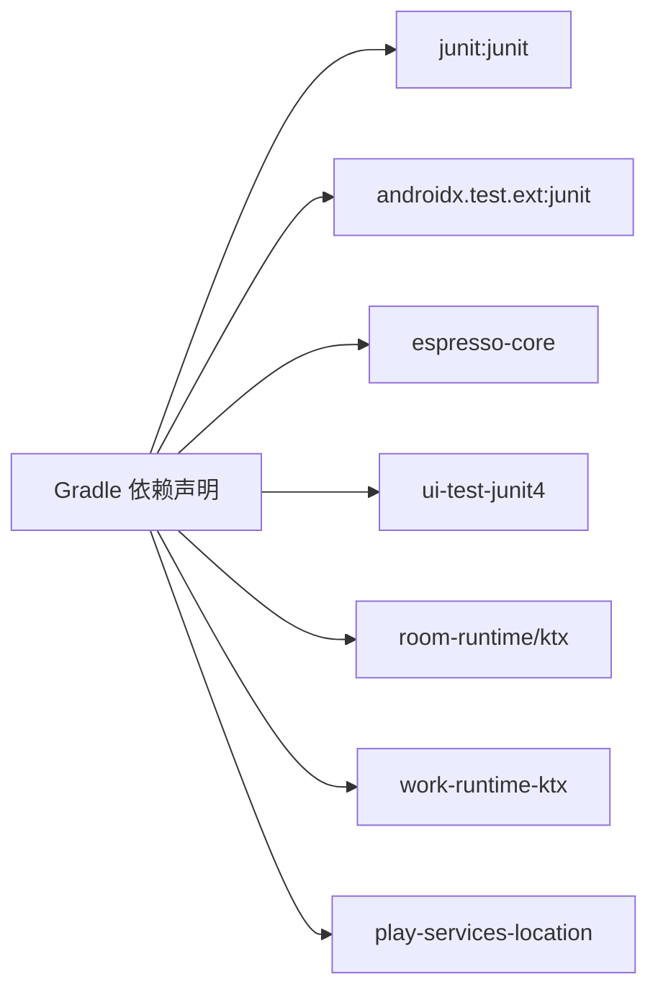

# 测试指南

<cite>
**本文引用的文件**
- [app/build.gradle.kts](file://app/build.gradle.kts)
- [build.gradle.kts](file://build.gradle.kts)
- [settings.gradle.kts](file://settings.gradle.kts)
- [AlarmRepository.kt](file://app/src/main/java/com/snuabar/sunrisesunsetalarm/data/repository/AlarmRepository.kt)
- [AlarmDao.kt](file://app/src/main/java/com/snuabar/sunrisesunsetalarm/data/database/AlarmDao.kt)
- [SunCalcUtil.kt](file://app/src/main/java/com/snuabar/sunrisesunsetalarm/util/SunCalcUtil.kt)
- [AlarmManagerHelper.kt](file://app/src/main/java/com/snuabar/sunrisesunsetalarm/service/AlarmManagerHelper.kt)
- [AlarmReceiver.kt](file://app/src/main/java/com/snuabar/sunrisesunsetalarm/receiver/AlarmReceiver.kt)
</cite>

## 目录
1. [引言](#引言)
2. [项目结构](#项目结构)
3. [核心组件](#核心组件)
4. [架构总览](#架构总览)
5. [详细组件分析](#详细组件分析)
6. [依赖分析](#依赖分析)
7. [性能考虑](#性能考虑)
8. [故障排查指南](#故障排查指南)
9. [结论](#结论)
10. [附录](#附录)

## 引言
本测试指南面向日出日落智能闹钟应用，目标是帮助开发者建立系统化的测试体系，覆盖单元测试、集成测试与UI测试，重点保障天文计算、闹钟调度、数据持久化与广播接收器行为的正确性与稳定性。文档同时给出Mock策略、测试数据准备、测试环境配置与自动化执行流程的最佳实践。

## 项目结构
应用采用Android + Jetpack Compose + Room + WorkManager + 广播接收器的典型架构。测试相关的关键位置与依赖如下：
- 单元测试：Junit（本地运行）
- UI测试：Compose测试与Espresso（仪器化测试）
- 依赖注入与模块：Room数据库、AlarmManager、系统服务通过Context访问
- 运行时权限与系统能力：精确闹钟权限在调度阶段进行条件判断

图表来源
- [AlarmReceiver.kt:17-68](file://app/src/main/java/com/snuabar/sunrisesunsetalarm/receiver/AlarmReceiver.kt#L17-L68)
- [AlarmManagerHelper.kt:17-165](file://app/src/main/java/com/snuabar/sunrisesunsetalarm/service/AlarmManagerHelper.kt#L17-L165)
- [SunCalcUtil.kt:6-137](file://app/src/main/java/com/snuabar/sunrisesunsetalarm/util/SunCalcUtil.kt#L6-L137)
- [AlarmRepository.kt:7-21](file://app/src/main/java/com/snuabar/sunrisesunsetalarm/data/repository/AlarmRepository.kt#L7-L21)
- [AlarmDao.kt:7-29](file://app/src/main/java/com/snuabar/sunrisesunsetalarm/data/database/AlarmDao.kt#L7-L29)

章节来源
- [app/build.gradle.kts:58-107](file://app/build.gradle.kts#L58-L107)
- [settings.gradle.kts:1-18](file://settings.gradle.kts#L1-L18)

## 核心组件
- 天文计算工具：SunCalcUtil 提供日出日落时间计算，返回包含日出、日落、正午的时间点，用于确定触发时机。
- 闹钟调度器：AlarmManagerHelper 负责根据重复模式、偏移量、节假日跳过策略与精确闹钟权限，计算并注册下一次触发时间。
- 数据访问：AlarmDao 定义Room查询与CRUD操作；AlarmRepository 封装数据访问与流式查询。
- 广播接收器：AlarmReceiver 在闹钟触发后启动前台服务处理响铃、震动、渐强等，并按重复模式决定是否重排或禁用。

章节来源
- [SunCalcUtil.kt:6-137](file://app/src/main/java/com/snuabar/sunrisesunsetalarm/util/SunCalcUtil.kt#L6-L137)
- [AlarmManagerHelper.kt:17-165](file://app/src/main/java/com/snuabar/sunrisesunsetalarm/service/AlarmManagerHelper.kt#L17-L165)
- [AlarmDao.kt:7-29](file://app/src/main/java/com/snuabar/sunrisesunsetalarm/data/database/AlarmDao.kt#L7-L29)
- [AlarmRepository.kt:7-21](file://app/src/main/java/com/snuabar/sunrisesunsetalarm/data/repository/AlarmRepository.kt#L7-L21)
- [AlarmReceiver.kt:17-68](file://app/src/main/java/com/snuabar/sunrisesunsetalarm/receiver/AlarmReceiver.kt#L17-L68)

## 架构总览
测试策略围绕以下层次展开：
- 单元测试：独立验证算法与纯函数（如SunCalcUtil）、仓库方法（AlarmRepository）与调度逻辑（AlarmManagerHelper）中的可测部分。
- 集成测试：验证DAO与数据库交互、Room迁移、事务一致性；以及AlarmReceiver与AlarmManagerHelper协作。
- UI测试：Compose测试与Espresso测试，覆盖用户交互路径与通知/全屏闹钟界面。

图表来源
- [AlarmManagerHelper.kt:21-54](file://app/src/main/java/com/snuabar/sunrisesunsetalarm/service/AlarmManagerHelper.kt#L21-L54)
- [SunCalcUtil.kt:19-44](file://app/src/main/java/com/snuabar/sunrisesunsetalarm/util/SunCalcUtil.kt#L19-L44)
- [AlarmReceiver.kt:35-66](file://app/src/main/java/com/snuabar/sunrisesunsetalarm/receiver/AlarmReceiver.kt#L35-L66)

## 详细组件分析

### 组件A：天文计算（SunCalcUtil）
- 设计要点
  - 纯函数：输入日期与经纬度，输出当日日出、日落、正午时间（毫秒级）。
  - 数值稳定性：对极昼/极夜场景进行边界处理；角度归一化避免越界。
- 测试关注点
  - 输入边界：纬度过高/低、经度变化、跨年/跨月。
  - 输出一致性：日出日落顺序、正午居中、与已知参考值对比。
  - 性能：避免在UI线程调用，保证快速返回。
- Mock策略
  - 无需Mock外部依赖，但可构造多组经纬度与日期组合进行参数化测试。
- 覆盖率建议
  - 分支覆盖率：极昼/极夜分支、日出/日落两个事件分支。
  - 场景覆盖率：不同纬度带（温带/寒带）、不同季节。

图表来源
- [SunCalcUtil.kt:19-44](file://app/src/main/java/com/snuabar/sunrisesunsetalarm/util/SunCalcUtil.kt#L19-L44)

章节来源
- [SunCalcUtil.kt:6-137](file://app/src/main/java/com/snuabar/sunrisesunsetalarm/util/SunCalcUtil.kt#L6-L137)

### 组件B：闹钟调度（AlarmManagerHelper）
- 设计要点
  - 计算下一次触发时间：支持自定义时间、日出/日落基线、偏移分钟、重复天数、节假日跳过。
  - 权限适配：Android 12+检测精确闹钟权限，必要时降级为不精确闹钟。
  - PendingIntent管理：基于Alarm.id生成唯一请求码，携带必要extras。
- 测试关注点
  - 触发时间计算：重复模式、偏移、节假日跳过、极昼/极夜。
  - 权限分支：有/无精确闹钟权限下的行为差异。
  - 边界情况：时间已过当天、连续多日无效、fallback到明天。
- Mock策略
  - Mock AlarmManager：验证setExact/setAndAllowWhileIdle或回退调用次数与参数。
  - Mock SunCalcUtil：固定返回日出/日落时间，隔离算法误差。
  - Mock Calendar：控制“现在”时间，便于预测未来触发点。
- 覆盖率建议
  - 分支覆盖率：权限分支、重复模式分支、节假日跳过分支。
  - 场景覆盖率：工作日/周末/自定义、跨时区、极昼/极夜。

图表来源
- [AlarmManagerHelper.kt:21-54](file://app/src/main/java/com/snuabar/sunrisesunsetalarm/service/AlarmManagerHelper.kt#L21-L54)

章节来源
- [AlarmManagerHelper.kt:17-165](file://app/src/main/java/com/snuabar/sunrisesunsetalarm/service/AlarmManagerHelper.kt#L17-L165)

### 组件C：数据访问（AlarmRepository 与 AlarmDao）
- 设计要点
  - AlarmRepository封装DAO方法，暴露Flow与suspend接口。
  - AlarmDao定义查询、插入、更新、删除与按ID删除。
- 测试关注点
  - 查询一致性：getAllAlarms按创建时间倒序；getEnabledAlarms过滤启用状态。
  - 写入一致性：insert/update/delete语义正确；REPLACE冲突策略。
  - 流式查询：Flow订阅与数据变更传播。
- Mock策略
  - Mock AlarmDao：返回预设列表/单个对象，或抛出异常以验证错误路径。
  - 使用In-Memory Database（如Room的InMemoryDatabase）进行集成测试。
- 覆盖率建议
  - 分支覆盖率：Flow订阅、空结果、异常路径。
  - 场景覆盖率：插入/更新/删除组合、批量查询。

图表来源
- [AlarmRepository.kt:7-21](file://app/src/main/java/com/snuabar/sunrisesunsetalarm/data/repository/AlarmRepository.kt#L7-L21)
- [AlarmDao.kt:7-29](file://app/src/main/java/com/snuabar/sunrisesunsetalarm/data/database/AlarmDao.kt#L7-L29)

章节来源
- [AlarmRepository.kt:1-22](file://app/src/main/java/com/snuabar/sunrisesunsetalarm/data/repository/AlarmRepository.kt#L1-L22)
- [AlarmDao.kt:1-30](file://app/src/main/java/com/snuabar/sunrisesunsetalarm/data/database/AlarmDao.kt#L1-L30)

### 组件D：广播接收器（AlarmReceiver）
- 设计要点
  - 接收闹钟广播，启动前台服务处理响铃、震动、渐强等。
  - 根据重复模式决定禁用一次性闹钟或重新调度。
  - 从AlarmRepository加载当前闹钟状态，避免使用过期数据。
- 测试关注点
  - 广播解析：alarm_id存在性、extras完整性。
  - 前台服务启动：Intent参数与服务生命周期。
  - 重复模式分支：一次性禁用、重复类别的重排。
- Mock策略
  - Mock AlarmRepository：返回指定闹钟对象或null。
  - Mock AlarmManagerHelper：拦截scheduleAlarm调用并断言参数。
  - 使用ShadowAlarmManager（Robolectric）或Instrumentation框架模拟系统闹钟。
- 覆盖率建议
  - 分支覆盖率：闹钟存在/不存在、重复模式分类。
  - 场景覆盖率：不同铃声/震动/渐强配置。

图表来源
- [AlarmReceiver.kt:17-68](file://app/src/main/java/com/snuabar/sunrisesunsetalarm/receiver/AlarmReceiver.kt#L17-L68)

章节来源
- [AlarmReceiver.kt:1-69](file://app/src/main/java/com/snuabar/sunrisesunsetalarm/receiver/AlarmReceiver.kt#L1-L69)

## 依赖分析
- 测试框架与工具
  - JUnit：本地单元测试
  - AndroidX Test（JUnit4、Espresso、Compose测试）：UI与仪器化测试
  - KSP：Room编译期注解处理
- 关键外部依赖
  - Room：数据库ORM
  - WorkManager：后台任务调度（与闹钟重排相关）
  - Play Services Location：位置服务（影响SunCalcUtil输入）

图表来源
- [app/build.gradle.kts:58-107](file://app/build.gradle.kts#L58-L107)

章节来源
- [app/build.gradle.kts:58-107](file://app/build.gradle.kts#L58-L107)
- [build.gradle.kts:1-7](file://build.gradle.kts#L1-L7)
- [settings.gradle.kts:1-18](file://settings.gradle.kts#L1-L18)

## 性能考虑
- 单元测试
  - 避免真实系统调用：Mock AlarmManager、Calendar、Location。
  - 参数化测试：使用多组经纬度与日期，减少重复用例。
- 集成测试
  - 使用内存数据库或临时数据库，缩短初始化时间。
  - 批量写入与事务提交，减少I/O开销。
- UI测试
  - 合理使用Compose测试API，避免深层UI树查找。
  - 使用TestTag与TestName标识元素，提升定位效率。
- 调度性能
  - AlarmManagerHelper应尽量避免在主线程阻塞；对SunCalcUtil调用进行缓存或批处理。

## 故障排查指南
- 精确闹钟权限未授予
  - 现象：日志提示无法设置精确闹钟，退回到不精确闹钟。
  - 排查：确认设备系统设置中已授权“允许安排精确闹钟”。
  - 测试：在Mock环境中模拟canScheduleExactAlarms返回false，验证回退逻辑。
- 闹钟未触发或提前触发
  - 现象：触发时间早于预期或完全不触发。
  - 排查：核对offsetMinutes、repeatDays索引映射、节假日跳过逻辑。
  - 测试：构造“今天已过期”的场景，验证自动跳至明天。
- 日出/日落计算异常
  - 现象：极昼/极夜地区出现非法时间。
  - 排查：检查SunCalcUtil的cosH边界处理与角度归一化。
  - 测试：构造高纬度与极端日期，验证返回值范围。
- 数据库写入失败
  - 现象：插入/更新后查询不到最新数据。
  - 排查：确认Room编译配置、事务与协程作用域使用。
  - 测试：使用In-Memory Database进行写入-读取一致性验证。

章节来源
- [AlarmManagerHelper.kt:32-54](file://app/src/main/java/com/snuabar/sunrisesunsetalarm/service/AlarmManagerHelper.kt#L32-L54)
- [AlarmManagerHelper.kt:122-125](file://app/src/main/java/com/snuabar/sunrisesunsetalarm/service/AlarmManagerHelper.kt#L122-L125)
- [SunCalcUtil.kt:92-95](file://app/src/main/java/com/snuabar/sunrisesunsetalarm/util/SunCalcUtil.kt#L92-L95)

## 结论
通过分层测试策略与Mock配合，可以有效覆盖天文计算、闹钟调度、数据持久化与广播处理等核心功能。建议优先完善单元测试与集成测试，再补充UI测试，持续提升覆盖率与稳定性。定期回归测试与参数化用例有助于应对复杂边界场景。

## 附录

### 测试用例设计原则
- 原子性：每个用例只验证单一行为或边界。
- 可重复性：使用固定种子或可控时间源，避免随机性。
- 可读性：命名清晰、前置条件明确、断言具体。
- 可维护性：用例与实现解耦，避免过度细节绑定。

### 覆盖率要求建议
- 行/分支覆盖率：核心算法与关键分支达到80%以上。
- 场景覆盖率：不同纬度带、重复模式、节假日、权限状态。
- 回归覆盖率：每次修复缺陷后补充对应用例。

### Mock对象与测试数据准备
- Mock对象
  - AlarmManager：验证调用次数与参数（精确/不精确）。
  - SunCalcUtil：固定返回值，隔离算法误差。
  - Calendar：冻结“现在”时间，便于预测未来触发点。
  - AlarmRepository：返回预设数据或抛出异常。
- 测试数据
  - 构造多组经纬度（温带/寒带/极昼/极夜）、日期（跨年/跨月）、重复模式与偏移量。
  - 准备节假日列表与非节假日日期，验证skipHolidays逻辑。

### 测试环境配置与自动化执行
- 本地单元测试
  - 使用Android Studio或Gradle命令执行test任务。
- 仪器化测试
  - 使用Gradle命令执行connectedAndroidTest，或在CI中配置设备/模拟器。
- Compose UI测试
  - 使用ui-test-junit4与Compose测试API，结合TestTag进行定位。
- 自动化执行
  - 在CI流水线中分别执行test与connectedAndroidTest，收集报告并统计覆盖率。

章节来源
- [app/build.gradle.kts:101-106](file://app/build.gradle.kts#L101-L106)