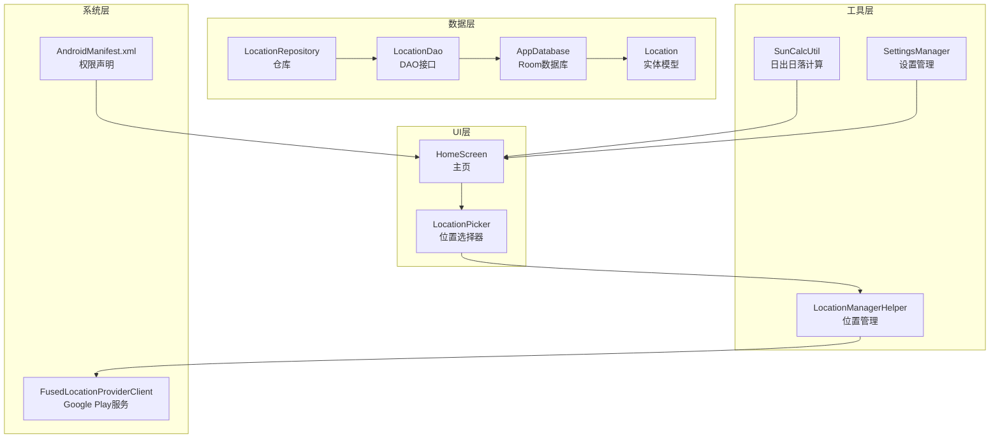
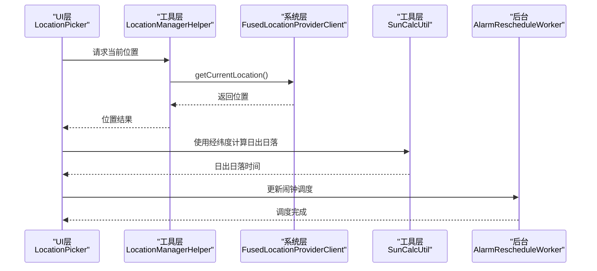
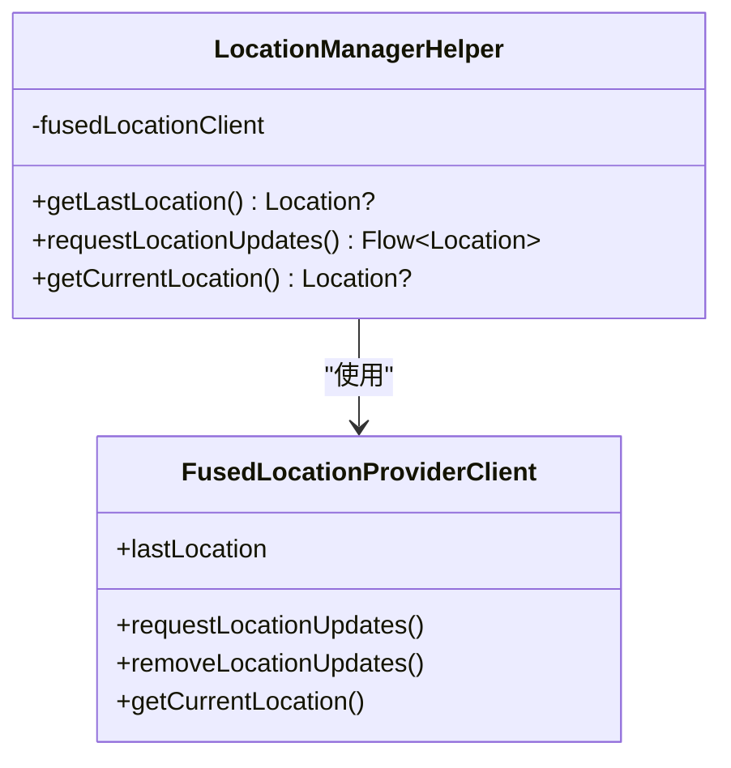
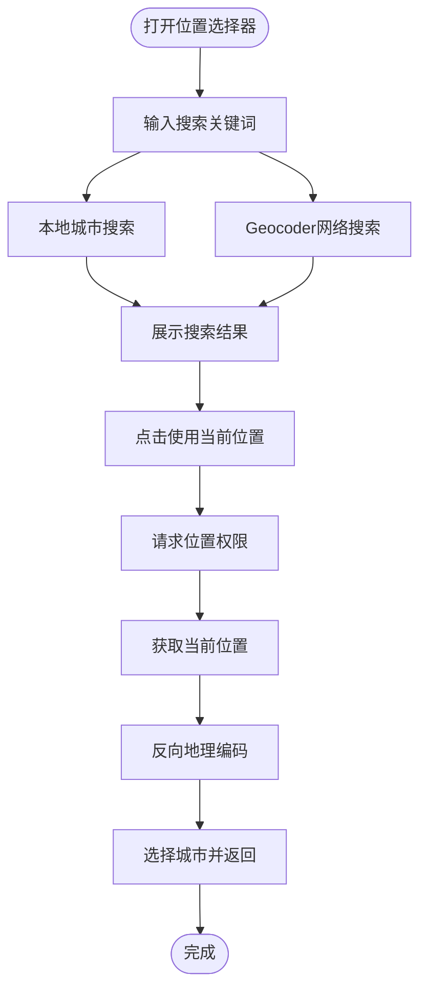
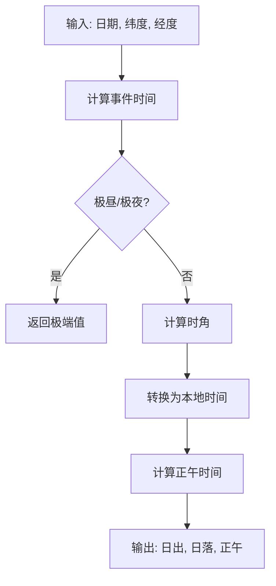
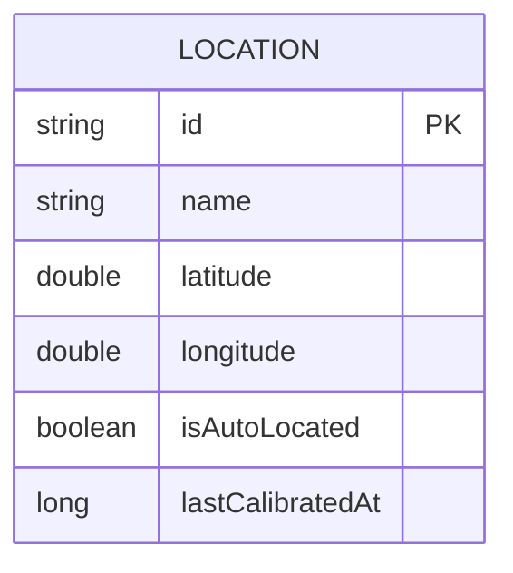
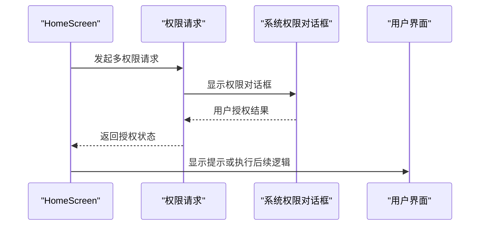
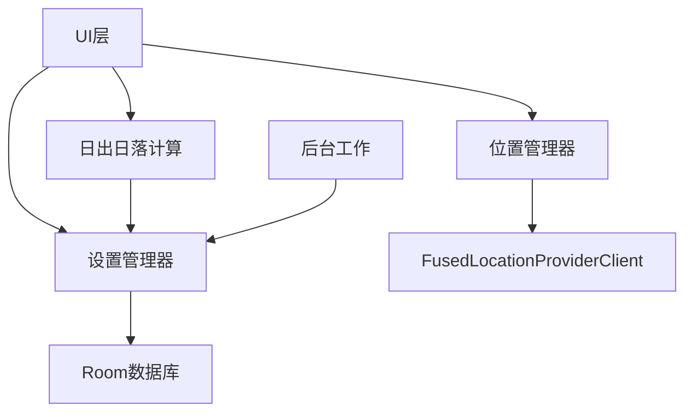

# 位置服务集成

<cite>
**本文档引用的文件**
- [LocationManagerHelper.kt](file://app/src/main/java/com/snuabar/sunrisesunsetalarm/util/LocationManagerHelper.kt)
- [LocationPicker.kt](file://app/src/main/java/com/snuabar/sunrisesunsetalarm/ui/components/LocationPicker.kt)
- [SunCalcUtil.kt](file://app/src/main/java/com/snuabar/sunrisesunsetalarm/util/SunCalcUtil.kt)
- [LocationDao.kt](file://app/src/main/java/com/snuabar/sunrisesunsetalarm/data/database/LocationDao.kt)
- [Location.kt](file://app/src/main/java/com/snuabar/sunrisesunsetalarm/data/model/Location.kt)
- [AppDatabase.kt](file://app/src/main/java/com/snuabar/sunrisesunsetalarm/data/database/AppDatabase.kt)
- [LocationRepository.kt](file://app/src/main/java/com/snuabar/sunrisesunsetalarm/data/repository/LocationRepository.kt)
- [SettingsManager.kt](file://app/src/main/java/com/snuabar/sunrisesunsetalarm/util/SettingsManager.kt)
- [AndroidManifest.xml](file://app/src/main/AndroidManifest.xml)
- [HomeScreen.kt](file://app/src/main/java/com/snuabar/sunrisesunsetalarm/ui/screens/HomeScreen.kt)
- [AlarmRescheduleWorker.kt](file://app/src/main/java/com/snuabar/sunrisesunsetalarm/receiver/AlarmRescheduleWorker.kt)
</cite>

## 目录
1. [简介](#简介)
2. [项目结构](#项目结构)
3. [核心组件](#核心组件)
4. [架构概览](#架构概览)
5. [详细组件分析](#详细组件分析)
6. [依赖关系分析](#依赖关系分析)
7. [性能考虑](#性能考虑)
8. [故障排除指南](#故障排除指南)
9. [结论](#结论)

## 简介
本文件详细说明了Android应用中的位置服务集成方案，涵盖以下方面：
- FusedLocationProviderClient的使用方式：位置获取、精度设置、更新频率控制
- 位置权限的申请与管理：运行时权限处理、权限拒绝的回退策略
- 位置数据的存储与缓存：Room数据库的使用、位置历史记录、地理位置解析
- 日出日落时间计算的位置依赖关系：经纬度参数传递、实时位置更新、位置变化检测
- 性能优化建议：电池消耗控制、精度与性能平衡

## 项目结构
位置服务相关代码主要分布在以下模块：
- 工具层：位置管理与日出日落计算
- 数据层：Room数据库与DAO接口
- UI层：位置选择器与权限请求
- 应用配置：清单文件中的权限声明

**图表来源**
- [LocationManagerHelper.kt:14-78](file://app/src/main/java/com/snuabar/sunrisesunsetalarm/util/LocationManagerHelper.kt#L14-L78)
- [LocationPicker.kt:27-275](file://app/src/main/java/com/snuabar/sunrisesunsetalarm/ui/components/LocationPicker.kt#L27-L275)
- [SunCalcUtil.kt:6-138](file://app/src/main/java/com/snuabar/sunrisesunsetalarm/util/SunCalcUtil.kt#L6-L138)
- [LocationDao.kt:7-23](file://app/src/main/java/com/snuabar/sunrisesunsetalarm/data/database/LocationDao.kt#L7-L23)
- [Location.kt:6-15](file://app/src/main/java/com/snuabar/sunrisesunsetalarm/data/model/Location.kt#L6-L15)
- [AppDatabase.kt:10-34](file://app/src/main/java/com/snuabar/sunrisesunsetalarm/data/database/AppDatabase.kt#L10-L34)
- [LocationRepository.kt:7-17](file://app/src/main/java/com/snuabar/sunrisesunsetalarm/data/repository/LocationRepository.kt#L7-L17)
- [SettingsManager.kt:8-49](file://app/src/main/java/com/snuabar/sunrisesunsetalarm/util/SettingsManager.kt#L8-L49)
- [AndroidManifest.xml:5-15](file://app/src/main/AndroidManifest.xml#L5-L15)

**章节来源**
- [LocationManagerHelper.kt:14-78](file://app/src/main/java/com/snuabar/sunrisesunsetalarm/util/LocationManagerHelper.kt#L14-L78)
- [LocationPicker.kt:27-275](file://app/src/main/java/com/snuabar/sunrisesunsetalarm/ui/components/LocationPicker.kt#L27-L275)
- [SunCalcUtil.kt:6-138](file://app/src/main/java/com/snuabar/sunrisesunsetalarm/util/SunCalcUtil.kt#L6-L138)
- [LocationDao.kt:7-23](file://app/src/main/java/com/snuabar/sunrisesunsetalarm/data/database/LocationDao.kt#L7-L23)
- [Location.kt:6-15](file://app/src/main/java/com/snuabar/sunrisesunsetalarm/data/model/Location.kt#L6-L15)
- [AppDatabase.kt:10-34](file://app/src/main/java/com/snuabar/sunrisesunsetalarm/data/database/AppDatabase.kt#L10-L34)
- [LocationRepository.kt:7-17](file://app/src/main/java/com/snuabar/sunrisesunsetalarm/data/repository/LocationRepository.kt#L7-L17)
- [SettingsManager.kt:8-49](file://app/src/main/java/com/snuabar/sunrisesunsetalarm/util/SettingsManager.kt#L8-L49)
- [AndroidManifest.xml:5-15](file://app/src/main/AndroidManifest.xml#L5-L15)

## 核心组件
本项目的核心位置服务组件包括：
- 位置管理器：封装FusedLocationProviderClient，提供最近位置查询、位置流式更新、当前高精度位置获取
- 位置选择器：支持本地城市搜索与Geocoder网络搜索，提供GPS定位能力
- 日出日落计算器：基于经纬度进行日出日落时间计算
- 数据持久化：Room数据库存储位置信息，支持增删改查
- 设置管理：保存当前经纬度、位置名称、最后校准时间等

**章节来源**
- [LocationManagerHelper.kt:14-78](file://app/src/main/java/com/snuabar/sunrisesunsetalarm/util/LocationManagerHelper.kt#L14-L78)
- [LocationPicker.kt:27-275](file://app/src/main/java/com/snuabar/sunrisesunsetalarm/ui/components/LocationPicker.kt#L27-L275)
- [SunCalcUtil.kt:6-138](file://app/src/main/java/com/snuabar/sunrisesunsetalarm/util/SunCalcUtil.kt#L6-L138)
- [LocationDao.kt:7-23](file://app/src/main/java/com/snuabar/sunrisesunsetalarm/data/database/LocationDao.kt#L7-L23)
- [Location.kt:6-15](file://app/src/main/java/com/snuabar/sunrisesunsetalarm/data/model/Location.kt#L6-L15)
- [AppDatabase.kt:10-34](file://app/src/main/java/com/snuabar/sunrisesunsetalarm/data/database/AppDatabase.kt#L10-L34)
- [LocationRepository.kt:7-17](file://app/src/main/java/com/snuabar/sunrisesunsetalarm/data/repository/LocationRepository.kt#L7-L17)
- [SettingsManager.kt:8-49](file://app/src/main/java/com/snuabar/sunrisesunsetalarm/util/SettingsManager.kt#L8-L49)

## 架构概览
位置服务在应用中的整体流程如下：
- 用户通过位置选择器发起位置请求
- UI层调用位置管理器获取当前位置或订阅位置更新
- 位置结果用于日出日落时间计算
- 计算结果影响闹钟调度与展示
- 位置信息通过设置管理器持久化

**图表来源**
- [LocationPicker.kt:141-175](file://app/src/main/java/com/snuabar/sunrisesunsetalarm/ui/components/LocationPicker.kt#L141-L175)
- [LocationManagerHelper.kt:60-77](file://app/src/main/java/com/snuabar/sunrisesunsetalarm/util/LocationManagerHelper.kt#L60-L77)
- [SunCalcUtil.kt:19-45](file://app/src/main/java/com/snuabar/sunrisesunsetalarm/util/SunCalcUtil.kt#L19-L45)
- [AlarmRescheduleWorker.kt:35-47](file://app/src/main/java/com/snuabar/sunrisesunsetalarm/receiver/AlarmRescheduleWorker.kt#L35-L47)

## 详细组件分析

### 位置管理器（LocationManagerHelper）
该类封装了FusedLocationProviderClient的使用，提供三种核心能力：
- 获取最近位置：返回最后一次可用位置
- 订阅位置更新：以Flow形式提供持续位置流
- 获取当前高精度位置：一次性高精度定位

**图表来源**
- [LocationManagerHelper.kt:14-78](file://app/src/main/java/com/snuabar/sunrisesunsetalarm/util/LocationManagerHelper.kt#L14-L78)

实现要点：
- 使用优先级平衡功耗与精度的请求配置
- 通过callbackFlow将位置回调转换为Kotlin Flow
- 在协程作用域内安全地处理位置请求与取消

**章节来源**
- [LocationManagerHelper.kt:14-78](file://app/src/main/java/com/snuabar/sunrisesunsetalarm/util/LocationManagerHelper.kt#L14-L78)

### 位置选择器（LocationPicker）
位置选择器提供两种位置获取方式：
- 本地搜索：基于内置城市列表的快速筛选
- 网络搜索：通过Geocoder进行地理编码搜索
- GPS定位：调用位置管理器获取当前位置并反向地理编码

**图表来源**
- [LocationPicker.kt:42-98](file://app/src/main/java/com/snuabar/sunrisesunsetalarm/ui/components/LocationPicker.kt#L42-L98)
- [LocationPicker.kt:141-175](file://app/src/main/java/com/snuabar/sunrisesunsetalarm/ui/components/LocationPicker.kt#L141-L175)

**章节来源**
- [LocationPicker.kt:27-275](file://app/src/main/java/com/snuabar/sunrisesunsetalarm/ui/components/LocationPicker.kt#L27-L275)

### 日出日落计算（SunCalcUtil）
日出日落计算基于经纬度与日期，采用简化算法：
- 输入：年、月、日、纬度、经度
- 输出：日出时间、日落时间、正午时间
- 关键步骤：计算时差、真太阳时、时角、极昼极夜判断

**图表来源**
- [SunCalcUtil.kt:19-45](file://app/src/main/java/com/snuabar/sunrisesunsetalarm/util/SunCalcUtil.kt#L19-L45)
- [SunCalcUtil.kt:47-127](file://app/src/main/java/com/snuabar/sunrisesunsetalarm/util/SunCalcUtil.kt#L47-L127)

**章节来源**
- [SunCalcUtil.kt:6-138](file://app/src/main/java/com/snuabar/sunrisesunsetalarm/util/SunCalcUtil.kt#L6-L138)

### 数据持久化（Room数据库）
位置数据通过Room数据库进行持久化：
- 实体：Location表，包含主键、名称、经纬度、自动定位标记、最后校准时间
- DAO：提供查询、插入、更新、删除操作
- 仓库：封装DAO操作，向上提供业务方法

**图表来源**
- [Location.kt:6-15](file://app/src/main/java/com/snuabar/sunrisesunsetalarm/data/model/Location.kt#L6-L15)
- [LocationDao.kt:7-23](file://app/src/main/java/com/snuabar/sunrisesunsetalarm/data/database/LocationDao.kt#L7-L23)
- [AppDatabase.kt:10-17](file://app/src/main/java/com/snuabar/sunrisesunsetalarm/data/database/AppDatabase.kt#L10-L17)

**章节来源**
- [Location.kt:6-15](file://app/src/main/java/com/snuabar/sunrisesunsetalarm/data/model/Location.kt#L6-L15)
- [LocationDao.kt:7-23](file://app/src/main/java/com/snuabar/sunrisesunsetalarm/data/database/LocationDao.kt#L7-L23)
- [AppDatabase.kt:10-34](file://app/src/main/java/com/snuabar/sunrisesunsetalarm/data/database/AppDatabase.kt#L10-L34)
- [LocationRepository.kt:7-17](file://app/src/main/java/com/snuabar/sunrisesunsetalarm/data/repository/LocationRepository.kt#L7-L17)

### 权限管理与UI集成
- 清单文件声明位置权限：ACCESS_FINE_LOCATION、ACCESS_COARSE_LOCATION
- UI层通过ActivityResultContracts请求权限
- HomeScreen中集成位置权限请求与错误提示

**图表来源**
- [AndroidManifest.xml:5-15](file://app/src/main/AndroidManifest.xml#L5-L15)
- [HomeScreen.kt:124-131](file://app/src/main/java/com/snuabar/sunrisesunsetalarm/ui/screens/HomeScreen.kt#L124-L131)
- [LocationPicker.kt:141-175](file://app/src/main/java/com/snuabar/sunrisesunsetalarm/ui/components/LocationPicker.kt#L141-L175)

**章节来源**
- [AndroidManifest.xml:5-15](file://app/src/main/AndroidManifest.xml#L5-L15)
- [HomeScreen.kt:124-131](file://app/src/main/java/com/snuabar/sunrisesunsetalarm/ui/screens/HomeScreen.kt#L124-L131)
- [LocationPicker.kt:141-175](file://app/src/main/java/com/snuabar/sunrisesunsetalarm/ui/components/LocationPicker.kt#L141-L175)

## 依赖关系分析
位置服务各组件之间的依赖关系如下：
- UI层依赖位置管理器与设置管理器
- 位置管理器依赖Google Play服务的FusedLocationProviderClient
- 日出日落计算依赖位置信息
- 数据持久化依赖Room数据库
- 后台工作依赖设置管理器中的位置参数

**图表来源**
- [LocationManagerHelper.kt:14-78](file://app/src/main/java/com/snuabar/sunrisesunsetalarm/util/LocationManagerHelper.kt#L14-L78)
- [LocationPicker.kt:27-275](file://app/src/main/java/com/snuabar/sunrisesunsetalarm/ui/components/LocationPicker.kt#L27-L275)
- [SunCalcUtil.kt:19-45](file://app/src/main/java/com/snuabar/sunrisesunsetalarm/util/SunCalcUtil.kt#L19-L45)
- [SettingsManager.kt:19-33](file://app/src/main/java/com/snuabar/sunrisesunsetalarm/util/SettingsManager.kt#L19-L33)
- [AlarmRescheduleWorker.kt:35-47](file://app/src/main/java/com/snuabar/sunrisesunsetalarm/receiver/AlarmRescheduleWorker.kt#L35-L47)

**章节来源**
- [LocationManagerHelper.kt:14-78](file://app/src/main/java/com/snuabar/sunrisesunsetalarm/util/LocationManagerHelper.kt#L14-L78)
- [LocationPicker.kt:27-275](file://app/src/main/java/com/snuabar/sunrisesunsetalarm/ui/components/LocationPicker.kt#L27-L275)
- [SunCalcUtil.kt:19-45](file://app/src/main/java/com/snuabar/sunrisesunsetalarm/util/SunCalcUtil.kt#L19-L45)
- [SettingsManager.kt:19-33](file://app/src/main/java/com/snuabar/sunrisesunsetalarm/util/SettingsManager.kt#L19-L33)
- [AlarmRescheduleWorker.kt:35-47](file://app/src/main/java/com/snuabar/sunrisesunsetalarm/receiver/AlarmRescheduleWorker.kt#L35-L47)

## 性能考虑
- 电池消耗控制
  - 使用平衡功耗与精度的优先级配置
  - 合理设置位置更新间隔，避免过于频繁的定位
  - 在不需要时及时移除位置监听，释放资源
- 精度与性能平衡
  - 对于日出日落计算，使用合理的经纬度精度即可满足需求
  - 在UI交互中优先使用最近位置，必要时再触发高精度定位
- 数据缓存策略
  - 利用Room数据库缓存常用位置，减少重复网络请求
  - 结合SharedPreferences存储用户偏好设置，提升响应速度

## 故障排除指南
- 位置权限被拒绝
  - UI层应提示用户授予权限，并引导至系统设置
  - 若权限缺失，提供降级策略（如默认城市或手动输入）
- 位置获取失败
  - 捕获异常并返回空值，避免应用崩溃
  - 提供重试机制或提示用户检查设备定位服务
- 日出日落计算异常
  - 检查经纬度范围是否合理
  - 处理极昼/极夜情况下的特殊返回值
- 数据库操作失败
  - 检查Room迁移脚本与实体定义一致性
  - 确保DAO方法的调用线程正确（协程或IO线程）

**章节来源**
- [LocationManagerHelper.kt:18-33](file://app/src/main/java/com/snuabar/sunrisesunsetalarm/util/LocationManagerHelper.kt#L18-L33)
- [LocationPicker.kt:141-175](file://app/src/main/java/com/snuabar/sunrisesunsetalarm/ui/components/LocationPicker.kt#L141-L175)
- [SunCalcUtil.kt:92-96](file://app/src/main/java/com/snuabar/sunrisesunsetalarm/util/SunCalcUtil.kt#L92-L96)
- [AppDatabase.kt:19-32](file://app/src/main/java/com/snuabar/sunrisesunsetalarm/data/database/AppDatabase.kt#L19-L32)

## 结论
本项目实现了完整的Android位置服务集成方案，涵盖了从位置获取、权限管理到数据持久化的全流程。通过合理使用FusedLocationProviderClient、Room数据库与Compose UI，既保证了用户体验，又兼顾了性能与可靠性。日出日落计算与位置服务的结合，为应用提供了准确且实用的功能基础。