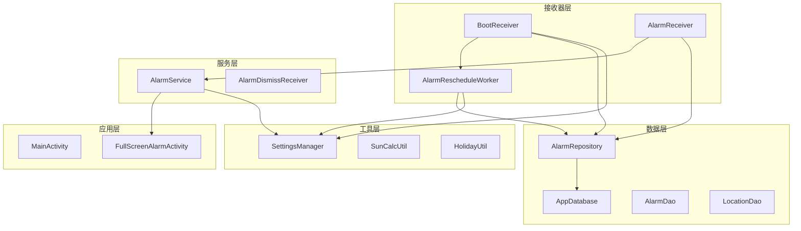
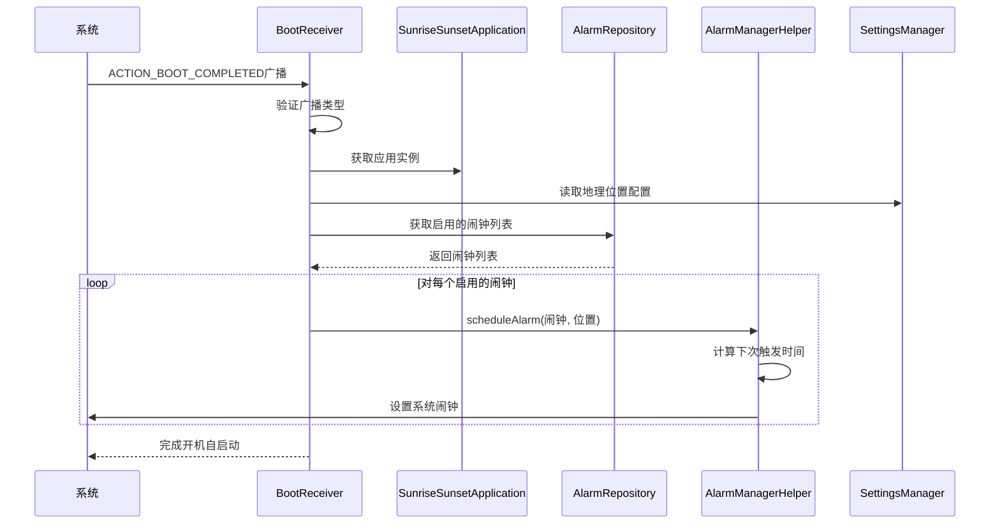
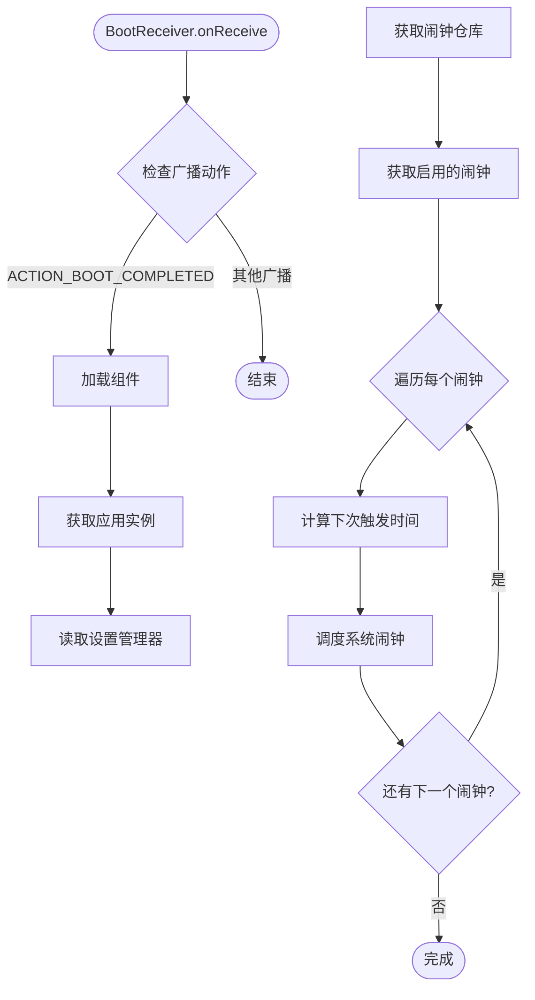
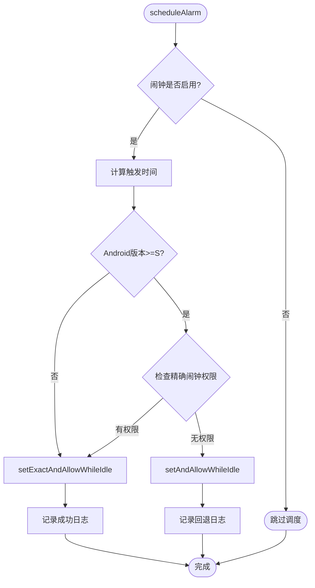
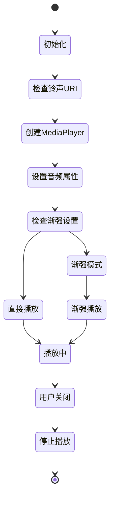
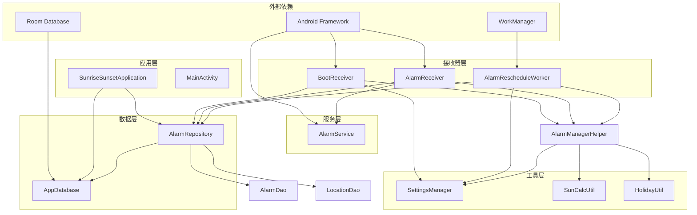

# 开机自启动机制

<cite>
**本文档引用的文件**
- [BootReceiver.kt](file://app/src/main/java/com/snuabar/sunrisesunsetalarm/receiver/BootReceiver.kt)
- [AndroidManifest.xml](file://app/src/main/AndroidManifest.xml)
- [SunriseSunsetApplication.kt](file://app/src/main/java/com/snuabar/sunrisesunsetalarm/SunriseSunsetApplication.kt)
- [AlarmManagerHelper.kt](file://app/src/main/java/com/snuabar/sunrisesunsetalarm/service/AlarmManagerHelper.kt)
- [AlarmService.kt](file://app/src/main/java/com/snuabar/sunrisesunsetalarm/service/AlarmService.kt)
- [SettingsManager.kt](file://app/src/main/java/com/snuabar/sunrisesunsetalarm/util/SettingsManager.kt)
- [AlarmRescheduleWorker.kt](file://app/src/main/java/com/snuabar/sunrisesunsetalarm/receiver/AlarmRescheduleWorker.kt)
- [AlarmRepository.kt](file://app/src/main/java/com/snuabar/sunrisesunsetalarm/data/repository/AlarmRepository.kt)
- [AppDatabase.kt](file://app/src/main/java/com/snuabar/sunrisesunsetalarm/data/database/AppDatabase.kt)
- [HolidayUtil.kt](file://app/src/main/java/com/snuabar/sunrisesunsetalarm/util/HolidayUtil.kt)
- [SunCalcUtil.kt](file://app/src/main/java/com/snuabar/sunrisesunsetalarm/util/SunCalcUtil.kt)
- [AlarmReceiver.kt](file://app/src/main/java/com/snuabar/sunrisesunsetalarm/receiver/AlarmReceiver.kt)
</cite>

## 目录
1. [简介](#简介)
2. [项目结构](#项目结构)
3. [核心组件](#核心组件)
4. [架构概览](#架构概览)
5. [详细组件分析](#详细组件分析)
6. [依赖关系分析](#依赖关系分析)
7. [性能考量](#性能考量)
8. [故障排除指南](#故障排除指南)
9. [结论](#结论)

## 简介

本文档详细解析了Android应用的开机自启动机制，重点分析BootReceiver的实现原理、开机广播监听、系统启动检测以及应用初始化流程。该应用是一个闹钟应用程序，需要在设备重启后自动恢复所有闹钟的定时设置，确保用户不会错过重要的闹钟提醒。

## 项目结构

该项目采用标准的Android应用结构，核心功能围绕闹钟管理展开，包含以下主要模块：

**图表来源**
- [AndroidManifest.xml:53-62](file://app/src/main/AndroidManifest.xml#L53-L62)
- [SunriseSunsetApplication.kt:28-34](file://app/src/main/java/com/snuabar/sunrisesunsetalarm/SunriseSunsetApplication.kt#L28-L34)

**章节来源**
- [AndroidManifest.xml:17-87](file://app/src/main/AndroidManifest.xml#L17-L87)
- [SunriseSunsetApplication.kt:18-66](file://app/src/main/java/com/snuabar/sunrisesunsetalarm/SunriseSunsetApplication.kt#L18-L66)

## 核心组件

### BootReceiver - 开机广播接收器

BootReceiver是开机自启动机制的核心组件，负责监听系统开机完成广播并重新调度所有启用的闹钟。

**关键特性：**
- 监听`ACTION_BOOT_COMPLETED`系统广播
- 重新调度所有启用的闹钟
- 处理地理位置信息以计算日出日落时间
- 支持精确和非精确闹钟调度

### AlarmManagerHelper - 闹钟管理助手

AlarmManagerHelper封装了所有与系统闹钟管理相关的操作，包括闹钟的创建、取消和重新调度。

**核心功能：**
- 基于地理位置计算日出日落时间
- 支持多种重复模式（一次性、每日、工作日、周末、自定义）
- 处理节假日跳过逻辑
- 兼容不同Android版本的精确闹钟API

### AlarmService - 前台服务

AlarmService是闹钟触发后的实际执行组件，负责播放铃声、震动和显示全屏闹钟界面。

**主要职责：**
- 播放自定义铃声和渐强效果
- 控制震动模式
- 显示全屏闹钟活动
- 自动停止机制

**章节来源**
- [BootReceiver.kt:11-33](file://app/src/main/java/com/snuabar/sunrisesunsetalarm/receiver/BootReceiver.kt#L11-L33)
- [AlarmManagerHelper.kt:17-54](file://app/src/main/java/com/snuabar/sunrisesunsetalarm/service/AlarmManagerHelper.kt#L17-L54)
- [AlarmService.kt:24-83](file://app/src/main/java/com/snuabar/sunrisesunsetalarm/service/AlarmService.kt#L24-L83)

## 架构概览

应用的开机自启动机制遵循以下架构模式：

**图表来源**
- [BootReceiver.kt:12-32](file://app/src/main/java/com/snuabar/sunrisesunsetalarm/receiver/BootReceiver.kt#L12-L32)
- [AlarmManagerHelper.kt:21-54](file://app/src/main/java/com/snuabar/sunrisesunsetalarm/service/AlarmManagerHelper.kt#L21-L54)

## 详细组件分析

### BootReceiver 实现详解

BootReceiver继承自BroadcastReceiver，实现了开机自启动的核心逻辑：

#### 广播监听机制
- 监听系统`ACTION_BOOT_COMPLETED`广播
- 验证广播类型确保只响应开机完成事件
- 使用协程确保线程安全的数据库操作

#### 应用初始化流程

**图表来源**
- [BootReceiver.kt:18-32](file://app/src/main/java/com/snuabar/sunrisesunsetalarm/receiver/BootReceiver.kt#L18-L32)

#### 关键实现细节

**权限要求：**
- `RECEIVE_BOOT_COMPLETED`: 接收开机完成广播
- `WAKE_LOCK`: 确保系统不会在处理开机启动时休眠
- `SCHEDULE_EXACT_ALARM`: 在Android 12+上进行精确闹钟调度

**资源初始化：**
- 通过`SunriseSunsetApplication.instance`获取全局应用实例
- 使用`SettingsManager`读取当前地理位置信息
- 通过`AlarmRepository`访问数据库中的所有启用闹钟

**章节来源**
- [BootReceiver.kt:11-33](file://app/src/main/java/com/snuabar/sunrisesunsetalarm/receiver/BootReceiver.kt#L11-L33)
- [AndroidManifest.xml:7](file://app/src/main/AndroidManifest.xml#L7)

### AlarmManagerHelper 精确闹钟调度

AlarmManagerHelper提供了跨版本兼容的闹钟调度解决方案：

#### 版本兼容性处理

**图表来源**
- [AlarmManagerHelper.kt:21-54](file://app/src/main/java/com/snuabar/sunrisesunsetalarm/service/AlarmManagerHelper.kt#L21-L54)

#### 触发时间计算算法

AlarmManagerHelper实现了复杂的触发时间计算逻辑：

**日出日落闹钟计算：**
- 使用`SunCalcUtil.calculateSunTimes`计算当天的日出日落时间
- 结合用户设置的偏移分钟数
- 考虑地理位置的经纬度信息

**自定义闹钟计算：**
- 直接使用用户设置的小时和分钟
- 支持24小时制的时间格式

**重复模式处理：**
- 支持一次性、每日、工作日、周末、自定义重复模式
- 通过`RepeatMode`枚举控制重复行为
- 跳过节假日功能通过`HolidayUtil`实现

**章节来源**
- [AlarmManagerHelper.kt:62-151](file://app/src/main/java/com/snuabar/sunrisesunsetalarm/service/AlarmManagerHelper.kt#L62-L151)
- [SunCalcUtil.kt:19-45](file://app/src/main/java/com/snuabar/sunrisesunsetalarm/util/SunCalcUtil.kt#L19-L45)
- [HolidayUtil.kt:80-94](file://app/src/main/java/com/snuabar/sunrisesunsetalarm/util/HolidayUtil.kt#L80-L94)

### AlarmService 前台服务实现

AlarmService负责处理实际的闹钟触发事件：

#### 通知渠道管理
- 创建专用的通知渠道用于闹钟通知
- 设置高重要性级别确保用户可见
- 支持Android O+的通知渠道特性

#### 音频播放控制

**图表来源**
- [AlarmService.kt:144-200](file://app/src/main/java/com/snuabar/sunrisesunsetalarm/service/AlarmService.kt#L144-L200)

#### 震动控制逻辑
- 支持Android O+的波形震动模式
- 兼容旧版本的震动API
- 可配置的震动模式和持续时间

**章节来源**
- [AlarmService.kt:85-142](file://app/src/main/java/com/snuabar/sunrisesunsetalarm/service/AlarmService.kt#L85-L142)
- [AlarmService.kt:202-212](file://app/src/main/java/com/snuabar/sunrisesunsetalarm/service/AlarmService.kt#L202-L212)

## 依赖关系分析

应用的依赖关系呈现清晰的分层架构：

**图表来源**
- [SunriseSunsetApplication.kt:28-34](file://app/src/main/java/com/snuabar/sunrisesunsetalarm/SunriseSunsetApplication.kt#L28-L34)
- [AlarmManagerHelper.kt:17-165](file://app/src/main/java/com/snuabar/sunrisesunsetalarm/service/AlarmManagerHelper.kt#L17-L165)

**章节来源**
- [SunriseSunsetApplication.kt:25-34](file://app/src/main/java/com/snuabar/sunrisesunsetalarm/SunriseSunsetApplication.kt#L25-L34)
- [AlarmRepository.kt:7-21](file://app/src/main/java/com/snuabar/sunrisesunsetalarm/data/repository/AlarmRepository.kt#L7-L21)

## 性能考量

### 启动性能优化

**延迟启动策略：**
- BootReceiver在开机广播到达时立即响应，但避免长时间运行的任务
- 使用协程确保异步数据库操作不影响主线程
- 通过WorkManager处理周期性的闹钟重调度任务

**内存管理：**
- 使用懒加载模式初始化AlarmRepository和LocationRepository
- 通过Singleton模式管理AppDatabase实例
- 合理的资源释放机制防止内存泄漏

### 电池优化考虑

**精确闹钟权限：**
- 在Android 12+上检查`SCHEDULE_EXACT_ALARM`权限
- 无权限时自动降级到非精确闹钟
- 提供用户引导到系统设置的提示

**后台限制：**
- 使用前台服务确保闹钟触发时的可靠性和可见性
- 合理的notification设计避免过度打扰用户

## 故障排除指南

### 常见问题诊断

**开机自启动失败：**
1. 检查`RECEIVE_BOOT_COMPLETED`权限是否正确声明
2. 验证BootReceiver的intent-filter配置
3. 确认应用具有开机启动权限（不同厂商可能有特殊设置）

**闹钟不准确：**
1. 验证地理位置设置的准确性
2. 检查日出日落计算的经纬度值
3. 确认时区设置正确

**闹钟重复异常：**
1. 检查RepeatMode设置是否符合预期
2. 验证节假日跳过功能的配置
3. 确认数据库中闹钟状态的一致性

### 错误处理机制

**日志记录：**
- 详细的调试日志输出便于问题定位
- 关键错误路径都有相应的警告和错误日志
- 异常情况下的优雅降级处理

**异常恢复：**
- 数据库操作的异常捕获和重试机制
- 网络请求失败时的本地缓存回退
- 闹钟调度失败时的自动重试逻辑

**章节来源**
- [BootReceiver.kt:18-32](file://app/src/main/java/com/snuabar/sunrisesunsetalarm/receiver/BootReceiver.kt#L18-L32)
- [AlarmManagerHelper.kt:32-46](file://app/src/main/java/com/snuabar/sunrisesunsetalarm/service/AlarmManagerHelper.kt#L32-L46)

## 结论

该应用的开机自启动机制展现了现代Android应用开发的最佳实践：

**技术优势：**
- 完善的版本兼容性处理，支持从低版本到最新版本的Android系统
- 精确的闹钟调度算法，结合地理位置计算提供准确的日出日落闹钟
- 良好的架构设计，清晰的分层结构便于维护和扩展

**用户体验优化：**
- 前台服务确保闹钟触发时的可靠性和可见性
- 多种铃声和震动模式满足不同用户需求
- 智能的节假日跳过功能提升实用性

**安全性考虑：**
- 最小权限原则，仅申请必要的系统权限
- 数据持久化和备份机制确保用户数据安全
- 异常处理和错误恢复机制保证系统稳定性

该实现为Android应用的开机自启动场景提供了完整的参考模板，涵盖了从权限申请、广播监听到服务调度的完整生命周期管理。