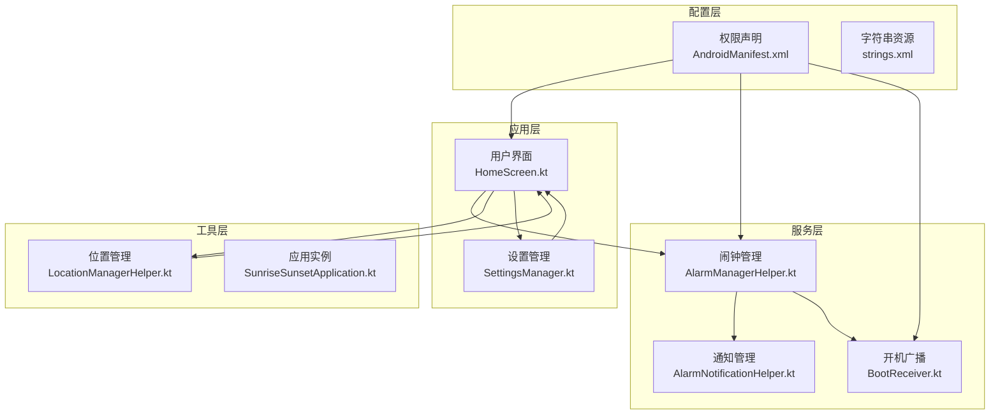
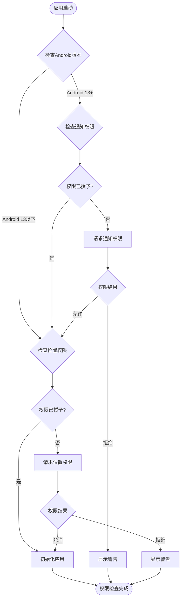
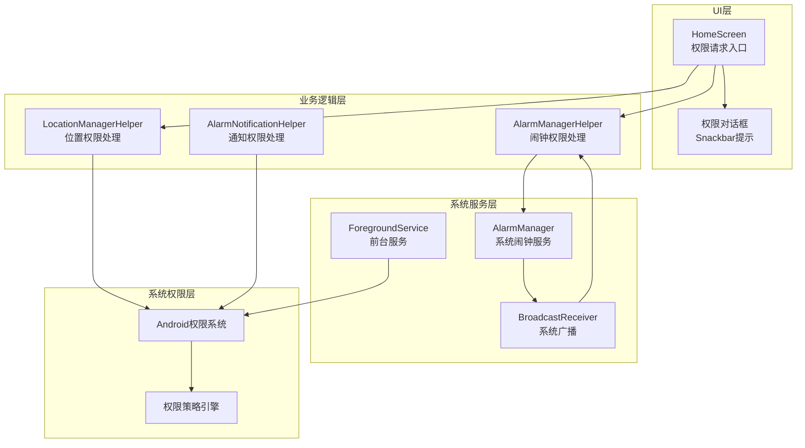
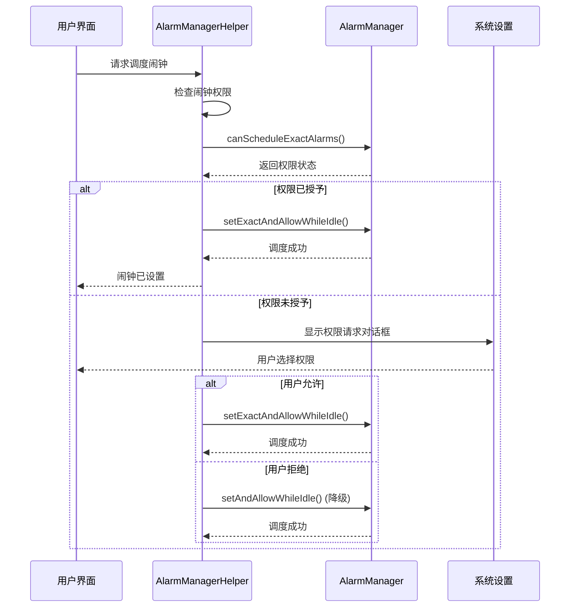
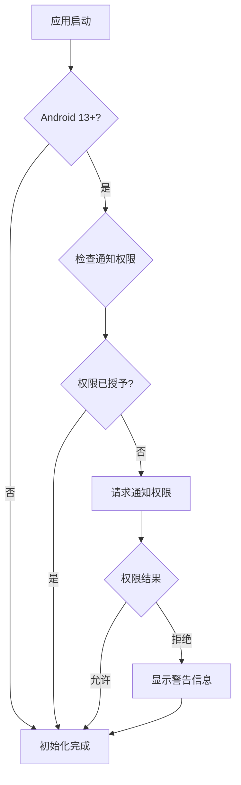
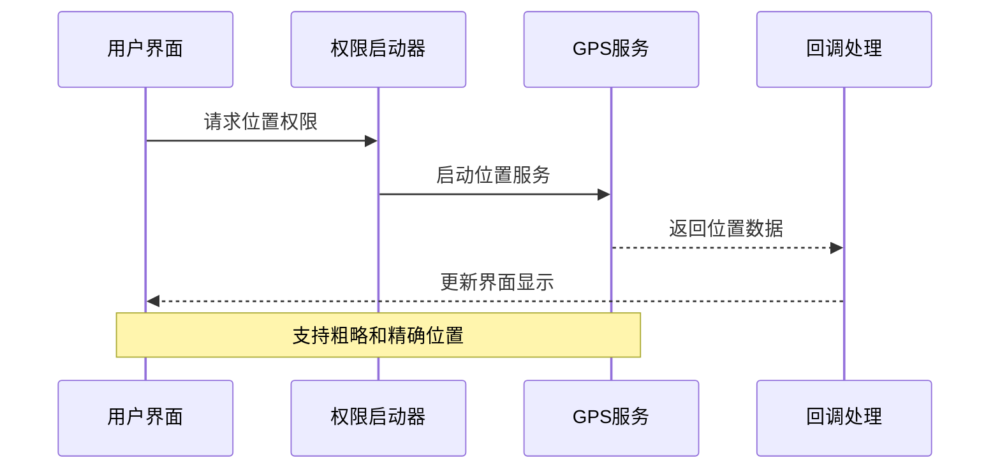
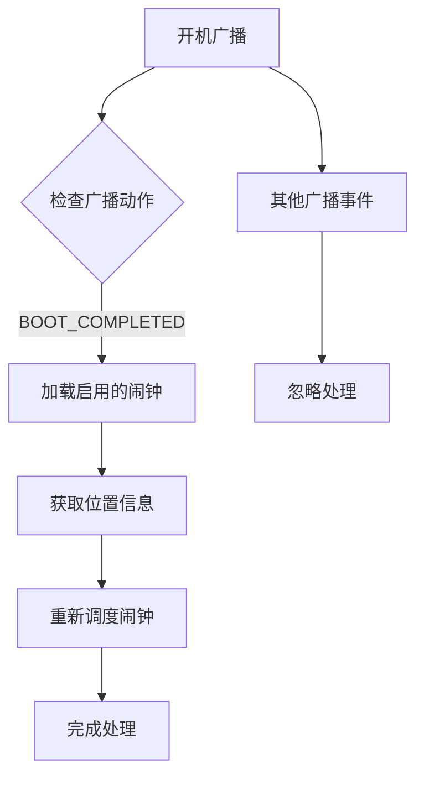
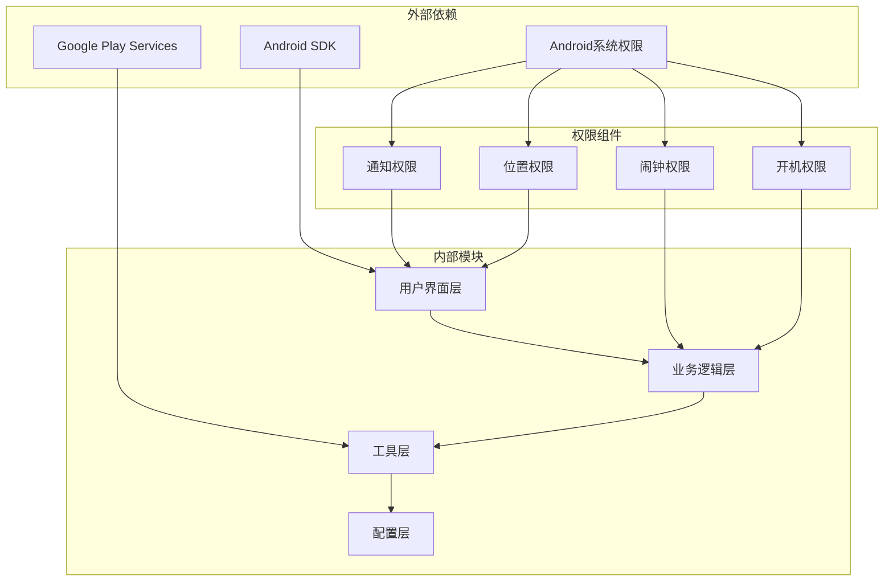

# 权限管理系统

<cite>
**本文档引用的文件**
- [AndroidManifest.xml](file://app/src/main/AndroidManifest.xml)
- [HomeScreen.kt](file://app/src/main/java/com/snuabar/sunrisesunsetalarm/ui/screens/HomeScreen.kt)
- [AlarmManagerHelper.kt](file://app/src/main/java/com/snuabar/sunrisesunsetalarm/service/AlarmManagerHelper.kt)
- [LocationManagerHelper.kt](file://app/src/main/java/com/snuabar/sunrisesunsetalarm/util/LocationManagerHelper.kt)
- [AlarmNotificationHelper.kt](file://app/src/main/java/com/snuabar/sunrisesunsetalarm/service/AlarmNotificationHelper.kt)
- [BootReceiver.kt](file://app/src/main/java/com/snuabar/sunrisesunsetalarm/receiver/BootReceiver.kt)
- [SettingsManager.kt](file://app/src/main/java/com/snuabar/sunrisesunsetalarm/util/SettingsManager.kt)
- [SunriseSunsetApplication.kt](file://app/src/main/java/com/snuabar/sunrisesunsetalarm/SunriseSunsetApplication.kt)
- [strings.xml](file://app/src/main/res/values/strings.xml)
</cite>

## 目录
1. [引言](#引言)
2. [项目结构](#项目结构)
3. [核心组件](#核心组件)
4. [架构概览](#架构概览)
5. [详细组件分析](#详细组件分析)
6. [依赖关系分析](#依赖关系分析)
7. [性能考量](#性能考量)
8. [故障排除指南](#故障排除指南)
9. [结论](#结论)
10. [附录](#附录)

## 引言

本文件为Android权限管理系统的详细技术文档，基于Clock应用的实际代码实现进行深入分析。该系统实现了完整的Android权限体系，包括权限声明、运行时权限申请、权限状态检查等核心流程。

系统涵盖了多种权限类型：
- **位置权限**：ACCESS_FINE_LOCATION、ACCESS_COARSE_LOCATION
- **通知权限**：POST_NOTIFICATIONS（Android 13+）
- **闹钟权限**：SCHEDULE_EXACT_ALARM
- **系统权限**：RECEIVE_BOOT_COMPLETED、FOREGROUND_SERVICE等

通过分析代码实现，本文档将详细说明各类权限的申请时机、处理策略、用户引导机制以及最佳实践。

## 项目结构

Clock应用采用典型的Android项目结构，权限管理相关的核心文件分布如下：

**图表来源**
- [AndroidManifest.xml:1-88](file://app/src/main/AndroidManifest.xml#L1-L88)
- [HomeScreen.kt:1-402](file://app/src/main/java/com/snuabar/sunrisesunsetalarm/ui/screens/HomeScreen.kt#L1-L402)
- [AlarmManagerHelper.kt:1-166](file://app/src/main/java/com/snuabar/sunrisesunsetalarm/service/AlarmManagerHelper.kt#L1-L166)

**章节来源**
- [AndroidManifest.xml:1-88](file://app/src/main/AndroidManifest.xml#L1-L88)
- [HomeScreen.kt:1-402](file://app/src/main/java/com/snuabar/sunrisesunsetalarm/ui/screens/HomeScreen.kt#L1-L402)

## 核心组件

### 权限声明与配置

系统在AndroidManifest.xml中声明了所有必需的权限：

| 权限类型 | 权限名称 | 用途描述 |
|---------|----------|----------|
| 位置权限 | ACCESS_FINE_LOCATION | 精确地理位置获取 |
| 位置权限 | ACCESS_COARSE_LOCATION | 粗略地理位置获取 |
| 通知权限 | POST_NOTIFICATIONS | 通知发送权限（Android 13+） |
| 闹钟权限 | SCHEDULE_EXACT_ALARM | 精确闹钟调度 |
| 系统权限 | RECEIVE_BOOT_COMPLETED | 开机启动接收 |
| 服务权限 | FOREGROUND_SERVICE | 前台服务运行 |
| 特殊权限 | FOREGROUND_SERVICE_SPECIAL_USE | 特殊用途前台服务 |
| 其他权限 | VIBRATE、INTERNET、WAKE_LOCK | 设备控制和网络访问 |

### 运行时权限管理

系统实现了多层级的权限管理策略：

**图表来源**
- [HomeScreen.kt:124-147](file://app/src/main/java/com/snuabar/sunrisesunsetalarm/ui/screens/HomeScreen.kt#L124-L147)

**章节来源**
- [AndroidManifest.xml:5-15](file://app/src/main/AndroidManifest.xml#L5-L15)
- [HomeScreen.kt:124-147](file://app/src/main/java/com/snuabar/sunrisesunsetalarm/ui/screens/HomeScreen.kt#L124-L147)

## 架构概览

系统采用分层架构设计，权限管理贯穿各个层次：

**图表来源**
- [AlarmManagerHelper.kt:17-54](file://app/src/main/java/com/snuabar/sunrisesunsetalarm/service/AlarmManagerHelper.kt#L17-L54)
- [LocationManagerHelper.kt:14-79](file://app/src/main/java/com/snuabar/sunrisesunsetalarm/util/LocationManagerHelper.kt#L14-L79)

**章节来源**
- [AlarmManagerHelper.kt:1-166](file://app/src/main/java/com/snuabar/sunrisesunsetalarm/service/AlarmManagerHelper.kt#L1-L166)
- [LocationManagerHelper.kt:1-79](file://app/src/main/java/com/snuabar/sunrisesunsetalarm/util/LocationManagerHelper.kt#L1-L79)

## 详细组件分析

### 闹钟权限管理系统

闹钟权限是系统中最复杂的权限之一，涉及精确闹钟调度和系统特殊应用权限。

#### 权限检查与申请流程

**图表来源**
- [HomeScreen.kt:88-113](file://app/src/main/java/com/snuabar/sunrisesunsetalarm/ui/screens/HomeScreen.kt#L88-L113)
- [AlarmManagerHelper.kt:32-54](file://app/src/main/java/com/snuabar/sunrisesunsetalarm/service/AlarmManagerHelper.kt#L32-L54)

#### 权限降级策略

当精确闹钟权限被拒绝时，系统采用降级策略：

| 权限状态 | 精确调度 | 降级调度 | 备注 |
|----------|----------|----------|------|
| 已授予 | setExactAndAllowWhileIdle | 不适用 | 最佳体验 |
| 未授予 | setAndAllowWhileIdle | setAndAllowWhileIdle | 系统可能延迟 |
| 系统限制 | setAndAllowWhileIdle | setAndAllowWhileIdle | 受系统节电影响 |

**章节来源**
- [AlarmManagerHelper.kt:32-54](file://app/src/main/java/com/snuabar/sunrisesunsetalarm/service/AlarmManagerHelper.kt#L32-L54)
- [HomeScreen.kt:88-113](file://app/src/main/java/com/snuabar/sunrisesunsetalarm/ui/screens/HomeScreen.kt#L88-L113)

### 通知权限管理系统

通知权限是Android 13引入的重要权限，直接影响用户体验。

#### 权限申请时机

**图表来源**
- [HomeScreen.kt:143-147](file://app/src/main/java/com/snuabar/sunrisesunsetalarm/ui/screens/HomeScreen.kt#L143-L147)

#### 用户体验优化

系统通过Snackbar提供即时反馈：

- **权限拒绝时**：显示"未授予通知权限，闹钟提醒可能无法正常显示"
- **权限授予时**：静默处理，确保流畅体验
- **权限申请时**：提供明确的解释和操作指引

**章节来源**
- [HomeScreen.kt:132-141](file://app/src/main/java/com/snuabar/sunrisesunsetalarm/ui/screens/HomeScreen.kt#L132-L141)
- [AlarmNotificationHelper.kt:42-73](file://app/src/main/java/com/snuabar/sunrisesunsetalarm/service/AlarmNotificationHelper.kt#L42-L73)

### 位置权限管理系统

位置权限用于获取用户的地理信息以计算日出日落时间。

#### 权限申请策略

**图表来源**
- [HomeScreen.kt:124-131](file://app/src/main/java/com/snuabar/sunrisesunsetalarm/ui/screens/HomeScreen.kt#L124-L131)
- [LocationManagerHelper.kt:36-57](file://app/src/main/java/com/snuabar/sunrisesunsetalarm/util/LocationManagerHelper.kt#L36-L57)

#### 位置服务实现

系统使用Google Play Services Fused Location Provider：

- **最后位置获取**：getLastLocation()
- **实时位置更新**：requestLocationUpdates()
- **当前位置获取**：getCurrentLocation()

**章节来源**
- [LocationManagerHelper.kt:18-77](file://app/src/main/java/com/snuabar/sunrisesunsetalarm/util/LocationManagerHelper.kt#L18-L77)

### 开机启动权限管理

系统需要在设备重启后重新调度所有闹钟。

#### BootReceiver实现

**图表来源**
- [BootReceiver.kt:12-32](file://app/src/main/java/com/snuabar/sunrisesunsetalarm/receiver/BootReceiver.kt#L12-L32)

**章节来源**
- [BootReceiver.kt:1-34](file://app/src/main/java/com/snuabar/sunrisesunsetalarm/receiver/BootReceiver.kt#L1-L34)

## 依赖关系分析

系统权限管理的依赖关系呈现清晰的层次结构：

**图表来源**
- [AndroidManifest.xml:17-87](file://app/src/main/AndroidManifest.xml#L17-L87)
- [SunriseSunsetApplication.kt:25-34](file://app/src/main/java/com/snuabar/sunrisesunsetalarm/SunriseSunsetApplication.kt#L25-L34)

**章节来源**
- [AndroidManifest.xml:1-88](file://app/src/main/AndroidManifest.xml#L1-L88)
- [SunriseSunsetApplication.kt:18-67](file://app/src/main/java/com/snuabar/sunrisesunsetalarm/SunriseSunsetApplication.kt#L18-L67)

## 性能考量

### 权限检查性能优化

系统在权限检查方面采用了多项优化策略：

1. **延迟检查**：仅在需要时才检查权限状态
2. **缓存机制**：避免重复的权限查询
3. **异步处理**：使用协程处理权限相关操作
4. **降级策略**：权限缺失时提供功能降级

### 内存使用优化

- **权限状态缓存**：减少频繁的系统调用
- **资源释放**：及时释放不再使用的权限对象
- **生命周期管理**：遵循Android生命周期最佳实践

## 故障排除指南

### 常见权限问题及解决方案

#### 闹钟权限问题

| 问题现象 | 可能原因 | 解决方案 |
|----------|----------|----------|
| 闹钟不准确 | 精确闹钟权限未授予 | 引导用户到系统设置开启权限 |
| 闹钟延迟 | 系统节电策略影响 | 提示用户将应用加入白名单 |
| 无法开机启动 | 系统省电优化 | 提供省电设置引导 |

#### 通知权限问题

| 问题现象 | 可能原因 | 解决方案 |
|----------|----------|----------|
| 无通知提醒 | 通知权限被拒绝 | 显示权限必要性说明 |
| 通知显示异常 | 应用被系统限制 | 引导用户检查应用权限设置 |

#### 位置权限问题

| 问题现象 | 可能原因 | 解决方案 |
|----------|----------|----------|
| 无法获取位置 | 位置权限未授予 | 重新请求位置权限 |
| 位置不准确 | GPS信号弱 | 建议到空旷地方重试 |
| 电池消耗过大 | 位置服务过于频繁 | 调整位置更新频率 |

**章节来源**
- [AlarmManagerHelper.kt:32-46](file://app/src/main/java/com/snuabar/sunrisesunsetalarm/service/AlarmManagerHelper.kt#L32-L46)
- [HomeScreen.kt:127-129](file://app/src/main/java/com/snuabar/sunrisesunsetalarm/ui/screens/HomeScreen.kt#L127-L129)

## 结论

该权限管理系统展现了现代Android应用权限处理的最佳实践：

### 主要优势

1. **完整的权限覆盖**：涵盖所有核心权限类型
2. **优雅的降级策略**：权限缺失时提供替代方案
3. **优秀的用户体验**：通过Snackbar提供即时反馈
4. **清晰的错误处理**：完善的异常处理机制

### 技术亮点

- **分层架构设计**：权限管理逻辑清晰分离
- **异步处理机制**：避免阻塞主线程
- **系统集成深度**：充分利用Android系统特性
- **用户引导完善**：提供清晰的操作指引

### 改进建议

1. **权限必要性说明**：在首次请求权限时提供更详细的说明
2. **权限历史记录**：记录用户权限决策历史
3. **批量权限处理**：支持多个权限的批量申请
4. **权限状态监控**：持续监控权限状态变化

## 附录

### 权限申请最佳实践

#### 权限最小化原则
- 仅申请业务必需的权限
- 避免申请过宽泛的权限范围
- 定期审查和清理不需要的权限

#### 透明度要求
- 在首次使用前说明权限用途
- 提供清晰的隐私政策链接
- 展示权限对功能的影响

#### 合规性考虑
- 遵循GDPR等隐私法规
- 提供用户撤回权限的便利途径
- 定期进行权限合规性检查

#### 用户体验优化
- 选择合适的权限申请时机
- 提供权限申请的上下文说明
- 实现权限拒绝后的功能降级

**章节来源**
- [HomeScreen.kt:101-113](file://app/src/main/java/com/snuabar/sunrisesunsetalarm/ui/screens/HomeScreen.kt#L101-L113)
- [SettingsManager.kt:1-49](file://app/src/main/java/com/snuabar/sunrisesunsetalarm/util/SettingsManager.kt#L1-L49)