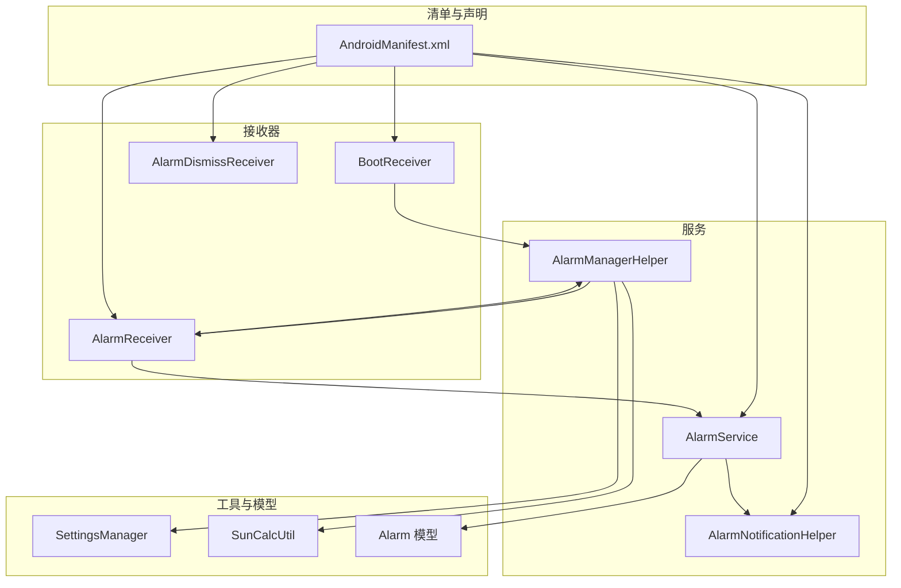
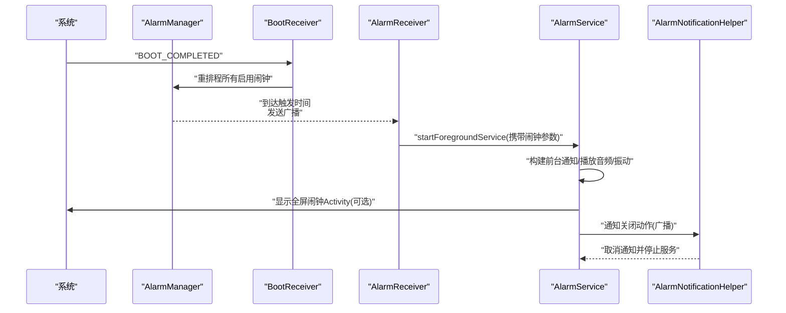
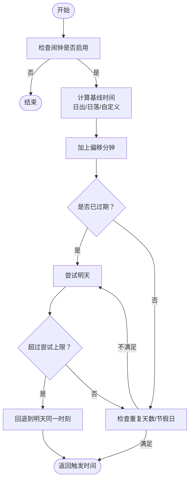
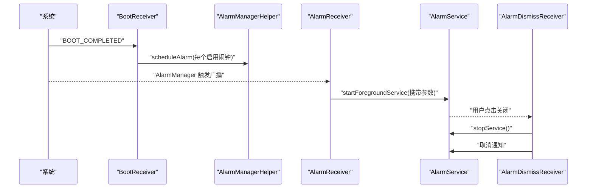
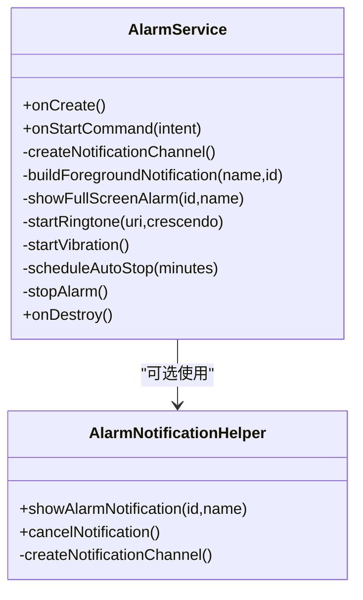
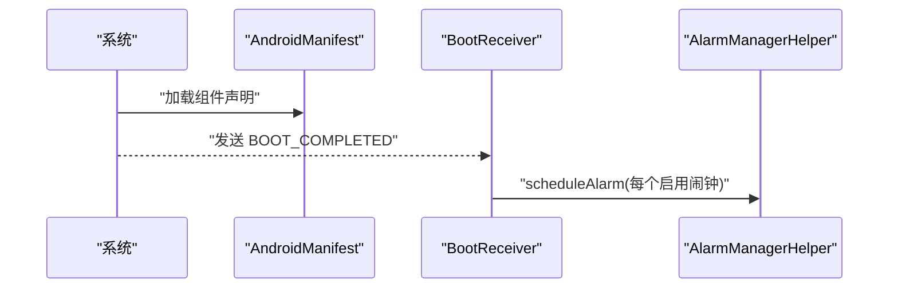
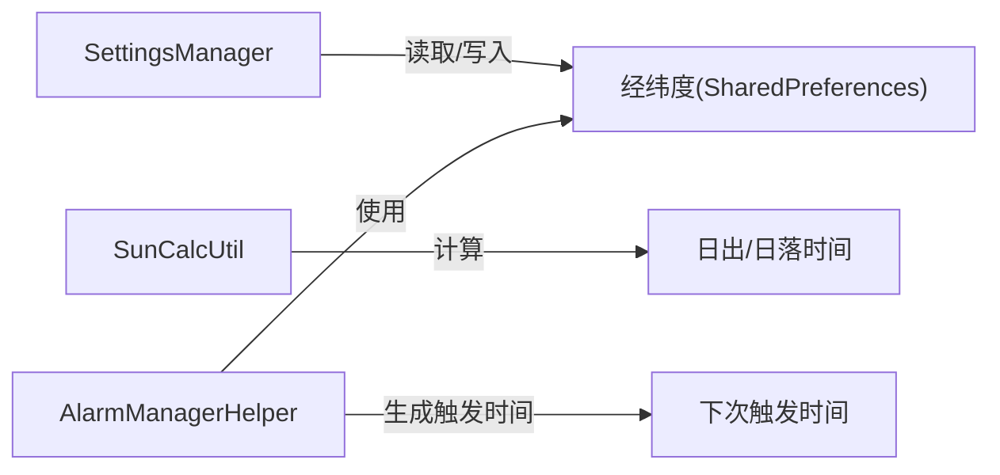
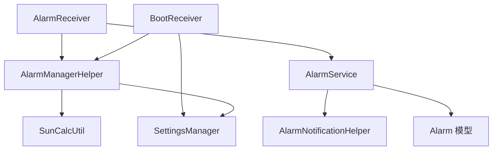

# 系统集成

<cite>
**本文引用的文件**
- [AndroidManifest.xml](file://app/src/main/AndroidManifest.xml)
- [BootReceiver.kt](file://app/src/main/java/com/snuabar/sunrisesunsetalarm/receiver/BootReceiver.kt)
- [AlarmReceiver.kt](file://app/src/main/java/com/snuabar/sunrisesunsetalarm/receiver/AlarmReceiver.kt)
- [AlarmService.kt](file://app/src/main/java/com/snuabar/sunrisesunsetalarm/service/AlarmService.kt)
- [AlarmManagerHelper.kt](file://app/src/main/java/com/snuabar/sunrisesunsetalarm/service/AlarmManagerHelper.kt)
- [AlarmDismissReceiver.kt](file://app/src/main/java/com/snuabar/sunrisesunsetalarm/service/AlarmDismissReceiver.kt)
- [AlarmNotificationHelper.kt](file://app/src/main/java/com/snuabar/sunrisesunsetalarm/service/AlarmNotificationHelper.kt)
- [SettingsManager.kt](file://app/src/main/java/com/snuabar/sunrisesunsetalarm/util/SettingsManager.kt)
- [SunCalcUtil.kt](file://app/src/main/java/com/snuabar/sunrisesunsetalarm/util/SunCalcUtil.kt)
- [Alarm.kt](file://app/src/main/java/com/snuabar/sunrisesunsetalarm/data/model/Alarm.kt)
</cite>

## 目录
1. [简介](#简介)
2. [项目结构](#项目结构)
3. [核心组件](#核心组件)
4. [架构总览](#架构总览)
5. [详细组件分析](#详细组件分析)
6. [依赖关系分析](#依赖关系分析)
7. [性能考量](#性能考量)
8. [故障排查指南](#故障排查指南)
9. [结论](#结论)
10. [附录](#附录)

## 简介
本文件聚焦于日出日落智能闹钟应用的系统集成能力，系统性梳理 Android 平台关键服务与组件的使用方式，包括：
- 闹钟管理：基于 AlarmManager 的精确/非精确调度与跨进程广播触发
- 后台服务：前台服务与通知通道、音频播放与振动控制
- 开机自启动：BootReceiver 注册与开机后闹钟重排程
- 位置服务：经纬度参数用于日出日落时间计算（通过工具类与设置管理）
- 通知系统：前台服务通知、全屏闹钟通知、关闭动作广播
- 权限与兼容：运行时权限、特殊应用权限、平台版本差异处理

## 项目结构
应用采用按职责分层的目录组织，系统集成相关的核心文件分布如下：
- 清单与声明：AndroidManifest.xml 中声明权限、四大组件及属性
- 接收器：BootReceiver（开机）、AlarmReceiver（闹钟触发）、AlarmDismissReceiver（关闭）
- 服务：AlarmService（前台服务）、AlarmManagerHelper（闹钟调度）、AlarmNotificationHelper（通知）
- 工具与模型：SettingsManager（位置与偏好）、SunCalcUtil（日出日落计算）、Alarm 模型

**图表来源**
- [AndroidManifest.xml:1-88](file://app/src/main/AndroidManifest.xml#L1-L88)
- [BootReceiver.kt:1-34](file://app/src/main/java/com/snuabar/sunrisesunsetalarm/receiver/BootReceiver.kt#L1-L34)
- [AlarmReceiver.kt:1-69](file://app/src/main/java/com/snuabar/sunrisesunsetalarm/receiver/AlarmReceiver.kt#L1-L69)
- [AlarmService.kt:1-247](file://app/src/main/java/com/snuabar/sunrisesunsetalarm/service/AlarmService.kt#L1-L247)
- [AlarmManagerHelper.kt:1-166](file://app/src/main/java/com/snuabar/sunrisesunsetalarm/service/AlarmManagerHelper.kt#L1-L166)
- [AlarmDismissReceiver.kt:1-19](file://app/src/main/java/com/snuabar/sunrisesunsetalarm/service/AlarmDismissReceiver.kt#L1-L19)
- [AlarmNotificationHelper.kt:1-79](file://app/src/main/java/com/snuabar/sunrisesunsetalarm/service/AlarmNotificationHelper.kt#L1-L79)
- [SettingsManager.kt:1-49](file://app/src/main/java/com/snuabar/sunrisesunsetalarm/util/SettingsManager.kt#L1-L49)
- [SunCalcUtil.kt:1-138](file://app/src/main/java/com/snuabar/sunrisesunsetalarm/util/SunCalcUtil.kt#L1-L138)
- [Alarm.kt:1-50](file://app/src/main/java/com/snuabar/sunrisesunsetalarm/data/model/Alarm.kt#L1-L50)

**章节来源**
- [AndroidManifest.xml:1-88](file://app/src/main/AndroidManifest.xml#L1-L88)

## 核心组件
- AlarmManager 闹钟管理：负责精确/非精确闹钟的设置与取消，支持“允许在休眠时运行”
- BroadcastReceiver 广播接收器：
  - BootReceiver：监听开机完成，重排程所有启用的闹钟
  - AlarmReceiver：接收 AlarmManager 触发，启动前台服务并处理重复/一次性逻辑
  - AlarmDismissReceiver：处理“关闭”动作，取消通知并停止服务
- Service 前台服务：AlarmService 提供前台通知、音频播放、振动、自动停止与全屏闹钟页面
- 通知系统：AlarmNotificationHelper 负责通知通道与通知构建；AlarmService 内置前台通知
- 位置与计算：SettingsManager 存取经纬度；SunCalcUtil 计算日出日落时间；AlarmManagerHelper 结合偏移分钟与重复规则生成下次触发时间

**章节来源**
- [AlarmManagerHelper.kt:1-166](file://app/src/main/java/com/snuabar/sunrisesunsetalarm/service/AlarmManagerHelper.kt#L1-L166)
- [AlarmReceiver.kt:1-69](file://app/src/main/java/com/snuabar/sunrisesunsetalarm/receiver/AlarmReceiver.kt#L1-L69)
- [BootReceiver.kt:1-34](file://app/src/main/java/com/snuabar/sunrisesunsetalarm/receiver/BootReceiver.kt#L1-L34)
- [AlarmService.kt:1-247](file://app/src/main/java/com/snuabar/sunrisesunsetalarm/service/AlarmService.kt#L1-L247)
- [AlarmNotificationHelper.kt:1-79](file://app/src/main/java/com/snuabar/sunrisesunsetalarm/service/AlarmNotificationHelper.kt#L1-L79)
- [SettingsManager.kt:1-49](file://app/src/main/java/com/snuabar/sunrisesunsetalarm/util/SettingsManager.kt#L1-L49)
- [SunCalcUtil.kt:1-138](file://app/src/main/java/com/snuabar/sunrisesunsetalarm/util/SunCalcUtil.kt#L1-L138)
- [Alarm.kt:1-50](file://app/src/main/java/com/snuabar/sunrisesunsetalarm/data/model/Alarm.kt#L1-L50)

## 架构总览
系统以“闹钟调度 → 广播触发 → 前台服务执行 → 用户交互”的链路为核心，结合位置计算与通知通道，形成完整的闹钟生命周期。

**图表来源**
- [AndroidManifest.xml:47-83](file://app/src/main/AndroidManifest.xml#L47-L83)
- [BootReceiver.kt:12-32](file://app/src/main/java/com/snuabar/sunrisesunsetalarm/receiver/BootReceiver.kt#L12-L32)
- [AlarmReceiver.kt:35-67](file://app/src/main/java/com/snuabar/sunrisesunsetalarm/receiver/AlarmReceiver.kt#L35-L67)
- [AlarmService.kt:44-83](file://app/src/main/java/com/snuabar/sunrisesunsetalarm/service/AlarmService.kt#L44-L83)
- [AlarmNotificationHelper.kt:42-77](file://app/src/main/java/com/snuabar/sunrisesunsetalarm/service/AlarmNotificationHelper.kt#L42-L77)

## 详细组件分析

### AlarmManager 闹钟管理（AlarmManagerHelper）
- 职责
  - 计算下一次触发时间：支持日出/日落/自定义三种基线，结合偏移分钟、重复天数、节假日跳过策略
  - 调度与取消：根据 Android 版本与权限决定使用精确或非精确闹钟，并允许在休眠时运行
- 关键点
  - 精确闹钟：Android 12+ 需要 SCHEDULE_EXACT_ALARM 权限，否则回退为“允许在休眠时运行”的非精确闹钟
  - 重复逻辑：按周几映射到 repeatDays 数组，过滤已过期时间与节假日
  - PendingIntent：携带 alarm_id 与 alarm_name，作为广播标识
- 复杂度
  - 计算复杂度近似 O(D)，D 为尝试天数上限（当前为 8 天）

**图表来源**
- [AlarmManagerHelper.kt:62-151](file://app/src/main/java/com/snuabar/sunrisesunsetalarm/service/AlarmManagerHelper.kt#L62-L151)
- [SunCalcUtil.kt:19-45](file://app/src/main/java/com/snuabar/sunrisesunsetalarm/util/SunCalcUtil.kt#L19-L45)
- [Alarm.kt:28-36](file://app/src/main/java/com/snuabar/sunrisesunsetalarm/data/model/Alarm.kt#L28-L36)

**章节来源**
- [AlarmManagerHelper.kt:17-54](file://app/src/main/java/com/snuabar/sunrisesunsetalarm/service/AlarmManagerHelper.kt#L17-L54)
- [AlarmManagerHelper.kt:62-151](file://app/src/main/java/com/snuabar/sunrisesunsetalarm/service/AlarmManagerHelper.kt#L62-L151)
- [SunCalcUtil.kt:19-45](file://app/src/main/java/com/snuabar/sunrisesunsetalarm/util/SunCalcUtil.kt#L19-L45)
- [Alarm.kt:28-36](file://app/src/main/java/com/snuabar/sunrisesunsetalarm/data/model/Alarm.kt#L28-L36)

### 广播接收器（BootReceiver、AlarmReceiver、AlarmDismissReceiver）
- BootReceiver
  - 监听 BOOT_COMPLETED，从设置中读取经纬度，遍历数据库中的启用闹钟，调用 AlarmManagerHelper 重新排程
- AlarmReceiver
  - 从广播中提取 alarm_id，查询数据库获取闹钟详情，启动 AlarmService 并传递参数
  - 对一次性闹钟：触发后禁用；对重复闹钟：调用 AlarmManagerHelper 重新排程
- AlarmDismissReceiver
  - 收到“关闭”广播后，调用 AlarmNotificationHelper 取消通知并停止 AlarmService

**图表来源**
- [BootReceiver.kt:12-32](file://app/src/main/java/com/snuabar/sunrisesunsetalarm/receiver/BootReceiver.kt#L12-L32)
- [AlarmReceiver.kt:18-67](file://app/src/main/java/com/snuabar/sunrisesunsetalarm/receiver/AlarmReceiver.kt#L18-L67)
- [AlarmDismissReceiver.kt:7-18](file://app/src/main/java/com/snuabar/sunrisesunsetalarm/service/AlarmDismissReceiver.kt#L7-L18)

**章节来源**
- [BootReceiver.kt:11-33](file://app/src/main/java/com/snuabar/sunrisesunsetalarm/receiver/BootReceiver.kt#L11-L33)
- [AlarmReceiver.kt:17-68](file://app/src/main/java/com/snuabar/sunrisesunsetalarm/receiver/AlarmReceiver.kt#L17-L68)
- [AlarmDismissReceiver.kt:7-18](file://app/src/main/java/com/snuabar/sunrisesunsetalarm/service/AlarmDismissReceiver.kt#L7-L18)

### 前台服务与通知（AlarmService、AlarmNotificationHelper）
- AlarmService
  - 创建通知通道，构建前台通知，根据 RingMode 决定行为（全屏、仅通知、Live Activity）
  - 音频播放：支持 crescendo（渐强）与默认铃声；振动：根据平台版本选择 API
  - 自动停止：按 ringDurationMinutes 定时停止播放、释放资源并 stopSelf
  - 全屏闹钟：启动 FullScreenAlarmActivity
- AlarmNotificationHelper
  - 单独的通知通道与通知构建，支持全屏意图与关闭动作

**图表来源**
- [AlarmService.kt:24-247](file://app/src/main/java/com/snuabar/sunrisesunsetalarm/service/AlarmService.kt#L24-L247)
- [AlarmNotificationHelper.kt:13-79](file://app/src/main/java/com/snuabar/sunrisesunsetalarm/service/AlarmNotificationHelper.kt#L13-L79)

**章节来源**
- [AlarmService.kt:39-83](file://app/src/main/java/com/snuabar/sunrisesunsetalarm/service/AlarmService.kt#L39-L83)
- [AlarmService.kt:100-142](file://app/src/main/java/com/snuabar/sunrisesunsetalarm/service/AlarmService.kt#L100-L142)
- [AlarmService.kt:144-212](file://app/src/main/java/com/snuabar/sunrisesunsetalarm/service/AlarmService.kt#L144-L212)
- [AlarmService.kt:229-240](file://app/src/main/java/com/snuabar/sunrisesunsetalarm/service/AlarmService.kt#L229-L240)
- [AlarmNotificationHelper.kt:27-77](file://app/src/main/java/com/snuabar/sunrisesunsetalarm/service/AlarmNotificationHelper.kt#L27-L77)

### 开机自启动机制（BootReceiver）
- 清单声明：注册 BootReceiver，限定 RECEIVE_BOOT_COMPLETED 权限
- 处理逻辑：读取当前位置（纬度/经度），遍历启用的闹钟，逐个重新排程
- 注意：若无 SCHEDULE_EXACT_ALARM 权限，可能降级为非精确闹钟

**图表来源**
- [AndroidManifest.xml:53-62](file://app/src/main/AndroidManifest.xml#L53-L62)
- [BootReceiver.kt:12-32](file://app/src/main/java/com/snuabar/sunrisesunsetalarm/receiver/BootReceiver.kt#L12-L32)

**章节来源**
- [AndroidManifest.xml:53-62](file://app/src/main/AndroidManifest.xml#L53-L62)
- [BootReceiver.kt:12-32](file://app/src/main/java/com/snuabar/sunrisesunsetalarm/receiver/BootReceiver.kt#L12-L32)

### 位置服务与权限（SettingsManager、SunCalcUtil）
- 位置数据来源：SettingsManager 通过 SharedPreferences 存取当前城市名称、纬度、经度
- 日出日落计算：SunCalcUtil 基于经纬度与日期计算日出/日落/正午时间
- 权限声明：清单中声明 ACCESS_FINE_LOCATION 与 ACCESS_COARSE_LOCATION
- 实际使用：AlarmManagerHelper 在计算触发时间时使用经纬度；应用未直接使用 FusedLocationProviderClient

**图表来源**
- [SettingsManager.kt:23-33](file://app/src/main/java/com/snuabar/sunrisesunsetalarm/util/SettingsManager.kt#L23-L33)
- [SunCalcUtil.kt:19-45](file://app/src/main/java/com/snuabar/sunrisesunsetalarm/util/SunCalcUtil.kt#L19-L45)
- [AlarmManagerHelper.kt:21-29](file://app/src/main/java/com/snuabar/sunrisesunsetalarm/service/AlarmManagerHelper.kt#L21-L29)

**章节来源**
- [SettingsManager.kt:8-48](file://app/src/main/java/com/snuabar/sunrisesunsetalarm/util/SettingsManager.kt#L8-L48)
- [SunCalcUtil.kt:6-45](file://app/src/main/java/com/snuabar/sunrisesunsetalarm/util/SunCalcUtil.kt#L6-L45)
- [AndroidManifest.xml:5-6](file://app/src/main/AndroidManifest.xml#L5-L6)

## 依赖关系分析
- 组件耦合
  - AlarmReceiver 依赖 AlarmManagerHelper 与 AlarmService
  - BootReceiver 依赖 AlarmManagerHelper 与 SettingsManager
  - AlarmService 依赖 AlarmNotificationHelper（可选）、Alarm 模型
  - AlarmManagerHelper 依赖 SunCalcUtil 与 SettingsManager
- 外部依赖
  - AlarmManager、NotificationManager、MediaPlayer、Vibrator
  - PendingIntent、NotificationChannel、AudioAttributes

**图表来源**
- [AlarmReceiver.kt:17-68](file://app/src/main/java/com/snuabar/sunrisesunsetalarm/receiver/AlarmReceiver.kt#L17-L68)
- [BootReceiver.kt:18-32](file://app/src/main/java/com/snuabar/sunrisesunsetalarm/receiver/BootReceiver.kt#L18-L32)
- [AlarmManagerHelper.kt:17-54](file://app/src/main/java/com/snuabar/sunrisesunsetalarm/service/AlarmManagerHelper.kt#L17-L54)
- [AlarmService.kt:100-142](file://app/src/main/java/com/snuabar/sunrisesunsetalarm/service/AlarmService.kt#L100-L142)
- [AlarmNotificationHelper.kt:42-77](file://app/src/main/java/com/snuabar/sunrisesunsetalarm/service/AlarmNotificationHelper.kt#L42-L77)
- [Alarm.kt:1-50](file://app/src/main/java/com/snuabar/sunrisesunsetalarm/data/model/Alarm.kt#L1-L50)

**章节来源**
- [AlarmReceiver.kt:17-68](file://app/src/main/java/com/snuabar/sunrisesunsetalarm/receiver/AlarmReceiver.kt#L17-L68)
- [BootReceiver.kt:18-32](file://app/src/main/java/com/snuabar/sunrisesunsetalarm/receiver/BootReceiver.kt#L18-L32)
- [AlarmManagerHelper.kt:17-54](file://app/src/main/java/com/snuabar/sunrisesunsetalarm/service/AlarmManagerHelper.kt#L17-L54)
- [AlarmService.kt:100-142](file://app/src/main/java/com/snuabar/sunrisesunsetalarm/service/AlarmService.kt#L100-L142)
- [AlarmNotificationHelper.kt:42-77](file://app/src/main/java/com/snuabar/sunrisesunsetalarm/service/AlarmNotificationHelper.kt#L42-L77)
- [Alarm.kt:1-50](file://app/src/main/java/com/snuabar/sunrisesunsetalarm/data/model/Alarm.kt#L1-L50)

## 性能考量
- 闹钟调度
  - 优先使用精确闹钟（Android 12+ 需要 SCHEDULE_EXACT_ALARM 权限），避免频繁唤醒导致耗电
  - 若权限不可用，回退为“允许在休眠时运行”的非精确闹钟，注意系统节电策略可能影响触发精度
- 前台服务
  - 使用 FOREGROUND_SERVICE 与 FOREGROUND_SERVICE_SPECIAL_USE，配合专用通知通道，确保稳定运行
  - 音频播放与振动需及时释放资源，避免内存泄漏与系统资源占用
- 通知与交互
  - 使用 PendingIntent.FLAG_IMMUTABLE，减少系统开销与安全风险
  - 全屏闹钟仅在需要时启动，避免不必要的界面切换
- 位置与计算
  - 位置信息来自本地存储，避免频繁定位请求；日出日落计算为纯数学运算，成本较低

[本节为通用性能建议，无需特定文件引用]

## 故障排查指南
- 无法按时响铃
  - 检查 SCHEDULE_EXACT_ALARM 权限是否授予；如未授予，系统可能使用非精确闹钟
  - 确认 AlarmManager 是否成功设置；查看日志输出
- 开机后闹钟未重排程
  - 检查 BootReceiver 是否被系统广播触发；确认 RECEIVE_BOOT_COMPLETED 权限与 exported 属性
  - 确认 SettingsManager 中经纬度是否有效
- 通知未显示或无法关闭
  - 检查通知通道创建与通知优先级；确认 AlarmDismissReceiver 是否正确取消通知并停止服务
- 音频/振动异常
  - 检查音频 URI 与 AudioAttributes 设置；平台版本差异下的振动 API 使用
- 全屏闹钟页面未弹出
  - 检查 RingMode 配置与 FullScreenAlarmActivity 启动意图

**章节来源**
- [AlarmManagerHelper.kt:32-54](file://app/src/main/java/com/snuabar/sunrisesunsetalarm/service/AlarmManagerHelper.kt#L32-L54)
- [BootReceiver.kt:12-32](file://app/src/main/java/com/snuabar/sunrisesunsetalarm/receiver/BootReceiver.kt#L12-L32)
- [AlarmReceiver.kt:18-67](file://app/src/main/java/com/snuabar/sunrisesunsetalarm/receiver/AlarmReceiver.kt#L18-L67)
- [AlarmService.kt:85-98](file://app/src/main/java/com/snuabar/sunrisesunsetalarm/service/AlarmService.kt#L85-L98)
- [AlarmDismissReceiver.kt:7-18](file://app/src/main/java/com/snuabar/sunrisesunsetalarm/service/AlarmDismissReceiver.kt#L7-L18)

## 结论
该应用通过 AlarmManager、BroadcastReceiver、Service 与通知系统实现了可靠的闹钟生命周期管理，并在 Android 12+ 上妥善处理了精确闹钟权限问题。位置信息与日出日落计算为“日出/日落”基线提供了科学依据。整体设计遵循前台服务与通知通道规范，具备良好的稳定性与用户体验。

[本节为总结性内容，无需特定文件引用]

## 附录

### 系统权限与兼容性要点
- 必要权限
  - ACCESS_FINE_LOCATION、ACCESS_COARSE_LOCATION：用于日出日落计算的位置数据
  - RECEIVE_BOOT_COMPLETED：开机自启动
  - FOREGROUND_SERVICE、FOREGROUND_SERVICE_SPECIAL_USE：前台服务
  - VIBRATE、WAKE_LOCK：闹钟执行所需
  - SCHEDULE_EXACT_ALARM：Android 12+ 精确闹钟
  - POST_NOTIFICATIONS：通知权限
  - USE_FULL_SCREEN_INTENT：全屏闹钟
- 兼容性
  - Android 12+：需显式授予 SCHEDULE_EXACT_ALARM 权限；否则回退为非精确闹钟
  - 平台版本差异：振动 API、音频属性等需按版本分支处理

**章节来源**
- [AndroidManifest.xml:5-15](file://app/src/main/AndroidManifest.xml#L5-L15)
- [AlarmManagerHelper.kt:32-54](file://app/src/main/java/com/snuabar/sunrisesunsetalarm/service/AlarmManagerHelper.kt#L32-L54)
- [AlarmService.kt:144-212](file://app/src/main/java/com/snuabar/sunrisesunsetalarm/service/AlarmService.kt#L144-L212)