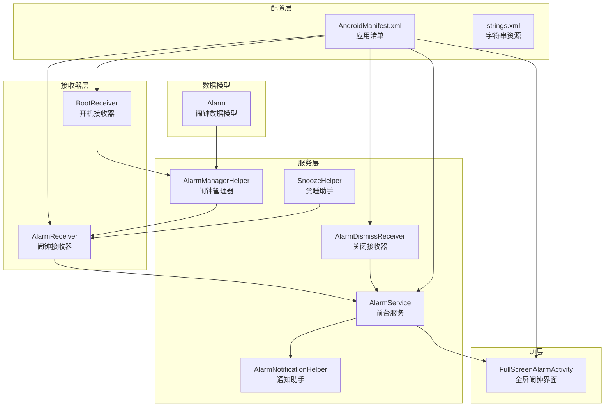
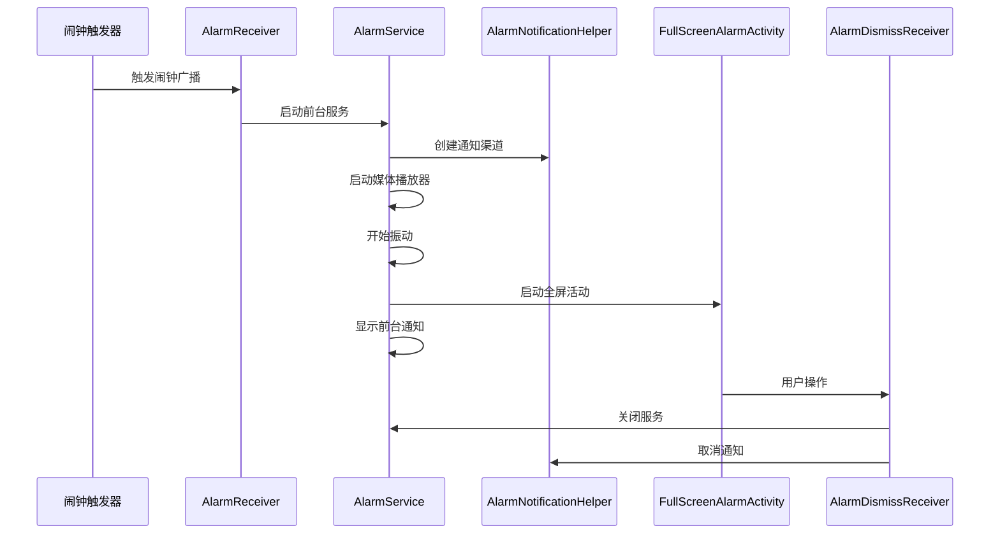
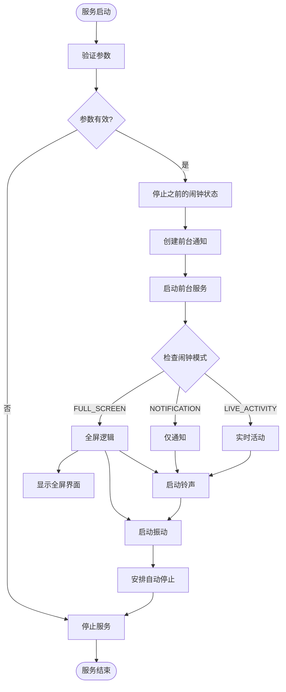
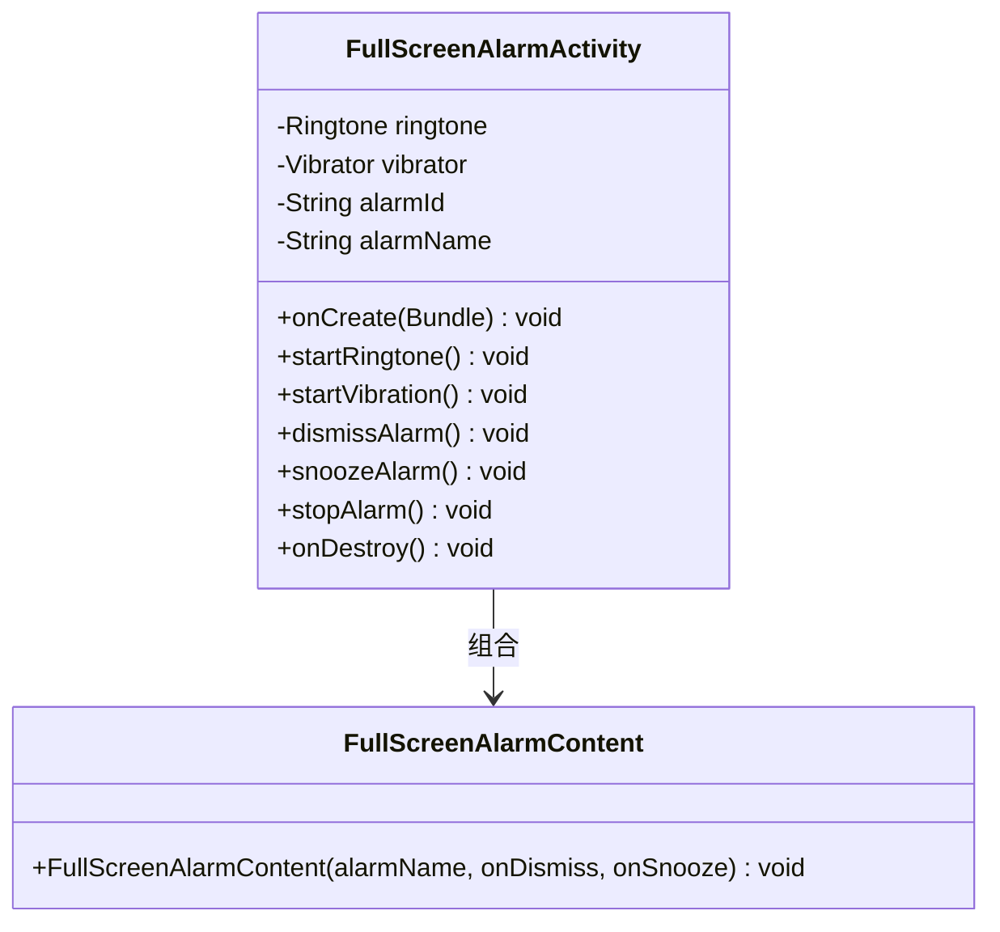
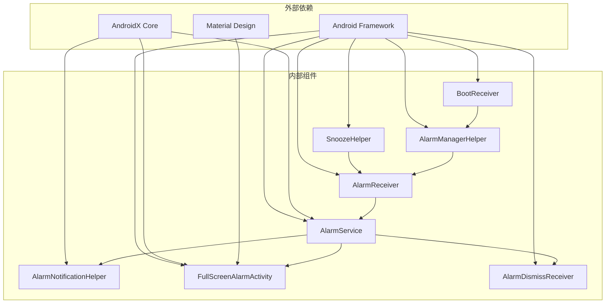

# 通知系统集成

<cite>
**本文档引用的文件**
- [AlarmNotificationHelper.kt](file://app/src/main/java/com/snuabar/sunrisesunsetalarm/service/AlarmNotificationHelper.kt)
- [AlarmService.kt](file://app/src/main/java/com/snuabar/sunrisesunsetalarm/service/AlarmService.kt)
- [AlarmReceiver.kt](file://app/src/main/java/com/snuabar/sunrisesunsetalarm/receiver/AlarmReceiver.kt)
- [FullScreenAlarmActivity.kt](file://app/src/main/java/com/snuabar/sunrisesunsetalarm/ui/screens/FullScreenAlarmActivity.kt)
- [AlarmDismissReceiver.kt](file://app/src/main/java/com/snuabar/sunrisesunsetalarm/service/AlarmDismissReceiver.kt)
- [SnoozeHelper.kt](file://app/src/main/java/com/snuabar/sunrisesunsetalarm/service/SnoozeHelper.kt)
- [AlarmManagerHelper.kt](file://app/src/main/java/com/snuabar/sunrisesunsetalarm/service/AlarmManagerHelper.kt)
- [BootReceiver.kt](file://app/src/main/java/com/snuabar/sunrisesunsetalarm/receiver/BootReceiver.kt)
- [Alarm.kt](file://app/src/main/java/com/snuabar/sunrisesunsetalarm/data/model/Alarm.kt)
- [AndroidManifest.xml](file://app/src/main/AndroidManifest.xml)
- [strings.xml](file://app/src/main/res/values/strings.xml)
</cite>

## 目录
1. [简介](#简介)
2. [项目结构](#项目结构)
3. [核心组件](#核心组件)
4. [架构概览](#架构概览)
5. [详细组件分析](#详细组件分析)
6. [依赖关系分析](#依赖关系分析)
7. [性能考虑](#性能考虑)
8. [故障排除指南](#故障排除指南)
9. [最佳实践](#最佳实践)
10. [结论](#结论)

## 简介

本文件详细介绍了Android通知系统的完整实现，包括通知渠道创建、通知样式设计、交互按钮配置等核心功能。重点涵盖了前台服务通知的实现机制，包括通知持续显示、用户交互处理、应用生命周期管理等。同时深入解析了全屏闹钟界面的设计和实现，包括Activity配置、窗口属性设置、用户操作响应等。文档还阐述了通知权限的管理和用户设置，包括通知开关控制、静默模式处理、个性化配置等，并提供了通知系统的最佳实践建议。

## 项目结构

该通知系统采用模块化设计，主要分布在以下目录结构中：



**图表来源**
- [AlarmService.kt:1-247](file://app/src/main/java/com/snuabar/sunrisesunsetalarm/service/AlarmService.kt#L1-L247)
- [AlarmNotificationHelper.kt:1-79](file://app/src/main/java/com/snuabar/sunrisesunsetalarm/service/AlarmNotificationHelper.kt#L1-L79)
- [FullScreenAlarmActivity.kt:1-172](file://app/src/main/java/com/snuabar/sunrisesunsetalarm/ui/screens/FullScreenAlarmActivity.kt#L1-L172)

**章节来源**
- [AlarmService.kt:1-247](file://app/src/main/java/com/snuabar/sunrisesunsetalarm/service/AlarmService.kt#L1-L247)
- [AlarmNotificationHelper.kt:1-79](file://app/src/main/java/com/snuabar/sunrisesunsetalarm/service/AlarmNotificationHelper.kt#L1-L79)
- [FullScreenAlarmActivity.kt:1-172](file://app/src/main/java/com/snuabar/sunrisesunsetalarm/ui/screens/FullScreenAlarmActivity.kt#L1-L172)

## 核心组件

### 通知渠道管理

系统实现了两个独立的通知渠道，分别用于不同的通知场景：

1. **前台服务通知渠道**：用于持续显示的闹钟通知
2. **全屏闹钟通知渠道**：用于全屏闹钟界面的通知

每个渠道都配置了特定的音频属性和振动模式，确保用户能够及时接收到重要的闹钟提醒。

### 前台服务通知实现

前台服务通过`AlarmService`类实现，该服务：
- 创建并启动前台通知
- 管理媒体播放器和振动器
- 处理闹钟响铃逻辑
- 实现渐强音效功能
- 自动停止机制

### 全屏闹钟界面

`FullScreenAlarmActivity`提供了完整的全屏闹钟体验：
- 锁屏显示支持
- 屏幕常亮设置
- 振动反馈
- 用户交互按钮（关闭、贪睡）

**章节来源**
- [AlarmNotificationHelper.kt:27-40](file://app/src/main/java/com/snuabar/sunrisesunsetalarm/service/AlarmNotificationHelper.kt#L27-L40)
- [AlarmService.kt:85-98](file://app/src/main/java/com/snuabar/sunrisesunsetalarm/service/AlarmService.kt#L85-L98)
- [FullScreenAlarmActivity.kt:33-63](file://app/src/main/java/com/snuabar/sunrisesunsetalarm/ui/screens/FullScreenAlarmActivity.kt#L33-L63)

## 架构概览

通知系统采用分层架构设计，各组件职责明确：



**图表来源**
- [AlarmReceiver.kt:35-45](file://app/src/main/java/com/snuabar/sunrisesunsetalarm/receiver/AlarmReceiver.kt#L35-L45)
- [AlarmService.kt:56-77](file://app/src/main/java/com/snuabar/sunrisesunsetalarm/service/AlarmService.kt#L56-L77)
- [FullScreenAlarmActivity.kt:82-95](file://app/src/main/java/com/snuabar/sunrisesunsetalarm/ui/screens/FullScreenAlarmActivity.kt#L82-L95)

## 详细组件分析

### AlarmNotificationHelper 分析

该类负责通知渠道的创建和通知的显示管理：

#### 通知渠道特性
- **渠道ID**: `alarm_channel`
- **渠道名称**: "闹钟提醒"
- **重要级别**: 高优先级
- **音频设置**: 禁用默认声音
- **振动设置**: 启用振动

#### 通知样式设计
通知采用Material Design风格，包含：
- 大标题和副标题
- 小图标显示
- 全屏意图配置
- 持续显示设置
- 关闭按钮动作

```mermaid
classDiagram
class AlarmNotificationHelper {
-Context context
-NotificationManager notificationManager
+String CHANNEL_ID
+String CHANNEL_NAME
+Int NOTIFICATION_ID
+createNotificationChannel() void
+showAlarmNotification(alarmId, alarmName) void
+cancelNotification() void
}
class NotificationCompat$Builder {
+setContentTitle(String) Builder
+setContentText(String) Builder
+setSmallIcon(Int) Builder
+setPriority(Int) Builder
+setCategory(String) Builder
+setFullScreenIntent(PendingIntent, Boolean) Builder
+setOngoing(Boolean) Builder
+addAction(Int, String, PendingIntent) Builder
+build() Notification
}
AlarmNotificationHelper --> NotificationCompat$Builder : 使用
```

**图表来源**
- [AlarmNotificationHelper.kt:13-79](file://app/src/main/java/com/snuabar/sunrisesunsetalarm/service/AlarmNotificationHelper.kt#L13-L79)

**章节来源**
- [AlarmNotificationHelper.kt:13-79](file://app/src/main/java/com/snuabar/sunrisesunsetalarm/service/AlarmNotificationHelper.kt#L13-L79)

### AlarmService 分析

前台服务是通知系统的核心组件，负责处理所有闹钟相关的后台操作：

#### 服务生命周期管理
- **onCreate()**: 初始化通知渠道
- **onStartCommand()**: 处理闹钟触发逻辑
- **onDestroy()**: 清理资源

#### 闹钟模式支持
系统支持三种闹钟模式：
1. **FULL_SCREEN**: 完整的全屏体验
2. **NOTIFICATION**: 仅通知模式
3. **LIVE_ACTIVITY**: 实时活动模式

#### 渐强音效实现
通过定时器实现音量渐强效果：
- 总步数计算：`crescendoSeconds * 10`
- 更新间隔：100毫秒
- 音量范围：0到1之间



**图表来源**
- [AlarmService.kt:44-83](file://app/src/main/java/com/snuabar/sunrisesunsetalarm/service/AlarmService.kt#L44-L83)
- [AlarmService.kt:181-200](file://app/src/main/java/com/snuabar/sunrisesunsetalarm/service/AlarmService.kt#L181-L200)

**章节来源**
- [AlarmService.kt:24-247](file://app/src/main/java/com/snuabar/sunrisesunsetalarm/service/AlarmService.kt#L24-L247)

### FullScreenAlarmActivity 分析

全屏闹钟界面提供了完整的用户交互体验：

#### 窗口属性配置
- **锁屏显示**: `setShowWhenLocked(true)`
- **屏幕常亮**: `setTurnScreenOn(true)`
- **键盘解锁**: `FLAG_DISMISS_KEYGUARD`
- **保持屏幕开启**: `FLAG_KEEP_SCREEN_ON`

#### 用户交互设计
- **贪睡按钮**: 5分钟延迟
- **关闭按钮**: 立即停止
- **时间显示**: 当前时间格式化显示
- **主题适配**: Material Design风格



**图表来源**
- [FullScreenAlarmActivity.kt:26-106](file://app/src/main/java/com/snuabar/sunrisesunsetalarm/ui/screens/FullScreenAlarmActivity.kt#L26-L106)

**章节来源**
- [FullScreenAlarmActivity.kt:26-172](file://app/src/main/java/com/snuabar/sunrisesunsetalarm/ui/screens/FullScreenAlarmActivity.kt#L26-L172)

### AlarmReceiver 分析

闹钟接收器作为系统与应用之间的桥梁：

#### 接收器职责
- **闹钟识别**: 从Intent中提取闹钟ID
- **数据库查询**: 获取闹钟详细信息
- **服务启动**: 启动前台服务处理闹钟
- **后续处理**: 根据重复模式进行相应操作

#### 重复模式处理
- **一次性闹钟**: 触发后禁用
- **重复闹钟**: 计算下次触发时间并重新调度

**章节来源**
- [AlarmReceiver.kt:17-69](file://app/src/main/java/com/snuabar/sunrisesunsetalarm/receiver/AlarmReceiver.kt#L17-L69)

### SnoozeHelper 分析

贪睡功能的实现类：

#### 贪睡机制
- **延迟计算**: 当前时间 + 贪睡分钟数
- **精确调度**: 使用`setExactAndAllowWhileIdle`
- **跨版本兼容**: 处理Android 12+的权限要求

**章节来源**
- [SnoozeHelper.kt:10-46](file://app/src/main/java/com/snuabar/sunrisesunsetalarm/service/SnoozeHelper.kt#L10-L46)

## 依赖关系分析

通知系统各组件之间的依赖关系如下：



**图表来源**
- [AlarmReceiver.kt:1-69](file://app/src/main/java/com/snuabar/sunrisesunsetalarm/receiver/AlarmReceiver.kt#L1-L69)
- [AlarmService.kt:1-247](file://app/src/main/java/com/snuabar/sunrisesunsetalarm/service/AlarmService.kt#L1-L247)
- [AlarmNotificationHelper.kt:1-79](file://app/src/main/java/com/snuabar/sunrisesunsetalarm/service/AlarmNotificationHelper.kt#L1-L79)

**章节来源**
- [AlarmReceiver.kt:1-69](file://app/src/main/java/com/snuabar/sunrisesunsetalarm/receiver/AlarmReceiver.kt#L1-L69)
- [AlarmService.kt:1-247](file://app/src/main/java/com/snuabar/sunrisesunsetalarm/service/AlarmService.kt#L1-L247)

## 性能考虑

### 电池优化策略

1. **前台服务优化**
   - 使用`startForeground()`避免被系统杀死
   - 设置适当的优先级和可见性
   - 及时清理资源释放内存

2. **媒体播放优化**
   - 使用`MediaPlayer`的循环播放模式
   - 合理设置音量渐强时间
   - 及时释放播放器资源

3. **振动优化**
   - 使用`VibrationEffect.createWaveform()`创建自定义振动模式
   - 在不需要时及时取消振动

### 内存管理

- **资源清理**: 在`onDestroy()`中清理所有资源
- **回调移除**: 使用`Handler.removeCallbacks()`移除定时任务
- **对象复用**: 复用`PendingIntent`对象

### 系统兼容性

- **版本检测**: 使用`Build.VERSION.SDK_INT`进行版本判断
- **降级处理**: 为旧版本提供兼容实现
- **权限检查**: 运行时权限检查和处理

## 故障排除指南

### 常见问题及解决方案

#### 通知不显示问题
1. **检查通知权限**
   - 确认`POST_NOTIFICATIONS`权限已授予
   - 检查系统设置中的应用通知权限

2. **验证通知渠道**
   - 确认通知渠道已正确创建
   - 检查渠道的重要级别设置

#### 前台服务问题
1. **服务启动失败**
   - 检查`FOREGROUND_SERVICE`权限
   - 验证通知渠道创建是否成功

2. **服务被系统杀死**
   - 确保调用了`startForeground()`
   - 检查通知ID是否唯一

#### 全屏界面问题
1. **无法锁屏显示**
   - 检查`showOnLockScreen`属性设置
   - 确认`USE_FULL_SCREEN_INTENT`权限

2. **屏幕不常亮**
   - 验证`FLAG_TURN_SCREEN_ON`标志
   - 检查系统设置中的应用权限

**章节来源**
- [AlarmNotificationHelper.kt:27-40](file://app/src/main/java/com/snuabar/sunrisesunsetalarm/service/AlarmNotificationHelper.kt#L27-L40)
- [AlarmService.kt:39-42](file://app/src/main/java/com/snuabar/sunrisesunsetalarm/service/AlarmService.kt#L39-L42)
- [AndroidManifest.xml:14-15](file://app/src/main/AndroidManifest.xml#L14-L15)

## 最佳实践

### 用户体验优化

1. **通知设计原则**
   - 使用清晰的标题和内容
   - 提供直观的操作按钮
   - 支持多种交互方式

2. **全屏界面设计**
   - 简洁明了的布局
   - 大字体和高对比度
   - 快速响应的按钮

3. **声音和振动**
   - 提供可选择的铃声
   - 支持振动模式
   - 渐强音效提升体验

### 系统兼容性处理

1. **权限管理**
   - Android 6.0+ 动态权限申请
   - Android 13+ 通知权限特殊处理
   - 版本降级兼容

2. **电池优化**
   - 使用`setExactAndAllowWhileIdle`提高准确性
   - 合理设置闹钟间隔
   - 避免频繁唤醒设备

### 性能优化建议

1. **资源管理**
   - 及时释放媒体资源
   - 使用单例模式管理全局对象
   - 避免内存泄漏

2. **网络请求**
   - 异步处理地理位置
   - 缓存计算结果
   - 减少不必要的网络调用

3. **UI响应性**
   - 使用协程处理耗时操作
   - 避免在主线程执行重任务
   - 及时更新UI状态

### 安全性考虑

1. **Intent安全**
   - 使用`FLAG_IMMUTABLE`防止篡改
   - 验证Intent参数的有效性
   - 防止恶意Intent攻击

2. **数据保护**
   - 敏感数据加密存储
   - 权限最小化原则
   - 数据完整性校验

## 结论

该通知系统实现了完整的Android闹钟通知功能，包括前台服务通知、全屏闹钟界面、用户交互处理等多个方面。系统采用了模块化设计，各组件职责明确，具有良好的可维护性和扩展性。

### 主要优势

1. **功能完整性**: 覆盖了从闹钟触发到用户交互的完整流程
2. **用户体验优秀**: 提供了直观易用的全屏闹钟界面
3. **系统兼容性强**: 考虑了不同Android版本的差异
4. **性能优化到位**: 采用了多种优化策略确保系统效率

### 改进建议

1. **通知个性化**: 可以增加更多通知样式的自定义选项
2. **智能功能**: 可以添加基于用户行为的学习算法
3. **多语言支持**: 扩展国际化支持
4. **无障碍访问**: 增强无障碍功能支持

该通知系统为Android应用开发提供了优秀的参考实现，开发者可以根据具体需求进行定制和扩展。