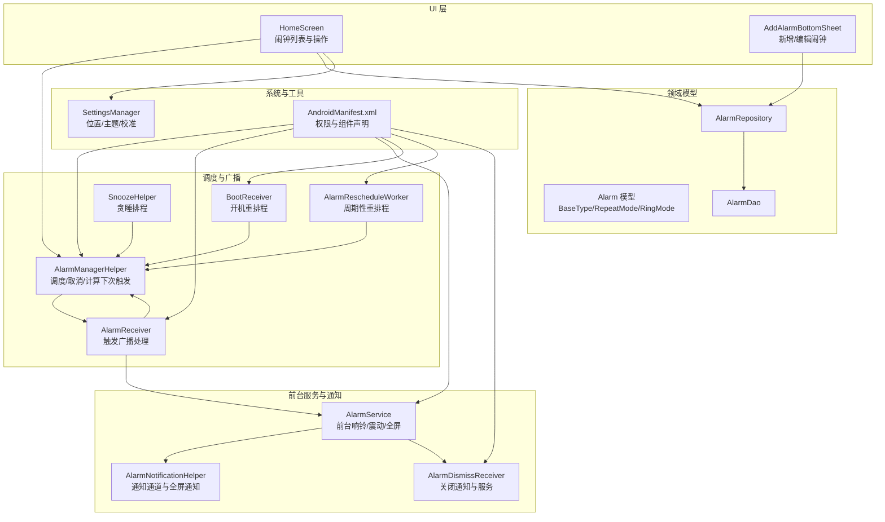
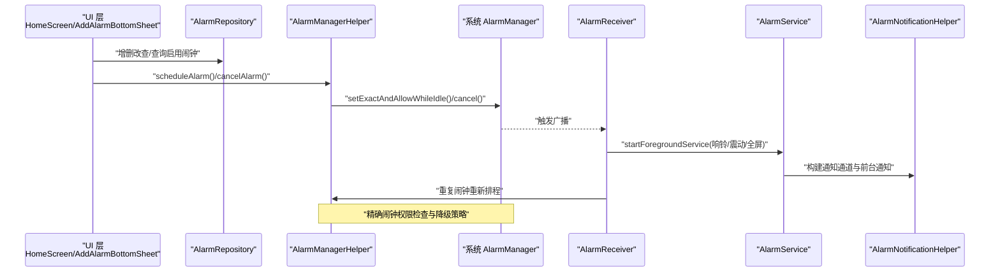
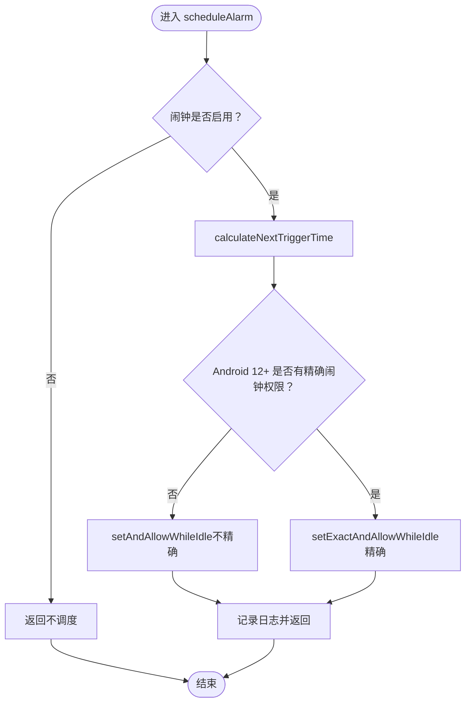
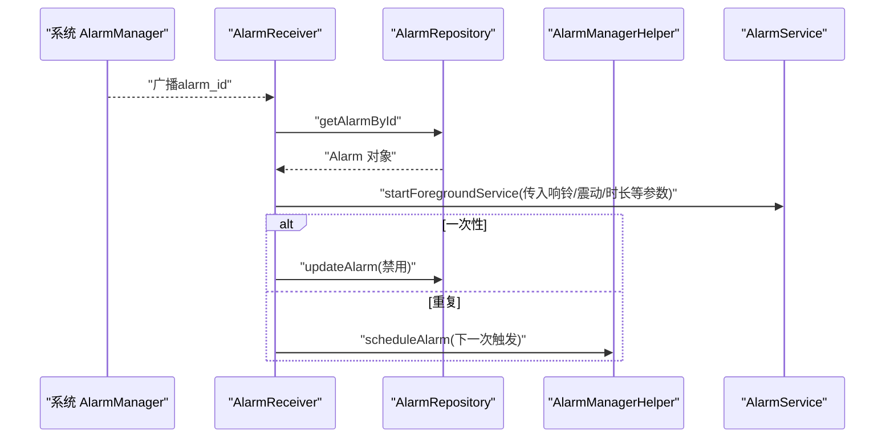
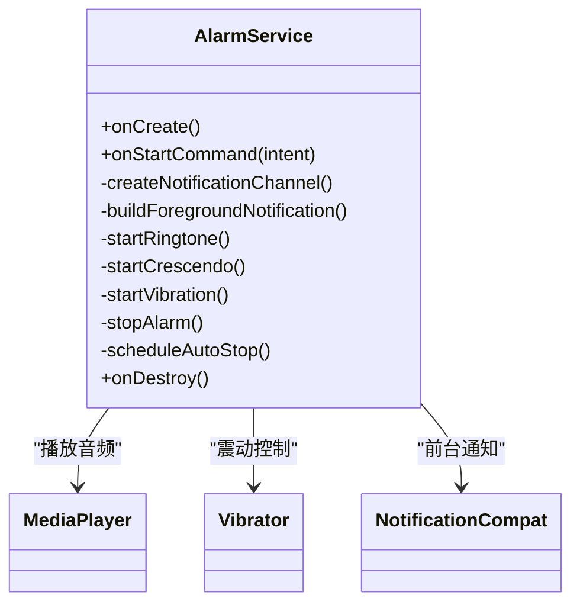
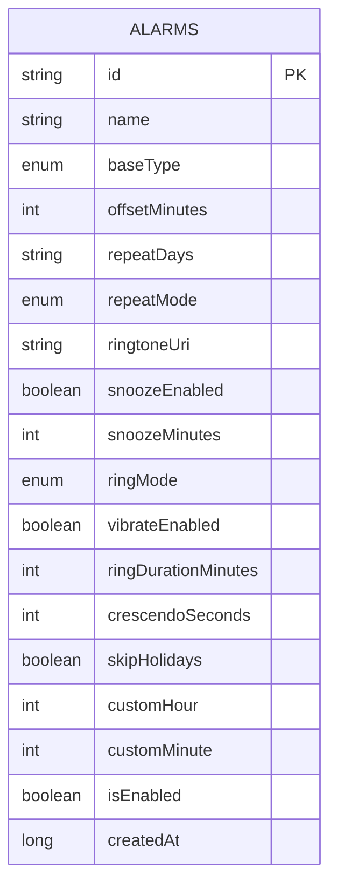
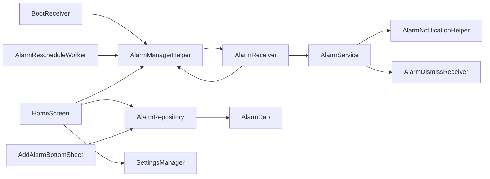

# 闹钟管理系统

<cite>
**本文引用的文件**
- [AlarmManagerHelper.kt](file://app/src/main/java/com/snuabar/sunrisesunsetalarm/service/AlarmManagerHelper.kt)
- [AlarmReceiver.kt](file://app/src/main/java/com/snuabar/sunrisesunsetalarm/receiver/AlarmReceiver.kt)
- [AlarmService.kt](file://app/src/main/java/com/snuabar/sunrisesunsetalarm/service/AlarmService.kt)
- [AlarmNotificationHelper.kt](file://app/src/main/java/com/snuabar/sunrisesunsetalarm/service/AlarmNotificationHelper.kt)
- [AlarmDismissReceiver.kt](file://app/src/main/java/com/snuabar/sunrisesunsetalarm/service/AlarmDismissReceiver.kt)
- [SnoozeHelper.kt](file://app/src/main/java/com/snuabar/sunrisesunsetalarm/service/SnoozeHelper.kt)
- [BootReceiver.kt](file://app/src/main/java/com/snuabar/sunrisesunsetalarm/receiver/BootReceiver.kt)
- [AlarmRescheduleWorker.kt](file://app/src/main/java/com/snuabar/sunrisesunsetalarm/receiver/AlarmRescheduleWorker.kt)
- [Alarm.kt](file://app/src/main/java/com/snuabar/sunrisesunsetalarm/data/model/Alarm.kt)
- [AlarmDao.kt](file://app/src/main/java/com/snuabar/sunrisesunsetalarm/data/database/AlarmDao.kt)
- [AlarmRepository.kt](file://app/src/main/java/com/snuabar/sunrisesunsetalarm/data/repository/AlarmRepository.kt)
- [SettingsManager.kt](file://app/src/main/java/com/snuabar/sunrisesunsetalarm/util/SettingsManager.kt)
- [HomeScreen.kt](file://app/src/main/java/com/snuabar/sunrisesunsetalarm/ui/screens/HomeScreen.kt)
- [AddAlarmBottomSheet.kt](file://app/src/main/java/com/snuabar/sunrisesunsetalarm/ui/components/AddAlarmBottomSheet.kt)
- [AndroidManifest.xml](file://app/src/main/AndroidManifest.xml)
</cite>

## 目录
1. [简介](#简介)
2. [项目结构](#项目结构)
3. [核心组件](#核心组件)
4. [架构总览](#架构总览)
5. [详细组件分析](#详细组件分析)
6. [依赖关系分析](#依赖关系分析)
7. [性能与最佳实践](#性能与最佳实践)
8. [故障排查指南](#故障排查指南)
9. [结论](#结论)
10. [附录](#附录)

## 简介
本项目是一个基于 Android 的“日出日落闹钟”应用，支持以下核心能力：
- 基于日出/日落或自定义时间的闹钟设置
- 精确闹钟与系统限制适配（Android 12+ 精确闹钟权限）
- 重复闹钟调度（每日、工作日、周末、自定义星期）
- 闹钟触发后的前台服务响铃、震动与全屏展示
- 闹钟状态管理（启用/禁用、重复模式、偏移时间、节假日跳过）
- 启动完成与定时重排程保障（开机重排程、周期性重排程）

## 项目结构
应用采用分层清晰的模块化组织：
- 数据层：Room 数据库 + DAO + Repository
- 领域模型：Alarm 及其枚举类型
- UI 层：Compose 主界面与底部弹窗
- 广播与服务：AlarmReceiver、BootReceiver、AlarmRescheduleWorker、AlarmService、AlarmDismissReceiver、SnoozeHelper
- 工具与配置：SettingsManager、AlarmNotificationHelper
- 清单与权限：AndroidManifest.xml

图表来源
- [AlarmManagerHelper.kt:17-166](file://app/src/main/java/com/snuabar/sunrisesunsetalarm/service/AlarmManagerHelper.kt#L17-L166)
- [AlarmReceiver.kt:17-69](file://app/src/main/java/com/snuabar/sunrisesunsetalarm/receiver/AlarmReceiver.kt#L17-L69)
- [AlarmService.kt:24-247](file://app/src/main/java/com/snuabar/sunrisesunsetalarm/service/AlarmService.kt#L24-L247)
- [AlarmNotificationHelper.kt:13-79](file://app/src/main/java/com/snuabar/sunrisesunsetalarm/service/AlarmNotificationHelper.kt#L13-L79)
- [AlarmDismissReceiver.kt:7-19](file://app/src/main/java/com/snuabar/sunrisesunsetalarm/service/AlarmDismissReceiver.kt#L7-L19)
- [SnoozeHelper.kt:10-46](file://app/src/main/java/com/snuabar/sunrisesunsetalarm/service/SnoozeHelper.kt#L10-L46)
- [BootReceiver.kt:11-34](file://app/src/main/java/com/snuabar/sunrisesunsetalarm/receiver/BootReceiver.kt#L11-L34)
- [AlarmRescheduleWorker.kt:12-48](file://app/src/main/java/com/snuabar/sunrisesunsetalarm/receiver/AlarmRescheduleWorker.kt#L12-L48)
- [Alarm.kt:6-50](file://app/src/main/java/com/snuabar/sunrisesunsetalarm/data/model/Alarm.kt#L6-L50)
- [AlarmDao.kt:7-30](file://app/src/main/java/com/snuabar/sunrisesunsetalarm/data/database/AlarmDao.kt#L7-L30)
- [AlarmRepository.kt:7-22](file://app/src/main/java/com/snuabar/sunrisesunsetalarm/data/repository/AlarmRepository.kt#L7-L22)
- [SettingsManager.kt:8-49](file://app/src/main/java/com/snuabar/sunrisesunsetalarm/util/SettingsManager.kt#L8-L49)
- [AndroidManifest.xml:1-88](file://app/src/main/AndroidManifest.xml#L1-L88)

章节来源
- [AndroidManifest.xml:1-88](file://app/src/main/AndroidManifest.xml#L1-L88)
- [Alarm.kt:6-50](file://app/src/main/java/com/snuabar/sunrisesunsetalarm/data/model/Alarm.kt#L6-L50)
- [AlarmDao.kt:7-30](file://app/src/main/java/com/snuabar/sunrisesunsetalarm/data/database/AlarmDao.kt#L7-L30)
- [AlarmRepository.kt:7-22](file://app/src/main/java/com/snuabar/sunrisesunsetalarm/data/repository/AlarmRepository.kt#L7-L22)
- [HomeScreen.kt:45-296](file://app/src/main/java/com/snuabar/sunrisesunsetalarm/ui/screens/HomeScreen.kt#L45-L296)
- [AddAlarmBottomSheet.kt:28-480](file://app/src/main/java/com/snuabar/sunrisesunsetalarm/ui/components/AddAlarmBottomSheet.kt#L28-L480)

## 核心组件
- AlarmManagerHelper：负责闹钟调度、取消、计算下一次触发时间；处理 Android 12+ 精确闹钟权限；支持日出/日落/自定义三种基准时间与偏移量、重复天数、节假日跳过策略。
- AlarmReceiver：广播接收器，负责启动前台服务 AlarmService、处理一次性与重复闹钟的后续逻辑（禁用一次性、为重复闹钟重新排程）。
- AlarmService：前台服务，负责构建通知通道、显示前台通知、播放媒体音效、震动、可选全屏活动；支持自动停止与渐强音量。
- AlarmNotificationHelper：独立的通知助手，用于创建通知通道与全屏通知。
- AlarmDismissReceiver：用于关闭通知并停止前台服务。
- SnoozeHelper：实现贪睡功能，将闹钟再次排程到未来某个时刻。
- BootReceiver：开机广播接收器，遍历启用的闹钟进行重排程。
- AlarmRescheduleWorker：周期性工作（每 24 小时），重新计算并排程所有启用的闹钟，以应对日出/日落时间变化。
- SettingsManager：统一管理应用设置（位置、主题、校准时间等）。
- UI 层：HomeScreen 负责展示与交互；AddAlarmBottomSheet 提供新增/编辑表单。

章节来源
- [AlarmManagerHelper.kt:17-166](file://app/src/main/java/com/snuabar/sunrisesunsetalarm/service/AlarmManagerHelper.kt#L17-L166)
- [AlarmReceiver.kt:17-69](file://app/src/main/java/com/snuabar/sunrisesunsetalarm/receiver/AlarmReceiver.kt#L17-L69)
- [AlarmService.kt:24-247](file://app/src/main/java/com/snuabar/sunrisesunsetalarm/service/AlarmService.kt#L24-L247)
- [AlarmNotificationHelper.kt:13-79](file://app/src/main/java/com/snuabar/sunrisesunsetalarm/service/AlarmNotificationHelper.kt#L13-L79)
- [AlarmDismissReceiver.kt:7-19](file://app/src/main/java/com/snuabar/sunrisesunsetalarm/service/AlarmDismissReceiver.kt#L7-L19)
- [SnoozeHelper.kt:10-46](file://app/src/main/java/com/snuabar/sunrisesunsetalarm/service/SnoozeHelper.kt#L10-L46)
- [BootReceiver.kt:11-34](file://app/src/main/java/com/snuabar/sunrisesunsetalarm/receiver/BootReceiver.kt#L11-L34)
- [AlarmRescheduleWorker.kt:12-48](file://app/src/main/java/com/snuabar/sunrisesunsetalarm/receiver/AlarmRescheduleWorker.kt#L12-L48)
- [SettingsManager.kt:8-49](file://app/src/main/java/com/snuabar/sunrisesunsetalarm/util/SettingsManager.kt#L8-L49)
- [HomeScreen.kt:45-296](file://app/src/main/java/com/snuabar/sunrisesunsetalarm/ui/screens/HomeScreen.kt#L45-L296)
- [AddAlarmBottomSheet.kt:28-480](file://app/src/main/java/com/snuabar/sunrisesunsetalarm/ui/components/AddAlarmBottomSheet.kt#L28-L480)

## 架构总览
系统遵循“UI 触发 → 数据层 → 广播/服务 → 系统闹钟/通知”的调用链路。UI 通过 AlarmManagerHelper 与 AlarmRepository 协作；闹钟触发由 AlarmReceiver 进入 AlarmService；系统层面通过 AlarmManager 与通知通道协同工作。

图表来源
- [HomeScreen.kt:185-247](file://app/src/main/java/com/snuabar/sunrisesunsetalarm/ui/screens/HomeScreen.kt#L185-L247)
- [AlarmRepository.kt:7-22](file://app/src/main/java/com/snuabar/sunrisesunsetalarm/data/repository/AlarmRepository.kt#L7-L22)
- [AlarmManagerHelper.kt:21-60](file://app/src/main/java/com/snuabar/sunrisesunsetalarm/service/AlarmManagerHelper.kt#L21-L60)
- [AlarmReceiver.kt:35-67](file://app/src/main/java/com/snuabar/sunrisesunsetalarm/receiver/AlarmReceiver.kt#L35-L67)
- [AlarmService.kt:44-83](file://app/src/main/java/com/snuabar/sunrisesunsetalarm/service/AlarmService.kt#L44-L83)
- [AlarmNotificationHelper.kt:42-78](file://app/src/main/java/com/snuabar/sunrisesunsetalarm/service/AlarmNotificationHelper.kt#L42-L78)

## 详细组件分析

### AlarmManagerHelper 组件分析
职责与实现要点：
- 精确闹钟权限处理：在 Android 12+ 检测 canScheduleExactAlarms，若未授权则回退到允许在节电模式下唤醒的不精确闹钟。
- 下次触发时间计算：支持三种基准时间（日出/日落/自定义），结合偏移分钟、重复天数、节假日跳过策略，最多尝试 8 天内找到有效触发点。
- PendingIntent 创建：携带 alarm_id、alarm_name 等关键信息，确保广播能正确传递给 AlarmReceiver。
- 调度与取消：使用 setExactAndAllowWhileIdle 或 setAndAllowWhileIdle，配合 cancel 清理。

图表来源
- [AlarmManagerHelper.kt:21-54](file://app/src/main/java/com/snuabar/sunrisesunsetalarm/service/AlarmManagerHelper.kt#L21-L54)
- [AlarmManagerHelper.kt:62-151](file://app/src/main/java/com/snuabar/sunrisesunsetalarm/service/AlarmManagerHelper.kt#L62-L151)

章节来源
- [AlarmManagerHelper.kt:17-166](file://app/src/main/java/com/snuabar/sunrisesunsetalarm/service/AlarmManagerHelper.kt#L17-L166)

### AlarmReceiver 组件分析
职责与实现要点：
- 接收系统广播，读取 alarm_id，从 AlarmRepository 获取完整闹钟信息。
- 启动 AlarmService 执行响铃、震动、全屏展示等。
- 处理重复与一次性逻辑：一次性闹钟触发后禁用；重复闹钟触发后重新计算并排程下一次。

图表来源
- [AlarmReceiver.kt:17-69](file://app/src/main/java/com/snuabar/sunrisesunsetalarm/receiver/AlarmReceiver.kt#L17-L69)
- [AlarmManagerHelper.kt:21-54](file://app/src/main/java/com/snuabar/sunrisesunsetalarm/service/AlarmManagerHelper.kt#L21-L54)

章节来源
- [AlarmReceiver.kt:17-69](file://app/src/main/java/com/snuabar/sunrisesunsetalarm/receiver/AlarmReceiver.kt#L17-L69)

### AlarmService 组件分析
职责与实现要点：
- 前台服务：创建通知通道、构建前台通知（持续、不可取消、可见性公开），支持关闭动作。
- 音频播放：MediaPlayer 按照 USAGE_ALARM 使用，支持默认或自定义铃声；可选渐强音量。
- 震动控制：根据系统版本使用 VibrationEffect 或兼容 API。
- 自动停止：按 ringDurationMinutes 定时停止播放、释放资源并停止服务。
- 全屏展示：根据 ringMode 决定是否启动 FullScreenAlarmActivity。

图表来源
- [AlarmService.kt:24-247](file://app/src/main/java/com/snuabar/sunrisesunsetalarm/service/AlarmService.kt#L24-L247)

章节来源
- [AlarmService.kt:24-247](file://app/src/main/java/com/snuabar/sunrisesunsetalarm/service/AlarmService.kt#L24-L247)

### AlarmNotificationHelper 组件分析
职责与实现要点：
- 创建高重要性的通知通道，设置无声（避免重复播放）。
- 构建全屏通知，包含“关闭”动作，点击进入 FullScreenAlarmActivity。
- 提供通知显示与取消接口。

章节来源
- [AlarmNotificationHelper.kt:13-79](file://app/src/main/java/com/snuabar/sunrisesunsetalarm/service/AlarmNotificationHelper.kt#L13-L79)

### AlarmDismissReceiver 组件分析
职责与实现要点：
- 接收“关闭”动作广播，取消通知并停止 AlarmService。

章节来源
- [AlarmDismissReceiver.kt:7-19](file://app/src/main/java/com/snuabar/sunrisesunsetalarm/service/AlarmDismissReceiver.kt#L7-L19)

### SnoozeHelper 组件分析
职责与实现要点：
- 将闹钟再次排程到未来某个时刻（默认 5 分钟），使用与 AlarmReceiver 相同的 PendingIntent 标识策略，确保覆盖原闹钟。

章节来源
- [SnoozeHelper.kt:10-46](file://app/src/main/java/com/snuabar/sunrisesunsetalarm/service/SnoozeHelper.kt#L10-L46)

### BootReceiver 与 AlarmRescheduleWorker 组件分析
职责与实现要点：
- BootReceiver：开机完成后遍历启用的闹钟，重新计算并排程。
- AlarmRescheduleWorker：使用 WorkManager 每 24 小时执行一次重排程，保证日出/日落时间变化后闹钟仍准确。

章节来源
- [BootReceiver.kt:11-34](file://app/src/main/java/com/snuabar/sunrisesunsetalarm/receiver/BootReceiver.kt#L11-L34)
- [AlarmRescheduleWorker.kt:12-48](file://app/src/main/java/com/snuabar/sunrisesunsetalarm/receiver/AlarmRescheduleWorker.kt#L12-L48)

### 数据模型与数据访问层
职责与实现要点：
- Alarm：包含基准类型、重复模式、响铃模式、震动、渐强、节假日跳过、自定义时间等字段；提供重复天数序列化/反序列化辅助方法。
- AlarmDao：提供查询全部、查询启用、按 ID 查询、插入/更新/删除等接口。
- AlarmRepository：封装 DAO，向上提供 Flow/List 查询与协程挂起操作。

图表来源
- [Alarm.kt:6-37](file://app/src/main/java/com/snuabar/sunrisesunsetalarm/data/model/Alarm.kt#L6-L37)

章节来源
- [Alarm.kt:6-50](file://app/src/main/java/com/snuabar/sunrisesunsetalarm/data/model/Alarm.kt#L6-L50)
- [AlarmDao.kt:7-30](file://app/src/main/java/com/snuabar/sunrisesunsetalarm/data/database/AlarmDao.kt#L7-L30)
- [AlarmRepository.kt:7-22](file://app/src/main/java/com/snuabar/sunrisesunsetalarm/data/repository/AlarmRepository.kt#L7-L22)

### UI 层与交互流程
职责与实现要点：
- HomeScreen：展示日出/日落时间、闹钟列表；支持主题切换、位置选择、设置入口；在启用/删除/编辑时调用 AlarmManagerHelper 与 AlarmRepository。
- AddAlarmBottomSheet：提供闹钟新增/编辑表单，支持基准类型（日出/日落/自定义）、偏移量、重复模式、响铃模式、震动、渐强、节假日跳过、贪睡等高级选项。
- 权限提示：在 Android 12+ 引导用户开启“精确闹钟”权限；在 Android 13+ 请求通知权限。

章节来源
- [HomeScreen.kt:45-296](file://app/src/main/java/com/snuabar/sunrisesunsetalarm/ui/screens/HomeScreen.kt#L45-L296)
- [AddAlarmBottomSheet.kt:28-480](file://app/src/main/java/com/snuabar/sunrisesunsetalarm/ui/components/AddAlarmBottomSheet.kt#L28-L480)

## 依赖关系分析
- AlarmManagerHelper 依赖 AlarmReceiver 与 AlarmRepository，间接依赖 SettingsManager（通过位置参数）。
- AlarmReceiver 依赖 AlarmRepository、AlarmManagerHelper、AlarmService。
- AlarmService 依赖 AlarmNotificationHelper、AlarmDismissReceiver。
- BootReceiver 与 AlarmRescheduleWorker 依赖 AlarmRepository 与 AlarmManagerHelper。
- UI 层依赖 AlarmManagerHelper 与 AlarmRepository，间接依赖 SettingsManager。

图表来源
- [AlarmManagerHelper.kt:17-166](file://app/src/main/java/com/snuabar/sunrisesunsetalarm/service/AlarmManagerHelper.kt#L17-L166)
- [AlarmReceiver.kt:17-69](file://app/src/main/java/com/snuabar/sunrisesunsetalarm/receiver/AlarmReceiver.kt#L17-L69)
- [AlarmService.kt:24-247](file://app/src/main/java/com/snuabar/sunrisesunsetalarm/service/AlarmService.kt#L24-L247)
- [AlarmNotificationHelper.kt:13-79](file://app/src/main/java/com/snuabar/sunrisesunsetalarm/service/AlarmNotificationHelper.kt#L13-L79)
- [AlarmDismissReceiver.kt:7-19](file://app/src/main/java/com/snuabar/sunrisesunsetalarm/service/AlarmDismissReceiver.kt#L7-L19)
- [BootReceiver.kt:11-34](file://app/src/main/java/com/snuabar/sunrisesunsetalarm/receiver/BootReceiver.kt#L11-L34)
- [AlarmRescheduleWorker.kt:12-48](file://app/src/main/java/com/snuabar/sunrisesunsetalarm/receiver/AlarmRescheduleWorker.kt#L12-L48)
- [HomeScreen.kt:45-296](file://app/src/main/java/com/snuabar/sunrisesunsetalarm/ui/screens/HomeScreen.kt#L45-L296)
- [AlarmRepository.kt:7-22](file://app/src/main/java/com/snuabar/sunrisesunsetalarm/data/repository/AlarmRepository.kt#L7-L22)
- [AlarmDao.kt:7-30](file://app/src/main/java/com/snuabar/sunrisesunsetalarm/data/database/AlarmDao.kt#L7-L30)
- [SettingsManager.kt:8-49](file://app/src/main/java/com/snuabar/sunrisesunsetalarm/util/SettingsManager.kt#L8-L49)

章节来源
- [AlarmManagerHelper.kt:17-166](file://app/src/main/java/com/snuabar/sunrisesunsetalarm/service/AlarmManagerHelper.kt#L17-L166)
- [AlarmReceiver.kt:17-69](file://app/src/main/java/com/snuabar/sunrisesunsetalarm/receiver/AlarmReceiver.kt#L17-L69)
- [AlarmService.kt:24-247](file://app/src/main/java/com/snuabar/sunrisesunsetalarm/service/AlarmService.kt#L24-L247)
- [AlarmNotificationHelper.kt:13-79](file://app/src/main/java/com/snuabar/sunrisesunsetalarm/service/AlarmNotificationHelper.kt#L13-L79)
- [AlarmDismissReceiver.kt:7-19](file://app/src/main/java/com/snuabar/sunrisesunsetalarm/service/AlarmDismissReceiver.kt#L7-L19)
- [BootReceiver.kt:11-34](file://app/src/main/java/com/snuabar/sunrisesunsetalarm/receiver/BootReceiver.kt#L11-L34)
- [AlarmRescheduleWorker.kt:12-48](file://app/src/main/java/com/snuabar/sunrisesunsetalarm/receiver/AlarmRescheduleWorker.kt#L12-L48)
- [HomeScreen.kt:45-296](file://app/src/main/java/com/snuabar/sunrisesunsetalarm/ui/screens/HomeScreen.kt#L45-L296)
- [AlarmRepository.kt:7-22](file://app/src/main/java/com/snuabar/sunrisesunsetalarm/data/repository/AlarmRepository.kt#L7-L22)
- [AlarmDao.kt:7-30](file://app/src/main/java/com/snuabar/sunrisesunsetalarm/data/database/AlarmDao.kt#L7-L30)
- [SettingsManager.kt:8-49](file://app/src/main/java/com/snuabar/sunrisesunsetalarm/util/SettingsManager.kt#L8-L49)

## 性能与最佳实践
- 精确闹钟权限：在 Android 12+ 优先使用精确闹钟；若未授权，系统会放宽节电策略，但可能影响准确性。建议在 UI 中引导用户开启“精确闹钟”权限。
- 电池优化与后台限制：AlarmManager 在 allowWhileIdle 模式下仍受系统节流影响，建议：
  - 保持 AlarmService 为前台服务，使用高优先级通知通道；
  - 避免长时间播放音频，合理设置 ringDurationMinutes；
  - 使用渐强而非持续高音量，减少功耗。
- 重排程策略：
  - 开机重排程（BootReceiver）与周期性重排程（WorkManager）双保险，确保日出/日落时间变化后闹钟仍准确。
  - 位置变更时主动取消并重新排程，避免无效触发。
- UI 与数据一致性：
  - 启用/禁用、删除、编辑均先调用 AlarmManagerHelper，再更新数据库，必要时提供撤销操作。
  - 通知权限在 Android 13+ 动态请求，避免因权限缺失导致提醒失败。

[本节为通用指导，无需列出具体文件来源]

## 故障排查指南
常见问题与定位思路：
- 闹钟未按时响起
  - 检查是否授予“精确闹钟”权限；若未授予，系统会降级为不精确闹钟。
  - 查看日志中调度与权限判断分支。
- 闹钟重复无效
  - 确认 RepeatMode 与 repeatDays 设置；一次性闹钟触发后会被禁用。
  - 检查重排程是否成功（BootReceiver 与 AlarmRescheduleWorker）。
- 震动/响铃异常
  - 检查震动权限与系统设置；确认 AlarmService 中的音频与震动初始化逻辑。
- 通知无法显示
  - 确认通知权限已授予；检查通知通道创建与通知内容构建。
- 贪睡无效
  - 确认 SnoozeHelper 的 PendingIntent 标识与 AlarmReceiver 的接收逻辑一致。

章节来源
- [AlarmManagerHelper.kt:32-54](file://app/src/main/java/com/snuabar/sunrisesunsetalarm/service/AlarmManagerHelper.kt#L32-L54)
- [AlarmReceiver.kt:52-67](file://app/src/main/java/com/snuabar/sunrisesunsetalarm/receiver/AlarmReceiver.kt#L52-L67)
- [AlarmService.kt:144-212](file://app/src/main/java/com/snuabar/sunrisesunsetalarm/service/AlarmService.kt#L144-L212)
- [AlarmNotificationHelper.kt:27-40](file://app/src/main/java/com/snuabar/sunrisesunsetalarm/service/AlarmNotificationHelper.kt#L27-L40)
- [SnoozeHelper.kt:14-44](file://app/src/main/java/com/snuabar/sunrisesunsetalarm/service/SnoozeHelper.kt#L14-L44)
- [BootReceiver.kt:18-32](file://app/src/main/java/com/snuabar/sunrisesunsetalarm/receiver/BootReceiver.kt#L18-L32)
- [AlarmRescheduleWorker.kt:29-46](file://app/src/main/java/com/snuabar/sunrisesunsetalarm/receiver/AlarmRescheduleWorker.kt#L29-L46)

## 结论
本系统通过 AlarmManagerHelper 实现可靠的闹钟调度，结合 AlarmReceiver 与 AlarmService 完成触发后的响铃、震动与全屏展示；通过 BootReceiver 与周期性重排程保障长期稳定性；UI 层提供直观的配置与交互体验。针对 Android 12+ 的精确闹钟权限与系统节流，系统提供了降级策略与前台服务保障，满足日常使用场景下的准确性与可靠性。

[本节为总结性内容，无需列出具体文件来源]

## 附录
- 权限清单与组件声明：AndroidManifest.xml 中声明了闹钟、震动、前台服务、精确闹钟、通知、全屏意图等权限及各组件。
- 数据模型字段说明：见 Alarm.kt 中的字段定义与注释。

章节来源
- [AndroidManifest.xml:1-88](file://app/src/main/AndroidManifest.xml#L1-L88)
- [Alarm.kt:6-50](file://app/src/main/java/com/snuabar/sunrisesunsetalarm/data/model/Alarm.kt#L6-L50)