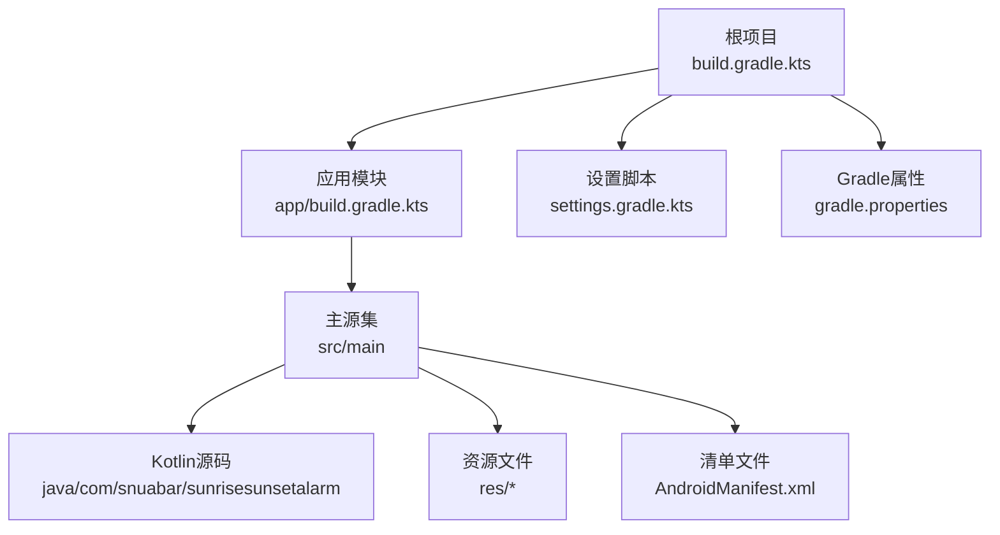
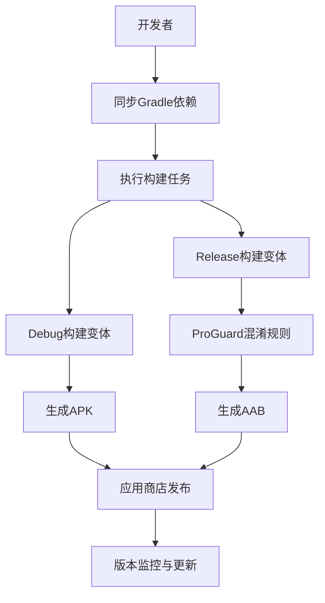
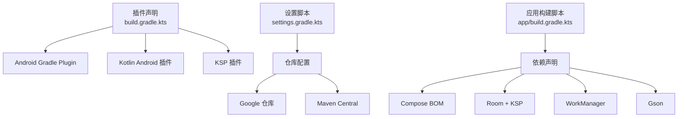

# 部署指南

<cite>
**本文档引用的文件**
- [build.gradle.kts](file://build.gradle.kts)
- [app/build.gradle.kts](file://app/build.gradle.kts)
- [gradle.properties](file://gradle.properties)
- [settings.gradle.kts](file://settings.gradle.kts)
- [README.md](file://README.md)
</cite>

## 目录
1. [简介](#简介)
2. [项目结构](#项目结构)
3. [核心组件](#核心组件)
4. [架构概览](#架构概览)
5. [详细组件分析](#详细组件分析)
6. [依赖分析](#依赖分析)
7. [性能考虑](#性能考虑)
8. [故障排除指南](#故障排除指南)
9. [结论](#结论)
10. [附录](#附录)

## 简介
本指南面向日出日落智能闹钟应用的部署与发布需求，涵盖构建配置、签名证书管理、ProGuard混淆规则设置、构建变体差异、APK/AAB包构建与优化、应用商店发布准备、持续集成与自动化部署以及版本管理最佳实践。该应用采用Android Gradle插件与Kotlin开发，使用Jetpack Compose进行UI构建，并通过Room数据库实现本地数据持久化。

## 项目结构
项目采用标准的Android Gradle多模块结构，根目录包含顶层构建脚本与全局配置，app模块为应用主体，包含源码、资源与构建配置。

图表来源
- [build.gradle.kts:1-7](file://build.gradle.kts#L1-L7)
- [settings.gradle.kts:1-18](file://settings.gradle.kts#L1-L18)
- [app/build.gradle.kts:1-108](file://app/build.gradle.kts#L1-L108)

章节来源
- [build.gradle.kts:1-7](file://build.gradle.kts#L1-L7)
- [settings.gradle.kts:1-18](file://settings.gradle.kts#L1-L18)
- [README.md:49-92](file://README.md#L49-L92)

## 核心组件
- 构建工具链与版本
  - Android Gradle插件版本：8.6.0
  - Kotlin编译器版本：1.9.22
  - KSP（Kotlin Symbol Processing）版本：1.9.22-1.0.17
- 编译与目标SDK
  - compileSdk：36
  - targetSdk：36
  - minSdk：26
  - JVM目标：17
- UI框架与编译选项
  - Jetpack Compose：启用
  - Compose编译扩展版本：1.5.8
- 依赖管理
  - 使用BOM统一管理Compose依赖
  - Room配合KSP编译器使用
  - WorkManager、Gson、Kotlin协程等

章节来源
- [build.gradle.kts:2-6](file://build.gradle.kts#L2-L6)
- [app/build.gradle.kts:7-56](file://app/build.gradle.kts#L7-L56)
- [gradle.properties:1-5](file://gradle.properties#L1-L5)

## 架构概览
下图展示了应用构建与发布的关键流程，从源码到最终产物的路径与关键配置点。

图表来源
- [app/build.gradle.kts:24-32](file://app/build.gradle.kts#L24-L32)
- [app/build.gradle.kts:26-30](file://app/build.gradle.kts#L26-L30)

## 详细组件分析

### 构建变体与配置差异
- Debug调试版本
  - 用途：开发与测试阶段使用，便于调试与日志输出
  - 特性：未启用代码压缩与混淆；包含调试依赖（如Compose调试工具）
- Release发布版本
  - 用途：正式发布与分发
  - 特性：当前配置中未启用代码压缩与混淆（isMinifyEnabled=false），但保留了ProGuard规则文件以备后续启用
  - 优化建议：在发布前可启用混淆与压缩，并配合R8优化

章节来源
- [app/build.gradle.kts:24-32](file://app/build.gradle.kts#L24-L32)
- [app/build.gradle.kts:58-107](file://app/build.gradle.kts#L58-L107)

### 签名证书生成与管理
- 证书生成
  - 使用Android Gradle插件提供的签名配置能力，通过gradle.properties或本地密钥库配置
  - 建议使用独立的密钥库文件与安全的密码管理策略
- 密钥轮换与备份
  - 发布密钥需妥善保管，定期轮换并备份至安全介质
  - 不同环境（开发、测试、生产）应使用不同的密钥库
- Gradle配置要点
  - 在app/build.gradle.kts中添加签名块，指定keyAlias、keyPassword、storeFile、storePassword
  - 在CI环境中通过环境变量注入密钥信息，避免硬编码

章节来源
- [app/build.gradle.kts:24-32](file://app/build.gradle.kts#L24-L32)

### ProGuard混淆规则设置
- 当前状态
  - Release变体已配置ProGuard规则文件，但未启用压缩与混淆
- 启用步骤
  - 将isMinifyEnabled设为true
  - 确保proguard-rules.pro存在并包含必要的keep规则
  - 验证Compose、Room、WorkManager等依赖的混淆配置
- 规则编写建议
  - 保持UI类、数据类、序列化类、反射使用的类不被混淆
  - 为第三方库添加对应的混淆规则文件
  - 在发布前进行完整性测试，确保混淆不影响核心功能

章节来源
- [app/build.gradle.kts:26-30](file://app/build.gradle.kts#L26-L30)

### APK与AAB包构建方法与优化
- APK构建
  - 使用命令：./gradlew assembleRelease
  - 产物位置：app/build/outputs/apk/release/app-release.apk
  - 适用场景：直接分发给用户或小规模测试
- AAB构建
  - 使用命令：./gradlew bundleRelease
  - 产物位置：app/build/outputs/bundle/release/app-release.aab
  - 优势：由Google Play统一优化与分发，减小安装包体积
- 优化策略
  - 启用代码压缩与混淆（在Release变体中）
  - 移除未使用资源与依赖
  - 使用R8进行字节码优化
  - 配置多APK分包（按ABI/屏幕密度），降低单包体积

章节来源
- [app/build.gradle.kts:24-32](file://app/build.gradle.kts#L24-L32)

### 应用商店发布准备
- 应用元数据配置
  - 应用名称、描述、关键词、分类
  - 截图与视频预览（至少包含主界面、闹钟设置、通知展示）
  - 支持的设备与Android版本范围
- 隐私政策与权限说明
  - 明确列出所需权限及其用途（位置、通知、开机启动等）
  - 提供隐私政策链接与数据处理声明
- 内容分级与年龄分级
  - 根据功能与数据收集情况填写COPPA、GSAM等分级
- 法律合规
  - 确保符合目标市场的法律法规
  - 如涉及位置数据，需遵守GDPR等数据保护法规

### 持续集成与自动化部署
- CI/CD流水线建议
  - 触发条件：push到主分支、打标签、PR合并
  - 步骤：依赖同步、静态检查、单元测试、仪器测试、构建APK/AAB
  - 安全：密钥与凭据通过CI变量注入，不提交到仓库
  - 分发：将产物上传至应用商店或内部测试轨道
- 常用平台
  - GitHub Actions、GitLab CI、Jenkins、Azure DevOps
- 自动化测试
  - 单元测试：JVM环境
  - 仪器测试：连接设备或模拟器
  - UI测试：Espresso或Compose测试

### 版本管理与更新策略
- 版本号规范
  - 使用语义化版本（主.次.修订），配合versionCode与versionName
  - 每次发布更新versionCode，必要时更新versionName
- 更新渠道
  - Google Play：内部测试、封闭测试、开放测试、生产发布
  - 应用内更新：通过Play Core库实现动态更新
- 回滚策略
  - 记录每次发布变更日志
  - 出现严重问题时回滚至上一稳定版本
- 用户通知
  - 重要更新通过通知或引导页告知用户

## 依赖分析
构建脚本与模块间的依赖关系如下：

图表来源
- [build.gradle.kts:2-6](file://build.gradle.kts#L2-L6)
- [settings.gradle.kts:8-14](file://settings.gradle.kts#L8-L14)
- [app/build.gradle.kts:58-107](file://app/build.gradle.kts#L58-L107)

章节来源
- [build.gradle.kts:2-6](file://build.gradle.kts#L2-L6)
- [settings.gradle.kts:8-14](file://settings.gradle.kts#L8-L14)
- [app/build.gradle.kts:58-107](file://app/build.gradle.kts#L58-L107)

## 性能考虑
- 构建性能
  - 合理配置Gradle JVM参数，避免内存不足导致的构建失败
  - 使用Gradle缓存与并行构建提升效率
- 运行时性能
  - 启用R8优化与代码压缩（在Release变体中）
  - 减少不必要的反射与动态加载
  - 优化Compose渲染与状态管理
- 包体积控制
  - 移除未使用资源与依赖
  - 使用AAB并启用Google Play的按需分发
  - 对图片与媒体资源进行压缩与格式优化

## 故障排除指南
- 构建失败
  - 检查Java/Kotlin版本与JDK兼容性
  - 清理并重建项目：./gradlew clean && ./gradlew build
  - 验证依赖版本与仓库可用性
- 签名错误
  - 确认签名配置中的密钥别名、密码与密钥库路径正确
  - 在CI环境中确保密钥与凭据变量已正确注入
- ProGuard相关问题
  - 启用混淆前先验证核心功能是否正常
  - 逐步添加keep规则，避免误伤反射或序列化类
- 测试失败
  - 确保测试设备或模拟器满足minSdk要求
  - 检查测试依赖与Compose测试工具版本兼容性

章节来源
- [gradle.properties:1-5](file://gradle.properties#L1-L5)
- [app/build.gradle.kts:24-32](file://app/build.gradle.kts#L24-L32)

## 结论
本部署指南提供了从构建配置、签名证书管理、混淆规则到APK/AAB构建与应用商店发布的完整流程。建议在Release变体中启用代码压缩与混淆，并完善测试与自动化流程，以确保高质量、高可靠性的应用交付与维护。

## 附录
- 快速参考
  - 同步依赖：./gradlew :app:dependencies
  - 生成APK：./gradlew assembleRelease
  - 生成AAB：./gradlew bundleRelease
  - 清理构建：./gradlew clean
- 参考文档
  - Android Gradle插件官方文档
  - Kotlin编译器与KSP文档
  - Jetpack Compose与Room官方指南