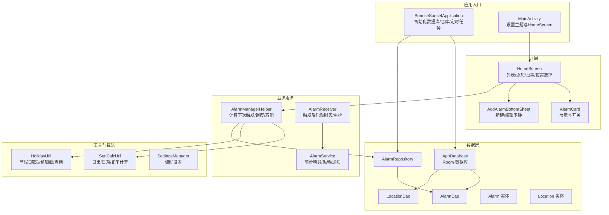
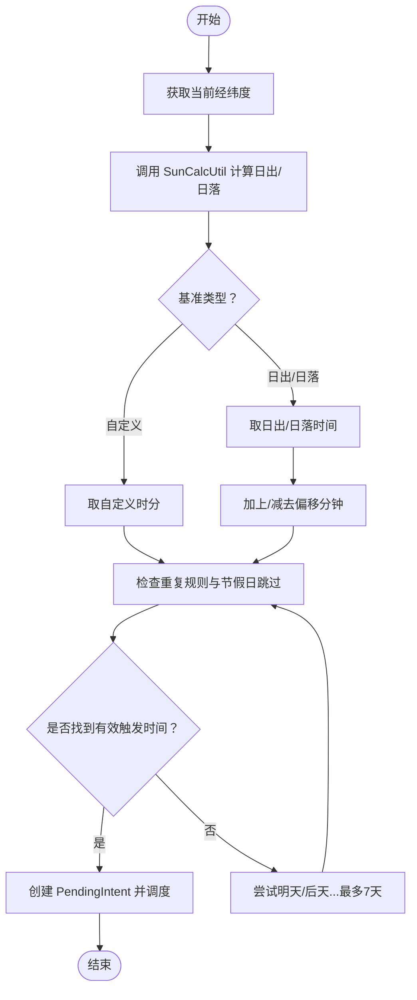
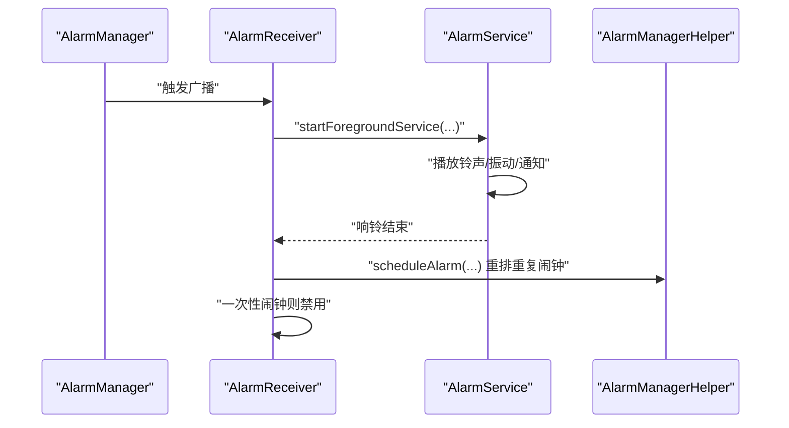
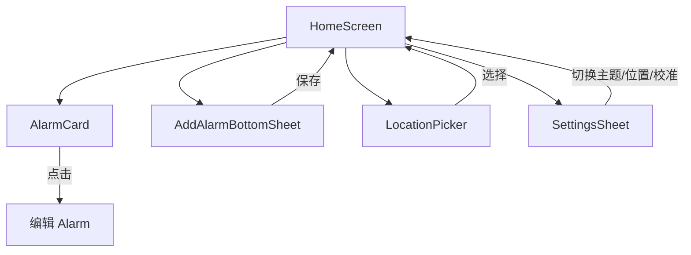
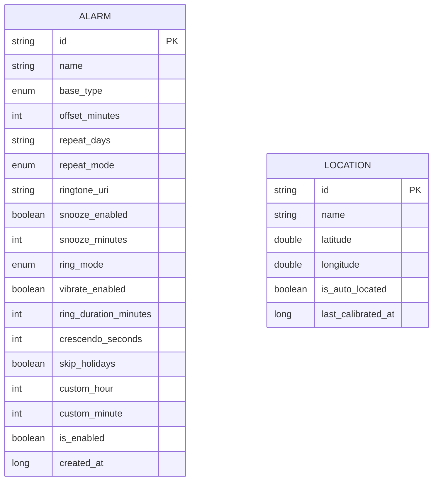
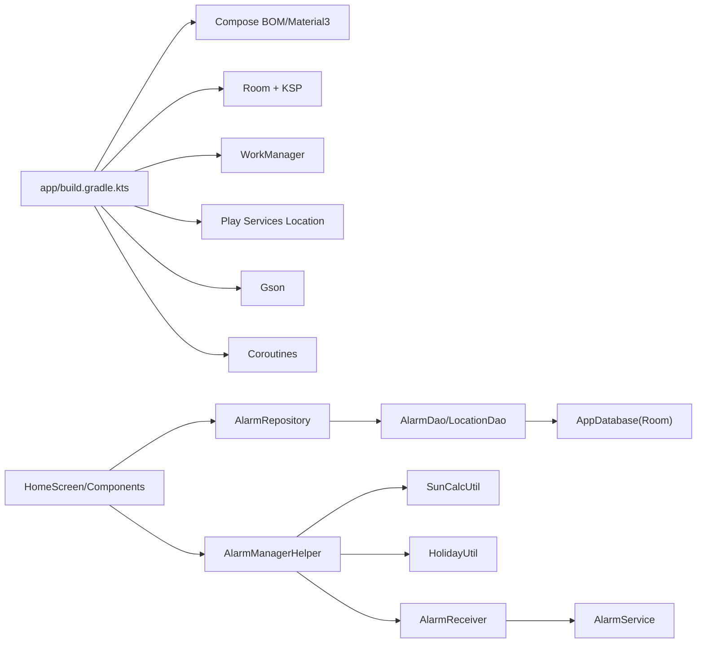

# 项目概览

<cite>
**本文引用的文件**
- [README.md](file://README.md)
- [SunriseSunsetApplication.kt](file://app/src/main/java/com/snuabar/sunrisesunsetalarm/SunriseSunsetApplication.kt)
- [MainActivity.kt](file://app/src/main/java/com/snuabar/sunrisesunsetalarm/MainActivity.kt)
- [AppDatabase.kt](file://app/src/main/java/com/snuabar/sunrisesunsetalarm/data/database/AppDatabase.kt)
- [Alarm.kt](file://app/src/main/java/com/snuabar/sunrisesunsetalarm/data/model/Alarm.kt)
- [Location.kt](file://app/src/main/java/com/snuabar/sunrisesunsetalarm/data/model/Location.kt)
- [AlarmRepository.kt](file://app/src/main/java/com/snuabar/sunrisesunsetalarm/data/repository/AlarmRepository.kt)
- [SunCalcUtil.kt](file://app/src/main/java/com/snuabar/sunrisesunsetalarm/util/SunCalcUtil.kt)
- [AlarmManagerHelper.kt](file://app/src/main/java/com/snuabar/sunrisesunsetalarm/service/AlarmManagerHelper.kt)
- [AlarmReceiver.kt](file://app/src/main/java/com/snuabar/sunrisesunsetalarm/receiver/AlarmReceiver.kt)
- [AlarmService.kt](file://app/src/main/java/com/snuabar/sunrisesunsetalarm/service/AlarmService.kt)
- [HomeScreen.kt](file://app/src/main/java/com/snuabar/sunrisesunsetalarm/ui/screens/HomeScreen.kt)
- [AlarmCard.kt](file://app/src/main/java/com/snuabar/sunrisesunsetalarm/ui/components/AlarmCard.kt)
- [AddAlarmBottomSheet.kt](file://app/src/main/java/com/snuabar/sunrisesunsetalarm/ui/components/AddAlarmBottomSheet.kt)
- [SettingsManager.kt](file://app/src/main/java/com/snuabar/sunrisesunsetalarm/util/SettingsManager.kt)
- [HolidayUtil.kt](file://app/src/main/java/com/snuabar/sunrisesunsetalarm/util/HolidayUtil.kt)
- [app/build.gradle.kts](file://app/build.gradle.kts)
</cite>

## 目录
1. [简介](#简介)
2. [项目结构](#项目结构)
3. [核心组件](#核心组件)
4. [架构总览](#架构总览)
5. [详细组件分析](#详细组件分析)
6. [依赖分析](#依赖分析)
7. [性能考虑](#性能考虑)
8. [故障排查指南](#故障排查指南)
9. [结论](#结论)
10. [附录](#附录)

## 简介
本项目是一个“日出日落智能闹钟”，以天文算法为基础，结合地理位置与可配置偏移量，实现基于日出/日落的动态闹钟时间。应用支持多种响铃模式、振动、渐强音效、节假日跳过、贪睡等功能，并提供 Jetpack Compose 的现代 UI 体验与 Room 数据库持久化。

- 核心目标：让用户在日出/日落时刻或自定义时间被准时唤醒，同时兼顾灵活性与易用性。
- 主要特性：日出/日落时间计算、偏移分钟数、重复周期、节假日跳过、响铃模式、振动与渐强、贪睡、位置切换自动重排。
- 技术选型：MVVM 架构、Jetpack Compose UI、Room 数据库、WorkManager 定时任务、AlarmManager 精确闹钟、Gson 解析节假日数据。

## 项目结构
应用采用按功能域分层的模块化组织方式，核心目录与职责如下：
- data 层：Room 实体与 DAO、仓库层封装数据访问。
- service 层：闹钟调度、通知与前台服务、响铃播放与振动控制。
- receiver 层：广播接收器处理闹钟触发与后续逻辑。
- ui 层：Compose 屏幕与可复用组件，提供交互与展示。
- util 层：工具类（节假日、定位、设置、天文计算）。
- 入口：Application 初始化数据库、预加载节假日、调度每日重排；Activity 设置 Compose 主题与入口屏幕。

图表来源
- [SunriseSunsetApplication.kt:36-65](file://app/src/main/java/com/snuabar/sunrisesunsetalarm/SunriseSunsetApplication.kt#L36-L65)
- [MainActivity.kt:17-38](file://app/src/main/java/com/snuabar/sunrisesunsetalarm/MainActivity.kt#L17-L38)
- [HomeScreen.kt:46-296](file://app/src/main/java/com/snuabar/sunrisesunsetalarm/ui/screens/HomeScreen.kt#L46-L296)
- [AlarmManagerHelper.kt:21-54](file://app/src/main/java/com/snuabar/sunrisesunsetalarm/service/AlarmManagerHelper.kt#L21-L54)
- [AlarmReceiver.kt:17-68](file://app/src/main/java/com/snuabar/sunrisesunsetalarm/receiver/AlarmReceiver.kt#L17-L68)
- [AlarmService.kt:44-83](file://app/src/main/java/com/snuabar/sunrisesunsetalarm/service/AlarmService.kt#L44-L83)
- [AppDatabase.kt:10-17](file://app/src/main/java/com/snuabar/sunrisesunsetalarm/data/database/AppDatabase.kt#L10-L17)
- [AlarmRepository.kt:7-21](file://app/src/main/java/com/snuabar/sunrisesunsetalarm/data/repository/AlarmRepository.kt#L7-L21)
- [SunCalcUtil.kt:19-45](file://app/src/main/java/com/snuabar/sunrisesunsetalarm/util/SunCalcUtil.kt#L19-L45)
- [HolidayUtil.kt:41-75](file://app/src/main/java/com/snuabar/sunrisesunsetalarm/util/HolidayUtil.kt#L41-L75)
- [SettingsManager.kt:8-48](file://app/src/main/java/com/snuabar/sunrisesunsetalarm/util/SettingsManager.kt#L8-L48)

章节来源
- [README.md:1-3](file://README.md#L1-L3)
- [SunriseSunsetApplication.kt:18-66](file://app/src/main/java/com/snuabar/sunrisesunsetalarm/SunriseSunsetApplication.kt#L18-L66)
- [MainActivity.kt:17-38](file://app/src/main/java/com/snuabar/sunrisesunsetalarm/MainActivity.kt#L17-L38)
- [HomeScreen.kt:46-296](file://app/src/main/java/com/snuabar/sunrisesunsetalarm/ui/screens/HomeScreen.kt#L46-L296)

## 核心组件
- 应用入口与依赖注入
  - Application 负责构建 Room 数据库、延迟初始化仓库、调度每日重排任务、预加载节假日数据。
  - 参考路径：[SunriseSunsetApplication.kt:36-65](file://app/src/main/java/com/snuabar/sunrisesunsetalarm/SunriseSunsetApplication.kt#L36-L65)

- 主界面与 MVVM
  - MainActivity 设置 Compose 主题与 HomeScreen。
  - HomeScreen 收集仓库流展示闹钟列表，处理添加/编辑/删除/开关、位置选择、权限提示与重排。
  - 参考路径：[MainActivity.kt:17-38](file://app/src/main/java/com/snuabar/sunrisesunsetalarm/MainActivity.kt#L17-L38)，[HomeScreen.kt:46-296](file://app/src/main/java/com/snuabar/sunrisesunsetalarm/ui/screens/HomeScreen.kt#L46-L296)

- 数据模型与仓库
  - Alarm/Location 为 Room 实体；AlarmRepository 封装 DAO 访问。
  - 参考路径：[Alarm.kt:6-37](file://app/src/main/java/com/snuabar/sunrisesunsetalarm/data/model/Alarm.kt#L6-L37)，[Location.kt:6-15](file://app/src/main/java/com/snuabar/sunrisesunsetalarm/data/model/Location.kt#L6-L15)，[AlarmRepository.kt:7-21](file://app/src/main/java/com/snuabar/sunrisesunsetalarm/data/repository/AlarmRepository.kt#L7-L21)

- 闹钟调度与触发
  - AlarmManagerHelper 计算下一次触发时间（含节假日跳过、重复规则、偏移），调度精确/近似闹钟。
  - AlarmReceiver 接收触发广播，启动 AlarmService 并根据重复模式重排或禁用一次性闹钟。
  - AlarmService 在前台响铃、振动、显示通知与全屏页面。
  - 参考路径：[AlarmManagerHelper.kt:21-151](file://app/src/main/java/com/snuabar/sunrisesunsetalarm/service/AlarmManagerHelper.kt#L21-L151)，[AlarmReceiver.kt:17-68](file://app/src/main/java/com/snuabar/sunrisesunsetalarm/receiver/AlarmReceiver.kt#L17-L68)，[AlarmService.kt:44-246](file://app/src/main/java/com/snuabar/sunrisesunsetalarm/service/AlarmService.kt#L44-L246)

- 天文算法与节假日
  - SunCalcUtil 基于 NOAA 简化算法计算日出/日落/正午。
  - HolidayUtil 预加载节假日数据，支持网络回退与本地缓存。
  - 参考路径：[SunCalcUtil.kt:19-137](file://app/src/main/java/com/snuabar/sunrisesunsetalarm/util/SunCalcUtil.kt#L19-L137)，[HolidayUtil.kt:41-94](file://app/src/main/java/com/snuabar/sunrisesunsetalarm/util/HolidayUtil.kt#L41-L94)

- UI 组件
  - AlarmCard 展示闹钟描述与时间；AddAlarmBottomSheet 提供新建/编辑表单与高级设置。
  - 参考路径：[AlarmCard.kt:21-150](file://app/src/main/java/com/snuabar/sunrisesunsetalarm/ui/components/AlarmCard.kt#L21-L150)，[AddAlarmBottomSheet.kt:29-480](file://app/src/main/java/com/snuabar/sunrisesunsetalarm/ui/components/AddAlarmBottomSheet.kt#L29-L480)

章节来源
- [SunriseSunsetApplication.kt:25-65](file://app/src/main/java/com/snuabar/sunrisesunsetalarm/SunriseSunsetApplication.kt#L25-L65)
- [MainActivity.kt:17-38](file://app/src/main/java/com/snuabar/sunrisesunsetalarm/MainActivity.kt#L17-L38)
- [AlarmRepository.kt:7-21](file://app/src/main/java/com/snuabar/sunrisesunsetalarm/data/repository/AlarmRepository.kt#L7-L21)
- [AlarmManagerHelper.kt:21-151](file://app/src/main/java/com/snuabar/sunrisesunsetalarm/service/AlarmManagerHelper.kt#L21-L151)
- [AlarmReceiver.kt:17-68](file://app/src/main/java/com/snuabar/sunrisesunsetalarm/receiver/AlarmReceiver.kt#L17-L68)
- [AlarmService.kt:44-246](file://app/src/main/java/com/snuabar/sunrisesunsetalarm/service/AlarmService.kt#L44-L246)
- [SunCalcUtil.kt:19-137](file://app/src/main/java/com/snuabar/sunrisesunsetalarm/util/SunCalcUtil.kt#L19-L137)
- [HolidayUtil.kt:41-94](file://app/src/main/java/com/snuabar/sunrisesunsetalarm/util/HolidayUtil.kt#L41-L94)
- [AlarmCard.kt:21-150](file://app/src/main/java/com/snuabar/sunrisesunsetalarm/ui/components/AlarmCard.kt#L21-L150)
- [AddAlarmBottomSheet.kt:29-480](file://app/src/main/java/com/snuabar/sunrisesunsetalarm/ui/components/AddAlarmBottomSheet.kt#L29-L480)

## 架构总览
项目采用 MVVM 架构：
- Model：Room 实体 + Repository。
- View：Jetpack Compose 屏幕与组件。
- ViewModel：通过 Compose 的状态收集与生命周期感知（如 collectAsStateWithLifecycle）实现数据驱动 UI。
- 服务层：AlarmManagerHelper/AlarmReceiver/AlarmService 协同完成调度与触发。
- 工具层：SunCalcUtil、HolidayUtil、SettingsManager 提供算法与配置能力。

```mermaid
classDiagram
class SunriseSunsetApplication {
+database : AppDatabase
+alarmRepository : AlarmRepository
+locationRepository : LocationRepository
+onCreate()
}
class AppDatabase {
+alarmDao() : AlarmDao
+locationDao() : LocationDao
}
class AlarmRepository {
+getAllAlarms() : Flow<List<Alarm>>
+insertAlarm(alarm)
+updateAlarm(alarm)
+deleteAlarm(alarm)
}
class AlarmManagerHelper {
+scheduleAlarm(alarm, lat, lng)
+cancelAlarm(alarm)
-calculateNextTriggerTime(...)
}
class AlarmReceiver {
+onReceive(context, intent)
}
class AlarmService {
+onStartCommand(intent)
+stopAlarm()
}
class SunCalcUtil {
+calculateSunTimes(date, lat, lng)
}
class HolidayUtil {
+preload(context)
+isHoliday(calendar)
}
SunriseSunsetApplication --> AppDatabase : "构建/持有"
SunriseSunsetApplication --> AlarmRepository : "懒加载"
AlarmRepository --> AppDatabase : "DAO 访问"
AlarmManagerHelper --> SunCalcUtil : "计算日出/日落"
AlarmManagerHelper --> HolidayUtil : "节假日跳过"
AlarmReceiver --> AlarmService : "启动前台服务"
AlarmReceiver --> AlarmManagerHelper : "重排重复闹钟"
```

图表来源
- [SunriseSunsetApplication.kt:25-34](file://app/src/main/java/com/snuabar/sunrisesunsetalarm/SunriseSunsetApplication.kt#L25-L34)
- [AppDatabase.kt:10-17](file://app/src/main/java/com/snuabar/sunrisesunsetalarm/data/database/AppDatabase.kt#L10-L17)
- [AlarmRepository.kt:7-21](file://app/src/main/java/com/snuabar/sunrisesunsetalarm/data/repository/AlarmRepository.kt#L7-L21)
- [AlarmManagerHelper.kt:21-151](file://app/src/main/java/com/snuabar/sunrisesunsetalarm/service/AlarmManagerHelper.kt#L21-L151)
- [AlarmReceiver.kt:17-68](file://app/src/main/java/com/snuabar/sunrisesunsetalarm/receiver/AlarmReceiver.kt#L17-L68)
- [AlarmService.kt:44-246](file://app/src/main/java/com/snuabar/sunrisesunsetalarm/service/AlarmService.kt#L44-L246)
- [SunCalcUtil.kt:19-45](file://app/src/main/java/com/snuabar/sunrisesunsetalarm/util/SunCalcUtil.kt#L19-L45)
- [HolidayUtil.kt:41-94](file://app/src/main/java/com/snuabar/sunrisesunsetalarm/util/HolidayUtil.kt#L41-L94)

## 详细组件分析

### 日出日落时间计算与偏移机制
- 计算原理：基于 NOAA 简化算法，输入日期与经纬度，返回当日日出/日落/正午的本地时间毫秒值。
- 偏移设置：Alarm 的 offsetMinutes 可为正负整数，表示在日出/日落基础上提前或延后若干分钟；自定义闹钟不参与此偏移。
- 节假日跳过：当 skipHolidays 为真时，AlarmManagerHelper 在寻找触发时间时会跳过节假日（由 HolidayUtil 判断）。
- 重复规则：支持一次性、每日、工作日、周末、自定义（每周具体星期几）。

图表来源
- [SunCalcUtil.kt:19-45](file://app/src/main/java/com/snuabar/sunrisesunsetalarm/util/SunCalcUtil.kt#L19-L45)
- [AlarmManagerHelper.kt:62-151](file://app/src/main/java/com/snuabar/sunrisesunsetalarm/service/AlarmManagerHelper.kt#L62-L151)
- [HolidayUtil.kt:80-94](file://app/src/main/java/com/snuabar/sunrisesunsetalarm/util/HolidayUtil.kt#L80-L94)

章节来源
- [SunCalcUtil.kt:19-137](file://app/src/main/java/com/snuabar/sunrisesunsetalarm/util/SunCalcUtil.kt#L19-L137)
- [AlarmManagerHelper.kt:62-151](file://app/src/main/java/com/snuabar/sunrisesunsetalarm/service/AlarmManagerHelper.kt#L62-L151)
- [HolidayUtil.kt:80-94](file://app/src/main/java/com/snuabar/sunrisesunsetalarm/util/HolidayUtil.kt#L80-L94)

### 闹钟触发与响铃流程
- 触发链路：AlarmManager 触发 AlarmReceiver → 启动 AlarmService → 前台响铃/振动/通知 → 根据重复模式决定重排或禁用一次性闹钟。
- 权限与兼容：Android 12+ 需要精确闹钟权限；若无权限则降级为允许在节电模式下唤醒的近似闹钟。
- 渐强与超时：支持渐强音效与响铃时长控制，到期自动停止并退出服务。

图表来源
- [AlarmReceiver.kt:17-68](file://app/src/main/java/com/snuabar/sunrisesunsetalarm/receiver/AlarmReceiver.kt#L17-L68)
- [AlarmService.kt:44-246](file://app/src/main/java/com/snuabar/sunrisesunsetalarm/service/AlarmService.kt#L44-L246)
- [AlarmManagerHelper.kt:21-54](file://app/src/main/java/com/snuabar/sunrisesunsetalarm/service/AlarmManagerHelper.kt#L21-L54)

章节来源
- [AlarmReceiver.kt:17-68](file://app/src/main/java/com/snuabar/sunrisesunsetalarm/receiver/AlarmReceiver.kt#L17-L68)
- [AlarmService.kt:44-246](file://app/src/main/java/com/snuabar/sunrisesunsetalarm/service/AlarmService.kt#L44-L246)
- [AlarmManagerHelper.kt:21-54](file://app/src/main/java/com/snuabar/sunrisesunsetalarm/service/AlarmManagerHelper.kt#L21-L54)

### UI 与交互（Jetpack Compose）
- HomeScreen：顶部显示日出/日落与位置，下方列表展示闹钟卡片，支持添加/编辑/删除/开关、位置选择、设置面板。
- AlarmCard：展示名称、描述（基准类型±偏移、重复模式）、下次触发时间。
- AddAlarmBottomSheet：提供基准类型选择、偏移滑块或自定义时间选择、重复模式与自定义星期、铃声选择、高级设置（响铃模式、振动、响铃时长、渐强、节假日跳过、贪睡）。

图表来源
- [HomeScreen.kt:46-296](file://app/src/main/java/com/snuabar/sunrisesunsetalarm/ui/screens/HomeScreen.kt#L46-L296)
- [AlarmCard.kt:21-150](file://app/src/main/java/com/snuabar/sunrisesunsetalarm/ui/components/AlarmCard.kt#L21-L150)
- [AddAlarmBottomSheet.kt:29-480](file://app/src/main/java/com/snuabar/sunrisesunsetalarm/ui/components/AddAlarmBottomSheet.kt#L29-L480)

章节来源
- [HomeScreen.kt:46-296](file://app/src/main/java/com/snuabar/sunrisesunsetalarm/ui/screens/HomeScreen.kt#L46-L296)
- [AlarmCard.kt:21-150](file://app/src/main/java/com/snuabar/sunrisesunsetalarm/ui/components/AlarmCard.kt#L21-L150)
- [AddAlarmBottomSheet.kt:29-480](file://app/src/main/java/com/snuabar/sunrisesunsetalarm/ui/components/AddAlarmBottomSheet.kt#L29-L480)

### 数据模型与数据库
- Alarm：包含基础类型（日出/日落/自定义）、偏移分钟、重复模式与星期、响铃参数、节假日跳过、启用状态等。
- Location：存储城市名与经纬度，支持自动定位标记与最后校准时间。
- Room 迁移：包含自定义小时/分钟字段与重复模式文本字段的迁移脚本。

图表来源
- [Alarm.kt:6-37](file://app/src/main/java/com/snuabar/sunrisesunsetalarm/data/model/Alarm.kt#L6-L37)
- [Location.kt:6-15](file://app/src/main/java/com/snuabar/sunrisesunsetalarm/data/model/Location.kt#L6-L15)
- [AppDatabase.kt:19-32](file://app/src/main/java/com/snuabar/sunrisesunsetalarm/data/database/AppDatabase.kt#L19-L32)

章节来源
- [Alarm.kt:6-37](file://app/src/main/java/com/snuabar/sunrisesunsetalarm/data/model/Alarm.kt#L6-L37)
- [Location.kt:6-15](file://app/src/main/java/com/snuabar/sunrisesunsetalarm/data/model/Location.kt#L6-L15)
- [AppDatabase.kt:19-32](file://app/src/main/java/com/snuabar/sunrisesunsetalarm/data/database/AppDatabase.kt#L19-L32)

## 依赖分析
- 构建与运行时依赖：Compose BOM、Material3、Navigation、ViewModel、Room、WorkManager、Play Services Location、Gson、Kotlinx Coroutines。
- 关键耦合点：
  - UI 通过 Repository 访问数据库，避免直接依赖 DAO。
  - AlarmManagerHelper 依赖 SunCalcUtil 与 HolidayUtil，负责调度与重排。
  - AlarmReceiver 与 AlarmService 形成触发与响铃闭环。
  - Application 作为全局单例持有数据库与仓库，便于跨组件共享。

图表来源
- [app/build.gradle.kts:58-107](file://app/build.gradle.kts#L58-L107)
- [HomeScreen.kt:65-66](file://app/src/main/java/com/snuabar/sunrisesunsetalarm/ui/screens/HomeScreen.kt#L65-L66)
- [AlarmRepository.kt:7-21](file://app/src/main/java/com/snuabar/sunrisesunsetalarm/data/repository/AlarmRepository.kt#L7-L21)
- [AppDatabase.kt:10-17](file://app/src/main/java/com/snuabar/sunrisesunsetalarm/data/database/AppDatabase.kt#L10-L17)
- [AlarmManagerHelper.kt:21-151](file://app/src/main/java/com/snuabar/sunrisesunsetalarm/service/AlarmManagerHelper.kt#L21-L151)
- [SunCalcUtil.kt:19-45](file://app/src/main/java/com/snuabar/sunrisesunsetalarm/util/SunCalcUtil.kt#L19-L45)
- [HolidayUtil.kt:41-94](file://app/src/main/java/com/snuabar/sunrisesunsetalarm/util/HolidayUtil.kt#L41-L94)
- [AlarmReceiver.kt:17-68](file://app/src/main/java/com/snuabar/sunrisesunsetalarm/receiver/AlarmReceiver.kt#L17-L68)
- [AlarmService.kt:44-246](file://app/src/main/java/com/snuabar/sunrisesunsetalarm/service/AlarmService.kt#L44-L246)

章节来源
- [app/build.gradle.kts:58-107](file://app/build.gradle.kts#L58-L107)

## 性能考虑
- 精确闹钟权限：Android 12+ 需要精确闹钟权限，否则降级为近似闹钟，可能影响准时性。
- 节假日数据预加载：Application 启动时异步预加载节假日数据，减少运行时网络请求开销。
- 数据库迁移：通过显式迁移脚本保证 Schema 兼容，避免运行时重建。
- UI 流式更新：使用 collectAsStateWithLifecycle，避免不必要的重组与阻塞。
- 响铃资源释放：AlarmService 在 onDestroy 中统一释放媒体与振动资源，防止泄漏。

## 故障排查指南
- 闹钟不准时
  - 检查是否授予“精确闹钟”权限；必要时引导用户前往系统设置开启。
  - 确认位置权限已授予，以便正确计算日出/日落。
  - 参考路径：[HomeScreen.kt:88-113](file://app/src/main/java/com/snuabar/sunrisesunsetalarm/ui/screens/HomeScreen.kt#L88-L113)

- 闹钟未触发或重复异常
  - 查看 AlarmManagerHelper 的日志与重复规则、节假日跳过逻辑。
  - 参考路径：[AlarmManagerHelper.kt:21-151](file://app/src/main/java/com/snuabar/sunrisesunsetalarm/service/AlarmManagerHelper.kt#L21-L151)

- 响铃未停止或资源未释放
  - 确认 AlarmService 是否在超时后停止并释放资源。
  - 参考路径：[AlarmService.kt:229-246](file://app/src/main/java/com/snuabar/sunrisesunsetalarm/service/AlarmService.kt#L229-L246)

- 节假日判断异常
  - 确认节假日数据已预加载；若网络失败，将回落到硬编码数据。
  - 参考路径：[HolidayUtil.kt:41-94](file://app/src/main/java/com/snuabar/sunrisesunsetalarm/util/HolidayUtil.kt#L41-L94)

章节来源
- [HomeScreen.kt:88-113](file://app/src/main/java/com/snuabar/sunrisesunsetalarm/ui/screens/HomeScreen.kt#L88-L113)
- [AlarmManagerHelper.kt:21-151](file://app/src/main/java/com/snuabar/sunrisesunsetalarm/service/AlarmManagerHelper.kt#L21-L151)
- [AlarmService.kt:229-246](file://app/src/main/java/com/snuabar/sunrisesunsetalarm/service/AlarmService.kt#L229-L246)
- [HolidayUtil.kt:41-94](file://app/src/main/java/com/snuabar/sunrisesunsetalarm/util/HolidayUtil.kt#L41-L94)

## 结论
本项目以“日出日落智能闹钟”为核心目标，围绕天文算法、灵活偏移、重复与节假日跳过、响铃模式与振动等特性，构建了清晰的 MVVM 架构与现代化 UI。通过 Room 持久化、WorkManager 定时任务与 AlarmManager 精确调度，实现了高可用的闹钟系统。目标用户包括晨型人、摄影爱好者、户外运动爱好者等对日出/日落有明确需求的人群。

## 附录
- 目标用户与场景
  - 晨型人：在日出前设定闹钟，配合渐强与振动提升自然唤醒体验。
  - 摄影爱好者：在日出/日落特定时刻设定提醒，配合节假日跳过避免误扰。
  - 户外运动爱好者：在日落前设定提醒，结合自定义时间满足训练安排。
- 快速上手建议
  - 首次使用：允许位置与通知权限，选择常用城市，查看日出/日落时间。
  - 新建闹钟：选择“日出/日落/自定义”，设置偏移分钟与重复模式，保存后自动调度。
  - 高级设置：根据需要调整响铃模式、振动、响铃时长、渐强与贪睡时长。